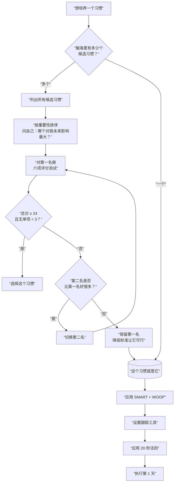

# 快速启动指南

> [!CAUTION] 在开始之前
> **不要读完所有课程再行动。** 选一个习惯，今天就开始。边行动边学习，在迭代中调整。

---

## Step 1：挑选一个习惯

### 选择标准

使用以下六条标准评估你的候选习惯，每条满分 5 分，总分越高越适合作为第一个 100 天行动：

| 标准 | 说明 | 自评 (1-5) |
|------|------|:-----------:|
| **重要性** | 这个习惯对你有多重要？改善会带来质变吗？ | |
| **可衡量性** | 能否明确判断"今天做到了"？ | |
| **可行性** | 以你当前的生活状态，有多大把握能每天执行？ | |
| **单一性** | 这是一个独立习惯还是需要多个小习惯？ | |
| **启动难度** | 从决定到开始行动需要多少步骤？（越少越好） | |
| **内在动力** | 你是发自内心想做，还是因为别人说应该做？ | |

### 决策流程图



### 好习惯 vs 待定习惯示例

| 好的选择 | 有风险的选择 | 原因 |
|----------|-------------|------|
| 每天晚饭后走路 20 分钟 | 每天跑步 5 公里 | 后者启动难度高，初期容易放弃 |
| 每天读 1 页书 | 每周读 1 本书 | 前者微习惯级别，后者目标模糊且大 |
| 每天早起 15 分钟 | 每天 5 点起床 | 循序渐进比激进改变更可持续 |
| 每天喝水 8 杯 | 戒掉所有甜食 | 做加法比做减法容易；甜食涉及戒断反应 |

---

## Step 2：应用 SMART + WOOP

### SMART 目标设定

| 维度 | 问题 | 示例（每天阅读） |
|------|------|-----------------|
| **S**pecific | 具体做什么？ | 睡前阅读纸质书 |
| **M**easurable | 如何衡量完成？ | 至少读 1 页 |
| **A**chievable | 以现在的生活能做到吗？ | 每天睡前 10 分钟，做得到 |
| **R**elevant | 和你的长期目标有关吗？ | 与个人成长目标一致 |
| **T**ime-bound | 什么时间做？ | 每晚 22:30-22:40 |

> 写下你的 SMART 目标：____

### WOOP 练习

| 环节 | 问题 | 你的答案 |
|------|------|---------|
| **W**ish（愿望） | 你最想养成的习惯是什么？ | |
| **O**utcome（结果） | 如果成功，最好的结果是什么？ | |
| **O**bstacle（障碍） | 最大的内部障碍是什么？ | |
| **P**lan（计划） | 当障碍出现时，你如何应对？ | |

> 关键是 **O（障碍）** 和 **P（计划）** 。用"**如果-那么**"句式写计划：
> - 如果 ____（障碍），那么我 ____（应对方案）。

---

## Step 3：设置跟踪工具

### 工具选择

| 工具类型 | 推荐选项 | 优点 | 缺点 |
|----------|---------|------|------|
| **纸质日历** | 挂墙日历 + 红笔 | 视觉冲击最大，每天都能看到 | 不便携带 |
| **手机 App** | Habitica / Streaks / Loop 等 | 自动记录，有统计 | 容易被其他 App 打扰 |
| **电子日历** | Google Calendar / 飞书日历 | 和日程整合 | 缺少习惯专门设计 |
| **笔记工具** | Obsidian / Notion | 可结合日志 | 需要自己建模板 |

> [!TIP] 推荐组合
> 纸质的可视化打卡（挂墙日历上的红叉） + 一个简单的手机跟踪 App。视觉动力 + 数据统计 = 最佳组合。

### 每日打卡模板

> 在 Obsidian 或笔记本中复制使用。

```markdown
## 100天行动打卡 - 第 __ 天

日期：____年__月__日

### 今日执行情况
- [ ] 完成了 **[习惯名称]**
- 执行详情：_________
- 用时：_________

### 一句话总结
_________________________

### 结构化日志（选填）
- 前提（什么触发了行动/不行动）：_________
- 行为（做了什么）：_________
- 后果（结果和感受）：_________
```

---

## Step 4：应用 20 秒法则

> 目标：把好习惯的启动时间缩短到 **20 秒以内**。

### 行动清单

- [ ] 好习惯所需物品是否已经准备好？
  - 跑步 → 跑鞋放在床边
  - 阅读 → 书放在枕头上
  - 冥想 → 垫子铺好了
- [ ] 坏习惯的触发物是否移除了？
  - 刷手机 → 手机放在另一个房间充电
  - 吃零食 → 零食柜清空
- [ ] 是否设置好了视觉提示？
  - 在门上贴便签
  - 手机壁纸换成提醒语
  - 日历挂在每天必经的墙上

---

## Step 5：规划第一周（ABC 策略）

### 第一周 ABC 方案

| 方案 | 场景 | 你的版本 |
|:----:|------|---------|
| **A 计划** | 理想情况：时间和精力都充足 | |
| **B 计划** | 有干扰：加班/有事/状态一般 | |
| **C 计划** | 最差情况：非常累/生病/紧急情况 | |

> [!IMPORTANT] C 计划的关键
> C 计划要简单到**即使发着烧也能完成**。例如"穿上跑鞋站 10 秒"或"打开书读一句话"。C 计划不是为了进步，而是为了保持**链条不断**。

---

## Step 6：开始！不追求完美

### 第一周执行守则

1. **前 7 天只看"做没做"，不问"做得好不好"**
2. 完成 C 计划也算"做了"，果断打勾
3. 如果某天没做，第二天立即恢复，不要补做
4. 每天结束后花 30 秒记录
5. 不要因为第一周太轻松而主动加量——**先稳住 21 天再考虑增量**

> [!NOTE] 完美主义是习惯养成的头号杀手
> 读 1 页书比不读书好 100 倍。做 1 个俯卧撑比一个都不做好 100 倍。"要么做到完美，要么干脆不做"是错误思维。

---

## Step 7：常见陷阱

| 陷阱 | 表现 | 应对方法 |
|------|------|---------|
| **贪多** | 同时开始 2-3 个习惯 | 只留一个，其余暂停 |
| **完美主义** | 中断一天就放弃 | 允许每月 2-3 天的弹性，断链后接上即可 |
| **主动加量太快** | 第三周觉得轻松就加倍 | 坚持微习惯至少 21 天再调，每次增量不超过 10% |
| **忽视环境** | 试图用意志力对抗诱惑 | 重新审视环境设计，移除诱惑源 |
| **不记录** | 凭感觉评估进度 | 回到 Step 3，建立每日打卡习惯 |
| **目标太模糊** | "多运动"而不是"每天下楼走 10 分钟" | 回到 Step 2，重新应用 SMART |
| **缺乏预案** | 遇到意外就不知所措 | 回到 Step 5，准备好 ABC 三套方案 |
| **独自战斗** | 没有人监督和鼓励 | 找一个打卡伙伴或加入微信群 |

---

## Step 8：失败了怎么办（Day N 恢复指南）

> 失败不是中断，而是中断后彻底放弃。

### 中断级别判断

| 级别 | 定义 | 应对 |
|:----:|------|------|
| 1 | 中断 1 天 | 明天正常继续，不需要任何调整 |
| 2 | 中断 2-3 天 | 回到 C 计划执行 3 天，恢复信心后再回到 A 计划 |
| 3 | 中断 4-7 天 | 回顾结构化日志，分析原因；重新做 WOOP；降到微习惯级别重启 |
| 4 | 中断 7 天以上 | 承认这一轮失败，但**不做零分评价**。总结经验，重新设定更合理的目标，开始新的一轮。不把失败归因于"我意志力差"，而是"方案需要调整" |

### 恢复检查清单

- [ ] 我今天重新开始了吗？（哪怕只是 C 计划）
- [ ] 我分析了中断的原因吗？（使用结构化日志）
- [ ] 我的目标需要调整吗？（太难了 → 降低标准）
- [ ] 我的环境需要改变吗？（阻力太大了 → 重新设计环境）
- [ ] 我需要外部支持吗？（找朋友监督 / 加入社群）

> [!WARNING] 最重要的规则
> **永远不要连续中断 2 天。** 这是 100 天行动的底线。允许失败，但不允许连续失败。

---

## 每日快速检查清单（可打印版）

```markdown
# 每日清单

## 早晨
- [ ] 回顾今天的习惯目标
- [ ] 检查环境准备（20秒法则）

## 执行时
- [ ] 完成习惯（A/B/C 任一方案都算）
- [ ] 完成后立即打勾

## 晚上
- [ ] 在日历上画红叉（别断链子）
- [ ] 一句话记录今天的情况
- [ ] 准备好明天的执行条件
```

---

## 第一周每日指引

| 天数 | 重点 | 自检 |
|:----:|------|------|
| 第1天 | **启动！** 不关注质量，只关注完成 | 我完成了吗？ |
| 第2天 | **重复**，让身体熟悉这个节奏 | 比昨天顺了一点吗？ |
| 第3天 | **小障碍出现？** 运用 WOOP 的"如果-那么"计划 | 有遇到障碍吗？怎么应对的？ |
| 第4天 | **环境检查**，还有什么可以优化的？ | 20秒还能更短吗？ |
| 第5天 | **记录回顾**，前 4 天看到了什么模式？ | 什么时候最容易放弃？ |
| 第6天 | **社交宣告**，告诉一个人你在坚持什么 | 有人知道我在做这个吗？ |
| 第7天 | **第一周总结**，庆祝连续 7 天打卡 | 为下周制定 ABC 方案！ |

---

> [!TIP] 下一步
> 已经开始了？继续往下学习课程中的具体方法论：
> - 想深入理解习惯科学 → [[../lessons/0001-habit-science-foundation|第01课]]
> - 总觉得自己意志力不够 → [[../lessons/0005-ego-depletion|第05课]]
> - 经常中断想要放弃 → [[../lessons/0008-self-compassion|第08课]]
> - 想开始跑步/运动 → [[../lessons/0014-exercise-habits|第14课]]

**关联笔记：** [[core-rules-cheatsheet|核心规则速查]] | [[glossary|术语表]] | [[../00-course-map|课程地图]]