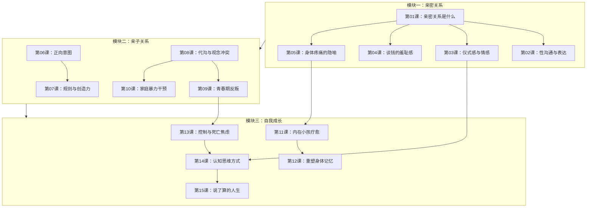

# 课程地图

## 学习路径说明

本课程三大模块既有独立性，又相互关联：

1. **亲密关系（第01-05课）**：从最基础的"什么是真正的亲密关系"开始，逐步深入到性沟通、仪式感、经济议题和身体感知。建议按01→02→03→04→05顺序学习。

2. **亲子关系（第06-10课）**：从正向养育的理念开始（06、07课），到具体的代际冲突解决方案（08、09课），再到家庭系统干预（10课）。06、07课是基础，08、09课可衔接学习。

3. **自我成长（第11-15课）**：从最深层的创伤疗愈（11课）和身体工作（12课）开始，到关系模式觉察（13课），最后是认知升级（14课）和生命整合（15课）。这是课程的升华部分。

## 前置关系

- 第05课（身体与亲密关系）→ 第12课（重塑身体记忆）：身体觉察是一脉相承的主题
- 第09课（青春期反叛）→ 第13课（控制与死亡焦虑）：理解控制的根源
- 第03课（仪式感）→ 第14课（认知思维方式）：重新框架化理解