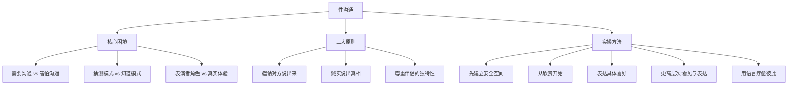

# 第02课：如何跟伴侣表达想要或不想要？

## 课程背景

本课延续由 **莎兰·汉考克（Sharon Hancock）** 主讲的亲密关系专题。在前一课讨论了亲密关系的本质之后，本课深入到亲密关系中最敏感也最容易被回避的领域——**性沟通**。莎兰指出，性关系中的沟通之所以困难，是因为它需要我们冒险和变得脆弱。但如果没有坦诚的沟通，性就只是一场表演，而不是真正的亲密连接。

## 核心概念

### 性沟通的核心困境

在性关系中，我们面临着天然的矛盾：

- **需要沟通**——否则对方无法知道你的喜好和界限
- **害怕沟通**——因为性是最容易感到被拒绝、被冒犯、被批评的领域

> [!WARNING]
> 没有任何一种文化真正教育过我们如何健康地谈论性。我们觉得表达"我很享受"比性本身更令人羞耻——就像在做爱时脱光了衣服，却还带着防御。

### 从"猜测"到"知道"

如果两个人靠猜测来进行性爱，就会从身体的流动滑入头脑的思考——"我做得好吗？""对方喜欢吗？"一旦失去与身体流动的连接，就无法在当下的感受中获得愉悦。

## 要点详解

### 1. 建立安全的沟通空间

在讨论性之前，先建立一个敞开的沟通空间。你可以这样邀请伴侣：

> "我不确定你享受什么，所以如果你愿意告诉我、向我展示，我会很开心。我想了解你喜欢被怎样抚摸，喜欢什么样的方式和速度。同样，我也愿意让你知道我喜欢什么。"

### 2. 从说"好的"开始

表达性喜好需要技巧，莎兰建议：

**先说好的，再说需要调整的：**
- "当你这样做的时候，我真的很喜欢。"
- "我感觉好极了，我想要更多。"
- "如果你这样做，我并不会很舒服。"

> [!TIP]
> 不要一上来就成为批评家。在性中我们极为敏感，批评会让对方感到被拒绝。先从欣赏开始，在安全的基础上再提出调整。

### 3. 女性的困境与表达

课程特别强调了女性在性沟通中面临的挑战：

女性身体需要很长时间的准备，但社会对性的误解让很多女性不敢开口说出"我还没有准备好"。如果不说出来，女性就会成为"表演者"——即便可以做出出色的表演，但内心只想快点结束。

**需要说出来的话包括：**
- "我需要更多的时间。"
- "我需要更多的连接。"
- "我可以看着你的眼睛。"
- "我需要一切更轻柔、更缓慢。"

### 4. 真正的性沟通是灵魂层面的相遇

莎兰指出，性不仅仅是打开身体，更高层次的沟通是关于**看见和表达**：

> "我感觉我看到了你今晚的温柔。""我看到了你的友善和敞开。"

这种程度的沟通创造了安全的基础和信任的空间——那里才是性最终发生的地方。

**抚摸不是关键，关键在于"你"：**
- "我很享受你的抚摸。"
- "我很享受你抚摸我的方式。"
- "因为你非常敏感，而我非常感激这一点。"

语言在性中是极具疗愈性的，因为它让我们放松、感受到安全。

### 5. 性沟通的三项基本原则

| 原则 | 内容 | 说明 |
|------|------|------|
| **邀请** | 邀请对方说出来 | 主动创造一个可以谈论性的空间 |
| **诚实** | 愿意说出真相 | 坦诚表达自己的喜好和不适 |
| **尊重** | 尊重伴侣的边界和差异 | 每个人的需求都是独特的 |

> [!TIP]
> 每个人的性需求都是不同的——有人需要拥抱和连接，有人需要强烈的吸引，有人需要空间和距离。除非你说出来，否则对方不可能百分之百猜对，无论他/她有多么敏感。

## 案例分析

### 女性身体的节奏差异

课程指出，一个常见的误区是认为女性不需要很多刺激。实际上，女性很容易感觉到过度刺激，她们更多需要的是温柔和柔软。如果男性不了解这一点，按照自己的节奏进行，女性就会进入"表演模式"——配合演出但不在当下，结果是没有真正的亲密体验。

### 表达欣赏的示范

当你以美好的方式被抚摸时，可以这样说：
> "我很享受你的抚摸，我很享受你抚摸我的方式。抚摸不是关键，关键在于你——是你以这样的方式抚摸了我。因为你非常敏感，而我非常感激这一点。"

## 重要观点

> [!TIP]
> 性是两个灵魂从身体层面、头脑层面、情绪层面进行的一场深入沟通。只有这样，两个人才能更加深入彼此，感受到真正的相遇。性因此成为极具疗愈性和滋养性的体验。

> [!WARNING]
> 如果卡在自己的头脑和想象中，性就是一场表演。你需要从控制的性格中出来，不再以特定的方式看待事物和反应。真正滋养的性需要安全，而安全只有在缓慢的步调和真诚的表达中才能建立。

## 自我觉察练习

### 练习一：表达欣赏

在接下来的亲密接触中，练习说出至少一句欣赏的话。从小事开始：
- "我喜欢你靠近我的方式。"
- "我很享受你今天的拥抱。"

注意你内心的羞耻感，并试着穿越它。

### 练习二：了解彼此的地图

找一个双方都放松的时刻，用以下问题开启对话：
1. 你喜欢被怎样抚摸？加快还是放慢？轻柔还是用力？
2. 做爱前你需要什么？拥抱？言语？空间？
3. 你希望我多问你的感受，还是你更习惯主动表达？
4. 我们之间有没有你一直想尝试但还没说出来的？

### 练习三：身体当下检查

在做爱过程中，偶尔停下来问自己和对方：
- "这个速度对你来说舒服吗？"
- "你想要一些不一样的吗？"
- "我的身体在这里吗？还是我在头脑中？"

## 思维导图

## 总结回顾

性沟通是亲密关系中最困难也最有价值的课题。本课的核心要点：

1. **建立邀请文化**——主动创造谈论性的安全空间，而不是等待对方开口
2. **从欣赏开始**——先说好的，再温柔地提出调整，避免批评和指责
3. **放下表演，做真实的自己**——敢于说出"我还没有准备好""我需要更多时间"
4. **语言是疗愈的**——说出"我很享受你抚摸我的方式"，让对方感受到被看见和被欣赏
5. **尊重独特性**——没有两个人是一样的，只有通过沟通才能了解彼此真正的需求

性可以成为一段关系中极其滋养和疗愈的体验，前提是双方都愿意从头脑的表演中走出来，进入身体的真实流动。

上一课我们讨论了亲密关系的本质，接下来我们将面对另一个常见问题：当伴侣缺乏仪式感时该如何应对。详见 [[0003-ru-he-mian-dui-que-fa-yi-shi-gan|第03课：如何面对缺乏仪式感的伴侣？]]