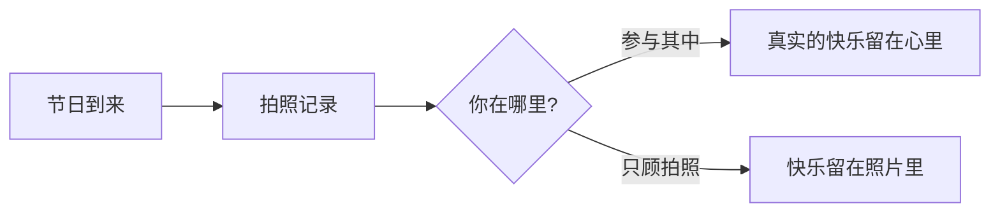
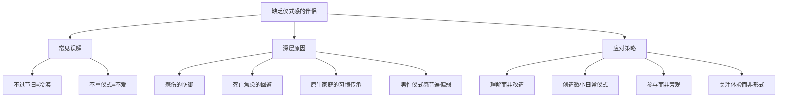

# 第03课：如何面对缺乏仪式感的伴侣？

## 课程背景

本课由**武志红上海工作室心理咨询师李宁**主讲，以问答形式回应来访者的真实困惑。来访者的困扰是：丈夫的家庭除了春节外什么节日都不过，连父亲的忌日也不祭祀。丈夫的理由是"不相信灵魂，不做无意义的祭祀"，但妻子担心这种态度背后是**冷漠**，并害怕这种冷漠会传递给下一代，导致感情破裂。

## 核心概念

### 仪式感 ≠ 爱

课程提出了一个关键区分：**不重视仪式感，不等于冷漠，更不等于不爱。**

> [!WARNING]
> 在你的心里，不过节日或祭祀可能等于对亲人没有感情。但事实未必如此——一个人不重视仪式感，可能只是没有能力用你需要的方式来爱你。

### 冷漠可能是悲伤的防御

课程引用了一个重要的心理学视角：

> "每个人现在采取的应对策略，一定是对他而言最好的方式。"

表面上的冷漠，有时是为了隔离开内心难以承受的悲伤。对于某些人来说，**光是活着就已经竭尽全力了**，仪式感对他们而言可能是一道超纲的考题。

## 要点详解

### 1. 仪式感的真正意义

《小王子》中的狐狸说：仪式感就是**使某一天与其他日子不同，使某一时刻与其他时刻不同**。

人们需要借助仪式感来：

| 功能 | 作用 |
|------|------|
| **梳理生命** | 标记开始与结束 |
| **铭记情感** | 温暖或悲伤的回忆 |
| **增进亲密** | 见证与允诺 |

### 2. 性别差异与期待落差

课程指出一个现实：**男人的仪式感大多都比较弱**。如果你把"爱不爱"建立在仪式感上，大概率会失望。

> [!TIP]
> 你觉得仪式感是爱人的方式，对方可能完全无从察觉到这种体验。这不是对错问题，而是过往经历和感受能力的差异。

### 3. 从"改变对方"到"影响对方"

课程给出了一个关键转向：**不要试图改造对方，而是用微小的仪式感去温暖对方。**

#### 每日小仪式感的建议

- **挤牙膏**：每天先刷牙的人顺带给对方也挤好牙膏——演员孙俪和邓超就有一个约定：早起的人给晚起的人挤好牙膏，代替无法亲自道的早安；早睡的人也给对方挤好牙膏，代替晚安
- **出门吻别或拥别**：让分离有一个温柔的标记
- **回家后的第一个迎接**：让对方感受到被期待和被欢迎

> [!TIP]
> 如果你不是想着去改造对方不喜欢的习惯，而是用你营造的点点滴滴微小的仪式感带来的温情去温暖他，他也一定会慢慢放松原先的观念，和你一起去感受庆祝节日的快乐。

### 4. 仪式与体验的本末之辨

课程提出了一个深刻的提醒：**不要因为追求仪式而错过真实的快乐。**

设想一个场景：有了孩子之后，先生在快乐地和孩子玩耍。你会做什么？是参与其中享受亲情快乐，还是忙着拍照发朋友圈？

> [!TIP]
> 拍照留念非常重要，它保存了珍贵的时刻。但如果你每次都在拍照，就会错失多少实实在在当下的快乐。有仪式感最重要的不是仪式，而是你的感觉——是你能够感受到彼此之间流动的爱。

## 案例分析

### 案例一：孙俪与邓超的挤牙膏仪式

著名演员孙俪曾在一档访谈节目中分享，她和丈夫邓超因拍戏作息不同频，于是有了一个心照不宣的小约定：
- 早起的人会顺带把对方的牙膏挤好——代替无法亲自道的早安
- 早睡的人也会把牙膏挤好——代替一句晚安

这个案例说明：仪式感不一定要盛大隆重，生活中的微小习惯同样可以承载深厚的情感。

### 案例二：来访者的节日焦虑

来访者担心丈夫对节日的冷漠会：
1. 影响夫妻感情——没有仪式感无法确认对方的爱
2. 传递到下一代——孩子也会变得冷漠

咨询师的回应帮助来访者看到：丈夫对祭祀/死亡的回避，可能隐藏着对死亡焦虑的深层恐惧。回避是最大的恐惧，当人被死亡焦虑裹挟时，创造性和富有活力的思维都会变得很难。

## 重要观点

> [!WARNING]
> 如果把不注重仪式感和冷漠直接划等号，对有些人来说是有失公允的。每个人的观念都和过去息息相关——先生的家庭从哪一辈开始就不过节日了？当时发生了什么？了解这些，是为了理解，而不是强迫认同。

> [!TIP]
> 仪式很重要，但它只是生活种种情感的一个载体。如果把仪式感看得太重，反而本末倒置。重要的是在生活的点点滴滴中体验温情，制造一些小的仪式感来增加彼此情感的流动。

## 自我觉察练习

### 练习一：审视你的仪式感期待

1. 在你的原生家庭中，仪式感扮演了什么角色？
2. 你需要仪式感的深层需求是什么——是确认被爱、获得安全感，还是其他？
3. 如果完全没有仪式感，你还能用什么方式确认彼此的爱？

### 练习二：从微小仪式开始

在接下来的一周里，尝试每天做一件微小但有仪式感的事：

- 每天出门前给对方一个拥抱
- 睡前说一句感谢的话
- 倒一杯水放在对方习惯的位置

注意观察：没有说出口的话，是否可以通过行动来传递？

### 练习三：理解对方的家庭历史

尝试温和地与伴侣或伴侣的家人聊聊：
- "你们家从什么时候开始就不过这些节日了？"
- "当时发生了什么？"

目标是理解，不是审判。了解对方的观念形成过程，是沟通的基础。

## 思维导图

## 总结回顾

面对缺乏仪式感的伴侣，本课的核心启示是：

1. **重新定义冷漠**——不过节日不等于不爱，背后可能有未被看见的悲伤和防御
2. **理解比改变重要**——了解对方家庭的历史和观念形成过程，比强迫改变更有意义
3. **从微小处开始**——挤牙膏、出门吻别、回家迎接，日常的小仪式比盛大节日更能积累温情
4. **用影响代替改造**——用你创造的温暖去影响对方，而不是批评对方不够好
5. **关注体验而非形式**——最重要的是能感受到彼此之间流动的爱，而不是完成仪式本身

上一课我们讨论了性沟通的重要性，下一课我们将探讨家庭关系中另一个敏感而实际的问题：家庭主妇如何开口向丈夫要钱。详见 [[0004-ru-he-kai-xiang-zhang-fu-yao-qian|第04课：家庭主妇如何开口向丈夫要钱？]]