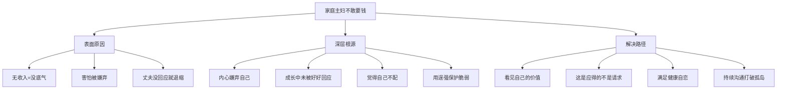

# 第04课：家庭主妇如何开口向丈夫要钱？

## 课程背景

本课由**武志红广州工作室心理咨询师赵颖奇**主讲。来访者是一位全职太太，与丈夫生活一年多，孩子八个月。辞去工作后，她害怕跟丈夫提钱，有强烈的羞耻感，宁愿透支信用卡也不愿向丈夫开口要生活费。她曾在微信上提过一次每月需要四千多元开支，丈夫没有回应，她便再也不敢开口。

## 核心概念

### 羞耻感的根源

不敢开口要钱的背后，不是丈夫真的会拒绝，而是**内心对自己的嫌弃**。

> "每天都觉得自己两个地方不够好——这也不够好，那也不够好。"

嫌弃自己的人生活在巨大的自卑和焦虑中，一提出需求就感觉羞耻，被拒绝或被忽视一次就恨不得找个地方钻进去，同时内心暗自发誓"果然不能指望别人"。

### "嫌弃自己"的成因

自我认可最初建立在他人的回应上。如果在成长过程中没有被很好地回应和接纳过，一次次受挫就会让自己觉得"糟透了"，进而学会用**逞强**来保护自己的脆弱。

> [!WARNING]
> 与其说你在害怕你老公嫌弃你，不如说你在内心嫌弃自己。你对自己、对感情没有信心，这才是问题的核心。

## 要点详解

### 1. 重新认识家庭主妇的价值

家庭主妇没有收入，不创造"可见的经济价值"，但这绝不等于没有价值。课程引用了经济学家的研究数据：

| 指标 | 数据 |
|------|------|
| 中国家庭主妇每日工作时长 | **10小时以上** |
| 照顾学龄前儿童的年劳动价值 | **约20万元** |

> [!TIP]
> 金钱不应该成为衡量一个家庭成员价值的标杆——任何时候都不应该。工作和家庭主妇只是家庭内部的分工：一个家庭需要有人赚钱，也需要有人照顾家，你们是互相需要的关系。

### 2. 从"请求帮助"到"应得的权益"

来访者将生活费视为一种"请求"，但课程指出：

> 你要生活费这件事，并不是在请求你老公的帮助——这些是你应得的。

夫妻之间形成了明确的分工：丈夫在外赚钱，妻子在家照顾孩子和家庭。生活费不是施舍，而是分工体系中的合理分配。

### 3. 满足健康的自恋

为了减少谈钱时的羞耻感，核心在于**满足自己成长过程中很少被满足的自恋**。

**健康的自恋**是：
- 相信自己是可爱的
- 认为这是不证自明的
- 不管别人的反应和评价如何，对自己有一种基本的信任
- 认为自己就是值得的
- 自己的存在于这个世界本身就是一件喜悦的事

### 4. 不充分沟通的恶性循环

如果一次沟通对方没有反应，就让你不知如何再开口，那么两个人就会活在自己的世界里：

```
你内心: 他一定嫌弃我 → 我不要再开口
他内心: 她没再说 → 可能没这需求了
```

越是不充分的沟通，越有机会让你把**内部固有的关系模式**置于现实的关系中。在你的内心世界，他是你以为的样子；在他的内心世界，你是他以为的样子——你们就像是婚姻里的两座孤岛，以为熟悉，其实陌生。

## 案例分析

### 张爱玲的"零用钱试验"

张爱玲曾说过一句话广为流传：

> "能够爱一个人爱到问她拿零用钱的程度，那是严格的试验。"

这句话说明：向伴侣要钱这件事，天然地触及了关系中最敏感的部分——信任和信心。能心安理得地向另一个人要钱，至少能在一定程度上说明你对这段关系的信心。反过来说，无法开口本身就意味着信心的缺失。

### 来访者的具体困境

来访者的困境层层递进：
1. **现实层面**：辞去工作，无收入，有孩子需要抚养
2. **心理层面**：害怕被嫌弃 → 不敢提要求 → 透支信用卡
3. **关系层面**：微信提了一次，丈夫无回应 → 退缩 → 不再沟通
4. **深层根源**：成长过程中没有被很好地回应和接纳 → 嫌弃自己 → 不相信自己值得被满足

## 重要观点

> [!WARNING]
> 没有人是一座孤岛，也没有一个人可以脱离这个世界独自生存下去。我们都需要和别人产生连接，甚至是互相帮助才能活着。提出自己的需求不是软弱，而是人与人之间正常连接的体现。

> [!TIP]
> 想要减少谈钱时的羞耻感，着眼点应该在于如何满足自己成长过程中很少被满足的自恋。你需要不断进行自我觉察，承认和正视自己内心的需求，然后试着去满足它。而这同样逃不开向他人表达你的需要。

## 自我觉察练习

### 练习一：梳理你的价值清单

拿出一张纸，列出你作为家庭主妇/伴侣所做的所有事情（包括但不限于）：

- 照顾孩子的各项工作（喂养、哄睡、教育、陪伴）
- 家务劳动（做饭、洗衣、打扫、采购）
- 情感支持（倾听、安慰、为家庭营造温暖氛围）
- 家庭管理（记账、规划、安排家庭事务）

完成后问自己：如果一个保姆+育儿师+管家+心理咨询师累计做这些工作，月薪是多少？

### 练习二：追溯"不敢开口"的根源

回顾你的成长经历：
1. 小时候向父母提出需求时，他们通常如何回应？
2. 你是否有过"提需求被拒绝或忽视"的创伤经历？
3. 你内心是否有一个声音在说"我不配"？这个声音是谁的？

### 练习三：练习表达需求

从小的、安全的需求开始练习：
1. 今天想吃什么？——向伴侣说出你的想法
2. 我需要你帮我做XX——明确表达你的需要
3. 这周的生活费需要XX元——用平静、陈述的语气说出来

注意：即使对方没有立即回应，也不代表你的需求是错误的。坚持温和而坚定地表达。

## 思维导图



## 总结回顾

家庭主妇不敢向丈夫要钱，表面是经济依赖带来的底气不足，深层是自我价值感缺失和成长过程中未被充分回应的创伤。本课的关键启示：

1. **重新定义价值**——家庭主妇每日工作10小时以上，年劳动价值约20万元，这不是"没有收入"而是"隐形贡献"
2. **认清这是应得的**——生活费不是请求帮助，而是家庭分工中的合理分配
3. **理解羞耻感的根源**——嫌弃自己的感受源于成长过程中未被好好回应和接纳
4. **建立健康自恋**——相信自己是值得的，不依赖他人的反馈来确认自身的价值
5. **打破孤岛状态**——持续沟通，即使一次没有得到回应，也要寻找更适合的方式再次表达

下一课是本模块的最后一课，我们将通过身体的角度来理解亲密关系。详见 [[0005-tong-guo-shen-ti-liao-jie-qin-mi|第05课：如何通过身体了解亲密关系？]]