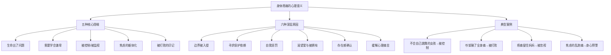

# 第05课：如何通过身体了解亲密关系？

## 课程背景

本课由**王宇赤**主讲，是"通过身体了解亲密关系"专题课程。课程提出了一个核心命题：**身体是灵魂的模样，身体是生命的殿堂**。当心理的痛苦无法被表达时，它会以身体疼痛的方式发出信号。理解这些信号，就是靠近自己、疗愈关系的第一步。

## 核心概念

### 身体疼痛与心理的关联

非躯体损伤、原因不明的身体疼痛，**都与心理困扰、冲突和创伤相关**。

> [!WARNING]
> 我们内心无法表达的痛苦，像一只饥饿的怪兽，咬住身体不松口，让身体疼痛。身体的疼痛是内心痛苦的呐喊。

### 身体是生命的隐喻

每个人身体里都有自己的节奏，根据生命轨迹律动。但成长中被控制、被干扰的经历，不仅压抑了身体原有的内在律动，更阻断了身体对内对外的觉察能力。身体不再是一个鲜活、流动、有智慧的生命体，而是一部死气沉沉的机器。

## 要点详解

### 1. 身体疼痛的五种心理隐喻

#### 隐喻一：生命出了问题

疼痛令人痛苦，但也不全是坏事。以身体疼痛为师，顺着疼痛找回不同时期丢失的生命碎片，就像一块块拼图回到自己的位置——拼图越多，生命中的漏洞就越少。

**疼痛的价值：**
- 疼痛让人无法逃避，只能转过头来面对
- 当我们可以面对时，很多事情已经开始发生变化
- 很多以前不曾发现的东西，原来那么惊喜

#### 隐喻二：需要学会谦卑和敬畏

很多人生活在头脑的判断和推理中，摒弃感受和身体。过度使用身体，不重视身体感受，甚至伤害身体，结果是**身心分离**。身体以各种症状、疼痛甚至疾病的方式表达它的不满和报复。

> "在身体疼痛面前，我们是渺小的、微不足道的。原来我们不是无所不能的神，我们有局限，也有软弱，需要妥协，也要退让。"

#### 隐喻三：妈妈的眼睛在身上

身体疼痛可能源于**被控制、被监视的创伤记忆**。当一个人长期处于被挑剔、被监管的环境中，身体会形成紧张和疼痛的习惯。

#### 隐喻四：焦虑的躯体化

统计数据显示，即使身体没有任何疾病，焦虑症患者中有 **30%到40%** 伴有身体疼痛症状。当焦虑症得到缓解，疼痛也会随之消失。

焦虑时身体的典型反应：到处乱窜的刺痛感，一会儿这儿痛，一会儿那儿痛，不剧烈但让人烦躁。

#### 隐喻五："我被打败了"

身体疼痛有时是对失败的心理反应。在争吵中"输了"的人会出现全身疼痛，这不是偶然——**身体记住了过去被打败时的痛苦记忆**。

### 2. 六种引起身体疼痛的深层原因

| 原因 | 表现 |
|------|------|
| **边界被入侵** | 守不住边界时的疼痛感，像领地遭践踏 |
| **寻求保护与依赖** | 慢性疼痛患者用痛苦来控制和依赖他人 |
| **自我惩罚** | 内疚感转化为身体疼痛来惩罚自己 |
| **渴望爱与被拥有** | 缺乏爱的身体用疼痛表达渴望 |
| **存在感确认** | 疼痛让人感觉"我活着" |
| **缓解心理痛苦** | 用身体可控的疼痛替代弥散的心理痛苦 |

### 3. 身体疼痛与"活着"的存在感

> [!WARNING]
> 早年被父母强烈忽略的人，在成年之后会有莫名其妙的全身疼痛。疼痛的意思是"好像有人在打我"——他们虚拟了一个糟糕的关系，因为再糟糕的关系也比没有关系好。

这背后是一种深深的哀伤：内心空无一人，特别孤独。哪怕拥有一个坏的关系，也比没有关系让人感觉好过些。

## 案例分析

### 案例一：不会"自己跳舞"的女孩

一位26岁的学员，身体无法自发律动，只能模仿别人。当需要她带领舞动时，她站着不动，身体紧绷，最后说"感觉身体很痛"。

**根源：**
她的妈妈特别控制，从小到大，她的一举一动都被妈妈监管。留什么发型、刘海多长、眉毛形状、唇膏颜色，妈妈都要过问。她跟在妈妈身后与妈妈保持一致——一旦不一致，妈妈的目光就会"打"在她身上，有刺痛的感觉。

**身体的反应逻辑：**
- 模仿别人舞动 = 跟在妈妈身后 → 安全、熟悉
- 自己带领舞动 = 暴露在妈妈的目光中 → 紧张、疼痛

**疗愈方向：** 找到她身体里自己的律动节奏。在信任的人面前闭眼舞动，让身体根据需要自发做出动作。

### 案例二：吵架输了就全身疼痛的"女侠"

一位来访者每次和丈夫吵架，如果吵输了就会全身疼痛难忍，需要卧床一到两天；吵赢了就什么事都没有。

**根源：** 她小时候经常被父母打骂。她在父母面前是"被打败的小孩"，但在外面她打别人，成为"胜利的大人"。身体里并存着**暴打孩子的父母**和**被暴打的小孩**两个角色。

**身体的反应逻辑：**
- 吵赢了 → 胜利的大人 → 强大、有力量
- 吵输了 → 失败的孩子 → 唤起被父母暴打时的躯体记忆和疼痛

身体记住了被父母暴打时的痛，吵架输了时，这份隐藏的痛就被唤起。

### 案例三：用身体疼痛留住妈妈的女孩

一位女性来访者，家里重男轻女，父母喜欢弟弟、贬低她。她诚惶诚恐长大，现在有工作和家庭，但被身体疼痛困扰多年。

**身体症状：**
- 肩膀和腋下固定部位疼痛
- 身边只要有人就会痛
- 无法开会、接触同事、见亲戚朋友

**心理根源：**
她用身体疼痛虚拟着和妈妈的关系——一个委屈不被喜欢的孩子和一个不断挑剔指责的妈妈。身体疼痛让她幻想着周围人都在攻击她，就像小时候妈妈用嫌弃的态度对待她。

> "身体疼痛变成她把别人留在心里的秘密。就像在给妈妈说：就算骂我也好，打我也好，不要离开我。"

她不敢放弃这个念头，因为她害怕——没人理她。妈妈还能挑剔她一下，爸爸却不会看她一眼。她在被忽视的关系中长大，仿佛周围只有她一个人。

### 案例四：焦虑的"乱跑疼痛"

主讲人分享了自己的亲身经历：在做一件很有干劲的事情时，身体却出现一会儿胃痛、一会儿胸口痛、一会儿肚子痛的状况，疼痛到处乱跑。直到胸口像针扎一样痛，她才停下来看看到底发生了什么。

停下来静静待一会儿后，她感受到内心的焦急、评判和很多声音——原来这件看似不重要的事，让自己这么焦虑。顺着焦虑梳理自己，理解焦虑，很快平静下来，身体的痛感也消失了。

> "当焦虑发生时，我的身体就先我一步对其产生了反应。在我还没意识到的时候，身体用到处乱穿的疼痛提醒我：你需要好好照顾自己了。"

### 案例五：通过身体疼痛缓解心理痛苦

| 方式 | 心理机制 |
|------|----------|
| 用烟头烫伤手臂 | 用聚焦的身体疼痛替代弥散的心理痛苦 |
| 暴饮暴食 | 让胃部舒服以缓解心里不舒服 |
| 吸烟喝酒 | 让身体陪伴一起难受来分担痛苦 |

身体疼痛是可以抓住的实在感觉，而心理痛苦是弥散性的、抓不住的感觉。用身体可控的疼痛来替代心理上失控的痛苦，是一种常见的无意识策略。

## 重要观点

> [!TIP]
> 身体疼痛不全是坏事。以身体疼痛为师，顺着疼痛，可以找回自己不同时期丢失的生命碎片。就像一块块拼图回到自己位置上一样——拼图越多，生命中的漏洞就越少。

> [!WARNING]
> 身体疼痛不是惩罚，而是信号。它告诉我们身体结构与功能遭到破坏，身体需要被呵护和照顾。当疼痛出现时，不要急着消除它，而是问一问：我的身体想告诉我什么？

> [!IMPORTANT]
> 看待身体问题不能千篇一律，要因人而异。每一种对身体解读的观点，都需要你与身体有连接之后才能找到感觉，才能真正帮助自己。

## 自我觉察练习

### 练习一：身体疼痛日记

记录接下来一周中出现的任何身体疼痛（包括轻微的不适）：

| 时间 | 疼痛部位 | 疼痛类型 | 发生前发生了什么 | 当时的情绪 |
|------|----------|----------|------------------|------------|
| 周一 | 肩膀 | 酸痛 | 被批评了一句 | 委屈 |
| ... | ... | ... | ... | ... |

一周后回顾：疼痛和情绪之间是否有规律？

### 练习二：身体扫描冥想

找一个安静的时间，从头到脚慢慢扫描自己的身体：

1. 哪个部位有紧张感、酸痛感或其他不适？
2. 如果这个部位可以说话，它想对你说什么？
3. 试着把手放在那个部位，温柔地问："你需要什么？"

### 练习三：焦虑的身体信号

下次感到焦虑时，不要只关注头脑中的想法，而是问自己：
1. 我的身体现在有什么感觉？
2. 心跳加速？胃部收紧？肩膀紧绷？
3. 疼痛在哪个位置？是什么性质的痛？

**关键认知：** 身体比头脑更早知道你的状态。

### 练习四：从模仿到自主

如果你发现自己总是"模仿"别人（不只是动作，也包括观点、生活方式），尝试每天做一件没有任何人教过你、完全来自内心冲动的事情——哪怕只是改变走路的路线或选择不同口味的食物。

## 思维导图

## 总结回顾

本课从身体疼痛的角度切入亲密关系，揭示了身心之间的深刻联系：

1. **身体不说谎**——不明原因的身体疼痛往往是内心痛苦的语言，不要急着消除它，先倾听它
2. **疼痛是信使**——顺着疼痛可以找回丢失的生命碎片，疼痛不全是坏事
3. **被控制的身体**——长期被控制、被监视的经历会让身体形成紧张的"盔甲"，失去自发性
4. **被打败的身体**——童年被暴力对待的记忆留存在身体里，在特定情境下被重新激活
5. **被忽视的身体**——早年缺乏关爱的孩子成年后可能用身体疼痛来虚拟关系，因为"糟糕的关系也好过没有关系"
6. **焦虑的身体**——焦虑情绪常以身体疼痛的方式表达，当焦虑缓解，疼痛也随之消失

**身体是生命的殿堂。** 理解身体发出的信号，就是理解自己最深层的需要。亲密关系的质量，最终会通过身体的状态呈现出来。

本模块"亲密关系"到此结束。通过这五节课，我们从关系本质、性沟通、仪式感、经济独立到身体觉察，全方位探索了亲密关系中的关键议题。在下一模块中，我们将开启新的主题。详见 [[0001-shen-me-shi-qin-mi-guan-xi|第01课：什么样的亲密关系才算是圆满？]]（返回模块起点）