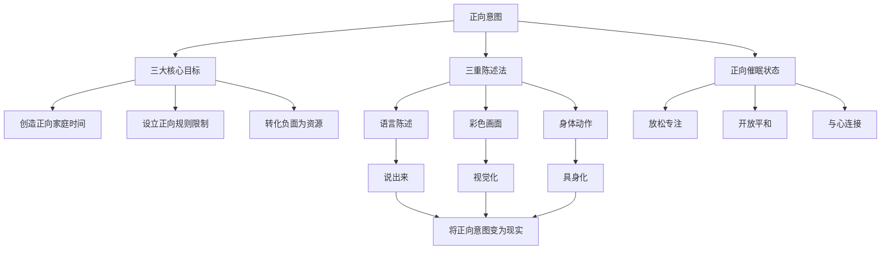

# 第06课：如何对孩子保持正向意图？

> 讲师：斯蒂芬·吉利根（Stephen Gilligan）| 正向心理学与催眠治疗专家

## 课程背景

在孩子已经与父母建立非语言的情绪连接根基之后，亲子教育的下一步就是如何设立和保持**正向意图**。吉利根博士指出，父母的意图和目标深刻影响着孩子生命中的一切——如果父母的出发点是"确保孩子不坏"，那么想象力就已经被"孩子是坏的"这个画面所占据。正向父母需要学会用正向的语言、画面和身体姿态来组织自己的行为，并最终教导孩子运用同样的方法为自己创造正向的人生。

## 核心概念

### 1. 正向意图（Positive Intention）

父母在与孩子互动时，内心深处所持有的建设性目标。它不是负面的担忧（"别让孩子变坏"），而是积极的建设（"我要为孩子创造正向的家庭时间"）。

### 2. 三重陈述法（Triple Statement）

将正向意图通过三种方式表达和固化——**语言**、**彩色画面**、**身体动作**。三者缺一不可，仅靠语言不足以让正向意图成为可持续的现实。

### 3. 正向催眠状态

一种放松、专注、开放且平和的内在状态。父母必须首先让自己进入这种状态，才能用非语言的方式向孩子传递正向讯息。

## 要点详解

### 正向父母的三大核心意图

吉利根博士提出三个至关重要的正向目标：

1. **共同创造正向家庭时间**——让家庭氛围成为滋养性的存在
2. **设立并维持正向规则和限制**——既有框架又有温度
3. **将负面行为改变为正向资源**——不否定问题，而是转化它

> [!TIP] 正向意图的底层逻辑是：你的注意力流向哪里，哪里就会生长。关注"好"而不是"怕坏"，结果会截然不同。

### 语言、画面与身体的整合

| 维度 | 作用 | 示例 |
|------|------|------|
| 语言陈述 | 明确表达意图 | "我最想要的就是为我的家庭创造正向时间" |
| 彩色画面 | 激活想象力与情感 | "我看到全家人一起笑着吃饭、聊天" |
| 身体动作 | 将意图具身化 | 伸出手臂、触碰心口、做一个正向战士般的姿势 |

> [!WARNING] 如果你压力重重、失去连接，那么不论语言有多么正向，目标都不会带来应有的正向结果。正向状态比正向语言更重要。

## 案例分析

### 场景一：从"防止孩子变坏"到"创造正向时间"

一位母亲原本每天对孩子说的都是"不要乱跑""不要吵闹""不要看电视太久"，孩子越来越抗拒。通过学习正向意图，她将关注点转向"今天我们一起做什么有趣的事？"，家庭氛围明显改善。

### 场景二：负面行为的转化

当孩子发脾气摔东西时，传统父母会立刻制止和批评。正向父母的思维是：这是一个机会——我可以将这种强烈的情绪能量转化为创造力。先连接孩子的感受，再引导他用语言表达，最后一起找出建设性的宣泄方式。

## 自我觉察练习：三重陈述法

找一个安静的空间，按以下步骤练习（约5-6分钟）：

1. **准备**：双脚平放地面，做几次深呼吸。回忆一个你感到平和的时刻——听音乐、读一本书、在大自然中漫步。感受内在的平和。

2. **选择一个正向目标**：例如"共同创造正向家庭时间"。

3. **语言陈述**：大声说出——"作为正向父母，我最想要创造的就是正向家庭时间。"

4. **彩色画面**：允许一个彩色画面从想象力中浮出——可以是幻想的（繁星、天使、海洋中的海豚），也可以是现实的（全家一起吃饭、玩耍）。

5. **身体动作**：让你的身体做一个能代表这个意图的动作——如太极气功般轻柔温和，或如正向战士般坚定有力。

每天练习一次，直到这个三重表达成为你的本能。

## 思维导图

## 重要观点

> 你与孩子的关系是催眠性的——你每天都在无意识地向孩子传递你的意图。改变意图，就改变了催眠的内容，也就改变了关系的质量。

> 正向目标不仅仅是语言——它需要被说出来、被看见、被身体感受到。只有三者合一，才能让愿望真正落地。

## 总结回顾

本节课的核心是：**正向父母的前提是正向意图，而正向意图需要用语言、画面和身体三种方式同时锚定。** 当你将注意力从"防止坏结果"转向"创造好结果"时，亲子关系的基调就已经改变。

练习三重陈述法，并逐步教给孩子，让他们也学会用同样的方法为自己的梦想设定正向意图。

---

**下一步课程：** [[0007-she-ding-gui-ze-bu-sun-hai-chuang-zao|第07课：如何设立规则又不损害孩子的创造力？]]