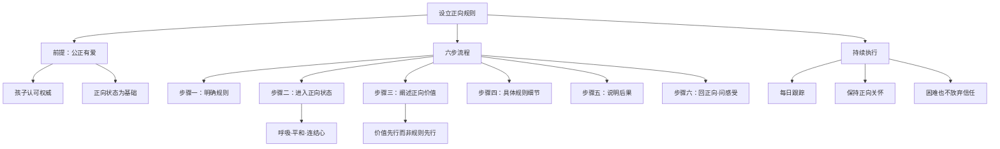

# 第07课：如何设立规则又不损害孩子的创造力？

> 讲师：斯蒂芬·吉利根（Stephen Gilligan）| 正向心理学与催眠治疗专家

## 课程背景

设立规则与保护创造力，似乎是为人父母最矛盾的任务之一。太多规则可能压制天性，太少规则又让孩子缺乏方向。吉利根博士在本课中提供了一个既能让规则落地、又能让孩子感受到被爱与尊重的正向框架——关键在于规则的出发点不是"你不够好"，而是"我们共同遵循的价值"。

## 核心概念

### 1. 综合规则 vs 具体行为规则

| 类型 | 定义 | 示例 |
|------|------|------|
| **综合规则（不可协商价值观）** | 家庭的核心价值导向 | 好好上学、尊重他人、结交正向朋友 |
| **具体行为规则** | 可操作、可随时间调整的行为要求 | 每天2小时作业、10点前睡觉、限制电子设备时间 |

### 2. 正向父母的权威基础

孩子愿意认可父母的权威，但前提是**父母公正且有爱**。如果孩子从规则设立者那里得到的信息是"你不是好孩子"，他们很难正向回应。

### 3. 规则背后的正向价值

每一个规则都应该对应一个正向价值。例如"限制电脑使用时间"背后的正向价值是"有更多时间与人连接、做作业和自我发展"。

## 要点详解

### 规则设立的六步流程

吉利根博士结合自身养育26岁女儿的经验，提出了设立规则的系统化流程：

#### 第一步：明确规则并确定沟通时机

选择一项具体规则（如"限制电脑使用时间"），单独和孩子约定一次正式的沟通时间，而非在情绪激动时提出。

#### 第二步：进入正向父母状态

在沟通之前，先调整自己的状态：
- 呼吸上下流动，将平和带入内在
- 在周围的整个世界当中感到平和
- 感受到与心的连结
- 脸上戴上微笑
- 在想象中看到孩子内心深处的美，带着"你是个好孩子，你一定会成长为优秀的人"的信念

> [!TIP] 语言内容只占沟通效果的7%，你的非语言状态（语气、表情、身体姿态）才是真正的信息。进入正向状态，比准备完美的说辞更重要。

#### 第三步：以正向价值开始谈话

不要直接说"我要限制你玩游戏"，而是先说："我们家最重要的价值之一是保持健康、与他人建立好的连接。你是家庭的一部分，我希望你也能成功、快乐。"

#### 第四步：阐述具体规则细节

将价值转化为具体的行为要求——什么样的分数、每天多少时间、何时睡觉。尽可能详细，同时确保要求**合理且可达**。

> 吉利根博士的个人经验：他的女儿数学不是强项，所以他会在数学上更宽容——"取得好成绩"不等于"在所有科目都得最高分"。

#### 第五步：说明违反规则的后果

明确后果，例如"如果没有完成作业，会失去看电视/使用电脑的特权"。后果要和孩子在意的事情相关，但本质上是正向引导而非惩罚。

#### 第六步：回到正向状态，确认共识

再次感受对孩子的正向关怀——"你是个好孩子，我相信你能遵守这些规则，成长为一个成熟快乐的人。" 然后询问孩子的想法和感受。

### 后续执行

- **每日跟踪**：确保规则的执行和后果的落实
- **保持正向状态**：即使孩子遇到困难、挣扎，你也要持续感受对他们的正向关怀
- **爱和信任贯穿始终**：让孩子意识到，规则背后是深沉的爱

## 案例分析

### 案例：电脑使用时间规则

一位父亲发现12岁的儿子每天花4小时以上打游戏，作业拖拉。他按照六步流程操作：

1. 选择周六上午专门谈话
2. 先做深呼吸，保持平静，回想儿子可爱的瞬间
3. 说："在我们家，我们重视健康和成长。你是个聪明的孩子，我们希望你能全面发展。"
4. 具体规则：工作日每天游戏不超过1小时，周末不超过2小时；作业完成后才能玩游戏
5. 后果：违规一次，次日禁玩；违规三次，当周禁玩
6. 询问儿子想法，调整到双方接受的方案

结果：儿子虽然一开始有抵触，但因为感受到父亲的尊重和信任，两个月后规则内化为习惯。

### 反例：空泛的指责

另一种做法是每天看到孩子玩游戏就吼"你又玩游戏！作业做完了吗？"，没有规则、没有后果、没有正面沟通。孩子感受到的是"我不够好"，而非"规则是为我好"。

## 思维导图

## 重要观点

> [!WARNING] 规则本身是中性的武器。当它在爱与连接中被传递，就是成长的脚手架；当它在愤怒与否定中被抛出，就是伤害孩子的刀。

> 如果你能做到在正向催眠的状态中设立规则，这会允许你的孩子更成熟、更有纪律性、更好地融入家庭价值观，并认识到在这个过程当中他们是如此被爱的。

## 自我觉察练习

**练习：规则正向化**

取一条你当前正在对孩子执行的规则，填写以下表格：

| 维度 | 内容 |
|------|------|
| 当前规则 | （如：每天只能看电视30分钟） |
| 背后的正向价值 | （如：保护视力、鼓励阅读和户外活动） |
| 你进入正向状态了吗？ | 是/否 |
| 是否以价值开头沟通？ | 是/否 |
| 规则是否具体可达？ | 是/否 |
| 后果是否提前说明？ | 是/否 |

如果以上有任何"否"，尝试按照六步流程重新来一次。

## 总结回顾

规则不是压制，而是孩子成长的脚手架。正向父母的秘密在于：**先连接，再纠正；先认同价值，再接受规则。** 当孩子感受到规则的出发点是爱和信任，他们不仅愿意遵守，还会在内化规则的过程中变得更加成熟。

**上一课：** [[0006-ru-he-dui-hai-zi-bao-chi-zheng-xiang|第06课：如何对孩子保持正向意图？]]

**下一课：** [[0008-ru-he-hua-jie-yu-hai-zi-de-guan-nian|第08课：代沟加深，如何化解与孩子的观念冲突？]]