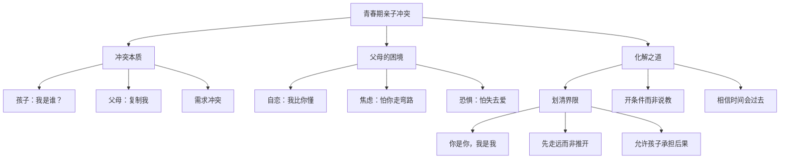

# 第08课：代沟加深，如何化解与孩子的观念冲突？

> 讲师：荣伟玲 | 心理咨询师、心理治疗专家

## 课程背景

孩子到了青春期，亲子冲突往往呈爆发式增长。很多父母焦虑到无法入眠，白头发也是在这个时期长出来的。荣伟玲老师首先提醒父母一个关键事实：**青春期冲突无论看上去多么严重，都会过去。** 到了二十多岁，孩子一旦成人，他们会和解或放下，不会再和父母闹下去。在这个认知基础上，荣伟玲深入剖析了冲突的本质，并提出化解之道。

## 核心概念

### 1. "我是谁"——自我同一性的追问

青春期的核心任务是回答"我是谁"。无论答案是什么，孩子都不愿意答案是"我是父母的翻版"。每个人都有寻求独特性的需要，而父母骨子里却有复制自己的本能——希望孩子复制自己的成功经验，同时避免自己走过的弯路。

### 2. 父母的复制本能 vs 孩子的独特性需求

| 父母的立场 | 孩子的感受 |
|-----------|-----------|
| "我是为你好" | "你要杀灭我的独特性" |
| "我走过的路是对的" | "你不相信我的判断" |
| "别走弯路" | "你比我强，所以我不听" |

### 3. 好父母的四个层级

| 层级 | 表现 | 结果 |
|------|------|------|
| 最糟糕 | 天天责备+大包大揽 | 养出啃老族 |
| 第二糟糕 | 天天责备+成年后赶出家门 | 自立但不相信人，内心缺安全感 |
| 稍好 | 鼓励赞美+包办生活责任 | 阳光但有依赖，遇挫折易崩溃 |
| **最好** | **赞美孩子+界限分明** | **自信独立，有应对挫折的经验** |

## 要点详解

### 为什么孩子不接受父母的"成功经验"？

1. **时代在变**：过去的成功经验在急速变化的环境中可能不再适用
2. **父母的自恋**：父母下意识地认为自己比孩子聪明，即使不说破，孩子也能感受到
3. **指导感即否定感**：孩子将指手画脚理解为"你不相信我的判断"、"你觉得你比我强"

### 化解冲突的核心：划清界限

- **尊重命运分离**：我是我，你是你，我们是两个不同的人
- **避免费力推开孩子，自己先走远一点**：当父母不再紧贴，孩子反而不会用力对抗
- **开条件而非说经验**：设定明确的标准，让孩子自己选择

> [!TIP] 超然心态的三个层面：① 他是他，我是我；② 我走过的路不一定适合他；③ 他的选择后果由他自己承担。

## 案例分析

### 案例：五百强高管父亲与留学儿子

一位白手起家的父亲，做到五百强企业管理层。他的儿子自小成绩优异，高中被送往美国。到了高考年，儿子却不着急，听音乐、开派对、交朋友、去旅游，声称考个一般大学就够了。

父亲急了：
- 和儿子谈自己的奋斗经历——农村出身，靠意志力走到今天
- 每天在朋友圈发自己五公里跑步和读书信息，"提醒"儿子看
- 儿子直接把父亲朋友圈屏蔽
- 父亲天天打电话，后来儿子不接电话了

**转机**：父亲停止说教，转而明确提条件——
"我们只是高级一点的中产，送你出国很不容易。如果你能考上某个层面的大学（父亲划定范围），我就付学费。如果考不上，请回国读大学。没有经验分享，没有琐碎控制，你的人生，你自己选。"

**结果**：儿子努力了一把，考取了全球前十的学校。

> 这位父亲从"以过来人身份指导"转变为"设定条件、尊重选择"，界限的清楚反而激发了孩子的内在动力。

### 关键的补充条件

荣伟玲强调，这个策略有效的前提是：**在0-7岁阶段与孩子建立了扎实的亲子关系根基。** 如果孩子小时候由保姆或老人带大，青春期再划清界限就会很困难——因为父母本能地害怕失去孩子的爱。这种情况下，父母需要心理咨询师的介入，作为"专业的代父母"帮助孩子度过这个阶段。

> [!WARNING] 如果和孩子硬扛，即使把孩子压服了，孩子内心会变得非常软弱，不再相信自己内心的力量。适当放手，反而给孩子机会自立。

## 自我觉察练习

**练习：检验你的"复制本能"**

请诚实回答以下问题：

1. 你是否经常说"我当年……"来教育孩子？
2. 你是否给孩子设定了你自己曾经想走但没走成的路？
3. 当孩子做出和你预期不同的选择时，你的第一反应是焦虑还是好奇？
4. 你是否能说出三个孩子优于你的方面？
5. 如果孩子将来从事和你完全不同领域的职业，你是否能真心支持？

如果以上有超过两个"是"（对1-2题）或"否"（对3-5题），你可能需要用更大的边界感来看待孩子的人生。

## 思维导图

## 重要观点

> 焦虑的父母们，请记住一点：青春期孩子与你的冲突是会过去的。意识到这一点，焦虑至少缓解一半。

> 避免孩子费力推开我们，自己首先应该走远一点。

> 如果小时候不管，孩子长大了反而啥都要管——没有比这更糟糕的了。

## 总结回顾

青春期冲突的本质是"我是谁"的权力之争。化解的关键不是"赢了孩子"，而是**划清界限**——用条件代替说教，用信任代替控制。前提是0-7岁的情感根基已经打下。有了这个根基，放手不是失去，而是给了孩子一个为自己负责的机会。

**上一课：** [[0007-she-ding-gui-ze-bu-sun-hai-chuang-zao|第07课：如何设立规则又不损害孩子的创造力？]]

**下一课：** [[0009-ru-he-hua-jie-qing-chun-qi-fan-pan|第09课：越青春越叛逆，如何有效化解青春期反叛？]]