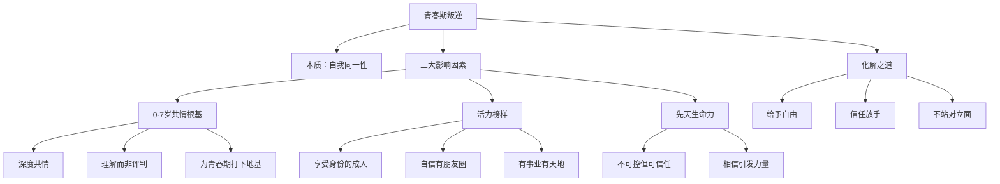

# 第09课：越青春越叛逆，如何有效化解青春期反叛？

> 讲师：荣伟玲 | 心理咨询师、心理治疗专家

## 课程背景

"我儿子从会说话开始就跟我对着干，什么都说不，咋一直叛逆？""做作业磨磨蹭蹭，一会儿动这个一会儿玩那个，一点作业做到半夜。""我的孩子在幼儿园就坐不住，乱跑乱跳。"——这些是武志红心理平台收集到的真实反馈，也是无数家长的心声。

荣伟玲老师在本课中提出一个颠覆性的视角：**青春期所谓的"叛逆"，在心理学上被认为是必要的、寻找自我同一性的过程。** 它是人一生中第一次"回炉重造"的机会——从10岁开始，20岁结束，是一个人真正从孩子转变为大人的过程。

## 核心概念

### 1. 叛逆的本质：寻找自我同一性

叛逆不是对抗，而是分化。孩子在青春期需要完成从家庭中分化出来的过程，成为与父母不一样的人。父母是谁，不再是他们小小世界里最重要的存在——最重要的是**自己是谁**。

### 2. 影响青春期发展的三个要素

| 要素 | 是否可控 | 说明 |
|------|---------|------|
| **0-7岁的情感根基** | 父母可控 | 这是最重要因素，爱的肥料决定根的深浅 |
| **活力四射的成人榜样** | 父母可控 | 孩子需要看到活出生命力的同性或异性榜样 |
| **孩子自身的生命力** | 不可控 | 先天因素；父母能做的就是坚定地相信 |

### 3. 共情 vs 权力压制

共情不是纵容，而是理解。用权力去压制孩子只能得到表面服从，内心积压的负面能量最终会在青春期以更猛烈的形式爆发。

## 要点详解

### 共情的力量：一个生动的案例

荣伟玲老师分享了自己与两岁多儿子的互动：

一次家族聚餐后，发现小宝衣服湿了（冬天），需要立刻换。但小宝看到另一家的孩子已经跑远，急着去追，不愿换衣服。几位亲戚围过去责备他"太不讲道理""大人都是为你好""这么浑真不应该"。孩子哭得更伤心。

荣伟玲没有加入责备，而是：
1. 放弃了去亲戚家的计划，打车回家
2. 把仍在哭泣的小宝抱在膝盖上，用身体温暖他
3. 说出孩子的感受："很生气是不是？因为看到小黑锅已经走远了，想去追他，并不在乎衣服是不是湿了，是不是？妈妈拖住不让走，特别着急，是不是？"

小宝马上不哭了，平静下来，点了点头，把小头靠在妈妈肩上。

> **他获得的平静，来源于被了解。**

### 榜样的四个标准

荣伟玲提出，活力四射的成人榜样必须具备：

- 快乐地享受自己的性别和身份
- 自信快乐，有知心朋友
- 有兴致勃勃的事业
- 有自己的一片天地

以特朗普教育子女为例：他宠爱孩子但不溺爱（买钻石给女儿做礼物，但稍大就要孩子自己挣零花钱）；让孩子观察自己的工作和社交；在重要人物面前热情地介绍和夸赞孩子。结果他的几个孩子成就动机都很高，个个是优等生并创立了自己的事业。

> [!TIP] 说教不如活出来。你活出什么状态，孩子就吸收什么状态。这就是榜样的催眠力量。

### 被深深信赖，是孩子爆发潜能的引信

一个女孩在学校被老师认定为多动症，母亲被建议带孩子看心理医生。心理医生和女孩谈了一会儿，站起来说"我们先出去一下"，走之前打开录音机放了一段音乐。他们在窗外偷看——女孩独自在房间里变得自由自在，站起来跳舞，非常优美。心理医生建议送孩子去舞蹈学校。后来这个女孩成为俄罗斯最著名的舞蹈家和编舞大师。

> 每个孩子都有独特的前置。学校师长可能不了解孩子，但从孩子生下来就和他一起生活的父母，应该有正面积极的心去观察孩子的天赋，而不是作为帮凶和他人一起去打击孩子。

### 真正的反叛需要权威作为对手

一位男士回忆15岁时：看到同学都在玩离家出走，觉得很酷，回家冲父母喊"我不在家里过了，我要离开"。他收拾行李往外冲，父亲急忙赶出来，递上一叠钱："出门在外小心点。"——他说，刹那之间，他一点也不想离开家了。

反叛需要对象。如果父母根本没有把自己当作权威，而是像朋友一样尊重和理解孩子，有商有量——反叛无从谈起。

> [!WARNING] 妖魔化青春期的反叛，只会杀灭了孩子内心的力量。需要的不是镇压，而是镇定的容纳、支持与引导。

## 思维导图

## 自我觉察练习

**练习一：你的共情能力自检**

下次孩子哭闹或发脾气时，不要急着说"别哭了""别闹了"——尝试：
1. 蹲下来，和孩子平视
2. 说出你观察到的孩子感受："你很生气/难过/着急，因为……"
3. 等待孩子的回应（点头、哭泣减少、靠过来）

> 孩子获得的平静来源于被了解。你不需要解决问题，只需要被理解。

**练习二：榜样的画像**

回答：你的孩子能在你身上看到什么？
- 你是否快乐地享受着自己的身份？
- 你是否有自己的朋友圈和热爱的事业？
- 你是否活出了一个成年人应有的生命状态？

如果答案让你犹豫，也许需要先为自己做一些工作。

## 总结回顾

青春期叛逆不是敌人，而是成长的信号。化解叛逆不需要更强力的镇压，只需要三条路径：**共情建立的情感根基**、**活出生命力的榜样引领**、以及**深深的、无条件的信任**。

当父母放下权威的执念，真正站到孩子身边——反叛就没有存在的必要了。

**上一课：** [[0008-ru-he-hua-jie-yu-hai-zi-de-guan-nian|第08课：代沟加深，如何化解与孩子的观念冲突？]]

**下一课：** [[0010-mian-dui-da-ma-hai-zi-de-zhang-fu|第10课：面对打骂孩子的丈夫，母亲该如何自处？]]