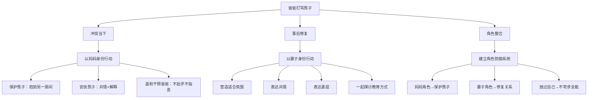

# 第10课：面对打骂孩子的丈夫，母亲该如何自处？

> 讲师：侯玉珍 | 武志红厦门工作室心理咨询师

## 课程背景

一位母亲的来信：孩子两岁半，爸爸经常为一些小毛病揍孩子——比如小便不提前说尿在身上。孩子现在只要看到爸爸大声说话就立马抱紧自己说"你不要打我"。妈妈上前阻拦时，爸爸更加生气，有时还冲妈妈发脾气。妈妈感到左右为难——保护了孩子怕否定老公，不管又舍不得孩子。"要做一个好妻子和好妈妈真的太难了。"

侯玉珍老师从**角色冲突理论**出发，为处于类似困境中的母亲提供了一条清晰的行动路径。

## 核心概念

### 1. 角色冲突

我们每个人都生活在多种身份角色里（母亲、妻子、女儿、员工等），每个角色都有其评价系统、责任和义务。当两个角色的要求在同一个场景下相互冲突时，人会感到左右为难——选择一方似乎就伤害了另一方。

### 2. 角色防御系统

一个健康的心理机制：**在什么情境下用什么身份应对。** 保护孩子时，启动"母亲"身份；修复夫妻关系时，启动"妻子"身份。角色区分能够隔离一种关系中的负性情绪，让自我的功能更好地发挥。

### 3. 温和而坚定

对爸爸干预的方式：不批评指责（这会触发自尊脆弱或防御），而是以温和的态度表达坚定的立场。核心信息是"我抱开孩子不是在否定你，只是换个方式"。

## 要点详解

### 冲突当下的三步行动

| 步骤 | 行动 | 核心原则 |
|------|------|---------|
| **第一步：保护孩子** | 想办法把孩子带到另一个房间 | 此时你是妈妈，孩子安全第一 |
| **第二步：安抚孩子** | 抱抱孩子，看着他的眼睛，共情他的恐惧 | "别怕，妈妈陪着你；爸爸这么生气不是你的错" |
| **第三步：温和干预爸爸** | 提醒爸爸冷静，解释抱开孩子的意图 | 不批评，不指责，温和而坚定 |

> [!WARNING] 上前阻拦爸爸会让爸爸觉得自己不被尊重，从而更加愤怒，甚至将愤怒转移到妈妈身上。所以对爸爸的干预要温和而坚定——不要一上来就批评他这样不对那样不好。

### 事后修复：妻子的角色

冲突结束后，选一个适合的氛围——一顿浪漫晚餐或一次两人的独处。此时抛开"爸妈"身份，回归"丈夫和妻子"。

1. **表达共情**："亲爱的，上次吵架让你不开心了，你希望我怎么补偿呀？"
2. **表达自己的委屈**："上次吵架，我也觉得很难过呢。"
3. **一起探讨教育方式**：以父母的角色坐下来商量

### 为什么爸爸会打孩子？

侯玉珍老师指出，爱打孩子的爸爸通常有两类：
- **自尊太脆弱**：无法面对自己的无力感，用暴力来获取掌控感
- **太理智**：无法触碰内心柔软的情感，把教育简化为规训

理解这一点不是为了原谅暴力，而是为了让母亲在干预时有更多的策略选择。

### 角色防御：放过自己

侯玉珍分享了两个朋友的对比：

- **小C**：优秀职业白领，白天忙工作，晚上回家陪孩子、辅导作业、哄睡，完全没有自己的时间。即使这样，内心依然愧疚——"没时间陪孩子"；不工作又怕养不起孩子。最后抑郁了。

- **另一位同状态的朋友**：同样的生活状态，却觉得自己已经做得很好了——做员工时努力上班，做妈妈时尽己所能给孩子爱。

> 两种状态的差异不在于生活内容，而在于**对自己是否苛刻**。

> [!TIP] 一个人不可能同时满足所有角色的要求。一件事情两个标准，势必左右为难。给自己建立角色防御系统——分开"我是妈妈"和"我是妻子"的标准。
> 
> 保护孩子，你就是个好妈妈；发生争执后愿意修补关系，你也是个好妻子。

## 案例分析

### 完整应对示范

**场景**：爸爸因为孩子尿裤子而大声斥责并要打孩子。

**母亲的当下行动**：
1. 走上前，温和地说："我来处理，你先冷静一下。"
2. 把孩子抱到另一个房间
3. 抱着孩子说："是不是很害怕？妈妈在这里。爸爸生气不是你的错，是他自己的坏情绪来了。"
4. 陪伴直到孩子情绪平复

**事后行动**：
1. 晚上孩子睡后，和丈夫单独相处时说："今天你好像特别累？我知道你也不想发火，但我们一起想想有没有更好的办法？"
2. 共同商定：以后感到要发火时，先离开现场冷静5分钟

## 思维导图

## 自我觉察练习

**练习：角色分离日记**

每次遇到角色冲突时，写下：

| 问题 | 你的回答 |
|------|---------|
| 当时我启动了什么角色？ | |
| 这个角色的核心责任是什么？ | |
| 另一角色的需求是什么？ | |
| 我是否可以在不同时间分别满足这两个角色？ | |
| 我今天是否已经尽力了？ | |

> 提醒：尽力就好，别太苛刻。你已经在承担很多。

## 重要观点

> 家庭暴力干预的第一原则从来不是修复夫妻关系，而是确保孩子的安全。没有一个孩子应该用恐惧换取"完整的家"。

> 在一段亲密关系中是不可能没有冲突的。如果两个人一味回避，只会越来越糟。对好的伴侣来说，最重要的能力之一就是懂得在冲突之后如何修复关系。

## 总结回顾

面对伴侣对孩子的暴力行为，母亲不需要在"好妻子"和"好妈妈"之间二选一。关键策略是：**冲突当下启动母亲的保护功能，事后启动妻子的修复功能。** 角色分离让你不必在同一时间满足所有期待，也就不必内疚。

保护好孩子，你已经是一个好妈妈。修复好关系，你也是一个好妻子。放过自己，你才能在这个困境中找到持续的力量。

**上一课：** [[0009-ru-he-hua-jie-qing-chun-qi-fan-pan|第09课：越青春越叛逆，如何有效化解青春期反叛？]]

**回到模块首页：** [[../index|课程总目录]]