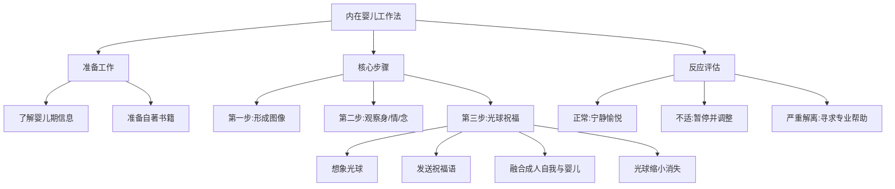

# 第11课：创伤疗愈：婴儿期内在小孩对话法

> 讲师：李孟潮

## 课程背景

本课程进入自我成长模块的深层议题——创伤疗愈。内心冲突有童年的根源，也有当下的表现。内在婴儿工作法专门处理由童年创伤形成的内心冲突，是一种温和而有养育性的技术，类似于"止痛剂"，适合有较轻创伤的来访者自行练习。课程强调，仅通过本课程无法实现彻底的疗愈效果，严重创伤者应优先寻求专业咨询师帮助。

## 核心概念

### 创伤与固着的区别

| 概念 | 定义 | 表现 |
|------|------|------|
| **创伤** | 发展过程中爱和恨的失衡 | 爱过少或过多、恨过少或过多均会造成创伤 |
| **固着** | 心理发展停滞在某个时期 | 老年时退行到婴儿期、少儿期或青少年期 |
| **退行** | 回到当年固着的地方 | 可能是寻求当年获得爱的地方，也可能是试图修复创伤 |

> [!WARNING]
> 过多的爱同样是一种创伤。"有一种冷叫做妈妈觉得你冷"——这种过度的爱在孩子幼年时是好的，但对青年来说不是爱，而是**控制**。

### 内在婴儿工作法的原理

想象一个内在孩童的形象（不一定是真实的自己），然后对这个内在婴儿发送关爱、祝福和安慰——即用**成人自我去养育、抱持、共情、理解、关爱内在婴儿**。这是一种温和的养育性技术，能让练习者稳定下来，感受到温情和温暖。

## 要点详解

### 第一步：准备工作——了解自己的婴儿期

在练习之前，建议先向父母了解以下信息：
- 父母当年是如何决定生下你的
- 你是在父母身边还是由他人照料长大
- 几岁上的托儿所/幼儿园
- 母乳喂养还是人工喂养
- 断奶方式、晚上睡眠安排

> [!TIP]
> 询问这些问题的目的不是评判父母，而是帮助你理解自己在婴儿期是否获得了足够的关爱。

### 第二步：形成内在婴儿图像

想象一幅具体的、像照片一样的婴儿图像。如果想象不出来，可以翻看真实的婴儿期照片作为辅助。

**案例：马小姐**
马小姐的婴儿期过得不错：父母愿意生下她，虽有轻微的重男轻女观念但不严重，在父母身边长大。她想象出的图像是和爸爸妈妈一起照相的样子——很开心但有一点点担心妈妈会嫌她烦。

**对比案例：创伤更重的来访者**
有的来访者想象出的图像是"一个小婴儿在一个农村的摇篮里面，浑身沾满了大便，正在哭泣"。这幅图像本身即是创伤信号，意味着大量被抛弃的体验。

### 第三步：观察身体、情绪与念头

图像栩栩如生之后，同时观察三个层面：

1. **身体感受**：温暖还是寒冷？紧张还是放松？沉重还是轻飘？
2. **情绪**：恐惧、悲伤、快乐还是痛苦？
3. **念头**：脑海中闪过什么想法？

> [!NOTE]
> 无论是出现什么情绪或念头，仅仅是**观察它们**，不要跟随着念头走。

### 第四步：发送祝福——光球技术

这是最关键的步骤。具体操作：

1. 想象一个**光球**（或小太阳）出现在你和内在婴儿之间
2. 对内在婴儿反复发送祝福语
3. 想象光球不断发出光芒，将成人自我和内在婴儿融合

**祝福语模板：**
- "祝你被人看见"
- "祝你被人关爱"
- "祝你被人无条件地接纳"
- "祝你远离所有痛苦和悲哀"

> [!example]
> 反复练习三到四轮，每轮重复祝福语。有些人在此过程中会出现"成人自我抱着内在婴儿"的温馨画面，可以继续这样想象直到感觉可以了，最后想象光球缩小为一个点，消失在宇宙中。

### 第五步：观察反应

- **正常反应**：感觉宁静、轻微愉悦感、睡眠改善
- **不适反应**：失眠、焦虑、心身不舒服——可以先停止练习，阅读自助书籍或做按摩
- **严重反应**：失魂落魄、解离体验（世界像隔着一层玻璃）——说明该时期的创伤非常大，必须停止练习并寻求专业心理医生帮助

> [!WARNING]
> 如果出现解离体验，请立即停止练习并寻求专业帮助。内在婴儿工作法本身也可以起到**诊断作用**，帮助你及早发现深层创伤，尽早接受治疗。

## 重要观点

> [!TIP]
> 内在婴儿最希望的是**被无条件地爱、被看见、被肯定**。我们发送的祝福也应围绕这些核心需求：看见、关爱、无条件接纳、抱持。

> [!WARNING]
> 仅仅通过本课程想要起到好的疗愈效果是不太可能的。如果真的需要疗愈效果，首选是找咨询师；如果要用自助方式，除了听课，还需要阅读自助书籍，如《回归内在》（新版《别永远伤在童年》）、《让往事随风而去》和《身体从未忘记》。

## 自我觉察练习

1. 向父母了解你的婴儿期成长信息（出生决定、喂养方式、照料者等）
2. 找一张婴儿期照片，或想象内在婴儿的画面
3. 观察看到这幅画面时身体的感受、情绪和念头
4. 尝试光球祝福练习，每日一次，持续一周
5. 记录练习后的身心反应，如持续不适请停止

## 思维导图

## 总结回顾

本课介绍了内在婴儿工作法的完整流程：从了解自身婴儿期背景，到形成内在婴儿图像，再到观察身体-情绪-念头的三重觉察，最后通过光球祝福技术完成疗愈。该方法的核心逻辑是——用已经成年的、有力量的自我，去抱持和关爱那个曾经受伤的内在婴儿，通过反复的祝福语修复爱与恨的失衡。

需要注意的是，这种方法适合较轻的创伤。如果练习中出现严重的解离体验或持续不适，说明创伤较深，需要借助专业咨询师的帮助。疗愈是一个渐进的过程，给自己时间和空间，允许过程自然发生。

---

**相关课程：**
- [[0012-ru-he-chong-su-shen-ti-ji-yi|第12课：如何重塑身体记忆，获得疗愈的力量？]] —— 身体层面的创伤记忆疗愈
- [[0005-tong-guo-shen-ti-liao-jie-qin-mi|第05课：如何通过身体了解亲密关系？]] —— 创伤在身体层面的表现