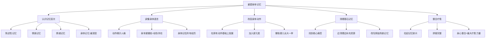

# 第12课：如何重塑身体记忆，获得疗愈的力量？

> 讲师：王宇赤

## 课程背景

身体是灵魂的模样，身体是生命的殿堂。身体记忆是记忆中最深层的记忆，它比大脑皮层的陈述性记忆、情景记忆和情绪记忆更加原始和持久。本课程探讨如何通过身体工作来重塑记忆——改变身体动作可以改变身体记忆，清理深层的基石记忆可以获得真正的疗愈力量。

## 核心概念

### 记忆的层次结构

记忆由浅入深，共分为四个层次：

```
陈述性记忆（大脑皮层）→ 情景记忆（空间与时间）→ 情绪记忆（情绪体验）→ 身体记忆（身体感受与反应）
```

**身体记忆的特点：**
- 三维立体的记忆，有身临其境的穿越感
- 记忆内容碎片化，常伴有强烈情绪
- 最早形成，胎儿期就已存在
- 分散在身体和神经系统中
- 以意象、符号和象征性的潜意识语言呈现

> [!TIP]
> "不要用脑子学习精神分析，而要用身体学习精神分析。"——曾奇峰。**具身认知理论**强调心智对身体及其感觉运动系统的依赖性，加入身体的参与会使学习效果大幅提升。

### 基石记忆

基石记忆是给我们带来困扰的最早的记忆。它们在被存储的过程中会被切割、打散、扭曲、变形，我们难以辨认。即使能辨认出来，也会因为恐惧而选择逃避。但如果不处理基石记忆，即使解决了表层问题，新的痛苦仍会源源不断地涌来。

## 要点详解

### 身体会记住什么

身体会记住：
- 受到威胁时的本能反应（屏住呼吸、收紧身体、毛孔张开）
- 危险时的身体动作和姿势
- 危险带来的情绪感受和体验
- 危险情景中的画面、感受、情绪、气味、声音、颜色
- 身体内有空间，外有表达——身体记得所有事情

### 身体动作中的人格密码

每个人的身体动作暗藏人格特点：

| 动作特征 | 背后的人格/心理状态 |
|----------|---------------------|
| 动作夸张、范围大、强度高、侵入性强 | 自我中心、需要被关注 |
| 动作无边界、无完结、与环境持续碰撞 | 共生阶段、无法独立 |
| 动作向中心锁、前胸后缩、身体形态变空 | 自我保护、不信任、解离倾向 |

**案例：解离中的"乖乖女"**

一位舞动学员的所有动作都缩向中间，给人自我保护、不信任别人的感觉。她生活中懵懵懂懂的，跟着别人做该做的事（结婚、生子、带孩子），但做这些事时是没有连接的、没有感觉的——这是**解离**状态。

**根源**：她有一个极度焦虑的妈妈，每时每刻都安排她做这做那，如果不听话就打骂。她只能用"走神"来表达不情愿，既满足了妈妈，又让自己没那么痛苦。习惯延续至今，做什么事都走神。

**干预方法**：
1. 满足她动作缩向中心的需要——让她重复、清晰、有力、有目的地做"缩回来"的动作
2. 在原有动作基础上加入不同元素，促进动作体验的多样化
3. 像陪伴婴儿长大一样，陪伴她身体动作发展、壮大
4. 当身体动作发展完整，可以自由表达情感、自发展现自我时，身体记忆即被改写

### 清理基石记忆

**案例：无法拒绝别人的女性**

一位舞动学员无法拒绝别人，总被周围人的要求弄得疲惫不堪。表面看是没有拒绝能力，但核心问题是**小时候被抛弃的经历**。

- 她是家里的第二个女孩，一出生就被送到外婆家
- 偶尔被接回父母家时，家人嘲笑她土气、乡下妹
- 她感觉家里没有她的位置，全家人都嫌弃她
- 她的身体卡在被抛弃时的恐惧和无能为力中
- 她用讨好和不拒绝的方式与人相处，是为了满足共生需要

**干预过程**：
1. 让她在安全姿势下躺卧，组员将手放在她身上
2. 做"吸节奏"动作（模拟婴儿吸吮妈妈乳头的节奏），有安抚、滋养作用
3. 用丝巾、垫子等柔软道具盖在她身上，轻轻摇晃
4. 重新改写了"被装在篮子里、被冷风吹着"的身体记忆

> [!WARNING]
> 清理身体深处的创伤记忆，**必须一边清理坏的，一边给予好的**。寻找身体资源、让身体与资源建立连接，是身体工作中的重中之重。不能生吞活剥，也不能拔苗助长。

### 身体记忆的整合与疗愈

重塑身体记忆就是恢复身体本来的样子：
- 把身体里扭曲、打结、堵塞、存储过久的负面形式翻腾出来
- 找到错位的身体动作和姿势
- 找到阻碍身体动作发展的节点
- 还身体一个清爽、轻盈的世界

> [!TIP]
> 身体就是身体，让身体承担太多不该承担的东西，是我们既懒惰又无力的表现。**心灵承担心灵该承担的，给身体自由**，让身体恢复本来的样子，才能真正重塑身体记忆。

## 重要观点

> [!TIP]
> 清理身体记忆的过程是整合身体记忆的过程。最深处的身体记忆是碎片式的，清理就是把散落在外的记忆碎片一片片地捡起来、拼接上，使记忆逐渐变完整、连接起来。**身体内在世界全然整合时，是最有疗愈力量的时刻**，因为世间万物都在你的身体里。

## 自我觉察练习

1. **观察自己的动作模式**：找一个安静的地方，做一些简单的动作（伸手、转身、弯腰），观察这些动作是否有特点？是展开的还是收缩的？是流畅的还是卡顿的？
2. **回忆身体的"基石记忆"**：尝试回溯最早让你感到"身体不舒服"的记忆，不强迫自己，只是轻轻触碰
3. **尝试改变一个小动作**：选择一个习惯性动作（如含胸、低头），每天有意识地做一次相反的动作，感受身体的不同
4. **身体扫描**：每天花5分钟，从头到脚扫描身体感受，留意哪些部位是紧张的、冰冷的或麻木的

## 思维导图



## 总结回顾

本课程的核心思想是：**身体记忆是记忆的最深层**，它存储了我们所有的经历，尤其是创伤经历。身体动作是身体记忆的外在表达，通过观察和重塑身体动作，我们可以改写身体记忆。

课程提出了三个层次的干预：
1. **重塑身体动作**：在原有动作基础上引导发展，像陪伴婴儿长大一样
2. **清理基石记忆**：找到核心痛苦记忆，边清理边补充资源，不可急于求成
3. **整合身体记忆**：将散落的记忆碎片拼接起来，实现身体内在世界的整合

最终的疗愈力量来自整合——当身体、心灵、情感、认知、灵魂、外部世界全部整合时，就是最有力量的时刻。

---

**相关课程：**
- [[0011-nei-zai-ying-er-dui-hua-fa|第11课：创伤疗愈：婴儿期内在小孩对话法]] —— 从内在意象层面处理早期创伤
- [[0005-tong-guo-shen-ti-liao-jie-qin-mi|第05课：如何通过身体了解亲密关系？]] —— 身体疼痛的心理隐喻