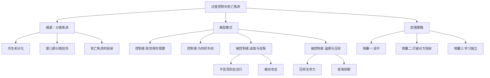

# 第13课：江湖篇—离开你，我就活不下去

> 讲师：武志红心理课堂团队

## 课程背景

本课聚焦于关系中"控制与无力"和"恐惧"的核心议题。当一段关系中有人说出或感受到"离开你，我就活不下去"时，这不仅仅是情感表达的夸张，而是内心深处**死亡焦虑**的体现。从共生到分化，从过度控制到逃离反抗，本课深入剖析这些关系模式的心理学根源，并提供突围指南。

## 核心概念

### 分离焦虑即死亡焦虑

"离开你，我就活不下去"中的"活不下去"，在精神层面的理解是关于内心深深的**死亡焦虑**。两个生命绞在一起、没有分化，就是共生的状态。婴儿的成长必须经历共生阶段，但到了一定程度就需要开始分化。许多成年人关系中的共生，就是分化没有成功，双方整天粘在一起。

当一方生出分离的愿望时，共生的幻想遭到破坏，不想要分离的一方会感觉到被抛弃，仿佛离死亡不远了。

### 控制与焦虑的恶性循环

```
越焦虑 → 越想控制 → 越控制 → 对方越想逃离 → 越焦虑
```

## 要点详解

### 最常见的控制："我觉得你需要"

过度控制最常见的形式是**"我觉得你需要"，然后主动去强加于你**。它的美丽外衣是："我都是为了你好。"

**案例：有一种冷叫做你妈觉得你很冷**

一位姑娘说，如果她拒绝穿衣服，妈妈能在她身边叨叨一整天，使劲浑身解数就是为了让她穿衣服，最后她自己简直要崩溃了。

**妈妈内心的真实状态**：你不穿衣服，我很焦虑，我要你穿上衣服来配合我的焦虑——否则我就会死。

> [!WARNING]
> 当一个人不考虑关系中的另一方也是"人"的时候，他就不会觉得对方有情感、有意志、有需要。你只被当作一个执行的机器。**不把对方当作人，是对关系的攻击和破坏。**"吃力不讨好"的本质就是入侵。

### 控制的妈妈与逃离的孩子

**案例：做三天饭菜的妈妈**

一位妈妈只要进女儿家门，就完全接管主场——决定吃什么、东西放哪里，外出前会提前做好三天的饭菜放冰箱，理由是"我怕你饿着了呀"。

这位妈妈认为女儿离开了她活不下去，实际上这是**投射**——把自己内心的愿望投放到另一个人身上。**她觉得女儿离开她活不下去，其实是她离了女儿活不下去。**

女儿的反抗方式：不打招呼就去外地旅行，到了目的地才发个信息告知。这形成了"控制的妈妈与逃离反叛的孩子"的模式。

### 控制的妈妈与温顺压抑的孩子

另一种常见的配对是：控制的妈妈与温顺压抑的孩子。这样的孩子：
- 什么事情都听从母亲
- 严重压抑自己的生命力
- 不提需求
- 活得特别没有热情
- 容易陷入抑郁

> [!NOTE]
> 在家庭治疗中，有时会遇到这样的情况：孩子刚刚有好转，父母就会停止咨询——因为青春期的父母会对孩子的咨询师产生嫉妒，担心失去自己在孩子心目中的地位。

## 过度控制者的内在世界

1. **没有活在当下**：永远在为未来的事情未雨绸缪，好像未来总是有一个危险在那里
2. **需要确定的控制感**：通过控制获得安全感，但以他人的自由和紧张为代价
3. **幼年创伤通常与分离有关**：婴儿的分离应以妈妈的祝福和接纳为承托。例如一岁孩子说"不"时，妈妈的正确反应是"哦，你有自己的想法了，真为你高兴"——这是祝福。如果妈妈的反应是"不什么不，这事儿得听我的"，孩子分离的力量就被贬低
4. **僵化的控制影响幸福感**：没有人愿意被过度控制，关系可能变得短暂，无法进入深度关系，加深孤独感

## 重要观点

> [!TIP]
> 在控制者这里，他们与孩子的关系并不会舒服到哪里去。孩子用他们自己的方式表达着抗议和攻击。控制者如果不把这股力量拿回自己身上，这个模式就会一直延续下去。

> [!WARNING]
> 一个过度焦虑的人，内心已经是失控的。他通过抓取其他人来获得控制感，缓解自己的焦虑。与之配对的被控制者会感到紧张，并在关系中非常不自在。

## 自我觉察练习

### 给被控制者的三个锦囊

> [!TIP]
> **锦囊一：学会说"不"** —— 自己不想要的，不管是明显感觉到还是不那么明显，都勇敢说出来，别委屈自己。

> [!TIP]
> **锦囊二：警惕一种幻想** —— 对方经常给你扣帽子：你多么不能干，没有它你不行。这可能是一种幻象。这个世界上，除了小婴儿依赖大人才能活，成年人自己都是可以活下来的。要相信自己。

> [!TIP]
> **锦囊三：独立** —— 被控制的人很多是依赖型的特质。需要自己独立起来，至少要一点一点地开始学着独立，为独立做准备。

### 自我检查清单

1. 你在关系中是否经常感到"没有对方不行"？
2. 你是否经常因为别人不按你的方式做事而感到极度焦虑？
3. 当孩子或伴侣说"不"时，你的第一反应是什么——接受还是愤怒？
4. 你是否经常以"为你好"的名义替别人做决定？

## 思维导图



## 总结回顾

本课的核心洞见是：**分离焦虑就是死亡焦虑**。过度控制的本质是内心失控的人通过抓取他人来获得确定感和安全感，但这往往以牺牲关系为代价。

课程揭示了控制与逃离的典型配对模式，分析了过度控制者的内在世界（活在未来的焦虑中、与分离创伤有关），并为被控制者提供了三个突围锦囊：学会说"不"、警惕被投射的"无能感"、逐步建立独立性。

没有人愿意被他人过度控制。当你遇到这样的人，你需要让自己强大起来，让自己有力量说"不"，也有力量离开。

---

**相关课程：**
- [[0011-nei-zai-ying-er-dui-hua-fa|第11课：创伤疗愈：婴儿期内在小孩对话法]] —— 理解婴儿期创伤的根源
- [[0009-ru-he-hua-jie-qing-chun-qi-fan-pan|第09课：越青春越叛逆，如何有效化解青春期反叛？]] —— 青春期分化与独立议题