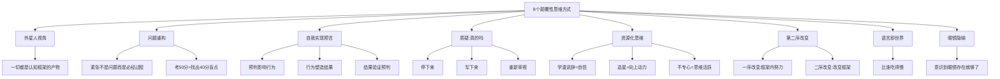

# 第14课：李松蔚：8个颠覆你认知的思维方式

> 讲师：李松蔚

## 课程背景

认知无处不在，但我们往往意识不到自己在使用认知。本课的核心观点是：**我们眼中的世界，是被认知加工和组织过的世界**。很多我们认定是"问题"的事情，其实只是因为我们戴着特定的"眼镜"在看它们。如果换一副眼镜，所谓的"问题"可能根本不存在，甚至是一种资源。李松蔚老师通过大量生活化案例，教我们如何用"外星人视角"重新审视认知，实现思维的颠覆性转变。

## 核心概念

### 什么是认知

认知是我们用来组织和理解世界的**基本假设**和**概念框架**。就像一副眼镜，我们戴了太久，已经忘记它的存在，以为看到的就是世界的本来面目。

### 原认知（Metacognition）

**对认知的认知**——把自己抽离出来，用陌生的眼光审视自己头脑中"不知不觉就生成的假设"。这是实现认知转换的关键能力。

## 要点详解：8个颠覆性思维方式

### 1. 外星人视角：你不是在看世界，你是在解读世界

想象自己是一个完全不了解地球文明的外星人，重新审视你熟悉的环境——你手里拿着的手机、草地上争夺球的人们、你正在做的事情。你会发现，所有看似"理所当然"的事情，背后都有一套**人为建构的认知框架**。

> [!TIP]
> 很多"问题"其实是我们在特定认知框架下定义出来的。就像一张桌子——它可以被当作凳子、台子、鼓、甚至武器。它之所以是"桌子"，是因为我们把它叫作桌子。**换一个定义，就换了一种可能。**

### 2. 问题不是问题，定义问题才是问题

**案例：游泳紧张的小女孩**

李老师7岁的女儿学游泳时很紧张，总往下沉。教练说"你越紧张越往下沉"，但指出问题后，问题反而加重了——因为女儿开始"害怕紧张"，越害怕越紧张。

李老师的做法：他说"紧张是你必然要经历的过程，大概要紧张一百多次才能学会游泳"，并鼓励她继续紧张。结果没几天，女儿就能浮在水面上了。

**转变的关键**：不再把紧张定义为"问题"，而是把它定义为"必经的过程"甚至"朋友"。认知框架变了，身体的反应也随之改变。

> [!WARNING]
> "你越紧张越往下沉"——这句话听起来是事实，但当我们把它当作问题来纠正时，反而会制造更多紧张。有时候，**不把问题当问题，问题反而消失了**。

### 3. 自我实现的预言：你以为的事实，是你制造的事实

**案例：不喜欢我的人**

当一个人预先认定"这个人可能不喜欢我"时，会下意识地用挑剔和戒备的眼光去观察对方，从中找出蛛丝马迹来验证自己的判断。对方接收到负面信号后，真的开始不喜欢他——于是他说："你看，我从一开始就知道他不喜欢我。"

> [!TIP]
> 我们的认知会引导行为，行为会影响他人的反应，他人的反应又反过来"证实"我们的认知。这就是**自我实现的预言**。打破它的唯一方式是：停下来问自己——"真的吗？"

### 4. "真的吗？"——质疑的魔力

这是实现认知转换的最核心工具。在头脑中产生任何"斩钉截铁"的判断时，慢下来，问自己三个字：**真的吗？**

**案例：考了50分的女儿**

朋友的女儿考了50多分，非常害怕。朋友没有批评，而是说："你知道50多分意味着什么吗？意味着你被扣了40多分。被扣的分就是考试的作用——帮你找出知识的缺漏。考100分的话，考试对你反而没用。考50分，等于帮你找出了40多分的盲点，你赚大了。"

这个认知转换让女儿备受鼓舞，很快成绩就上去了。

**案例：来自小县城的自卑者**

一位来访者因为来自小县城，在大城市同事面前感到自卑。当他停下来问自己"真的吗"时，他发现了另一种可能：他拥有在小县城生活二十年的经验，了解这部分人群的消费习惯和思维方式，恰恰是公司下沉市场战略中不可替代的人才。

> [!TIP]
> 最关键的一步不是看到资源在哪里，而是**你能不能停下来**，问自己"真的吗"——允许自己看到另一种可能性。

### 5. 重新定义"问题"：从灾难化到资源化

**案例：学渣的自信**

孩子说"我不想当学霸，我是学渣"。很多父母会将此视为"不自信"的表现。但如果换个角度——"我不需要当学霸，我也是有价值的"——这恰恰是自信的表现。

父母可以这样回应："如果你不当学霸，你厉害的地方在哪里？"或者"你接受自己是学渣还能这么自信，你一定有一些过人之处。"

**案例：痴迷追星的女儿**

当父母把追星看作问题时，会打压和嘲讽；但如果换一个视角——追星是孩子在对偶像投射自己对美好品质的向往（努力、上进），这其实是一种向上的动力。利用这种动力，可以与孩子协商学习目标，将追星转化为积极因素。

**案例：女儿的"坏习惯"**

妈妈抱怨孩子不专心、嬉皮笑脸、批评只记两分钟。换个角度：
- "不专心"可能代表思维活跃、好奇心强
- "批评只记两分钟"代表有稳定的自我认同，不易被负面评价影响

> [!TIP]
> 社会语境中很多根深蒂固的"问题认知"本身就是问题。不容易的是告诉你"这样也好，那样也好"——很多看起来很糟糕的事情，停下来问"真的完蛋了吗"，也许恰恰是好事的开始。

### 6. 第二序改变：停止改变，才是真正的改变

"第二序改变"区别于"第一序改变"——第一序改变是在现有框架内努力改变；第二序改变是**跳出框架，改变看待框架的方式**。

**案例：自我价值危机**

一位读者从快乐自信变得严重自我怀疑，认为自己是个"巨婴"。第二序改变不是让他继续改变自己、找更多问题，而是**停下来，先别急着变**——去欣赏那些维持了近四十年的、让他在大部分时候快乐的东西，学会欣赏而不是批判它们。

> [!WARNING]
> 第二序的改变，是去欣赏你骨子里的东西，而不是把它当成坏的有问题的东西去改变。**先学会欣赏它，再想怎么利用它让它变得更好。**

### 7. 语言即是世界：我们用什么词，就创造什么世界

**案例：比谁吃得慢**

女儿吃饭慢，很多父母会把"吃得慢"定义为问题，去催促、批评。李老师的做法是："我们来比赛谁吃得慢。"女儿赢了，很开心。接着比谁吃得快，女儿又赢了。

**关键**：没有把"慢"当成问题，而是换了一个游戏框架。语言定义了我们对事情的体验方式。

### 8. 认知的"眼镜"隐喻：知道你在戴着眼镜就够了

认知就像一副戴了几十年的有色眼镜。不一定要摘掉它或换一副，但**只要知道你是戴着眼镜看世界的**，意识到"这只是我的一种可能性"，你的世界就会豁然开朗。

> [!QUESTION]
> 为什么有时候指出问题反而让问题更严重？——因为当我们把某个现象定义为"问题"时，就给当事人增加了焦虑和压力，反而强化了问题的存在。

## 常见误区

### 误区的陷阱

1. **把"认知转换"等同于"积极思考"**：认知转换不是盲目乐观，而是允许自己看到更多的可能性
2. **认为认知转换可以解决一切问题**：有些时候问题确实就是问题，认知转换不能替代实际解决方案
3. **急于否定旧的认知框架**：不一定要推翻旧认知，而是意识到"这只是我的一种可能性"

## 重要观点

> [!TIP]
> 我其实并不主张用苦大仇深的心态去对待各种各样的问题——我的问题、孩子的问题、家里面的问题、社会的问题。有时候也许我们需要给它换一个名字，如果我们能够把它看成不一样的东西，我们对它们就会有完全不一样的态度。

> [!TIP]
> 想法只是代表着一种又一种的可能，但生活当中其实还有无数种可能性，只是看我们是愿意要好的，还是愿意要更好的。

## 自我觉察练习

1. **外星人练习**：每天选一个习以为常的情境（如吃饭、通勤），尝试用"外星人视角"重新观察，写下你的新发现
2. **"真的吗"训练**：当你发现自己产生了一个斩钉截铁的判断时，在内心问自己"真的吗？只能是这样吗？"
3. **问题重命名**：选一个你目前面临的问题，尝试给它换三个不同的名字，看看会带来什么不同的感受
4. **自我实现预言觉察**：回顾一段不愉快的人际关系，思考你最初的"预判"是什么，这个预判如何影响了互动的走向

## 思维导图

## 总结回顾

本课的核心思想是：**我们不是在直接体验世界，而是通过认知这副"眼镜"在体验世界**。当我们把某个现象定义为"问题"时，这种定义本身就可能制造或强化问题。

8个思维方式层层递进：
1. **外星人视角**——认识到一切认知都是建构的
2. **问题重构**——改变定义，改变体验
3. **自我实现预言觉察**——打破循环
4. **"真的吗"质疑**——核心工具
5. **资源化思维**——把劣势转化为优势
6. **第二序改变**——跳出框架
7. **语言即世界**——改变语言改变体验
8. **眼镜隐喻**——只需意识到眼镜的存在

最终的目标不是让你认同这些想法，而是在你人生中的某些时刻，它能够告诉你：**停下来，慢一点**，想想你的想法是不是还有其他的可能。

---

**相关课程：**
- [[0015-jiu-ge-wei-du-yong-you-shuo-liao-suan|第15课：武志红：9个维度让你拥有一个说了算的人生]] —— 从体验出发，活出真实的自己
- [[0013-li-kai-ni-wo-jiu-huo-bu-xia-qu|第13课：江湖篇—离开你，我就活不下去]] —— 认知框架如何影响我们的关系模式