# 第15课：武志红：9个维度让你拥有一个说了算的人生

> 讲师：武志红

## 课程背景

作为整个课程的收官之课，武志红老师以九个维度构建了一幅完整的自我成长地图。本课的核心信念是：**如果你还没有尊重你的感觉、按照你的感觉而活，那么属于你的人生还没有开始。** 从小事到大事，从吃喝拉撒到工作婚姻，你是遵从别人的声音、理性的头脑，还是尊重了自己的感觉？只有当感觉被尊重，真正的人生才开始。

> [!TIP]
> 武志红引用鲁米诗句："上穷碧落下黄泉，我寻索的始终是你。"——当你能够活出自己、能够说了算的时候，你发现"我就是你，你就是我"。"我"与"你"始终互为镜子。

## 核心概念：9个维度概述

本课以九对矛盾或维度展开，从最基础的"体验vs观察"开始，层层递进，最终抵达"我与你"的整合境界：

```
体验者 ↔ 观察者  →  控制者 ↔ 被控制者  →  选择 ↔ 被选择
→  真自我 ↔ 假自我  →  身体 ↔ 头脑  →  高 ↔ 低
→  生 ↔ 死  →  过程 ↔ 结果  →  我 ↔ 你
```

## 要点详解

### 第一维度：体验者 vs 观察者

**核心洞见**：观察者是安全的，但体验者才是活着的。

**案例：只想谈武志红的读者**
一位读者见到武志红后，完全不谈自己，只想谈"想象中的武志红"和"现实中的武志红"的差异。她只想做观察者，不敢做体验者，因为"全情体验太危险了"。

但武志红坦言——他自己过去也是一个"高明的旁观者"，直到2014年左右才开始活出体验者的一面。**做观察者时，无论多么高明，都有一种"客居他乡"的感觉**——你不是你生命的主人。

> [!TIP]
> 头脑上的观察者再高明，也不知道生命和存在是什么滋味。**只有当你是一个体验者，你才是这个世界的真正主体。**

### 第二维度：控制者 vs 被控制者

**核心洞见**：越是处在观察者的位置，越容易咄咄逼人，越希望关系中"我说了算"。

观察者+控制者的组合会给人"强大的完整感"，但它是**虚假的**。相反，被控制者+体验者的组合会带来羞耻感——"我怎么这么愚蠢，干嘛把心拿出来给别人看"。

**真正的力量**：不是控制一切，而是**鲜明地活在你的感觉中，同时又能说了算**。如果你是一个过度控制的人，你会感觉活在头脑中，与世界有隔绝。

> [!WARNING]
> 如果你主要活在理性评判和观察的角度，你要知道你并没有活在体验者的位置上。**控制者+观察者的完整感是虚假的。** 过度控制的人与这个世界有隔离。

### 第三维度：选择 vs 被选择

**核心洞见**：人生的意义在于选择，一个又一个的选择构成了你的人生。

"人生是由几千几万个选择组成的。当你人生快结束时回顾，如果发现你在这些选择中严重辜负了自己，那你这一生就白活了。"

> [!TIP]
> 如果你一直在被选择——你的父母、伴侣为你做了很好的选择——那么哪怕你看起来再光鲜亮丽，都找不到存在感。**相反，如果你一直在做选择，哪怕伤痕累累，你都有清晰的存在感。**

### 第四维度：真自我 vs 假自我

| 维度 | 真自我 (True Self) | 假自我 (False Self) |
|------|-------------------|-------------------|
| 构建基础 | 以自己的感觉为中心 | 以别人的感觉为中心 |
| 存在感 | 有心有体，真实存在 | 自我是"空的"，虚假的 |
| 身体关系 | 围绕身体和身体感觉构建 | 过度使用头脑构建 |

武志红自述是一个"经典的烂好人"——从小围着抑郁症的妈妈转，对她的感受特别敏感，对自己的感觉不敏感。这就是**假自我**的典型表现。

> [!WARNING]
> "真实自体"都是围绕着身体和身体感觉构建的；"虚假自体"不可避免会过度使用头脑。哪怕你的假自我看上去再完整、功能再好，你也会觉得那是**假的**。

### 第五维度：身体 vs 头脑

**核心洞见**：感觉是你和其他存在建立关系那一刹那的产物。

感觉 = 身体感官 + 其他存在建立关系的产物（视觉、听觉、嗅觉、味觉、触觉、第六感……）

**案例：咨询师面前的豹子**
武志红在一次咨询中骂了咨询师。咨询师坦然不动声色地接受了他的愤怒。那一刻，武志红突然出现一个意象：一只黑色的豹子从他身体里跳出来，在地板、书桌、天花板上自由游走。他的感官被放大了五六倍以上——世界如此鲜明，他自己也如此鲜明。

> [!TIP]
> 所谓的感觉、活在感官中，其实就是这么回事。你必须活在感觉之中。当你用感觉去感知万事万物时，你真切地感觉到：**我存在，其他事物也存在。**

### 第六维度：高 vs 低

**核心洞见**：头脑高高在上，俯瞰着身体。这个物理结构决定了我们天然的"高低矛盾"。

**案例：回避性人格的画面**
一位来访者感觉自己的脑袋离开了身体约一米高，高高在上俯视着身体，而且不愿意落下来——因为"身体是鄙俗的，散发着味道的"。

> [!NOTE]
> 中国式人际关系中，高和低的争斗非常严重。谁高谁低，谁说了算，谁掌握了权力——这是人际关系中最基本的维度之一。

**关于"键盘侠"现象**：当你做键盘侠时，你觉得自己很高明。但是当你要把那些道理在生命中真正实现出来的时候，你才发现自己原来这么愚蠢、这么虚弱。**领悟道理容易，在生命中实现出来极其不易。**

### 第七维度：生 vs 死

**核心洞见**：除了生死都是小事——但生死的隐喻无处不在，太多小事中都藏着生死。

**基本生死感**：你发出一个动力（一个诉求、一句话、一个欲望），当这个动力实现时，你获得"生"的感觉；当它被灭掉时，你体验到"死"的感觉。

> [!TIP]
> 为什么很多人不敢做体验者而只做观察者？因为做体验者意味着你的动力一旦表达，就面临着"生还是死"的结果。为了避免被灭掉的痛苦，你干脆不表达了。**很多人的生命力就是这样被扼杀的。**

**关于孩子的养育**——中国传统养育模式是"他律他治"（他人制定规律制约孩子），而西方是"自律自治"（让孩子找到自己的规律）。如果一个孩子的吃喝拉撒睡玩都是养育者决定的，意味着孩子无数次体验到自己的动力被杀死。**如果你总让孩子"听话"，你就是杀死孩子生命力的刽子手。**

**生与死一样重要**——你要学会：
- 该让动力生的时候就让其生
- 该让动力死的时候（主动放弃不切实际的欲望）就让它死
- 由你自己来选择生死，而不是被动承受

> [!WARNING]
> 没有酣畅淋漓活过的人，需要释放洪荒之力；而被欲望淹没、什么都舍不得放弃的人，需要学习接纳"死能量"。如果成年人还想活在全能自恋中为所欲为，归宿往往是医院、太平间、监狱或精神病院。

### 第八维度：过程 vs 结果

**核心洞见**：重视过程，不执着于结果——但真正做到极其不易。

对结果过度执着的人，本质上是在**逃避死亡焦虑**——一个动力必须立即实现，否则就担心这个动力会死掉。

能够享受过程的人，拥有一种基本感觉：**"我的动力基本可以实现；就算实现不了，也只是这一份动力死了，而我这个人不会死。"**

这意味着一个**抽象的自我**诞生了——我和我的动力是两回事，一份动力的生死只是我自身的一部分，而非我的全部生死。

**案例：学会享受大海的男士**
一位来访者有严重的躁郁症，前三年咨询中他完全不能享受过程。到了第四年，他突然发现自己能享受过程了——去海边开会时会脱光脚去感受沙滩和海水。他说："天哪，我感觉我过去三十多年真是白活了，我现在才知道什么是活着的感觉。"

### 第九维度：我 vs 你

**核心洞见**：当"我"被确认，"你"才被看见。

**逻辑递进**：
1. 当你看不见"我"（自己的自我），你很难看见"你"（别人与外部世界）
2. 当你的自我没有被确认时，大量的生命力处在黑暗之中——你感觉内在像住着一个恶魔
3. 这些黑暗的自我投射到外部世界，你会感觉外部世界也充满敌意
4. 当你活出自己、把自我照亮，你就成了一个光明的存在
5. 这时候你再去看外部世界，也是一个光明的存在——"我"与"你"合二为一

> [!TIP]
> 我们的文化太容易强调"无我"，但在我看来，人需要先走一条成为自己的英雄之旅——全然地找到自己、成为自己，这时候才可能进入真正的"无我"状态。**不能太早就要求自己无我。**

## 重要观点

> [!TIP]
> 鲁米的诗：
> "那一天将会到来，带着喜悦，你问候自己，到达你自己的门口，看着你自己的镜子。你们彼此向着对方微笑，说：请坐，请吃吧。你再一次爱上这个陌生人——他就是你自己。给他美酒、食物，将你的心再度交换给他，给这个爱了你一生的陌生人。"

## 自我觉察练习

1. **选择觉察**：回顾今天一整天，你做的哪些选择是出于自己的感觉，哪些是出于别人的期待？
2. **观察者vs体验者**：在下一件让你紧张的事情中，尝试做一个"体验者"而非"观察者"——全情投入，感受过程中身体的每一个反应
3. **生死能量日记**：每天记录一件让你感到"生能量"（活力满满）的事和一件让你感到"死能量"（疲惫无力）的事
4. **过程练习**：选一件你平时很在意结果的事（如工作汇报、考试成绩），刻意练习"享受过程、接纳结果"
5. **真自我检查**：想一想，"如果完全按我的感觉来，我的生活会和现在有什么不同？"

## 思维导图

```mermaid
flowchart TD
    A[9个维度:说了算的人生] --> A1[体验者 vs 观察者]
    A --> A2[控制者 vs 被控制者]
    A --> A3[选择 vs 被选择]
    A --> A4[真自我 vs 假自我]
    A --> A5[身体 vs 头脑]
    A --> A6[高 vs 低]
    A --> A7[生 vs 死]
    A --> A8[过程 vs 结果]
    A --> A9[我 vs 你]

    A1 --> A1a[观察者安全但客居]
    A1 --> A1b[体验者才是生命主人]

    A2 --> A2a[控制+观察=虚假完整]
    A2 --> A2b[体验+被控=羞耻但真实]

    A3 --> A3a[选择=存在感]
    A3 --> A3b[被选择=无存在感]

    A4 --> A4a[真自我=以感觉为中心]
    A4 --> A4b[假自我=以他人为中心]

    A5 --> A5a[感觉=与世界建立关系]
    A5 --> A5b[头脑只是工具]

    A6 --> A6a[头脑高高在上]
    A6 --> A6b[须降落到身体]

    A7 --> A7a[动力实现=生]
    A7 --> A7b[动力被灭=死]
    A7 --> A7c[须学会自主选择生死]

    A8 --> A8a[执着结果=逃避死亡焦虑]
    A8 --> A8b[享受过程=抽象自我诞生]

    A9 --> A9a[看见我才能看见你]
    A9 --> A9b[照亮自我=照亮世界]
```



## 总结回顾

本课作为课程的收官之作，构建了一个完整的自我成长框架。九个维度从外到内、从浅到深，最终指向一个核心命题：**拥有一个你说了算的人生。**

这九个维度告诉我们：
1. 做**体验者**而非旁观者，才能真正拥有生命
2. **控制**是虚假的强大，**活在感觉中**才是真实的
3. 主动**选择**而非被动被选择，是存在感的来源
4. **真自我**以感觉为中心建构，**假自我**以他人为中心
5. **身体和感觉**比头脑更接近生命的本质
6. 从"高"的位置降下来，才能真正连接生命
7. **生与死能量**都需要被接纳和掌握
8. **享受过程**比执着于结果更接近自由
9. 当**"我"被照亮**，"你"才能被真正看见——最终"我"与"你"合为一体

> [!TIP]
> 世界上只有一个你。所以最重要的是——请先保护好你自己，照顾好你自己，爱这个爱了你一生的陌生人。

---

**相关课程：**
- [[0014-ba-ge-dian-fu-ren-zhi-de-si-wei|第14课：李松蔚：8个颠覆你认知的思维方式]] —— 认知框架如何影响我们的人生选择
- [[0011-nei-zai-ying-er-dui-hua-fa|第11课：创伤疗愈：婴儿期内在小孩对话法]] —— 从婴儿期创伤理解真自我与假自我的根源
- [[0012-ru-he-chong-su-shen-ti-ji-yi|第12课：如何重塑身体记忆，获得疗愈的力量？]] —— 身体是通往真实自我的路径