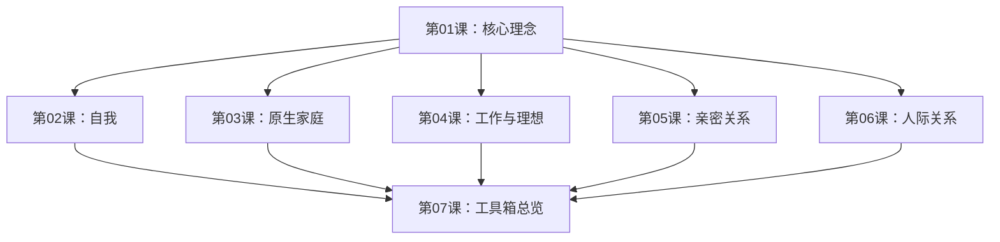

# 课程地图

## 学习路径

本课程建议按顺序学习，因为后面的工具箱会涉及前面的案例素材。但每个主题模块可以独立阅读。

## 模块详情

### 第01课：5%改变的核心理念 ← 从这开始

核心概念：扰动、5%变化、排异反应、行动优先。本书的哲学基础——了解为什么"小改变"比"大改变"更有效。

### 第02课：自我（9个案例）

| 案例 | 核心问题 | 关键干预 |
|------|----------|----------|
| 1.为什么我总是搞砸自己的人生？ | 自我分裂，旁观者与当事人冲突 | 外化的声音——角色对话 |
| 2.明知有危险，却无法节制 | 严重糖尿病患者的失控进食 | 重新理解行为的意义 |
| 3.这不是我想要的生活 | 全面自我否定，动不起来 | 最多改变5%，保持95%不变 |
| 4.先给失败找好理由 | 高三学生在疫情下的学习拖延 | 单双日作业——防御性悲观 |
| 5.一直在失去，一直不甘心 | 持续的失败感与虚无感 | 每天一小时体验放下 |
| 6.停不下担心，怎么办？ | 为小概率事件过度焦虑 | 黑色想象——接受最坏结果 |
| 7.自律为什么这么难？ | 囤积、熬夜、刷剧的失控 | 自律符号——0.1m²和60秒 |
| 8.实际的困惑 | 穷人学生的未来焦虑 | 关注实际的、当下的困惑 |
| 9.焦虑成了我的舒适圈 | 用焦虑自我折磨的循环 | 与焦虑站在一起 |

### 第03课：原生家庭（10个案例）

| 案例 | 核心问题 | 关键干预 |
|------|----------|----------|
| 1.血缘与边界 | 与控制欲母亲的对峙 | 保持稳定，假定对方有能力 |
| 2.为了告别的停留 | 父母去世后博士论文拖延 | 与逝者对话的仪式 |
| 3.难以摆脱的否定声音 | 母亲永不满足的批评 | 假设式实验——如果妈妈不在了 |
| 4.控制不住吵架 | 与父母的争吵怪圈 | 吵也行，吵完倒杯水 |
| 5.不敢反抗 | 继母虐待留下的畏惧 | 用仪式表达对逝去母亲的愤怒 |
| 6.面对催生 | 被父母催生的压力 | 分清家庭矛盾与个人选择 |
| 7.在亲人面前最暴躁 | 对外温柔、对亲暴躁的反差 | 观察任务——记录争吵细节 |
| 8.是家人的要求，还是自己的需要 | 睡前吃东西的习惯 | 列清单区分"妈妈要的"和"自己想要的" |
| 9.无法填补的缺憾 | 把患癌归因于原生家庭 | 重新解释——思念替代抱怨 |
| 10.无法改变的身份 | 农村出身研究生的论文拖延 | 保留"穷学生"的身份仪式 |

### 第04课：工作与理想（9个案例）

| 案例 | 核心问题 | 关键干预 |
|------|----------|----------|
| 1.迈不出第一步 | 求职拖延、简历写不出 | 写完就删的悖论干预 |
| 2.一周只有一天想干活 | 学术拖延 | 聚焦"做了一天"而非"六天没做" |
| 3.越失败，越努力，越恐惧 | 自我反思过度的恶性循环 | 去除评价——打破"我不好"的声音 |
| 4.不想加班，我该辞职吗？ | 加班的困扰与职业选择 | 收集家人意见，交给时间 |
| 5.恐惧权威 | 对上司的恐惧影响工作表现 | 把"恐惧权威"当作特点而非缺陷 |
| 6.做一份抵触的工作 | 对工作内容的抵触情绪 | 人与角色分离 |
| 7.这个年纪该有的样子 | 被年龄焦虑捆绑 | 发现正反馈的证据 |
| 8.我是普通人，但我不甘心 | 普通人的不甘与迷茫 | 先过好这一年——短期的确定 |
| 9.转换期的迷茫 | 离职后的身份迷茫 | 改写故事——从消极到积极 |

### 第05课：亲密关系（9个案例）

| 案例 | 核心问题 | 关键干预 |
|------|----------|----------|
| 1.一沟通就吵架 | 与男友一沟通就冲突 | 新的沟通形式——写纸条 |
| 2.我越操心，他越没信心 | 过度照顾导致对方无力 | 离开互补位置 |
| 3.喜欢被照顾，却无法心安理得 | 被照顾的内疚感 | 接受帮助也是一门功课 |
| 4.他犯了错，我却不敢说 | 不敢表达不满 | 沟通的勇气 |
| 5.做决定之前的准备 | 关系关键决定的犹豫 | 收集信息，不急于结论 |
| 6.没有人活该做个好人 | 被"好人"身份绑架 | 允许自己做"坏人" |
| 7.结论是还没有结论 | 对关系走向的不确定 | 接纳"没有结论"也是结论 |
| 8.面对诈尸式育儿 | 伴侣间歇式参与育儿 | 明确分工，正向强化 |
| 9.婚姻中的经济独立 | 婚后经济自主的困扰 | 对话与协商 |

### 第06课：人际关系（7个案例）

| 案例 | 核心问题 | 关键干预 |
|------|----------|----------|
| 1.所有人都讨厌我 | 社交恐惧与被讨厌的焦虑 | 接受不等于认同 |
| 2.我为何如此虚荣 | 对优越感的过度追求 | 理解虚荣背后的需求 |
| 3.住在孤独的城堡里 | 长期孤独与社交回避 | 微小社交实验 |
| 4.如何安放控制欲 | 对他人行为的过度控制 | 区分可控与不可控 |
| 5.心态失衡 | 与他人比较产生的失衡感 | 改变不必一步到位 |
| 6.如何走出讨好模式 | 过度讨好的行为模式 | 拒绝对话练习 |
| 7.身体症状与人际关系 | 躯体化症状的社交根源 | 建立身心链接 |

### 第07课：改变的工具箱总览

汇总全书五章的干预工具，快速查找适用方法。

## 参考文档

- [[reference/he-xin-gai-nian|核心概念与术语表]]
- [[reference/gong-ju-qia|干预工具速查卡]]

---

**建议**：先阅读第01课理解核心理念，然后根据自己最感兴趣的模块跳转学习。每个案例背后都对应着特定的工具，可以在第07课中快速检索。