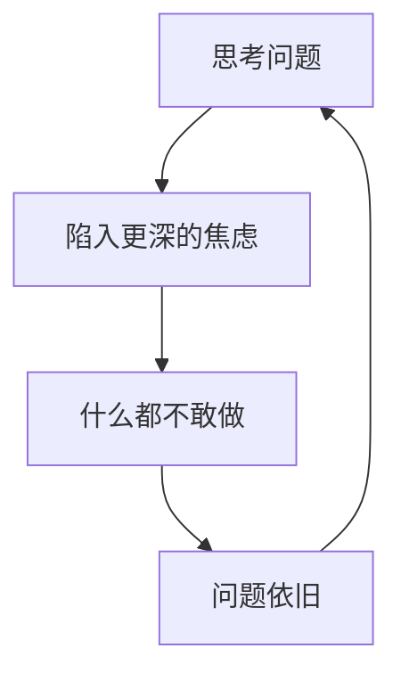
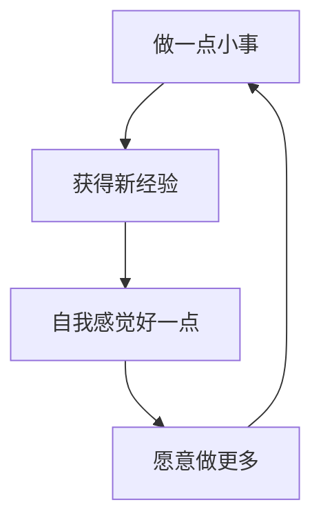

# 第01课：5%改变的核心理念

## 学习目标

- 理解"5%改变"的核心哲学
- 掌握"扰动"和"排异反应"的概念
- 理解为什么行动比思考更重要

## 核心理念：5%的改变

这本书的出发点非常明确：**不要对改变的期望太高，有5%新的经验就已经很好了。**

大多数人在面对困境时的第一反应是"彻底改变"——我要脱胎换骨，我要重新做人。但李松蔚发现，越是追求100%的改变，越容易被挫败、沮丧和自我否定压垮，最终连5%也做不到。结果就是0%。

> [!TIP] 改变的悖论
> 如果我说"请你变成那样"，对方会说"可我做不到"。我说"好吧，请保持你原来那样"，对方又会说"这样是不行的，我想改"。除非我们换一种表达："请你保持基本不变的同时，朝着可能的方向改变一点。"

## 核心概念

### 1. 惯性（排异反应）

"惯性"是改变最大的对手。它强大、狡猾、专注，有不屈不挠的斗志与自我修复的技能。哪怕是有益的变化，也会激发它强烈的"排异反应"——生活中一切带来变化的、不熟悉的元素，它都会向外推。

这就是为什么很多人明明知道什么是对的，却做不到。

### 2. 扰动

既然惯性如此强大，强行对抗只会两败俱伤。更好的策略是"扰动"——恰到好处的刺激，让对方更容易地启动不一样的尝试。

扰动的特点是：
- **足够小**：小到几乎不引起排异反应
- **足够具体**：是一个动作，不是一个道理
- **有体验性**：做了之后会有新的感受

### 3. 行动优先

> **行动比正确的行动更重要。**

这本书是一本"行动之书"。所有的答案都藏在新的行动里。很多人喜欢通过"思考"找答案——更安全、更无痛、显得更深刻——但真正改变的是"做"点什么。

### 4. 不要急于"同意"对方的问题

"问题"并不是一个客观存在的东西，它是一种叙事。既然问题是在这个角度下产生的，就无法通过相同的角度解决。

> 你不能用导致问题产生的思维去解决问题。——爱因斯坦

案例：父母说孩子"不自信"，但换个角度看——孩子不需要通过成绩排名证明自己的价值——这恰恰说明他很自信。如果我们已经同意了"不自信"的叙事，任何干预都在强化问题。

### 5. 保持对人的尊重

问题背后总有合理的一面：消沉的人也许是在用谨慎的策略回避失败；焦虑的人也许是背负了太多期待不知拒绝。一个人越是被理解，越是感到安全，就越是愿意打开自己，面对新的经验。

> [!WARNING] 常见误解
> 承认问题背后的合理性 ≠ 认同问题不需要改变。恰恰相反，只有在被理解的安全感中，人才有能量去改变。

### 6. 不需要一次性解决问题

只要一点微不可察的变化，哪怕在无足轻重的地方有一点新尝试，就很好。行动比正确的行动更重要。

## 书的起源：反馈实验

这本书的素材来自2019-2022年作者的"反馈实验"：
1. 读者匿名留言提出生活中的困惑
2. 作者给出一个极小的行动建议
3. 一周后读者反馈：生活中是否产生了变化

共精选44个案例，分为五大主题：自我、原生家庭、工作与理想、亲密关系、人际关系。

> [!ABSTRACT] 总结
> 5%的改变 = 保持95%不变 + 尝试5%的新可能。核心不是"变得更好"，而是"获得不同的经验"。

## 下一步

继续学习 [[0002-zi-wo|第02课：自我——向上螺旋与行动]]

> **课后任务**：想一想你生活中最想改变的一件事。如果只能改变它5%（其他95%保持不变），你会做什么？