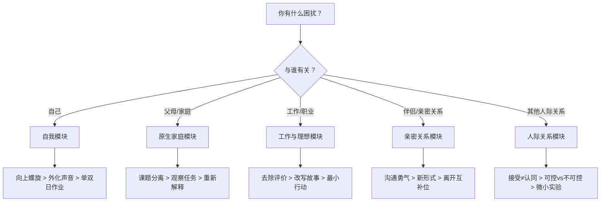

# 第07课：改变的工具箱总览

> 完成一个动作，比想明白一百个道理更有用。——李松蔚

## 工具箱一览

全书的干预工具可以归纳为**五大主题工具箱**，外加**核心通用工具**。下面是完整的工具速查。

## 通用工具

这些工具跨越所有主题，是全书最核心的干预思路：

| 工具 | 原理 | 一句话操作 |
|------|------|------------|
| **5%改变** | 变化太大引发排异，小到近乎不变才可行 | 保持95%现状，尝试5%新动作 |
| **扰动** | 恰到好处的刺激，让对方更容易启动 | 设计一个具体动作，小到不会失败 |
| **行动优先** | 行动带来新经验，新经验带来新认知 | 先做，别想太多 |
| **实验者心态** | 做实验就没有失败，只有发现 | "试试看，我也不知道结果会怎样" |
| **重新定义问题** | 问题是一种叙事，换角度就换解法 | 不"同意"提问者的问题框架 |

## 第一章：自我工具箱

> 想是想不明白的，解决办法往往需要行动。

| 工具 | 适用场景 | 操作示例 |
|------|----------|----------|
| **向上螺旋** | 陷入"越不想动越不动"的恶性循环 | 做一件极小的事启动正反馈 |
| **外化的声音** | 内心自我否定、纠结 | 把想法写成几个角色的对话 |
| **单双日作业** | 两种人生观冲突（佛系vs进取） | 单日做A，双日做B |
| **黑色想象** | 为坏事过度担忧 | 设定最坏情况注定发生，然后想应对 |
| **自律符号** | 需要自律感但做不到 | 保留0.1m²整洁+60秒什么也不做 |
| **防御性悲观** | 害怕失败导致拖延 | 提前找好"失败的理由"解压 |

## 第二章：原生家庭工具箱

> 走出原生家庭之前，先要看到原生家庭如何影响你。

| 工具 | 适用场景 | 操作示例 |
|------|----------|----------|
| **课题分离** | 被父母意见绑架 | "这件事后果谁承担？" |
| **观察任务** | 关系冲突反复发生 | 记录冲突的一句话、一个细节 |
| **目的论** | "我做不到"的困境 | 问："做不到的好处是什么？" |
| **重新解释** | 负面归因导致情绪恶化 | 把"抱怨"换成"思念" |
| **仪式连接** | 身份迷茫、恐惧改变 | 用照片/物品保持身份锚点 |
| **保持稳定** | 控制型父母 | 假定对方有能力，给自己时间 |

**核心金句：** 你可以选择受不受家庭影响——"有能力选择"，这就够了。

## 第三章：工作与理想工具箱

> 既然我是这样，那么这样的我又能找到哪些资源，去把事情做好呢？

| 工具 | 适用场景 | 操作示例 |
|------|----------|----------|
| **去除评价** | 自我谴责 | 把"缺点"还原为"特点" |
| **改写故事** | 对未来迷茫 | 为同样的素材讲一个新的故事 |
| **人与角色分离** | 把工作中的挫折当成"我不好" | "这只是我扮演的角色" |
| **短期的确定** | 长远焦虑 | 先过好这一年 |
| **最小行动按钮** | 面对巨大任务不敢开始 | 只做"打开电脑"这一个动作 |
| **悖论干预** | 拖延、抗拒 | "写完就删"——保持现状但有新意 |

## 第四章：亲密关系工具箱

> 最重要的始终不是沟通的技巧，而是开口的勇气。

| 工具 | 适用场景 | 操作示例 |
|------|----------|----------|
| **沟通的勇气** | 不敢表达不满/需求 | 说出来，不追求说漂亮 |
| **新的沟通形式** | 沟通陷入固定模式 | 写纸条、发语音、送卡片 |
| **离开互补位置** | 关系角色固化 | 停止你的那部分"配合" |
| **家庭生命周期** | 关系进入新阶段产生摩擦 | 了解这是正常的周期转换 |
| **去除三角化** | 卷入第三方 | 回到两人直接沟通 |
| **允许不同节奏** | 需要做决定但犹豫 | "没有结论"也是结论 |

## 第五章：人际关系工具箱

> 接受不等于认同。改变不必一步到位。

| 工具 | 适用场景 | 操作示例 |
|------|----------|----------|
| **接受不等于认同** | 对他人的差异无法容忍 | "我接受你就是这样，但我不一定认同" |
| **理解需求** | 对自己或他人的负面行为不解 | 找到行为背后的合理需求 |
| **微小社交实验** | 社交恐惧、孤独 | 一个微笑、一次简短的对话 |
| **可控与不可控** | 控制欲、焦虑 | 把能量投向可控部分 |
| **改变不必一步到位** | 习惯性讨好、回避 | 从不讨好一次、拒绝一次开始 |
| **身心链接** | 躯体化症状 | 问身体的不适想表达什么 |

## 快速选择指南

## 选择工具的四个原则

1. **越小越好**：行动小到不会引起排异反应
2. **越具体越好**：不是一个道理，是一个动作
3. **做比想重要**：启动行动，哪怕是错的
4. **接受"不知道"**：带着实验者心态，对结果没有预设

## 自检清单

- 面对困扰，我首先想到的是"做点什么"还是"想清楚"？
- 我选择的干预行动是否小到不会感到抵触？
- 我是否允许"不知道结果会怎样"？
- 我是否准备好接收新的经验，无论它是否符合预期？

## 延伸阅读

- [[reference/he-xin-gai-nian|核心概念与术语表]]
- [[reference/gong-ju-qia|干预工具速查卡]]

## 回顾全书

恭喜你完成了全部课程！现在回到 [[index|课程首页]] 回顾整个学习路径。