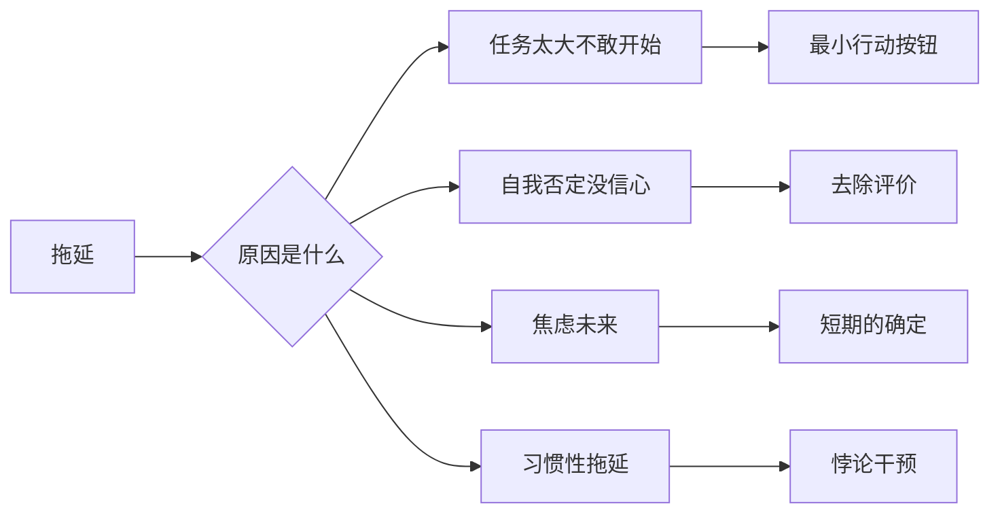
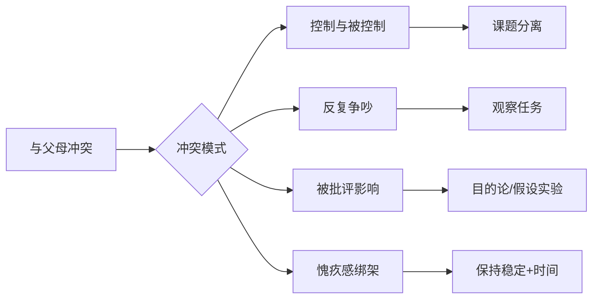
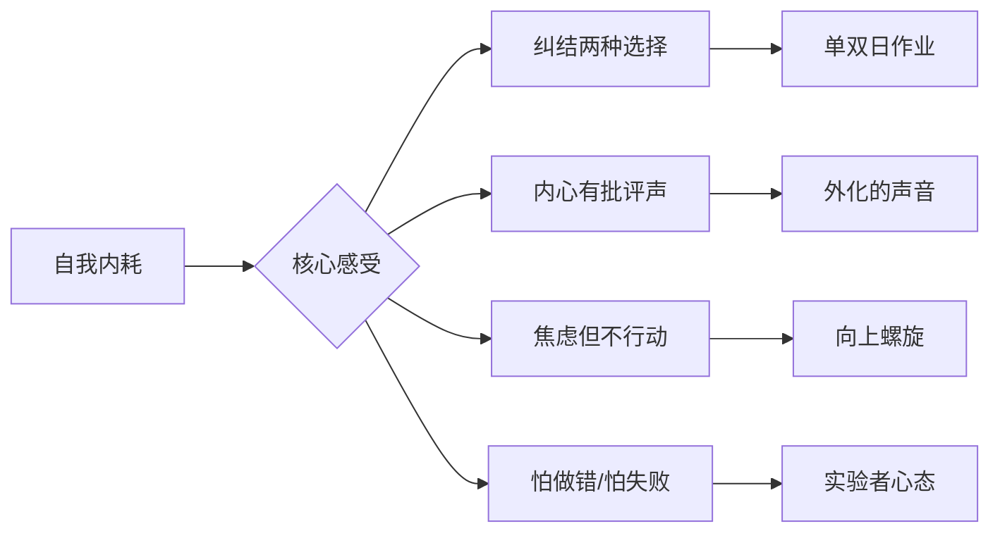

# 干预工具速查卡

## 按情绪/状态速查

| 你现在的状态 | 建议工具 | 出自 |
|-------------|----------|------|
| 不想动、拖延、内耗 | 向上螺旋——做一件极小的事 | 自我工具箱 |
| 焦虑、担心坏事发生 | 黑色想象——设定最坏结果 | 自我工具箱 |
| 两种声音打架、纠结 | 外化的声音——写成对话 | 自我工具箱 |
| 害怕失败、不敢开始 | 实验者心态——试试看 | 通用工具 |
| 目标太大、不敢启动 | 最小行动按钮——只做一步 | 工作工具箱 |
| 自我谴责、觉得自己不好 | 去除评价——把缺点还原为特点 | 工作工具箱 |
| 被父母意见影响 | 课题分离——谁的后果谁承担 | 原生家庭工具箱 |
| 和父母反复争吵 | 观察任务——记录争吵细节 | 原生家庭工具箱 |
| 对未来迷茫 | 短期的确定——先过好这一年 | 工作工具箱 |
| 孤独、不敢社交 | 微小社交实验——一个微笑开始 | 人际关系工具箱 |
| 控制欲强、想掌控他人 | 可控与不可控——区分界限 | 人际关系工具箱 |
| 讨好他人、不敢拒绝 | 改变不必一步到位——拒绝一次 | 人际关系工具箱 |
| 伴侣间沟通不畅 | 新的沟通形式——写纸条 | 亲密关系工具箱 |
| 越照顾对方、对方越不行 | 离开互补位置——停止配合 | 亲密关系工具箱 |

## 按问题场景速查

### 学业/工作拖延

### 与父母关系紧张

### 自我内耗

## 极简操作卡

如果你只能记住一个动作：

| 场景 | 一句话动作 |
|------|-----------|
| 什么也不想做 | 做一件**3分钟能完成**的事 |
| 内心自我批判 | 把想法写成**两个人的对话** |
| 害怕坏结果 | 想象**它已经发生了**，然后怎么办 |
| 纠结该选A还是B | 单日选A双日选B，**都要** |
| 父母让我难受 | 区分**我的事**还是**他们的事** |
| 总和人比较 | 问自己**这件事我控制得了吗** |
| 不敢拒绝 | 这次只说**"我再想想"** |
| 沟通就吵架 | 换一种方式**不说用写的** |
| 感觉疲惫无力 | 先做**5%的改变**，不要100% |