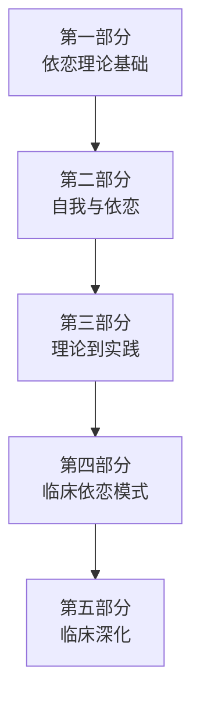

# 课程地图

## 推荐学习路径

## 详细课程结构

### 第一部分：鲍尔比及其超越
| 课号 | 主题 | 核心内容 |
|------|------|----------|
| 01 | [依恋与改变](lessons/0001-attachment-and-change.md) | 治疗关系的转化力量、未思的已知、经验立场 |
| 02 | [依恋理论的奠基](lessons/0002-foundations-of-attachment-theory.md) | 鲍尔比的依恋系统、安斯沃思的陌生情境、婴儿依恋分类 |
| 03 | [梅因与成人依恋访谈](lessons/0003-mary-main-and-aai.md) | 心理表征、元认知、代际传递 |
| 04 | [福纳吉与心智化](lessons/0004-fonagy-and-mentalizing.md) | 心智化、经验模式、主体间性 |

### 第二部分：依恋关系与自我的发展
| 课号 | 主题 | 核心内容 |
|------|------|----------|
| 05 | [自我的多重维度](lessons/0005-multiple-dimensions-of-self.md) | 身体自我、情绪自我、表征自我、反思自我、正念自我 |
| 06 | [依恋经验的多样性](lessons/0006-varieties-of-attachment-experience.md) | 安全型、回避型、矛盾型、混乱型 |
| 07 | [依恋如何塑造自我](lessons/0007-how-attachment-shapes-self.md) | 情感调节、关系过程、整合 |

### 第三部分：从依恋理论到临床
| 课号 | 主题 | 核心内容 |
|------|------|----------|
| 08 | [非言语经验与未思的已知](lessons/0008-nonverbal-and-unthought-known.md) | 非言语沟通、行动化的"已知" |
| 09 | [经验立场：嵌入、心智化与正念](lessons/0009-stance-toward-experience.md) | 嵌入式经验、心智化、正念 |
| 10 | [主体间性与关系视角](lessons/0010-intersubjectivity-and-relational-perspective.md) | 超越单人心理论、移情与反移情再思考 |

### 第四部分：心理治疗中的依恋模式
| 课号 | 主题 | 核心内容 |
|------|------|----------|
| 11 | [构建发展的熔炉](lessons/0011-constructing-developmental-crucible.md) | 协作沟通、治疗关系的建立 |
| 12 | [忽视型患者](lessons/0012-dismissing-patient.md) | 从隔离到亲密，贬低/理想化/控制模式 |
| 13 | [专注型患者](lessons/0013-preoccupied-patient.md) | 为自己心智留出空间，无助/愤怒模式 |
| 14 | [未解决型患者](lessons/0014-unresolved-patient.md) | 创伤与丧失的治疗，对安全的恐惧 |

### 第五部分：聚焦临床
| 课号 | 主题 | 核心内容 |
|------|------|----------|
| 15 | [非言语领域 I：唤起与行动化](lessons/0015-nonverbal-realm-1.md) | 非言语沟通、治疗中的行动化 |
| 16 | [非言语领域 II：身体工作](lessons/0016-nonverbal-realm-2.md) | 阅读身体、谈论身体、调动身体 |
| 17 | [心智化与正念的双螺旋](lessons/0017-mentalizing-and-mindfulness.md) | 心理解放的双螺旋、培养心智化与正念 |

## 课前准备

建议先了解基本的心理学概念。无需依恋理论的前置知识——本书将从基础讲起。