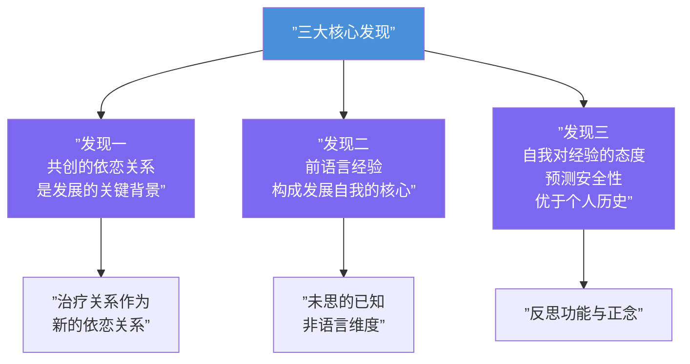

# 第01课：依恋与改变

## 本课导航

> [!ABSTRACT] 学习目标
> - 理解依恋理论三大核心发现及其对心理治疗的启示
> - 掌握"治疗即通过关系的自我转化"模型
> - 区分三种对经验的态度：回避型、沉浸型与反思型
> - 理解"未思的已知"（unthought known）的概念及其临床意涵
> - 初步认识正念（mindfulness）与反思维度的关系

---

## 1. 依恋理论的三大核心发现

David J. Wallin 从依恋研究中提炼出**三大核心发现**，构成了全书的理论基石：



### 发现一：依恋关系是发展的关键背景

依恋理论的核心前提——从摇篮到坟墓，人的一生都围绕亲密依恋关系展开。最早的关系塑造了我们对待依恋的态度，但我们也具有可塑性。如果早期关系出了问题，后续的关系可以提供"第二次机会"。

> [!NOTE] 鲍尔比的原话
> 治疗师的角色，类似于母亲为孩子提供安全基地（secure base），让孩子得以探索世界。——John Bowlby (1988)

### 发现二：前语言经验构成自我的核心

我们最早的依恋模式植根于**前语言期**（preverbal period）。这些经验无法用语言表达，却构成了自我最核心的部分。Christopher Bollas 称之为**"未思的已知"**（unthought known）——那些我们尚未思考过、却早已"知道"的东西。

### 发现三：自我对经验的态度预测安全性

**自我对经验的态度**（the stance of the self toward experience）比个人历史事实本身更能预测依恋安全性。这不是"发生了什么"，而是"我们如何对待所发生的"。

---

## 2. 治疗模型：通过关系的自我转化

Wallin 提出的治疗模型沿着依恋理论的发展轨迹展开，聚焦于 **关系性/情感性/反思性** 三位一体的过程：


### 2.1 安全基地（Secure Base）

治疗师的首要任务是成为患者的**安全基地**，使患者敢于感受"不该感受的"，知道"不该知道的"。这种安全感源于调谐（attunement）——治疗师帮助患者容忍、调节和沟通困难情感的能力。

### 2.2 情感调节（Affect Regulation）

安全基地感受是通过**情感调节互动**产生的。治疗师在场、接纳且能够涵容患者的强烈情绪，这本身就是一种矫正性情感体验。

### 2.3 叙事能力的强化

接触、表达和反思被解离的体验，能增强患者的**叙事能力**（narrative competence），使自我感更加连贯、安全。

---

## 3. 未思的已知（Unthought Known）

> [!TIP] 核心概念
> **未思的已知**（unthought known）指的是那些我们尚未用语言思考过、但身体和情感早已"知道"的经验。这些经验源于前语言期，存在于程序性记忆中，无法直接通过语言回忆。

### 三种表达路径

患者无法（或不愿）言说的解离/否认经验，会通过以下方式表达：

1. **唤起**（evoke）：在他者身上唤起同样的感受
2. **见诸行动**（enact）：在关系中"演出来"
3. **具身化**（embody）：通过身体语言呈现

### 临床意涵

治疗师需要培养 **"双目视觉"**（binocular vision）——同时追踪患者和治疗师双方的主观体验。尤其需要关注：
- 自己的主观体验
- 移情-反移情的共同建构
- 情绪和身体的非语言语言

> [!EXAMPLE] 临床案例
> 一位患者总在治疗中感到"莫名的悲伤"，却无法说出原因。治疗师注意到自己在 session 中也感到同样的沉重——这可能是患者唤起的"未思的已知"。治疗师通过关注身体的感受，发现患者每次讲述童年日常时都会微微屏住呼吸，这成为了解其被压抑的分离创伤的入口。

---

## 4. 对经验的态度：表征、反思与正念

### 4.1 三种状态

| 状态 | AAI 分类 | 对经验的态度 | 临床表现 |
|------|----------|-------------|----------|
| 安全/自主 | Secure/Autonomous | **反思型**：承认经验的"仅是表征性" | 灵活、能退后观察自己的想法 |
| 忽视型 | Dismissing | **最小化/否认型**：削弱经验的影响 | "我很正常，童年很好"（但缺乏具体记忆） |
| 沉浸型 | Preoccupied | **被淹没型**：被经验吞噬 | 被过去纠缠，无法客观看待 |

### 4.2 反思功能（Reflective Function）

**心智化**（mentalizing）——觉察到"拥有心智"中介着我们对世界的体验。它是：
- 理解行为背后的心理状态（信念、情感、欲望）
- 退后一步，不被情绪反射所控制
- 认识到自己的信念和感受**仅是表征**（merely representational）

> [!NOTE] 梅因的核心洞见
> 安全的反思姿态依赖于**元认知能力**——即认识到我们自己的信念和感受"仅是表征性的"。有了这种姿态，我们不会把经验当作绝对"现实"，而是能回应其背后可能的心理状态。

### 4.3 正念（Mindfulness）

Wallin 提出，在反思能力的基础上，还存在一种更深层的姿态——**正念**（mindfulness）：对当下经验保持刻意、非评判的觉知。

#### 四环模型

```mermaid
flowchart TD
    subgraph ”正念自我四环模型”
        A[”第一环：外部现实<br/>事件、情境、他人”] --> B[”第二环：表征世界<br/>心理模型、内部工作模型”]
        B --> C[”第三环：反思自我<br/>对经验进行反思”]
        C --> D[”第四环：正念自我<br/>对觉知的觉知”]
    end

    D --> D1[”将经验视为<br/>被建构的过程”]
    D --> D2[”非个人化的觉知<br/>(no self, only awareness)”]
    
    style D fill:#FFD700,color:#333
```

正念不同于反思：
- **反思**关注经验的内容（contents of experience）
- **正念**关注经验的建构过程（process of experiencing）
- **反思**是元认知（metacognition），**正念**是元觉知（meta-awareness）

> [!WARNING] 重要区分
> 依恋理论明确涉及前三环（外部现实、表征世界、反思自我），但 Wallin 认为依恋理论的发展轨迹指向第四环——正念自我。这不是一个"个人自我"，而是纯粹的觉知本身。

### 4.4 正念在治疗中的价值

1. **锚定当下**：如 Bion 所言，"不带记忆、欲望和理解"地接近患者
2. **增强身体觉察**：对自身躯体反应的调谐，放大感知患者非语言状态的信号
3. **培养接纳态度**：对经验"如其所示"的非防御性开放

> [!TIP] 正念的传染性
> 治疗师的正念姿态具有"传染性"——正如反思姿态会激发患者的反思能力，正念也能激发患者的正念体验。

---

## 5. 治疗关系的整合功能

治疗的根本目标是**整合**（integration）——通过新的依恋关系，将解离和否认的经验重新纳入自我叙事：

- 最初：依恋是生物必然性，确保生存
- 安斯沃思：非语言沟通的质量决定安全性
- 梅因：早期互动注册为心理表征和加工规则
- 福纳吉：对经验的反思姿态是安全性的关键预测因子

> [!QUESTION] 自测题
> 1. 依恋理论三大核心发现分别是什么？
> 2. "未思的已知"这个概念由谁提出？它的临床意义是什么？
> 3. 反思姿态和正念姿态的区别是什么？
> 4. 治疗关系为何被描述为"发展的熔炉"（developmental crucible）？

<details>
<summary>点击查看答案</summary>

1. **三大核心发现**：
   - 共创的依恋关系是发展的关键背景
   - 前语言经验构成发展自我的核心
   - 自我对经验的态度比个人历史事实更能预测依恋安全性

2. **未思的已知**（Christopher Bollas, 1987）指那些尚未被语言化但早已"知道"的经验。临床意义在于：治疗师需要通过关注自身主观体验、移情-反移情 enactment 和非语言表达，来接触和整合这些被解离的经验。

3. **反思姿态**是元认知（对思考的思考），关注经验的内容；**正念姿态**是元觉知（对觉知的觉知），关注经验的建构过程。正念超越个人化的自我，抵达非个人化的觉知。

4. 因为治疗关系既是**安全基地**（允许探索），又是**调节情感的容器**（帮助容忍痛苦），还是**反思能力的孵化器**——三重功能共同作用，使患者对经验的整体态度发生根本转变。

</details>

---

## 6. 本课小结

```mermaid
flowchart TD
    A[”依恋理论<br/>三个核心发现”] --> B[”治疗模型<br/>通过关系转化”]
    B --> C[”安全基地<br/>(Secure Base)”]
    B --> D[”未思的已知<br/>(Unthought Known)”]
    B --> E[”反思与正念态度<br/>(Reflective & Mindful Stance)”]
    C & D & E --> F[”整合与转化<br/>更连贯、安全的自我感”]
    
    style A fill:#E91E63,color:#fff
    style B fill:#9C27B0,color:#fff
    style F fill:#FF5722,color:#fff
```

### 关键术语对照

| 中文 | English | 主要提出者 |
|------|---------|-----------|
| 依恋 | Attachment | Bowlby |
| 安全基地 | Secure Base | Ainsworth / Bowlby |
| 未思的已知 | Unthought Known | Bollas |
| 心智化 | Mentalizing | Fonagy |
| 反思功能 | Reflective Function | Fonagy |
| 元认知 | Metacognition | Main |
| 正念 | Mindfulness | Buddhism / Kabat-Zinn |
| 双目视觉 | Binocular Vision | Bateson / Bion |
| 内部工作模型 | Internal Working Model | Bowlby / Craik |

---

## 下一步

→ 继续学习 **[[0002-foundations-of-attachment-theory|第02课：依恋理论的奠基]]**，深入了解鲍尔比和安斯沃思的核心贡献。

### 反思练习

花 5 分钟，静静地关注自己的呼吸。注意当思绪出现时，你是被它"带走"了，还是能觉察到"有一个思绪出现了"？这正是反思与正念的最初体验。

---

> [!NOTE] 引用来源
> - Bowlby, J. (1988). *A Secure Base*.
> - Bollas, C. (1987). *The Shadow of the Object*.
> - Fonagy, P. et al. (2002). *Affect Regulation, Mentalization, and the Development of the Self*.
> - Main, M. (1991). Metacognitive knowledge, metacognitive monitoring, and singular (coherent) vs. multiple (incoherent) models of attachment.
> - Wallin, D. J. (2007). *Attachment in Psychotherapy*, Chapter 1.