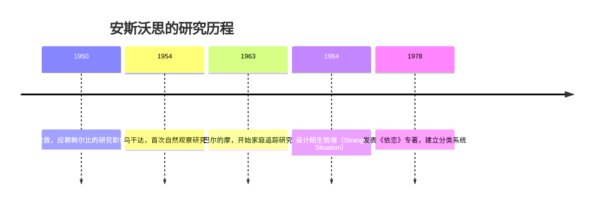
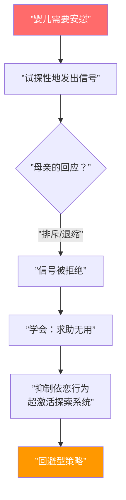

# 第02课：依恋理论的奠基

## 本课导航

> [!ABSTRACT] 学习目标
> - 理解鲍尔比（John Bowlby）依恋理论的核心——依恋行为系统与进化基础
> - 掌握安斯沃思（Mary Ainsworth）的陌生情境实验及四种依恋分类
> - 理解安全型、回避型、矛盾型与混乱型依恋的沟通特征
> - 认识早期依恋模式的长期影响

---

## 1. 鲍尔比：亲近、保护与分离

### 1.1 依恋行为系统

鲍尔比的核心贡献在于认识到：**依恋**（attachment）是一种基于生物进化必然性的动机系统，其根本功能是确保幼儿与照顾者的**身体亲近**（proximity），以保障生存。

```mermaid
flowchart LR
    A[”威胁/不安全感”] --> B[”激活依恋行为系统”]
    B --> C[”亲近寻求<br/>(Proximity Seeking)”]
    C --> D[”获得保护<br/>与安全感”]
    D --> E[”探索行为系统<br/>重新激活”]
    E --> A
    
    style A fill:#FF6B6B,color:#fff
    style B fill:#E91E63,color:#fff
    style C fill:#9C27B0,color:#fff
    style D fill:#4CAF50,color:#fff
    style E fill:#2196F3,color:#fff
```

三种依恋行为：

1. **亲近寻求**（Proximity Seeking）：通过哭、抱、爬、呼唤等维持与依恋对象的亲近
2. **安全基地**（Secure Base）：以依恋对象为基地探索不熟悉的环境
3. **安全港湾**（Safe Haven）：在危险时逃向依恋对象——人类寻求的不是一个场所，而是一个人

> [!NOTE] 关键演变
> 鲍尔比最初认为依恋的"设定目标"是物理亲近，但他后来认识到：亲近本身也是一种符号，象征着照顾者可获得的安慰。因此依恋目标不仅是当下的保护，更是对照顾者**持续可得性**（ongoing availability）的确认。而"可得性"不仅是物理上的可接近，更是**情绪上的可响应**。

### 1.2 探索行为系统与依恋系统的关系

探索系统与依恋系统是**相互补充**的：
- 当依恋对象可作为安全基地时，孩子自由探索
- 当依恋对象暂时缺席时，探索立即停止

> [!TIP] 生活类比
> 就像玛格丽特·马勒（Margaret Mahler）观察到的：幼儿短暂离开母亲去探索，然后回到母亲身边"加油"（refuel），再重新出发探索。这个过程完美诠释了安全基地的功能。

### 1.3 从物理亲近到"感受性安全"

鲍尔比最终认识到真正关键的不是客观的可得性，而是孩子对照顾者可得性的**评估**（appraisal）——这种评估在很大程度上取决于过去的经验。Sroufe 和 Waters（1977）进一步提出，依恋系统的设定目标不是距离调节，而是**"感受性安全"**（felt security）——一种依赖孩子内部经验的主观状态。

---

## 2. 安斯沃思：沟通、陌生情境与依恋分类

### 2.1 从乌干达到巴尔的摩

安斯沃思（Mary Ainsworth）是依恋理论真正的共同创建者。鲍尔比的儿子曾这样形容："他们是一对活力二人组，就像楼梯的台阶，你分不清哪一步属于谁。"



安斯沃思在乌干达的突破性发现：
- **依恋是普遍性的**：所有婴儿都形成依恋，但存在**质性差异**
- 依恋的关键不是照顾**数量**，而是**质量**
- 母亲的**敏感性**（sensitivity）至关重要

### 2.2 陌生情境实验（Strange Situation）

这是一个约 20 分钟的实验室程序，通过一系列 3 分钟片段，系统激活婴儿的依恋行为系统：

| 阶段 | 在场人物 | 情境 |
|------|---------|------|
| 1 | 母亲 + 婴儿 | 进入玩具丰富的房间 |
| 2 | 母亲 + 婴儿 + 陌生人 | 陌生人与母亲交谈 |
| 3 | 陌生人 + 婴儿 | **第一次分离** |
| 4 | 母亲 + 婴儿 | **第一次重聚** |
| 5 | 婴儿独处 | **第二次分离** |
| 6 | 陌生人 + 婴儿 | 陌生人进入 |
| 7 | 母亲 + 婴儿 | **第二次重聚** |

> [!NOTE]
> 安斯沃思发现，最能揭示依恋质量的是**重聚行为**（reunion behavior），而非分离行为。安全型婴儿无论分离时多么痛苦，都几乎能立即通过与母亲重新连接而获得安慰，并重新开始玩耍。

---

## 3. 四种依恋类型

### 3.1 安全型依恋（Secure Attachment）

**母亲特征**：敏感、接纳、合作、情绪可及——与婴儿的节奏"平滑地融合"（smoothly mesh），而非强加自己的步调。

**婴儿行为**：
- 在安全时探索，在不安时寻求安慰
- 两种冲动**可灵活切换**
- 重聚时立即被安抚，恢复玩耍

### 3.2 回避型依恋（Avoidant Attachment）

**母亲特征**：排斥身体接触、对婴儿悲伤的信号退缩、情绪不可及

**婴儿行为**：
- 表面冷漠——不停探索，对母亲离开/返回"无动于衷"
- 生理上仍然高度应激：心率升高、皮质醇显著高于安全型婴儿
- 这是一种**防御性适应**——如同大孩子长期分离后的"超脱"（detachment）



### 3.3 矛盾/抵抗型依恋（Ambivalent / Resistant Attachment）

**母亲特征**：**不可预测地**有时可得、有时不可得；并非排斥，但同样不敏感；微妙地抑制婴儿自主性

**婴儿行为**：
- 两种亚型：**愤怒型**（挣扎抗拒）和**被动型**（几乎不直接寻求安慰）
- 对母亲的行踪**持续关注**，无法自由探索
- 分离时极度痛苦，重聚后**无法被安抚**

### 3.4 混乱/迷失型依恋（Disorganized / Disoriented Attachment）

> [!WARNING] 最重要的临床发现
> 混乱型依恋是由 Mary Main 在安斯沃思原始分类基础上于近 20 年后补充发现的——对心理治疗领域影响最为深远。

**核心机制**：依恋对象同时是**安全港湾**和**恐惧来源**，孩子陷入趋-避两难的"生物学悖论"。

**行为表现**（通常仅持续 10-30 秒）：
- 向母亲反向后退
- 原地僵住（freezing）
- 瘫倒在地
- 进入恍惚/茫然状态（trance-like）
- 用手捂住嘴（如同压抑尖叫）

**成因**：与令孩子恐惧（frightening）、自身恐惧（frightened）或解离（dissociated）的父母互动。

> [!TIP] 统计事实
> 在受虐待的婴儿中，82% 被归类为混乱型；即使在低风险样本中，混乱型依恋也被发现与父母未解决的丧失/创伤高度相关。

---

## 4. 沟通质量是关键

安斯沃思的伟大发现是：依恋安全性取决于母婴之间的 **沟通质量**——一种她称为 **协作性**（collaborative）和 **偶然性**（contingent）的沟通方式：

> 一方发出信号，另一方以"我能感知你的感受并回应你的需要"的方式回应。

| 依恋类型 | 沟通模式 | 内部逻辑 |
|---------|---------|---------|
| 安全型 | **直接表达**需求 | 假设表达会得到调谐回应 |
| 回避型 | **抑制**依恋沟通 | 避免被拒绝，避免愤怒破坏关系 |
| 矛盾型 | **放大**依恋表达 | 持续施压可能获得不可预测的照顾 |

```mermaid
flowchart LR
    subgraph ”安全型沟通”
        A1[”婴儿：<br/>表达痛苦”] --> A2[”母亲：<br/>调谐回应”]
        A2 --> A3[”婴儿：<br/>得到安抚”]
    end
    
    subgraph ”回避型沟通”
        B1[”婴儿：<br/>抑制痛苦信号”] --> B2[”母亲：<br/>确认”没事””]
    end
    
    subgraph ”矛盾型沟通”
        C1[”婴儿：<br/>夸张表达”] --> C2[”母亲：<br/>不可预测回应”]
        C2 --> C3[”婴儿：<br/>继续夸张表达”]
    end
```

> [!QUESTION] 自测题
> 1. 鲍尔比为何认为依恋是一个"生物进化必然性"驱动的动机系统？
> 2. 安斯沃思用陌生情境实验发现了哪三种原始依恋类型？梅因后来补充了哪一种？
> 3. 为什么回避型婴儿"表面上不痛苦"但生理指标显示高度应激？
> 4. "沟通质量是关键"——安斯沃思认为什么构成高质量的妈妈-婴儿沟通？
> 5. 混乱型依恋的核心机制是什么？

<details>
<summary>点击查看答案</summary>

1. 人类的祖先在自然环境中面临捕食者等致命威胁，离开保护者的婴儿几乎无法生存数分钟。因此依恋行为系统被进化"设计"出来，与摄食和交配一样是人类基因编程的组成部分。

2. 安斯沃思发现了**安全型、回避型、矛盾型（抵抗型）**三种。梅因后来补充了**混乱/迷失型（Disorganized/Disoriented）**。

3. 表面上"无动于衷"是**防御性适应**——婴儿学会了求助无用，因而抑制依恋行为。但生理上（心率、皮质醇）仍处于高度应激。正如鲍尔比观察到的长期分离儿童，这是一种"超脱"（detachment）反应。

4. 高质量的沟通是**协作性（collaborative）**和**偶然性（contingent）**的：婴儿发出信号，母亲以"我能感知你的感受并回应你的需要"的方式回应。这是一种调谐（attunement）。

5. 核心机制是**生物学悖论**：依恋对象同时是安全港湾和恐惧来源。孩子被预设要在恐惧时转向父母，但父母恰恰就是恐惧的来源。这种"无解的恐惧"（fright without solution）导致策略的崩溃——表现为行为上的混乱和迷失。

</details>

---

## 5. 早期依恋模式的长期影响

大量追踪研究表明，婴儿期依恋模式对后续发展有显著影响：

| 依恋史 | 学龄期表现 | 后续风险 |
|--------|-----------|---------|
| 安全型 | 高自尊、情绪健康、社交能力、专注力 | 韧性（resilience） |
| 回避型 | 常被视为"阴沉、傲慢、对立" | 强迫型、自恋型、分裂样倾向 |
| 矛盾型 | 常被视为"黏人、不成熟" | 癔症型/表演型倾向 |
| 混乱型 | 心理病理的显著风险因子 | 边缘型人格障碍相关 |

---

## 6. 本课小结

### 关键人物贡献


### 关键术语对照

| 中文 | English | 提出者 |
|------|---------|--------|
| 依恋行为系统 | Attachment Behavioral System | Bowlby |
| 探索行为系统 | Exploratory Behavioral System | Bowlby |
| 安全基地 | Secure Base | Ainsworth |
| 安全港湾 | Safe Haven | Bowlby |
| 感受性安全 | Felt Security | Sroufe & Waters |
| 陌生情境 | Strange Situation | Ainsworth |
| 偶然性沟通 | Contingent Communication | Ainsworth |
| 无解的恐惧 | Fright without Solution | Main & Hesse |

---

## 下一步

→ 继续学习 **[[0003-mary-main-and-aai|第03课：梅因与成人依恋访谈]]**，探索依恋研究的"第二次革命"——从行为到心理表征。

### 反思练习

回忆一个你被某人安抚的经历。那个人是如何回应你的？他/她的回应让你感到安全吗？试着用"偶然性"和"调谐"的概念来分析这个互动。

---

> [!NOTE] 引用来源
> - Bowlby, J. (1969/1982). *Attachment and Loss, Vol. 1: Attachment*.
> - Bowlby, J. (1973). *Attachment and Loss, Vol. 2: Separation*.
> - Ainsworth, M. D. S., Blehar, M. C., Waters, E., & Wall, S. (1978). *Patterns of Attachment*.
> - Main, M., & Solomon, J. (1990). Procedures for identifying infants as disorganized/disoriented.
> - Wallin, D. J. (2007). *Attachment in Psychotherapy*, Chapter 2.