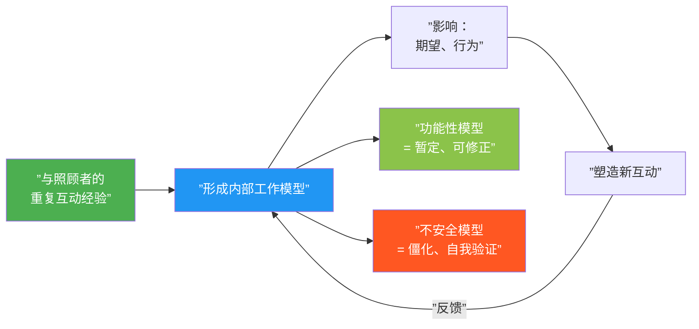
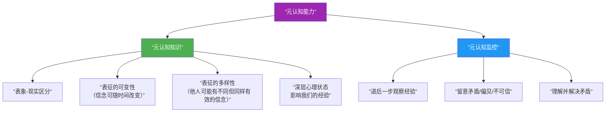

# 第03课：梅因与成人依恋访谈

## 本课导航

> [!ABSTRACT] 学习目标
> - 理解 Mary Main 如何将依恋研究从行为层面推进到**表征层面**
> - 掌握成人依恋访谈（AAI）的设计逻辑与分类系统
> - 理解内部工作模型作为"规则"而非"模板"的重新定义
> - 掌握依恋模式的**代际传递**机制与"传递缺口"
> - 理解元认知在依恋安全性中的核心作用

---

## 1. 从行为到表征：依恋研究的"第二次革命"

如果说陌生情境实验是依恋研究的**第一次革命**——将原本需要 72 小时的家庭观察浓缩为 20 分钟的实验室程序——那么 Main 的工作带来了**第二次革命**：将焦点从**外部行为**转向**内部心理表征**。

```mermaid
flowchart TD
    subgraph ”安斯沃思的贡献”
        A1[”研究焦点：<br/>非语言行为<br/>(Behavior)”]
        A2[”工具：<br/>陌生情境实验”]
        A3[”发现：<br/>婴儿依恋分类”]
    end
    
    subgraph ”梅因的贡献”
        B1[”研究焦点：<br/>心理表征<br/>(Mental Representations)”]
        B2[”工具：<br/>成人依恋访谈 (AAI)”]
        B3[”发现：<br/>成人依恋状态<br/>代际预测”]
    end
    
    A1 -->|”推进到”| B1
    A2 -->|”发展了”| B2
    A3 -->|”预测了”| B3
    
    style A1 fill:#FF9800,color:#fff
    style B1 fill:#9C27B0,color:#fff
```

> [!NOTE] 关键词
> 鲍尔比的第一个贡献——识别依恋为独立的、生物基础的动机系统——已由陌生情境实验验证。Main 的研究验证了鲍尔比的第二个贡献——**内部工作模型**（internal working model）——使对依恋心理表征的实证研究成为可能。

---

## 2. 内部工作模型：鲍尔比的遗产

### 2.1 起源：Craik 的"小尺度模型"

鲍尔比借用了 Kenneth Craik 的理论——"如果有机体在头脑中携带外部现实及其自身可能行动的小尺度模型（small-scale model），它就能在各种可能性中尝试，选择最佳方案，在未来情境出现之前做出反应。"

### 2.2 鲍尔比的界定

> 在任何人建立的外部世界工作模型中，一个关键特征是他对依恋人物的观念——他们是谁、在哪里、期望如何回应。同样，在自我的工作模型中，关键特征是在依恋人物眼中"自己有多可接受或不可接受"。——Bowlby (1973)



最功能性的依恋模型是真正的"工作"模型——具有**暂定性**（provisional quality），可根据新经验修正。而不安全的模型倾向僵化，新经验被强行纳入旧期待。

---

## 3. 表征性人工制品与成人依恋访谈

### 3.1 表征性人工制品

Main 的创造性在于：既然"表征过程无法被直接观察"，她就发明方法使其"可见"。她所称的**表征性人工制品**（representational artifacts）是通向内在世界的窗口：

- **分离故事**（6 岁儿童对分离照片的回应）
- **家庭绘画**
- **家庭照片回应**
- **AAI 访谈文本**

### 3.2 成人依恋访谈（AAI）

由 George, Kaplan 和 Main（1984, 1996）开发，AAI 是一个"表面简单"的半结构化访谈，旨在"让无意识感到意外"（surprise the unconscious）。

#### 核心问题示例

> 1. 请尝试描述你小时候与父母的关系，从尽可能早的记忆开始。
> 2. 请用 **5 个形容词或短语**描述你童年与母亲/父亲的关系……给出支持每个形容词的具体记忆。
> 3. 你小时候感到不安时会做什么？会怎么样？
> 4. 描述你第一次与父母分离的经历。
> 5. 你小时候是否感到过被拒绝？
> 6. 你童年时期经历过丧失吗？
> 7. 你认为你早期的经历如何影响你现在的成人人格？

> [!TIP] 临床价值
> **Main 的分析焦点不在"说了什么"，而在"怎么说"。** 她关注的是**过程与形式**（process and form），而非内容。这种对"如何"而非"什么"的关注使 AAI 对临床工作者极为宝贵。

### 3.3 AAI 的分类系统

Main 发现，AAI 最重要的评估标准是 **连贯话语**（coherent discourse）的能力——即话语的**内部一致性**、**可信性**和**协作性**。

| AAI 分类 | 依恋状态 | 话语特征 | 对应的婴儿类型 |
|----------|---------|---------|---------------|
| **安全/自主型（F）** | Secure/Autonomous | 连贯、协作；客观看待依恋关系，无论经历好或坏 | 安全型（B） |
| **忽视型（Ds）** | Dismissing | 不连贯；最小化依恋影响；"正常化"描述与具体记忆矛盾；声称"记不清" | 回避型（A） |
| **沉浸型（E）** | Preoccupied | 不连贯；被过去纠缠，语无伦次、含糊不清；愤怒/被动/恐惧 | 矛盾型（C） |
| **未解决/失组织型（U）** | Unresolved/Disorganized | 讨论丧失/虐待时推理或话语出现**明显中断**（如认为死者仍在世） | 混乱型（D） |

### 3.4 惊人的预测力

Main 的研究发现：父母在 AAI 上的分类可以**预测**婴儿在陌生情境实验中的分类，准确率达 **75%**。甚至在孩子**出生前**对父母进行 AAI，就能预测孩子的依恋安全性！

```mermaid
flowchart TD
    A[”父母AAI分类<br/>(产前)”] -->|”75%准确率”| B[”婴儿陌生情境分类<br/>(12个月)”]
    
    A --> A1[”安全/自主型 (F)”]
    A --> A2[”忽视型 (Ds)”]
    A --> A3[”沉浸型 (E)”]
    A --> A4[”未解决型 (U)”]
    
    B --> B1[”安全型 (B)”]
    B --> B2[”回避型 (A)”]
    B --> B3[”矛盾型 (C)”]
    B --> B4[”混乱型 (D)”]
    
    A1 --> B1
    A2 --> B2
    A3 --> B3
    A4 --> B4
    
    style A fill:#E91E63,color:#fff
    style B fill:#2196F3,color:#fff
```

---

## 4. 内部工作模型的重构：从模板到规则

### 4.1 "作为规则的模型"

Main 提出了一个重要重构：内部工作模型最好不被理解成"模板"（如心理分析中的自我-客体表象），而是作为**结构化过程**——即**一组用于组织依恋相关信息的有意识/无意识规则**。

> 这些规则不仅支配感受和行为，还支配注意、记忆和认知……个体在内部工作模型上的差异不仅与非语言行为模式有关，也与语言模式和心智结构有关。——Main et al. (1985)

### 4.2 三种策略

| 类型 | 沟通/行为策略 | 表征/注意策略 | 核心"规则" |
|------|-------------|-------------|-----------|
| 安全型 | 灵活平衡依恋与探索 | 自由接触依恋相关感受 | "可以感受，可以表达" |
| 回避型 | **抑制**依恋行为 | **最小化**对感受和需求的觉知 | "不要感受，不要需要" |
| 矛盾型 | **放大**依恋表达 | **最大化**对依恋线索的监控 | "持续施压才能获得照顾" |

### 4.3 注意力的主动部署

Main 强调，这些策略是**主动**实施的：

- **回避型婴儿**并非"没注意到"母亲——他**主动忽视**母亲，将注意力严格限制在玩具上，以分散自己的焦虑
- **矛盾型婴儿**并非仅仅"关注母亲"——他**主动扫描**人际环境，搜寻可能放大他痛苦的线索

> [!WARNING] 临床启示
> 患者可能**无意识地部署注意力**，以巩固和"证明"他们预先存在的期待和当前行为。我们观察到的大量思考、感受、记忆和行为之所以产生和持续，是为了维持过时的内部工作模型。

---

## 5. 代际传递

### 5.1 跨代传承

Main 的研究揭示了令人瞩目的跨代对应：

- 安全婴儿 → 安全成人 → 养育安全儿童
- 回避婴儿 → 忽视型成人 → 养育回避儿童
- 矛盾婴儿 → 沉浸型成人 → 养育矛盾儿童
- 混乱婴儿 → 未解决型成人 → 养育混乱儿童

### 5.2 代际传递的三代证据

唯一一项跨越**三代**的研究表明：祖母的依恋分类不仅与成年女儿的对应，还与女儿的孩子的依恋分类对应（Benoit & Parker, cited in Hesse, 1999）。

### 5.3 未解决的创伤——临床案例

Wallin 提供了一个震撼的例子：

> 一位患者对任何医疗程序都有极度恐惧（多次在抽血时昏倒）。治疗师问他小时候谁带他看医生。"我妈妈"——他回答说。他讲述了一个从未说过的故事：
>
> "我妈妈五岁时，她的母亲因常规手术住院，却死在手术台上。但没人告诉我妈她母亲死了。她被送去和亲戚住，只听说母亲太病重无法照顾她。八岁时父亲再婚，把她接回来，对她说'这是你妈妈'。她真信了。多年后她才知道真相。"

母亲未解决的丧失以解离状态保存，被孩子的痛苦唤起后，以恐惧的方式传递给了下一代。

### 5.4 传递缺口

van IJzendoorn（1995）的元分析发现了一个重要问题——**"传递缺口"**（transmission gap）：

- 照顾者的敏感性只能**部分解释**代际传递
- 大约 75% 的预测准确性，但敏感性只能解释其中的一部分

正是 Mary Main 在 1991 年引入的**元认知知识**和**元认知监控**概念，后来被 Peter Fonagy 用来帮助填补这个缺口。

---

## 6. 元认知：对思考的思考

### 6.1 单一模型 vs. 多重模型

Main 提出了一个关键区分：

- **安全个体**拥有**单一的**（singular）、整合的内部工作模型
- **不安全个体**拥有**多重模型**（multiple models）——矛盾的、不连贯的、解离的表征

> "多重模型的假设……不过是弗洛伊德动态无意识假设的不同术语版本。"——Bowlby, cited in Main (1991)

多重模型迫使个体进行**防御性注意窄化**——这就是鲍尔比所说的"知道你不应该知道的，感受你不应该感受的"。

### 6.2 元认知知识 vs. 元认知监控

| 概念 | 定义 | 临床意义 |
|------|------|---------|
| **元认知知识**<br/>Metacognitive Knowledge | 区分表象与现实的能力；认识到信念和感知可能无效 | 患者若不了解"知识的可错性"，反思意愿和能力受限 |
| **元认知监控**<br/>Metacognitive Monitoring | 同时置身于经验之内和外部的主动自我审视 | 观察和好奇塑造经验的心智习惯 |



### 6.3 安全性的标志

在 AAI 中，**元认知监控的实例**被视作安全依恋的标志，而元认知监控的**缺失**则预测了婴儿的混乱型依恋。

Main 提出：强大的元认知能力可能降低不利依恋经历的破坏性影响——包括创伤。反之，元认知的缺乏增加脆弱性。

> [!QUESTION] 自测题
> 1. 为什么 Main 认为内部工作模型最好被理解为"规则"而非"模板"？
> 2. AAI 和陌生情境实验有什么关键区别（在"测量什么"上）？
> 3. 什么是"传递缺口"？它为什么重要？
> 4. 元认知知识与元认知监控有什么区别？
> 5. 为什么"认知缺失"的回避型婴儿实际上**主动**忽视母亲？

<details>
<summary>点击查看答案</summary>

1. Main 认为内部工作模型不是静态的表象（模板），而是**结构化过程**——一组**规定个体获得或限制信息访问的规则**。这些规则不仅支配感受和行为，还支配注意、记忆和认知。它们起源于婴儿期在特定关系中的适应，并作为"生存规则"终身维持。

2. 陌生情境实验评估的是**特定关系**的质量——同一位婴儿可能对母亲是安全的，对父亲是不安全的。而 AAI 评估的是个体当前的**"关于依恋的心智状态"**——它**独立于任何特定关系**，更具有"特质"的稳定性。

3. **传递缺口**指的是：父母 AAI 预测婴儿依恋 75% 准确，但照顾者敏感性只能解释**部分**这种传递。这意味着存在其他关键变量。Main 的元认知概念和 Fonagy 的反思功能帮助解释了缺口中的很大一部分。

4. **元认知知识**是关于心智运作的理论性理解（如表象-现实区分、信念可随时间改变）。**元认知监控**是实时的主动自我审视——观察自己的思维过程，发现矛盾并试图理解。前者是"知道"，后者是"正在做"。

5. 回避型婴儿不是没注意到母亲——他**主动将注意力转移到玩具上**，以分散自己对陌生情境焦虑和对母亲安慰渴望的注意。这是一种"超激活探索系统以抑制依恋系统"的策略。Main 强调这是**主动的**回避，不是被动的无意识。

</details>

---

## 7. 本课小结

### Main 对依恋理论的核心贡献

1. **从行为到表征**：使内部工作模型的实证研究成为可能
2. **AAI 分类系统**：识别成人依恋四种状态
3. **代际预测**：75% 准确率从父母状态预测婴儿安全性
4. **模型重构**：内部工作模型作为"注意与信息的规则"
5. **元认知**：引入元认知知识/监控概念，为心理治疗提供关键工具

### 关键术语对照

| 中文 | English | 主要提出者 |
|------|---------|-----------|
| 内部工作模型 | Internal Working Model | Bowlby / Craik |
| 表征性人工制品 | Representational Artifacts | Main |
| 成人依恋访谈 | Adult Attachment Interview (AAI) | George, Kaplan & Main |
| 连贯话语 | Coherent Discourse | Main |
| 忽视型心智状态 | Dismissing State of Mind | Main |
| 沉浸型心智状态 | Preoccupied State of Mind | Main |
| 未解决/失组织型 | Unresolved/Disorganized | Main |
| 多重模型 | Multiple Models | Bowlby / Main |
| 元认知知识 | Metacognitive Knowledge | Main |
| 元认知监控 | Metacognitive Monitoring | Main |
| 传递缺口 | Transmission Gap | van IJzendoorn |

---

## 下一步

→ 继续学习 **[[0004-fonagy-and-mentalizing|第04课：福纳吉与心智化]]**，探索反思功能如何填补"传递缺口"及三种经验模式的临床意义。

### 反思练习

找一个安静的时间，问自己一个 AAI 式的问题："请用五个词描述你童年与母亲的关系。" 然后问自己："为什么选择这个词？能给我一个具体的记忆支持它吗？" 注意你是能流畅地给出具体记忆，还是倾向于"一切都是正常的"或者陷入无尽的细节？这或许能给你关于自己依恋状态的初步线索。

---

> [!NOTE] 引用来源
> - Bowlby, J. (1973). *Attachment and Loss, Vol. 2: Separation*.
> - George, C., Kaplan, N., & Main, M. (1984/1985/1996). *Adult Attachment Interview Protocol*.
> - Main, M., Kaplan, N., & Cassidy, J. (1985). Security in infancy, childhood, and adulthood: A move to the level of representation.
> - Main, M. (1991). Metacognitive knowledge, metacognitive monitoring, and singular vs. multiple models of attachment.
> - Main, M., & Hesse, E. (1992). Frightening, frightened, dissociated behavior in parents.
> - van IJzendoorn, M. (1995). Adult attachment representations, parental responsiveness, and infant attachment.
> - Wallin, D. J. (2007). *Attachment in Psychotherapy*, Chapter 3.