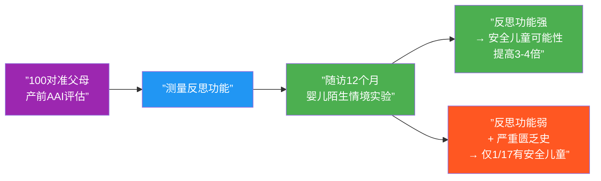
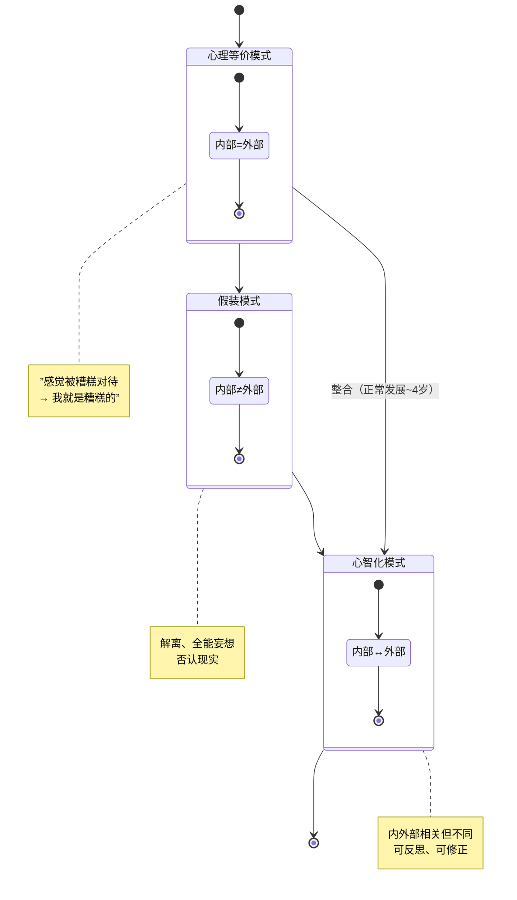
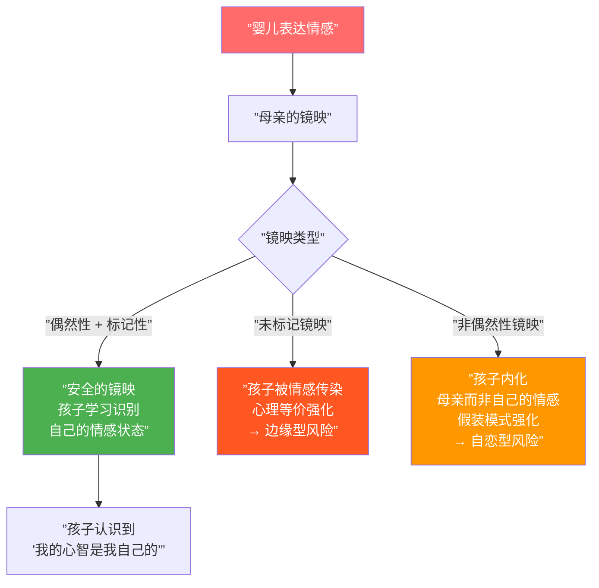
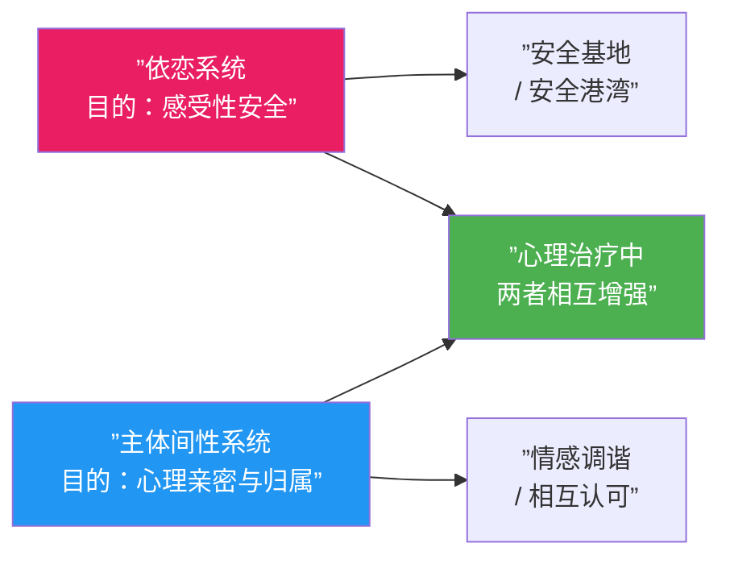
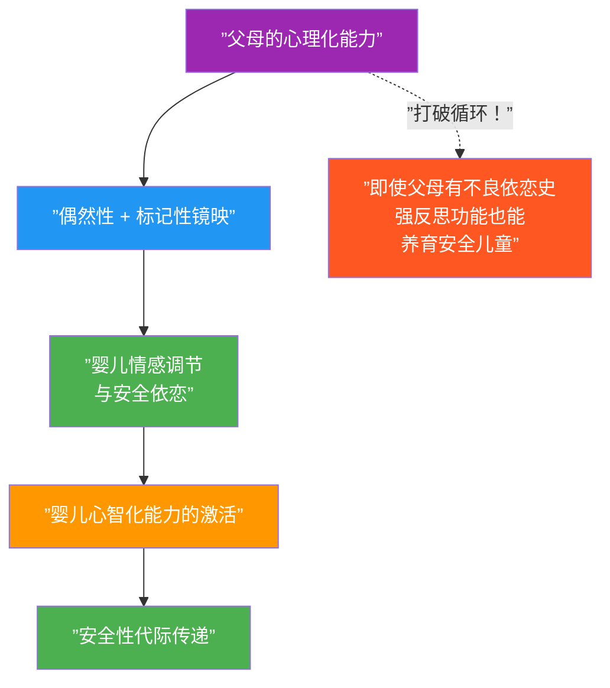

# 第04课：福纳吉与心智化

## 本课导航

> [!ABSTRACT] 学习目标
> - 理解**心智化**（mentalizing）与**反思功能**（reflective function）的定义及其临床核心地位
> - 掌握三种**经验模式**：心理等价、假装与反思模式
> - 理解"容纳"与"镜映"如何塑造安全性
> - 认识**主体间性**（intersubjectivity）从依恋到治疗的演变
> - 理解心智化如何填补"传递缺口"

---

## 1. 福纳吉：从元认知到心智化

Peter Fonagy 受 Main 在元认知方面工作的启发，但做了两个关键扩展：

1. **从自我监控到对他人心智的关注**：Main 关注成人在 AAI 中对自身思考和回忆的自我监控；Fonagy 则扩展到**对心智状态一般的关注**，特别是**他人的心智状态**
2. **从实验室到临床**：将反思功能量表化，使之成为临床评估和治疗的核心工具

> **心智化**（mentalizing）——"我们意识到拥有心智中介着我们对世界的体验"这一过程。其标志不是**自我**知识，而是关于**心灵一般**的知识。——Fonagy et al. (2002)

### 1.1 反思功能（Reflective Function）

**反思功能**让我们将自己和他人视为具有**心理深度**的存在。它使我们不仅基于可观察的行为，还基于行为背后的**心理状态**（欲望、情感、信念）来回应经验。

反思功能的四个维度：

| 维度 | 描述 | 临床观察点 |
|------|------|-----------|
| **对心理状态性质的认识** | 理解自我认识始终不完整；人们可能修改心理状态以减轻痛苦；某些心理反应可预测 | "我不敢说完全了解他的感受" |
| **识别行为背后的心理状态** | 合理地从信念、情感、欲望角度解释行为；认识到自己的解释可能受自身状态影响 | "我对她的愤怒，可能是因为我自己的恐惧" |
| **认识心理状态的发展性** | 昨天的感受可能不同于今天；父母的行为既受其父母影响，又影响孩子 | "现在回想起来，我父亲可能不是不爱我，而是不知道如何表达" |
| **对访谈者/治疗师心理状态的觉察** | 没有被告知，治疗师就无法知道患者知道的事；治疗师可能有自己独特的情感反应 | "你可能觉得我这个故事很奇怪，但对我来说这就是现实" |

> [!TIP] 临床窍门
> Fonagy 强调，我们不需要听患者宣示关于心理状态的原则（"人永远无法知道别人在想什么"），而是需要寻找**隐性理解**的证据——"小时候我确信母亲不爱我，但听了父亲关于**她**如何觉得我拒绝**她**的故事，我现在不确定她到底怎么想了。"

---

## 2. 反思功能研究：打破循环

### 2.1 里程碑研究

Fonagy 和 Steele 夫妇招募了 100 对准父母，在**孩子出生前**对他们进行 AAI 评估，测量反思功能。主要发现：

### 2.2 反思功能作为"解药"

最关键发现：**强大的反思能力可以打破"不利循环"**。

在经历了严重剥夺（父母精神疾病、长期分离等）的母亲中：
- **反思功能强** → **100%** 的孩子是安全的
- **反思功能弱** → 仅 **1/17** 的孩子是安全的

> [!NOTE] 核心结论
> "依恋本身并非目的，它存在的目的是产生一个表征系统——这个表征系统很可能是为了帮助人类生存而进化出来的。"——Fonagy et al. (2002)

这个表征系统就是**心智化系统**——它提供了巨大的进化优势，使个体能够理解、解释和预测他人的行为以及自己的行为。

---

## 3. 三种经验模式

Fonagy 描述了理解内部世界与外部现实之间关系的三种主观模式：

### 3.1 心理等价模式（Psychic Equivalence）

**内部世界 = 外部现实**。信念和事实之间没有区分。感受就是事实。

- 被糟糕对待时 → "我是糟糕的"
- 自我作为心理行动者被淹没："没有'我'在解释/创造经验，只有一个'我'被经验发生"
- 患者被感受和想法"霸凌"，因为它们被等同于事实

### 3.2 假装模式（Pretend Mode）

**内部世界 ≠ 外部现实**（完全脱耦）。不受现实约束——凡是想象的都是真实的，凡是被忽略的都被抹除。

- 临床示例：解离、否认、极端自恋式的夸大
- 患者被"愿望思维"托举，但也被隔离于自身感受和重要他人之外

### 3.3 心智化/反思模式（Mentalizing / Reflective Mode）

**内部世界与外部现实既分离又关联**。能反思我们的想法、感受、幻想如何影响、也被如何影响着实际发生的事。

- 感受到"被糟糕对待"但我不等于糟糕
- 主观经验具有**解释性深度**
- 享受内在于心智的自由

### 3.4 临床桥梁

患者常常难以从心理等价和/或假装模式中抽身：

- **心理等价**中：被必须付诸行动的感受和想法奴役
- **假装模式**中：被愿望思维托举，但从感受和重要关系中隔离

> **核心临床任务**：帮助患者从心理等价和假装模式过渡到反思模式。这个过渡的关键是——一个提供情感调节和**在反思性他者面前玩耍**的主体间性依恋关系。

---

## 4. 情感调节、容纳与镜映

### 4.1 Bion 的容纳概念

Fonagy 借用了 Wilfred Bion 的**容纳**（containment）概念：

> 支持性母亲**心智地容纳**婴儿自己无法管理但能在她身上唤起的情感经验。容纳需要母亲在自身内部承受、加工，并将婴儿之前无法容忍的情感经验以可容忍的方式**重新呈现**给婴儿。

容纳的三个信息：
1. **我理解**你痛苦的原因和情感影响
2. **我能应对**你的痛苦并缓解它
3. **我认可**你作为一个有意向性的存在——一个能够解读他人心智的独立人

> Fonagy 认为——**第三个要素**——认可孩子作为具有自己心智的独立存在——"可能是最大化孩子形成安全依恋可能性的最重要因素"。

### 4.2 镜映与标记

**偶然性镜映**（contingent mirroring）：面部/声音显示与婴儿情感的**准确对应**，使婴儿第一次"看见"自己的情感表征。

**标记性**（markedness）：为让婴儿知道这是对**孩子**情感的反应（而非母亲自己的），母亲将镜映**标记为"假装的"或"好像的"**——例如夸张化或混合矛盾情绪。

> 在标记性中，我们**否认我们自己感受到的**，同时保持我们的个体性。实际上，**我们成为孩子需要我们成为的那个人**。如果照顾者做不到这一点——要么太像她自己（非偶然性），要么太像孩子（未标记）——孩子就无法以同样有效的方式发展出分离感。——Fonagy

### 4.3 问题镜映与心理病理

| 镜映类型 | 结果 | 相关病理 |
|---------|------|---------|
| **未标记镜映** | 孩子被传染的情感淹没，内部=外部（心理等价） | **边缘型**（Borderline） |
| **非偶然性镜映** | 内化的是母亲而非自己的情感；内部≠外部（假装模式） | **自恋型**（Narcissistic） |

### 4.4 通过玩耍超越容纳

Fonagy 强调，走出心理等价和假装的道路始于容纳与情感调节，但通过**玩耍**抵达反思的领域：

- 孩子全心投入游戏时，想象与现实完全分离
- 但当**另一位（父母、治疗师）观察游戏**时，假装世界和现实世界开始重叠
- 通过一个评论、一个眼神或一个"解释"——观察者在内部经验和外部现实之间**建立联系**
- 两者从"等同"或"解离"走向**可关联**——这就是心智化的基础

> 这种发展仅发生在**关系性的、主体间的语境**中。无论是在儿童发展还是心理治疗中，心理的、情感的、反思的自我主要是在**被他者承认和理解**时被发现（或被创造）的。

---

## 5. 主体间性：从依恋到治疗

### 5.1 什么是主体间性？

**主体间性**（intersubjectivity）是两个主体性之间的互动——两个心智的交界面。它没有统一共识，但至少有三种理解：

| 理解角度 | 代表人物 |
|---------|---------|
| **先天主体间性**——从出生就存在 | Trevarthen, Meltzoff |
| **发展成就**——需要逐步获得 | Benjamin |
| **治疗理论**——分析场是主体性的交汇 | Stolorow, Atwood |

### 5.2 先天主体间性

**镜像神经元**（mirror neurons）的研究是关键部分。Trevarthen 发现：

> 新生儿**42 分钟**大时就能有意模仿成年人的面部表情。6 周时，婴儿对前一天观察到的成人面部姿态，第二天能模仿。婴儿能检测并保持"看到他人脸上的表情"与"自己脸上的感受"之间的对应关系。

Trevarthen 称之为**原初主体间性**（primary intersubjectivity）——"我们生来就相信我们的心智存在于他人之中。我们转向他人来了解自己心智的内容，了解事物的意义。"

### 5.3 Stern 的贡献

Daniel Stern 指出大约 9-12 个月时，婴儿做出了一个重要发现：

- **他有一个心智**
- **母亲有一个心智**
- **心智的内容——主观内部经验——可以被分享**

**情感调谐**（affect attunement）：不仅是对行为的模仿，而是对**内部经验的共鸣和沟通**。母亲必须提供**跨模态**（cross-modal）回应——例如用声音匹配婴儿身体表达的兴奋节奏。

> "两个心智创造了主体间性。但同样，主体间性塑造了两个心智。重心已从**内心世界**转向**主体间**。"——Stern (2004)

### 5.4 依恋与主体间性

Stern 认为**依恋**和**主体间性**是分离但互补的动机系统：

### 5.5 Benjamin 的相互认可

Jessica Benjamin 提出，充分意义上的主体间性不仅依赖对应和相似，还依赖**差异**和**相互认可**（mutual recognition）：

> "在客体存在之处，主体必须出现。"——Benjamin

从"I-It"（我-它）关系到"I-Thou"（我-你）关系（马丁·布伯）的跨越意味着将他人体验为**分离的主体**——既不理想化也不贬低，而是作为一个真实的人。

**修复"认可的破裂"**是关键：孩子必须既能主张自己的现实，又能接受对方的相反现实。只有通过**愤怒地表达自己**并发现对方"在毁灭中幸存"（既未报复也未退缩），孩子才学到对方是**分离的主体**。

### 5.6 治疗中的主体间性

Fonagy 认为治疗"起作用"的方式是：生成一个**安全依恋关系**，在此关系中患者的心智化和情感调节能力得以发展。这必须是一个**主体间性关系**——患者在**被另一个人认识**的过程中认识自己。

Change Process Study Group (Stern, Lyons-Ruth, Sander, Tronick, 1995年起) 强调：

- **被活出的**（lived）治疗关系而非被分析的（analyzed）关系是主要治疗干预
- 共同创建的、内隐的、通常未言说的过程是变化的关键
- 对**当下时刻**（present moment）的关注绝对核心

---

## 6. 本课小结

### "传递缺口"的答案

### 关键术语对照

| 中文 | English | 主要提出者 |
|------|---------|-----------|
| 心智化 | Mentalizing | Fonagy |
| 反思功能 | Reflective Function | Fonagy |
| 反思功能量表 | Reflective-Functioning Scale | Fonagy, Target, Steele |
| 心理等价模式 | Psychic Equivalence Mode | Fonagy |
| 假装模式 | Pretend Mode | Fonagy |
| 容纳 | Containment | Bion / Fonagy |
| 偶然性镜映 | Contingent Mirroring | Fonagy |
| 标记性 | Markedness | Fonagy |
| 主体间性 | Intersubjectivity | Trevarthen / Stern / Benjamin |
| 原初主体间性 | Primary Intersubjectivity | Trevarthen |
| 情感调谐 | Affect Attunement | Stern |
| 相互认可 | Mutual Recognition | Benjamin |
| 心智化情感性 | Mentalized Affectivity | Fonagy |

> [!QUESTION] 自测题
> 1. 心智化与 Main 的元认知有什么关键区别？
> 2. 三种经验模式分别是什么？患者通常被困在哪两种中？
> 3. "偶然性"和"标记性"在镜映中各有什么功能？
> 4. 反思功能为何能打破代际传递的恶性循环？
> 5. 依恋与主体间性在 Stern 看来是什么关系？

点击查看答案

1. Main 的元认知聚焦于**自我监控**——个体对自身思考和回忆的监控。Fonagy 的心智化则扩展到**对心理状态一般的关注**，特别是**他人**的心智状态。其标志不是自我知识，而是关于**心灵一般**的知识。

2. **心理等价模式**（内部=外部，感受即事实）、**假装模式**（内部≠外部，完全脱耦）、**心智化/反思模式**（内部与外部既分离又关联）。患者常被困在心理等价（被感受霸凌）和假装模式（被愿望托举但与现实脱节）中。

3. **偶然性**确保镜映准确对应于婴儿的情感，使婴儿"看见"自己的情感表征。**标记性**（如夸张化或混入矛盾情绪）告诉婴儿"这是你的感受，不是我的"——正是通过标记性，婴儿发展出"我的心智是我自己的"这一意识。

4. 研究发现，在经历了严重剥夺的母亲中，反思功能强者**100%** 养出了安全儿童。反思功能使父母能够理解自己和孩子行为背后的心理状态，不将孩子的行为单纯视为对自己的威胁或反映。它充当了"解药"，缓冲了不良早期经验的影响。

5. Stern 认为依恋和主体间性是**分离但互补的动机系统**。依恋系统的目标是**感受性安全**（安全基地/安全港湾）；主体间性系统的目标是**心理亲密与归属**（被了解和了解他人）。两者在心理治疗中相互增强。

---

## 下一步

→ 继续本模块的学习。回顾 **[[0001-attachment-and-change|第01课：依恋与改变]]** 以串联整个理论框架，或进入 Part II 关于依恋关系对发展中的自我的影响。

### 反思练习

选择一个最近让你感到"被理解"的时刻。对方做了什么或说了什么让你感到被理解？试着用"偶然性镜映"、"标记性"和"容纳"的概念分析这个互动。再想一个"被误解"的时刻——它属于三种镜映类型中的哪一种（未标记？非偶然性？）？

---

> [!NOTE] 引用来源
> - Fonagy, P., Steele, H., & Steele, M. (1991a). Maternal representations of attachment during pregnancy predict the organization of infant-mother attachment at one year of age.
> - Fonagy, P. et al. (1995). Attachment, the reflective self, and borderline states.
> - Fonagy, P., Gergely, G., Jurist, E. L., & Target, M. (2002). *Affect Regulation, Mentalization, and the Development of the Self*.
> - Stern, D. (1985). *The Interpersonal World of the Infant*.
> - Stern, D. (2004). *The Present Moment in Psychotherapy and Everyday Life*.
> - Benjamin, J. (1990/1999). *The Bonds of Love*.
> - Trevarthen, C. (1979). Communication and cooperation in early infancy: A description of primary intersubjectivity.
> - Wallin, D. J. (2007). *Attachment in Psychotherapy*, Chapter 4.