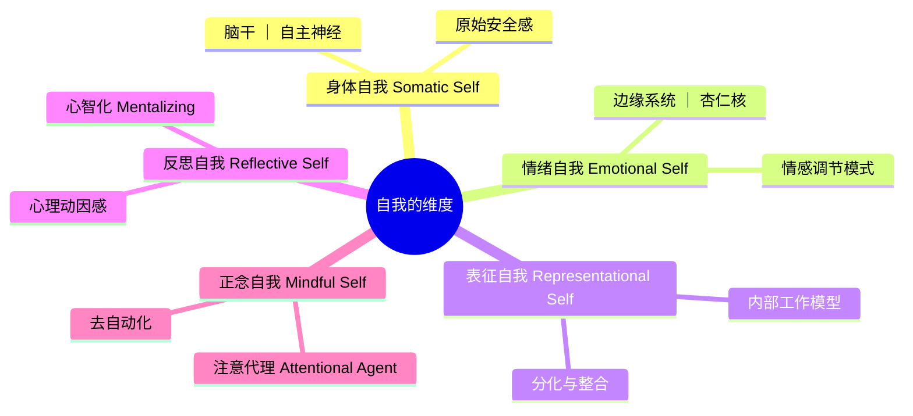
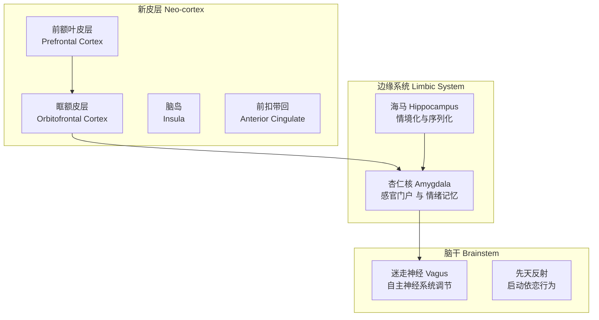

# 第05课：自我的多重维度

## 引言：自我的全景图

每个人的体内都交织着身体（body proper）、大脑（brain）与心智（mind）的合奏，它们共同生成了一个相对稳定的内在参照点——那就是**自我**（self）[^1]。自我不仅经验着生活，也在非意识（nonconscious）与意识（conscious）两个层面上塑造着生活。

依恋关系的影响会烙印在三个相互重叠的领域——**身体**（the body）、**情绪**（emotions）和**表征世界**（the representational world）——从而塑造自我对经验的态度（stance of the self toward experience）。理解这些领域各自的特性以及它们之间的整合程度，能够帮助临床工作者洞察来访者和治疗师各自带入治疗关系的资源与局限。

本章我们将沿循 Wallin 的论述，逐一探索自我的五个维度：**身体自我**、**情绪自我**、**表征自我**、**反思自我**与**正念自我**，并深入神经生物学层面，理解依恋如何在最底层的神经回路中塑造我们是谁。

## 身体自我：自我的根基

> "自我首先是一个身体自我。" ——西格蒙德·弗洛伊德（1923）

Daniel Stern 在《婴儿的人际世界》（*The Interpersonal World of the Infant*, 1985）中指出，"**核心自我**"（core self）源自婴儿对"**自我不变项**"（self-invariants）的早期经验，而其中最核心的就是婴儿自己的身体及其边界。神经生物学家 Antonio Damasio（1999）同样强调身体的"结构与运作的显著不变性"（remarkable invariance of the structures and operations of the body）是自我稳定性的来源。

Bowlby 将依恋理论扎根于进化生物学，指出婴儿寻求与照顾者亲近（proximity）的动机起初源于对**身体保护**的需要。后续研究表明，持续与依恋对象的亲近关系可以调节婴儿身体的内部功能，而依恋关系的质量——安全或不安全——会直接塑造婴儿生理反应系统的发展。例如，敏感回应的母亲所养育的安全型婴儿，其生理应激反应的激活阈值显著高于冷漠型（dismissing）、迷恋型（preoccupied）尤其是未解决型（unresolved）母亲养育的不安全型婴儿[^2]。

> [!NOTE] 临床要点
> 由于患者对身体的体验是根本性的，而这种体验又在关系情境中形成，**以依恋为导向的治疗必须将身体自我纳入关注的核心**。如何在"谈话疗法"中整合身体经验，是 Wallin 在后续非语言经验相关章节中重点探讨的主题。

## 情绪自我：情感的基石

> "痛苦或愉悦的感受——或是介于两者之间的某种质地——是我们心智的基石。" ——Antonio Damasio（2003）

Sroufe 和 Waters（1977）将"**感受到的安全**"（felt security）与亲近并列为依恋的目标，从而明确凸显了情绪在依恋中的核心地位。正是**安全感的感觉**最为根本——甚至超过亲近本身，因为婴儿完全可以身处依恋对象身边却未感到安全。

### 情绪为何如此根本？

1. **直觉性评估**：Bowlby（1969/1982）指出，情绪是个体对其机体状态或环境情境的"**直觉性评估**"（intuitive appraisals）。
2. **驱动行动**：从词源学看，emotion 源自拉丁语 *motore*（移动），情绪触发先天行为系统——包括依恋系统。愤怒引发对峙或抑制，恐惧触发逃跑或僵住，无助引发崩溃等[^3]。
3. **身体连接**：情绪始终与身体相连。身体感觉是情绪最初的形式，William James（1884）甚至大胆提出：我们的身体不是因为害怕而逃跑——恰恰相反，我们害怕是因为身体在逃跑。

### 情感调节：自我的核心

> "自我的核心在于情感调节的模式。" ——Allan Schore（1994）

Fonagy、Schore 等人提出，**情感调节**（affect regulation）是自我发展的基础，而依恋关系是我们学习调节情感的首要情境。我们在最初依恋中所形成的关系模式，本质上是情感调节的模式，它们随后在很大程度上决定了我们作为一个独特的自我对经验的响应方式。

> [!WARNING] 治疗启示
> 在治疗师试图创建的新依恋关系中，患者的情感是核心。有效的情感调节——让情感得以被感受、调制、沟通和理解——通常是使患者能够疗愈和成长的过程的核心。

## 表征自我：内在世界的蓝图

Bowlby 认为，拥有一个映射现实世界的表征世界是进化的必然要求。我们从过往经验中提取知识，用以预测当下和未来，这就是**内部工作模型**（internal working model, IWM）。

### 表征的形式

表征不仅存在于可视觉化的意象或可述说的信念（符号性表征）中，还存在于：

| 表征形式 | 编码方式 | 临床意义 |
|---------|---------|---------|
| **符号表征**（Symbolic） | 可视觉化的意象和可述说的信念 | 可通过语言直接触及 |
| **规则表征**（Rules） | 决定我们能注意什么、不能注意什么 | 制约注意力的方向 |
| **行动表征/程序表征**（Enactive） | 仅通过行动或互动表达 | 在亲子互动中重新上演 |
| **躯体与情绪记忆**（Somatic/Emotional） | 身体感觉和情感反应 | 创伤后应激反应的基础 |

### 分化与整合

客体关系理论阐明，有效的心理表征发展依赖于两个基本过程：

- **分化**（Differentiation）：创建心理边界，区分自我与他人、内在世界与外部现实。
- **整合**（Integration）：连接情感上矛盾的经验——例如，即使对某人感到愤怒，也依然能够爱TA。

> [!QUESTION] 自测问题
> 为什么说内部工作模型——尤其是不安全型的——具有自我延续（self-perpetuating）的特性？
>
> 

点击查看答案

> 因为如果我们在成长中通过互动学到"亲近他人是有风险的"，就会建立防御机制让自己意识不到对亲近的需要，从而不会做出寻求亲近的尝试——而这些尝试本身才有可能更新旧的回避型依恋模型。此外，情绪涉及身体信号，由旧模型驱动的恐惧或愤怒的身体表达可能反过来引发他人的拒绝，恰恰验证了模型的预期。正如 Bowlby 和 Main 所强调的，工作模型——尤其是不安全的——倾向于自我延续。
> 

## 反思自我与正念自我

如果说身体自我、情绪自我和表征自我是每个人固有的维度，那么反思自我和正念自我则只是**潜在地**（potentially）可以触及。但它们至关重要，因为**心智化**（mentalizing）和**正念**（mindfulness）都与内化的安全基地（internalized secure base）相关联，这种内化的安全基地使复原力（resilience）和探索成为可能。

### 反思自我（Reflective Self / Mentalizing Self）

反思自我通常通过这样一种关系发展而来：将依恋对象体验为安全基地，使我们能够安全地探索世界——包括内在世界。

> "被理解并感到自己存在于一个充满爱心、关怀、调谐且自持的他人之心与头脑中"（Fosha, 2003）——这使我们得以作为一个"人"而非"物"被认知：一个其行为由情感、意图和信念赋予意义的生命。

在 Fonagy 的术语中，这使我们成为"**心理动因**"（mental agents），能够有意识地尝试理解主观经验，从而可以"在场"于自身的经验之中，而非被其淹没或与之切断。

### 正念自我（Mindful Self）

如果说心智化通过使我们成为"心理动因"来促进内在自由，那么正念则通过使我们成为"**注意代理**"（attentional agents）来促进自由。对此时此地的经验行使自愿、持续且不加评判的注意——这会改变经验本身：既**深化**它（更充分的在场、接纳和觉知），又**轻化**它（不那么被过去和未来的重量、羞耻和恐惧所压迫）。

> [!TIP] 正念的治疗价值
> Wallin 将正念视为一种关键的治疗资源，它既强化新的依恋关系，也被新的依恋关系所强化。正念有助于：
> - 调节困难情绪
> - 去自动化（deautomatize）习惯性反应模式
> - 增强对内化安全基地的体验
> - 让心灵安静，提高对所有自我领域信号的接收能力

## 依恋的神经生物学

### 大脑的三层结构

可以将大脑看作一个"三层的并列双拼别墅"，中间有左右脑之分，三层依次是脑干、边缘系统和大脑新皮层。

#### 脑干（Brainstem）

脑干是大脑的"地基"，在个体发展和进化中最早出现。它调节基本的身体功能（心率、呼吸、消化）并激活反射——包括那些"启动"依恋过程的先天反射。

从脑干发出的**迷走神经**（vagus nerve）分为两支：
- **有髓腹侧迷走**（myelinated ventral vagus）：在安全时激活"迷走刹车"，下调交感神经系统，使社交参与成为可能。
- **无髓背侧迷走**（unmyelinated dorsal vagus）：在面临致命危险时触发副交感神经的关机反应和不动（immobilization），解离（dissociation）通常是这种身体反应的心理对应物。

#### 边缘系统（Limbic System）

边缘系统有时被称为"**情绪大脑**"（emotional brain）。两个关键结构：

- **杏仁核**（Amygdala）：出生时即发育良好，是边缘系统的感官门户。它负责"直觉性"（gut）反应，在几分之一秒内评估感官输入的安全或威胁，并触发战斗或逃跑反应。杏仁核以非意识的符号前情感记忆（presymbolic emotional memories）形式记录经验——这些记忆偏倚着我们对当下经验的评估。

- **海马**（Hippocampus）：调节杏仁核的过度反应倾向。它专门根据序列和背景组织信息，使我们能够对不同的情境做出不同的反应。海马在出生后第二至第三年才开始上线——这意味着最早几年的经验以无意识情感记忆的形式保存在杏仁核中，往往是笼统且**过度泛化**（overgeneralized）的。

#### 大脑新皮层（Neocortex）

**前额叶皮层**（Prefrontal Cortex）分为两个主要区域：
- **背外侧前额叶**（Dorsolateral PFC）："理性大脑"，负责有意识地思考、推理和解决问题。
- **中前额叶皮层**（Middle PFC）：这是一个整合区域，连接身体、脑干、边缘系统和皮层。其中关键的眶额皮层（Orbitofrontal Cortex, OFC）是"社会情绪大脑的高级主管"，负责解码非语言情绪信号、调节情感、调停依恋行为。

**脑岛**（Insula）对**内感受**（interoception）至关重要——即对身体自身状态的注意和觉知，尤其是内脏状态。"脑岛可能比其他任何结构都更深入地参与其中"（Damasio, 2003），它可能是我们知道自己感受如何的主要途径。

### 镜像神经元系统（Mirror Neuron System）

20世纪90年代中期，意大利神经科学家 Rizzolatti 在猕猴的前运动皮层中发现了一类特殊的神经元——**镜像神经元**（mirror neurons）——它们不仅在猕猴自己发起动作时放电，在**观察其他猴子做出相应动作时也同样放电**。随后在人类中也确认了类似系统。

关键发现：
- 只有**有意向的**（intentional）动作才会触发镜像神经元放电。
- 不仅是意图状态，他人的**情绪和身体感觉**也可以引发镜像神经元放电。
- 镜像神经元系统被认为是**共情**（empathy）、**情感调谐**（affect attunement）和**主体间性**（intersubjectivity）的神经基础。

### 整合与大脑

健康的依恋关系，尤其是生命最初几年的依恋关系，对于右脑与左脑功能、边缘系统与皮层功能的整合是必要的。神经可塑性（neural plasticity）的研究表明，成年人的大脑也可以被当前经验重塑——这强烈提示：重新创建那种最初使身体、大脑和心智得以发展的依恋基质，对于有效促进治疗性改变至关重要。

## 身心融合：具身心智与正念身体

Damasio 在《笛卡儿的错误》（*Descartes' Error*, 1994）中论证了心智与身体的不可分割性：感受本质上是心智对身体状态的解读，而理性——要真正理性——必须锚定在身体发出的情绪信号中。

### 两种临床困境

| 类型 | 表现 | 治疗方向 |
|------|------|---------|
| **离身心智**（Disembodied Mind） | 回避/冷漠型患者，悬在经验之上，"不落在身体里" | 帮助他们重新找回感受的、感知的身体作为自我的固有部分 |
| **无心身体**（Mindless Body） | 迷恋型/未解决型患者，身体统治自我，身体"背叛"了他们 | 帮助心智灌注身体，使身体不仅被感知，也能感知和知晓 |

> [!WARNING] 治疗取向：自下而上与自上而下的整合
>
> Wallin 强调，单靠与患者"谈论"困难情绪是不够的。有效的治疗必须：
> - 采用**自下而上**（bottom-up）的方法：扎根于身体感觉和情绪
> - 通过**内感受性注意**（interoceptive attention）激活中前额叶皮层
> - 帮助患者为身体感受**命名**（labeling），这调动了皮层资源来处理痛苦的情绪经验
> - **正念呼吸**可以减少杏仁核的放电，平息大脑，平静身体
> - 语言化（verbalization）痛苦经验可以减少杏仁核的激活[^4]

## 临床要点总结

1. **身体感是起点**：治疗要从身体感觉和情绪开始，而非从认知解释开始。
2. **关注非语言维度**：治疗关系中右脑对右脑的沟通——通过面部表情、语气、姿势和手势表达——至关重要。
3. **命名即调节**：邀请患者标注他们在身体中感受到什么，这调动了新皮层的资源来处理痛苦的皮层下经验。
4. **正念是资源**：培养对当下经验的注意可以松动过时的内部工作模型（所谓的"不变表征"）的掌控。
5. **心智化需要情感激活**：帮助患者在心智化时必须让他们**正在感受**困扰情绪，否则只是"伪心智化"（pseudo-mentalizing）。

## 自我检测

> [!QUESTION] 问题 1
> 什么是"不变表征"（invariant representations），它在临床上有何意义？
>
> 

点击查看答案

> 不变表征是大脑皮层中储存经验的神经元模式，它们以**不依赖细节变化的形式**（forms independent of variations in detail）保留经验。根据 Hawkins（2005）的皮层运作模型，皮层较低的三层处理来自感官和身体的当下输入，而较高的三层则根据记忆做出预测。临床意义在于，为了松动过时内部工作模型的掌控，我们需要培养患者对**当下此时此地经验**的正念注意——帮助患者"恢复感官知觉"（come to their senses），减少由上而下的记忆和预测压倒由下而上的当下经验数据。
> 

> [!QUESTION] 问题 2
> 脱活（deactivation）和过度激活（hyperactivation）策略分别对应哪种非安全依恋模式？
>
> 

点击查看答案

> 脱活策略对应回避型/冷漠型（Avoidant/Dismissing）依恋，表现为情绪过度调节、压制依恋需要；过度激活策略对应矛盾型/迷恋型（Ambivalent/Preoccupied）依恋，表现为情绪调节不足、放大痛苦以获取关注。混乱型/未解决型（Disorganized/Unresolved）则可能在这两种策略之间振荡。
> 

> [!QUESTION] 问题 3
> 为什么说"伪心智化"是无效的？
>
> 

点击查看答案

> Fonagy 指出，要真正行使心智化能力，患者需要在他们**实际正在感受**困扰情绪的时候谈论这些情绪。研究（Hariri et al., 2000）表明，看到令人不安的图片并被指示描述的人，其杏仁核激活程度显著低于看到同样图片但未被要求语言化的人。但仅仅在认知层面上"谈论"情绪而不同时体验情绪，就无法激活心智化所需的神经回路——杏仁核和前额叶皮层——因而只是空洞的智力化。
> 

## 下集预告

下一课 [[0006-varieties-of-attachment-experience|第06课：依恋经验的多样性]] 将详细解读四种依恋类型——安全型、回避型、矛盾型和混乱型——从婴儿期到成年期的连续性特征，以及这些模式如何以惊人的一致性贯穿整个生命周期。

---

[^1]: 本章中"自我"同时指代作为经验主体的"我"和被经验的"我"，Wallin 强调这两个方面在依恋关系中都被深刻塑造。
[^2]: 参见 Polan & Hofer, 1999; Lyons-Ruth, 1999。
[^3]: 见 van der Kolk, 2006; Damasio, 1999。
[^4]: 见 Hariri et al., 2000, 2003；以及 Ochsner & Gross, 2005。