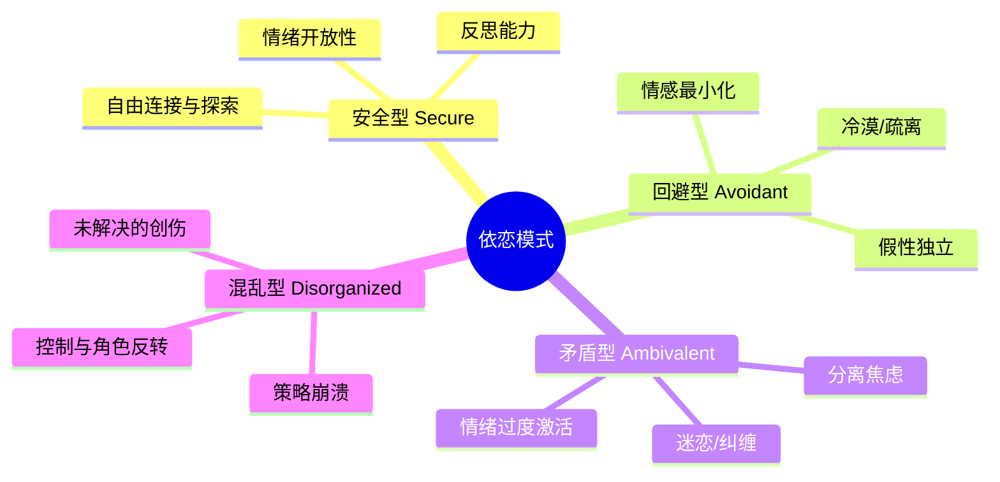
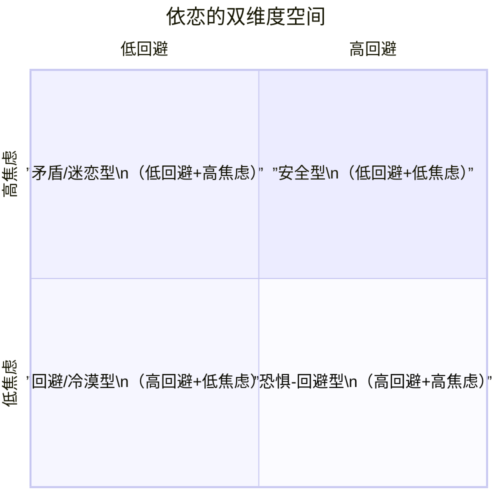

# 第06课：依恋经验的多样性

## 引言：从蓝图到心智结构

我们最初的依恋关系提供了心智的原始蓝图。这些关系中的沟通模式被内化为一系列结构化模式——这就是所谓的**自我**。在隐含的行动表征层面——即内部工作模型（internal working models）——**媒介即信息**（the medium is the message）。我们与赖以生存的他者之间的发展性对话（developmental dialogues）的结构，成为我们内在世界的初始结构[^1]。

> "无论婴儿的非语言沟通中，什么能唤起父母的调谐性回应，就被纳入（ruled in）；什么引发了厌恶反应或根本未被识别，就被排除在外（ruled out）。" ——Mary Main

Main 的研究表明，婴儿从这些早期交流中推导出的"规则"不仅支配着他们的行为，还决定了他们**允许自己去感受什么、想要什么、思考什么、记住什么**。这些规则编码在儿童的内部工作模型中，保存着他们的依恋历史知识，并塑造他们与他人及自己的当前和未来关系。

### 依恋模式的稳定性

纵向研究显示，婴儿12个月时在陌生情境实验（Strange Situation）中的安全型与非安全型分类，与成年后的成人依恋访谈（Adult Attachment Interview, AAI）分类之间的符合率达 **68-75%**（Fonagy et al., 2002）。

更惊人的是，Mary Main 原始研究的数据显示，从婴儿期到19岁的符合率超过 **80%**——只要排除了有中间创伤经历的参与者。创伤（如父母去世）可能会改变一切，且往往不会变得更好。

但同时，有些被预测为非安全型的成人却展现出连贯一致的 AAI 叙事——这标志着**"获得性安全型"**（earned secure）依恋的达成。婚姻也被证明可以将不安全型成人转变为安全型。这对心理治疗来说是一个充满希望的信息：**依恋关系性质的改变，可以改变个体的依恋工作模型**[^2]。

## 安全/自主型依恋：自由连接、探索与反思

### 婴儿期

在陌生情境实验中，安全型婴儿展现出灵活平衡（flexible balance）：在寻求母亲的安慰和独立探索玩具之间自如切换。似乎没有来自母亲的预设要求——她既不会被强制成为婴儿注意的焦点，也不会被忽略。

### 六岁时

Main 的追踪研究揭示出惊人的连续性。安全型儿童在六岁时：
- 面对展现分离的唤起性照片，能自如地讨论照片中孩子的感受，并想象其来源。
- 能设想出建设性的解决方案应对分离危机。
- 与父母重聚时立即表现出温暖的欢迎，语言交流流畅（fluent），而非生硬或刻板。
- 家庭画通常写实，父母和孩子彼此靠近、手臂伸展，像是在开放地接触。
- 拿到家庭快照时，表现出愉悦或随意评论，然后交回——Kaplan 将这种孩子描述为**"安全-足智多谋"**（secure-resourceful）。

### 父母的特征

这些儿童的父母在 AAI 中被归类为**"安全-自主型"**（secure-autonomous）。他们：
1. 展示出既能自由重视、又能客观反思其依恋关系的**能力**。
2. 话语模式（mode of discourse）被描述为**连贯且协作**（coherent and collaborative）。
3. 能够**既拥有经验又能反思经验**——站在**经验之内**和**经验之外**。
4. 这种能力被 Main 称为**元认知监控**（metacognitive monitoring）。

> [!TIP] 获得性安全型（Earned Secure）
> Main 识别出一个亚组：这些成年人描述了通常会与非安全型依恋相关联的痛苦童年史，但却能**连贯且协作地**谈论这些历史。这些"获得性安全型"成年人通常与密友、浪漫伴侣和/或治疗师建立了有意义的情绪关系（Siegel, 1999）。这对心理治疗来说是最具鼓舞性的发现之一。

## 回避/冷漠型依恋：不那么美好的孤岛

### 婴儿期

回避型婴儿缺乏安全型婴儿的灵活性和足智多谋。在陌生情境实验中，他几乎只进行探索，几乎完全不展示依恋行为。12个月时，他会主动回避母亲——这被认为是对母亲一贯拒绝其身体和情感亲近尝试的回应（也有研究者提出是侵入性、控制性和过度唤醒的养育所致）。

关键发现：回避型婴儿表面上不受分离影响、忽略重聚时的母亲，但其**生理反应**却无法否认其真实的痛苦——他的心跳加速、皮质醇水平升高（Sroufe & Waters, 1977b）。**他学会了抑制与分离和依恋相关情绪的自然表达，但这不意味着他没有感受到这些情绪。**

### 六岁时

- 能说出分离照片中儿童的悲伤，但**想象不出任何解决方案**。
- 重聚时回应被描述为"**受限的**"（restricted）：把所有主动权留给父母，只做最低限度的回应，谈话断断续续，话题仅限于非个人化内容。
- 家庭画被描述为"**不安全-不可伤害的**"（insecure-invulnerable）：人物区分度低，都带着刻板的"笑脸"，彼此远离，常常漂浮在空中且没有手臂。
- 拿到家庭快照：**转身离开，拒绝接受，或随意将其丢到地上**（Main, 1995, 2000）。

### 父母的特征

回避型儿童的父母几乎无一例外被归类为**"冷漠型"**（dismissing）。他们在 AAI 中的独特标志包括：
1. **坚持回忆不起来**童年的经历（insistence on lack of recall）。
2. 理想化的关系描述与实际经历之间的**矛盾**（contradiction）。

Wallin 引用 Main 的例子：一位母亲将她的母亲描述为"充满关爱、有爱心且支持性的"，随后却说：
> "有一次我在院子里玩时摔断了手臂。这种事情让我母亲很生气，她讨厌这种意外。痛了很久但我从没告诉她，她是从邻居那里知道的……她不喜欢爱哭的小孩。我总是尽量不哭，因为她是一个真正坚强的人。"

这位母亲为了维持对童年情绪孤立的"辩护"，将母亲的冷漠重新定义为"坚强"。

> [!WARNING] 身体生理反应揭示真相
> 冷漠型成年人在回答涉及分离、被拒绝或感到被父母威胁的 AAI 问题时，会表现出**皮肤电反应（galvanic skin response）的显著升高**（Dozier & Kobak, 1992）。冷漠的情感缺失只是表面现象。

### 两种矛盾的工作模型

Main 理论化了一种"二元合作"机制，解释了冷漠型父母的模型和规则如何被回避型子女采纳：

| 意识层面模型 | 无意识层面模型 |
|------------|--------------|
| 自我是好的、强大的、完整的 | 自我是有缺陷的、依赖的、无助的 |
| 他人是不可信任的、有需要的、不称职的 | 他人是拒绝性的、控制性的、惩罚性的 |

**脱活策略**（deactivating strategies）支持第一个模型作为对第二个模型的防御。它们促进距离、控制和自立，同时抑制可能激活依恋系统的情绪体验。

> [!QUESTION] 自测问题
> 冷漠型患者为什么常常过度批评和贬低他人？
>
> 

点击查看答案

> 这是一种投射机制。通过将他人的需要和脆弱视为"弱点"进行贬低，冷漠型患者可以避免面对自己内心同样被压抑的需要和脆弱。Wallin 描述道，冷漠型患者的"膨胀的自尊是以显著代价换来的——即对他们本可能依赖和爱的人吹毛求疵"。
> 

## 矛盾/迷恋型依恋：容不下独立的头脑

### 婴儿期

与回避型婴儿的脱活策略相对，矛盾型婴儿采用**过度激活策略**（hyperactivating strategy）。回避型的标志是**情感过度调节**（overregulation），矛盾型的标志是**情感调节不足**（underregulation）。在陌生情境实验中：

- 回避型婴儿只关注玩具，矛盾型婴儿**只关注母亲**。
- 交替出现**黏人且愤怒抵抗**（alternately clinging and angrily resistant），或陷入**无助的被动**（helpless passivity）。
- **极难被安抚**（extremely hard to soothe）。
- 对于母亲的去向长期焦虑（chronically anxious），似乎被压倒而无法探索。

这个模式是婴儿对母亲**不可预测的回应**（unpredictably responsive）的可预见反应——这一策略有助于获得母亲不稳定的关注。

### 六岁时

- 面对分离照片，一个孩子说照片中的孩子会为父母买花，**但会把他们的衣服藏起来**——传递了混合信息。
- 重聚时：一个孩子顺从地坐上母亲的大腿，却又扭动挣脱；另一个大张旗鼓地对父母表达情感，然后**突然中断接触**。
- 家庭画："**脆弱型**"（vulnerable），人物要么极大要么极小，彼此紧贴，经常突出身体脆弱或私密部位。
- 拿到家庭快照：**被照片深深吸引同时又深受困扰**——不是安全型孩子的享受，也不是回避型孩子的排斥，而是一种被吸引的焦躁。

### 父母的特征

这些父母被归类为**"迷恋型"**（preoccupied），编码为"E"（enmeshed/entangled，纠缠的）。在AAI中：

- 情绪性语言和语法混乱：从描述过去与父亲的情节突然转为**直接抱怨父亲当前行为**。
- 出现"**未标引的引语**"（unmarked quotations）：突然以父亲的口吻说话（"所以你为什么不听你妈妈的话？"）或**直接对父亲说话**（"再也别那样跟我说话！"）——仿佛父亲就在现场。
- 儿童化语言："妈妈生气因为那个狗狗咬了我"。
- 含糊表达："爸爸让我坐在他大腿上，然后那个……"。
- 冗长、离题、难以跟进、不完整的句子。

> [!NOTE] 临床要点
> 迷恋型父母传达信息的方式"混乱且令人困惑"、难以跟进、冗长，且不鼓励自主——正是这些特质被认为会助长矛盾型婴儿的"过度激活策略"。

### 虚假但真切的安全感

Main 得出结论，这些相同的依恋规则——**放大痛苦、抑制自主**——既造成了迷恋型父母混乱、情绪淹没的 AAI 回应，也造成了他们对婴儿非语言线索的不一致敏感性。

Main 的研究及临床经验表明，这种痛苦如此紧密地焊接在婴儿期产生的"**虚假但真切的安全感**"（false but felt security）上，以至于在成年后仍然是一个难以放下的负担。

## 混乱/未解决型依恋：创伤与丧失的伤痕

### 婴儿期

**混乱/迷失型**（disorganized/disoriented）婴儿在陌生情境实验中与母亲在一起时会零星出现难以解释、怪异、明显冲突或**解离**（dissociated）的行为。这些行为被认为是回应一个**让婴儿感到恐惧的父母**——或是父母本身恐惧或解离的反应引发了婴儿的恐惧。

核心悖论：婴儿面临一个无法解决的矛盾——其生物本能下的**安全港湾**（haven of safety）同时是其**警报的来源**（source of alarm）。

### 六岁时

- 面对分离照片：沉默，过于困扰而无法回应；或想象**灾难性结果**；或在语言或行为中显示出混乱。
- 家庭画：包含令人困扰和/或怪异的元素——断裂的身体部位、骷髅、被刮掉的人物。
- 拿家庭快照时：变得无言、非理性或痛苦。

### 控制与角色反转

一个令人警醒但关键的发现：当初被评估为混乱型的婴儿在六年后的重聚中展示出**一种新的行为策略**——试图**控制**父母：

- **照看型**（caregiving）："你累了吗，妈妈？要不要坐下，我给你拿杯（假装）茶？"
- **惩罚型**（punitive）："坐下闭嘴，闭上眼睛！我说了，闭着！"

这些孩子似乎正在扮演父母的角色，以维持与父母的亲近，同时应对父母带来的威胁。

### 父母的特征

混乱型儿童的父母经历了**未解决的**（unresolved）创伤和/或丧失。关键点：不是创伤本身，而是**未解决的状态**（lack of resolution）预测了孩子混乱的依恋。

在AAI中，未解决状态通过"**推理或话语监控的疏漏**"（lapses in the monitoring of reasoning or discourse）来识别：

| 疏漏类型 | 表现 | 例子 |
|---------|------|------|
| **推理疏漏** | 对同一现实持有不相容的观点 | 表示某人既死又活 |
| | 违反因果关系或时空关系的共识假设 | 声称一个死亡是由于一个念头 |
| **话语疏漏** | 突然切换话语"语境" | 从直白描述转向极度详尽的描述 |
| | 从聚焦的叙述转为长时间沉默 | 无法回忆之前说了什么 |
| | 从一个叙述声音切换到另一个 | 从哀悼者切换到致悼词者 |

> [!WARNING] 为什么恐惧会代际传递？
> 未解决的父母在抚养孩子的情境中（被婴儿的哭闹、发怒触发）可能突然坠入压倒性的、混乱的或恍惚的状态。父母的愤怒在身体或情感虐待中爆发是双重毁灭性的，因为它破坏了儿童对恐惧的生物学驱动反应——儿童既不能**转向**也不能**逃离**那个同时是感知威胁的来源和唯一安全港湾的依恋对象。此外，未解决的创伤也可以在**恐惧表现**中表达——从婴儿身边退缩或解离——这本身就是令人警觉的，因为安全基地因此变得一点也不安全。

## 重要警示与术语说明

### 分类的局限性

虽然从患者的**主导依恋心态**（prevailing state of mind with respect to attachment）出发来理解他们非常有帮助，但作为一个完整的人的复杂性永远不能被单一的描述充分捕捉。

社会心理学家主张以**双维度空间**来思考依恋模式：

### 情境依赖性

大部分患者在不同时间会展现出多重心态，且这些心态在一定程度上是**情境依赖的**（context-dependent）。在感到被拒绝的情境中，一个通常显露出冷漠心态的患者可能会看起来迷恋。

> [!TIP] 临床实用原则
> 虽然患者的依恋分类提示了大量具有临床价值的可能性，但始终是患者**生命和历史的细节**（the particulars of the patient's life and history）最具有说服力。一个表面上冷漠的患者需要否认的对连接的渴望，将完全取决于他与特定依恋对象的具体经验细节。

### 术语说明

- **AAI 研究者**使用"**对依恋的心态**"（state of mind with respect to attachment）——反映成人讨论依恋经验的连贯性，预测其子女的依恋行为。
- **社会心理学家**偏好"**依恋风格**"（attachment style）——通过自我报告量表评估在亲密关系中的经验。

尽管存在差异，两者都植根于内部工作模型、依恋策略及其产生的历史。

## 临床要点总结

1. **安全型依恋**是灵活性与整合性的典范——既重视亲近又重视自主，既拥有情绪又能反思情绪。
2. **回避/冷漠型**患者需要治疗师帮助他们重新连接被切断的情感领域和身体经验，获得右脑的情绪信息。
3. **矛盾/迷恋型**患者需要治疗师帮助他们调节情绪反应、建立独立的自我感，而不仅仅是活在他人的反应中。
4. **混乱/未解决型**患者需要治疗师提供一个足够稳固的安全基地，使那些被解离的创伤经验得以逐渐整合。
5. **获得性安全型**（earned secure）的存在本身就是心理治疗的希望——改变依恋关系的性质，可以改变一个人的依恋工作模型。

## 自我检测

> [!QUESTION] 问题 1
> 在 Main 的研究中，什么因素对依恋模式从婴儿期到19岁的连续性影响最大？
>
> 

点击查看答案

> 中间经历的创伤（例如父母的死亡等）。当有中间创伤经历的参与者被从分析中移除时，从婴儿期到19岁的连续符合率超过80%；但在包含这些参与者的分析中，这一比率显著降低。创伤可以改变一切，且通常不会变得更好。
> 

> [!QUESTION] 问题 2
> 什么是一个"获得性安全型"（earned secure）成年人？
>
> 

点击查看答案

> 指那些描述了通常与不安全型依恋相关的痛苦童年史（如被拒绝、忽视），但在成人依恋访谈（AAI）中仍能连贯且协作地谈论这些历史的成年人。这些成年人通常曾与密友、浪漫伴侣或治疗师建立了有意义的情绪关系。这是心理治疗能够改变依恋模式的最有力证据之一。
> 

> [!QUESTION] 问题 3
> 为什么回避型婴儿在陌生情境实验中看似不痛苦，生理却暴露了他们的真实感受？
>
> 

点击查看答案

> 回避型婴儿学会了抑制与分离和依恋相关情绪的自然表达，表面上忽略母亲、专注于玩具。但 Sroufe & Waters（1977b）的研究证明，这些婴儿的生理指标——如心率和皮质醇水平——与安全型婴儿一样显示着显著的痛苦。也就是说，他们学会了不在行为上表达痛苦，但身体的应激反应仍然存在。在成年冷漠型患者中，类似的生理反应也可以通过皮肤电反应（galvanic skin response）检测到（Dozier & Kobak, 1992）。
> 

## 下集预告

下一课 [[0007-how-attachment-shapes-self|第07课：依恋如何塑造自我]] 将探讨情感调节策略、协作沟通的品质以及主体间性——即依恋关系如何通过共调谐和共同创造的互动过程塑造自我。

---

[^1]: 见 Lyons-Ruth, 1999; Main & Goldwyn, 1984-1998; van IJzendoorn, 1995。
[^2]: 见 Hesse, 1999; Crowell, Treboux, & Waters, 2002。