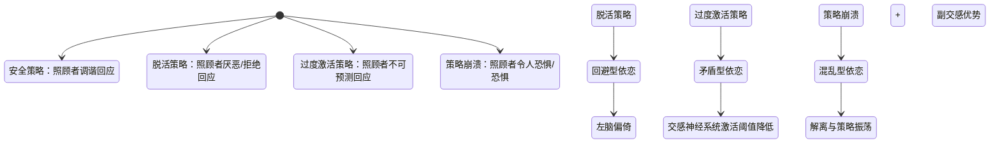
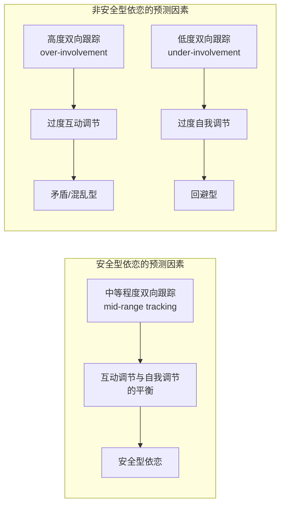

# 第07课：依恋如何塑造自我

## 引言：适应性塑造了自我

> "一个人与他人关系的经验，变成了他与自身关系的一个特征。" ——Peter Hobson（2002）

人类婴儿是极其脆弱和依赖的生命。他们不仅需要"更强壮和/或更智慧者"（Bowlby, 1988）的保护以维持生理存活，更需要依恋对象来帮助他们构建和维护那个被称为自我的稳定参照点。

婴儿的**彻底依赖**意味着：适应依恋对象——带着他们各自特有的优势和脆弱——是**强制性的**。因为婴儿**必须**适应，所以婴儿**一定会**适应。

Ainsworth 的研究本质上记录的就是婴儿为了从依恋对象那里获得保护而发展出的各种适应性策略。而这种适应的核心，是一种被称为**情感调节**（affect regulation）的心理功能。

## 依恋策略即情感调节策略

> "依恋是情感的二元调节。" ——Allan Schore（2003）

婴儿无法自行制造"感受得到的安全"（felt security）。因此他们需要依恋对象来帮助管理困难的情绪。这种情绪的管理就是情感调节。从这一角度来看，**适应性依恋策略本质上就是情感调节的策略——它们将以根本且普遍的方式塑造自我**。

### 安全型依恋中的情感调节

在安全型依恋中，照顾者的回应既缓解了婴儿的痛苦，又放大了她的积极情绪。婴儿因此将依恋关系体验为一个可以**有效调节情感**的语境。在内部，根植的是一种身体层面的感受：与他人连接可以带来缓解、安慰和愉悦。同时，自我——在表达其全部身体和情绪经验与需要时——是**好的、被爱的、被接纳的和有能力的**。

Fonagy 等人（2002）描述了安全型依恋中情感调节的"**社会性生物反馈**"（social biofeedback）过程：

1. 婴儿学会：表达感受可以带来积极结果——产生对自我和他人的积极感受。
2. 婴儿学会：她可以对他人产生影响——产生初步的**能动感**（sense of agency）。
3. 婴儿逐渐学会：**特定的**情感唤起**特定的**反应——这帮助她开始区分并最终命名自己的感受。

### 双轴策略：脱活与过度激活

当安全型依恋的**主要依恋策略**（primary attachment strategy）因照顾者的失调性回应而受挫时，婴儿会发展出**次要策略**（secondary attachment strategies）：

| 策略 | 别称 | 对应模式 | 策略功能 |
|------|------|---------|---------|
| **脱活**（Deactivation） | 最小化策略（Minimizing） | 回避型/冷漠型 | 压制依恋系统的激活，远离亲近冲动 |
| **过度激活**（Hyperactivation） | 最大化策略（Maximizing） | 矛盾型/迷恋型 | 持续激活依恋系统，放大痛苦以获取关注 |
| **策略振荡**（Oscillation） | 混合策略 | 混乱型/未解决型 | 在两者之间无规律摇摆 |

#### 脱活策略（Deactivation）

当父母对孩子与依恋相关的情感信号的回应是**厌恶性的**（aversive），脱活策略就会产生。孩子寻求亲近的信号被拒绝和/或被控制。为了在不利条件下维持最好的可能的依恋关系，孩子学会了**过度调节**（overregulate）自己的感受和它们的表达。

> [!NOTE] 临床面貌
> 你可以联想到**强迫型、自恋型或分裂型**患者。他们的情绪范围狭窄，对他人情感信号几乎视而不见，扁平的反应性让他们看起来"缺乏生命力"——Siegel（1999）称之为左脑和副交感神经系统的偏倚。
>
> 在这些患者身上未被整合的是与亲密关系相关的情感、欲望和满足。回避亲近压缩了他们的深刻感受、性表达、健康的依赖和信任的发展。

#### 过度激活策略（Hyperactivation）

矛盾型婴儿的过度激活策略似乎围绕着对亲近的追求。适应于回应**不可预测**的父母，孩子学会了**放大情感**来获得父母的关注。但被唤起的关注并不总是匹配孩子的需要——所以孩子学会维持**依恋系统的持续激活**。

> [!WARNING] 临床面貌
> 这些患者的过度依赖倾向破坏着他们的自尊，并且往往恰恰引发了他们在无意识中想要避免的**被抛弃**。过度激活还降低了触发交感神经系统激活的阈值，削弱了皮层对情绪反应的调控能力。

#### 混乱型依恋：策略的瓦解

混乱型依恋通常被视为适应性策略的崩溃。一个恐惧的婴儿被生物本能驱使去寻求亲近一个**令人恐惧**的父母。Main 观察到这些矛盾行为的顺序或同时出现：

> 在一个受虐待的婴儿身上观察到的例子：强烈地展示依恋行为（跑向父母哭着伸出双臂），随后莫名其妙地转为回避（婴儿突然停下，背对父母，沉默）。

混乱型/未解决型患者被**冲突的冲动**撕扯——既出于对攻击的恐惧而要回避他人，又出于对孤独的恐惧而绝望地转向他人。他们往往将情感体验为压倒性的和混乱的。

> [!TIP] 治疗意义
> 对于混乱型患者，治疗师需要的整合是多维度的——包括创伤经验的整合、解离情感的整合、以及自我与他人意象中分裂的弥合。这一切依赖于治疗师能否生成一个日益安全的依恋关系——一个安全港湾和基地——它本身成为患者耐受、调节和沟通那些之前无法承受的感受的主要来源。

## 协作沟通：发展的关键性因素

基于大量的实证研究发现，研究者 Lyons-Ruth（1999）提炼出了**协作沟通**（collaborative communication）的四个要素。这些要素既是良好养育的基础，也是有效心理治疗的根本。

### 协作沟通的四大要素

| 要素 | 含义 | 临床对应 |
|------|------|---------|
| **包容性**（Inclusiveness） | 对孩子的全部经验保持开放（不仅是痛苦），尽可能了解孩子的感受、愿望和信念 | 治疗师对患者所有维度的经验保持开放——包括身体感受、情绪、幻想 |
| **主动修复**（Initiate Repair） | 当关系被破坏时主动发起修复 | 治疗中不可避免的误解和裂痕后，治疗师的修复努力至关重要 |
| **支架**（Scaffolding） | 积极支持孩子正在萌芽的沟通能力 | 治疗师帮助患者命名尚未能言说的经验 |
| **积极对抗**（Willingness to Struggle） | 在孩子自我感与他人感处于发展性波动期时，愿意设定限制并允许孩子抗议 | 在保持连接的同时允许分离感的出现 |

### 情感调谐：从模仿到共享

Stern 提出**情感调谐**（affect attunement）——父母用一种**不同的感官通道**回应孩子的情感经验（例如，孩子高兴地尖叫，母亲用身体回应性地一颤），这使孩子感到被"认知"（to feel known）。如果只是纯粹的模仿，孩子只会感到被复制。

> "我说了些什么，然后你脸上出现了那种表情，所以我知道——你知道我的感受。" ——一位来访者对治疗师

> [!NOTE] 修复比完美更重要
> Stern 戏谑性地指出，这是一个实证发现：即使是最好的母亲，平均每19秒也会对婴儿犯一次"错误"。比避免关系中的断裂更重要的是**耐受和修复它们**。断裂与修复、失调与重新调谐的序列——其内化恰恰建立了这样的信心：误解是可以被化解的，痛苦是可以被度过的，因为它可以被缓解。

## 共调谐、主体间性与自我的诞生

### 互动调节与自我调节的平衡

Beebe 和 Lachmann（2002）在母婴面对面的沟通研究中揭示了：可预测婴儿12个月时依恋安全性的关键因素是二元互动中的**双向协调程度**（degree of bidirectional coordination）。

核心发现：
- **安全型**依恋与**中等程度**（midrange）的二元协调相关——协调"存在但不强迫"（present but not obligatory）。
- **高度协调**反映过度警惕地监控对方，预测矛盾或混乱型。
- **低度协调**反映退缩、抑制或缺乏匹配，预测回避型。

### 主体间性：两个独立主体的相遇

> "不存在只容得下一个人的空间。"

Wallin 引用 Benjamin 的观点：**相互承认**（mutual recognition）的能力——即承认（并被对方承认）为一个**独立的主体**而非一个客体——源于发现：**对方以及关系本身，可以在愤怒和冲突中存活下来**。

- 在回避/冷漠心态中：感觉"只容得下自我"。
- 在焦虑/迷恋心态中：感觉"只容得下他者"。
- 安全型依恋：**为两者留出空间**。

### 从镜像神经元到扩展的意识状态

Stern 指出，人类天生就配备了主体间性的"硬件"——镜像神经元系统使我们能够在他人的脸上看到并预测自己的感受。早在出生后42分钟，婴儿就能模仿成人伸舌头的面部动作——这是一种跨越感官通道的匹配能力，体现了自我与他人之间惊人的早期关联能力。

Tronick（1998）提出，婴儿-父母和患者-治疗师关系都是通过生成"**二元扩展的意识状态**"（dyadically expanded states of consciousness）来使发展成为可能的。这印证了主体间性临床理论家（Bollas, Mitchell, Stolorow）以及依恋研究者（Fonagy, Lyons-Ruth）共同的理解：**我们需要他人的心智来认知和成长自己的心智**。

## 临床整合框架

Wallin 在这一章中实际上为以依恋为导向的心理治疗提供了一个整合的操作框架：

### 情感调节层面
- 识别患者的主导策略（脱活/过度激活/振荡）
- 针对不同策略调整治疗姿态
- 帮助患者从策略性适应走向整合

### 关系过程层面
- 提供包容性、修复导向的关系
- 在互动调节与自我调节之间找到患者的平衡点
- 共同创建患者原始关系中缺失的经验

### 主体间性层面
- 承认治疗关系是共调谐的
- 两个独立主体的相遇是治疗性改变的核心
- 在差异和冲突中保持连接

> [!QUESTION] 自测问题 1
> 什么是"脱活策略"与"过度激活策略"？它们在临床患者身上分别有何表现？
>
> 

点击查看答案

> **脱活策略**（Deactivation）：当父母对孩子的依恋情感信号做出厌恶反应时产生。孩子过度调节情感表达，远离亲近冲动。临床上表现为强迫型/自恋型/分裂型患者——情感范围狭窄，对他人的情感信号不敏感，呈现假性自立。与左脑和副交感神经系统的偏倚相关（Siegel, 1999）。
>
> **过度激活策略**（Hyperactivation）：当父母对孩子的回应不可预测时产生。孩子通过放大痛苦来获取关注，维持依恋系统持续激活。临床上表现为歇斯底里型/边缘型患者——对依恋对象的可得到性过度敏感，倾向于夸大被抛弃的威胁，过度依赖，自尊受损。与交感神经系统的过度敏感相关。
>
> **混乱型**患者则可能在两种策略之间振荡——既回避亲近又恐惧孤独。
> 

> [!QUESTION] 自测问题 2
> Lyons-Ruth 提出的协作沟通四要素是什么？它们对心理治疗的启示是什么？
>
> 

点击查看答案

> 1. **包容性**（Inclusiveness）：对患者全部经验（身体、情绪、表征、幻想）保持开放。
> 2. **主动修复**（Initiate Repair）：当双方连接断裂时，治疗师主动发起修复，帮助建立对关系复原力的信心。
> 3. **支架**（Scaffolding）：帮助患者命名尚未言说的经验，支持其沟通能力的发展。
> 4. **积极对抗**（Willingness to Struggle）：在患者自我边界波动期，愿意设定界限并允许其表达抗议——在保持连接的同时允许分离感的出现。
>
> 这些要素共同塑造了一个安全基地的框架，在这个框架中，被排除的经验可以被重新整合。
> 

> [!QUESTION] 自测问题 3
> 什么叫"二元扩展的意识状态"（dyadically expanded states of consciousness）？它与心理治疗有何关联？
>
> 

点击查看答案

> Tronick（1998）提出的这一概念指的是，在母婴关系或治疗关系中，通过共调节的互动产生了一种超越个体单独能达到的意识状态。这是一种双方共同创造的、更丰富、更复杂的心理场域。Wallin 将其与临床主体间性理论家的观点联系起来——"我们需要他人的心智来认知和成长自己的心智"。在心理治疗中，治疗师与患者共同创造的这种扩展的意识状态，就是患者能够整合被排除经验、发展新能力的关键机制。治疗不仅仅是"修复"过去的缺陷，更是**在当下共同创造**新的经验。
> 

## 本课回顾

本章的核心信息可以概括为几个关键命题：

1. **依恋关系是情感调节的学校**——安全型依恋教会我们有效调节情感；不安全型依恋则发展出脱活或过度激活的次级策略。
2. **自我是被适应性塑造的**——被依恋对象调谐性回应的经验被整合；引发厌恶反应或未被识别的经验被排除在外。
3. **协作沟通是发展的关键**——Lyons-Ruth 的四要素框架（包容性、修复、支架、积极对抗）为治疗提供了操作指南。
4. **互动调节与自我调节需要平衡**——过度偏向任何一方都预示着不安全依恋。
5. **主体间性是改变的核心机制**——两个独立心智的相遇和共调谐创造了扩展的意识状态，使被排除的经验能够被整合。

> [!ABSTRACT] Part II 总结
>
> 第二部分的这三课构建了一个从理论到临床的完整桥梁：
>
> - [[0005-multiple-dimensions-of-self|第05课]] 提出了自我的多维模型——身体、情绪、表征、反思和正念自我——并追溯了它们的神经生物学基础。
> - [[0006-varieties-of-attachment-experience|第06课]] 详述了从婴儿期到成年期四种依恋模式的特征与连续性。
> - **第07课** 揭示了这些模式如何通过情感调节策略和关系过程得以形成和维系。
>
> 接下来，[[0008-nonverbal-and-unthought-known|第08课：非言语经验与「未思的已知」]] 将进入第三部分——从理论到实践——探索治疗中非语言经验的核心角色。

---

[^1]: 见 Lyons-Ruth, 1999; Main & Goldwyn, 1984-1998。
[^2]: 边注：Siegel 的概念化之所以有帮助，是因为它同时突出了回避/冷漠型患者的"缺陷"和那些需要治疗关注才能再整合的未发展能力。
[^3]: 有趣的是，多项研究表明回避型结果与母亲对婴儿的**极高跟踪**（very high tracking）相关——而婴儿的反应就像在逃离母亲的注意——这种互动模式被描述为"追逐与躲闪"（chase and dodge）。显然，婴儿也像我们大多数人一样需要一些空间。敏感的回应不仅包括对互动调节需要的调谐，还包括对孩子**自我调节**和"开放空间"（open space）需要的调谐（Sander, 1980）。