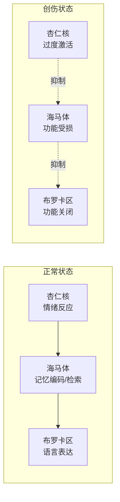
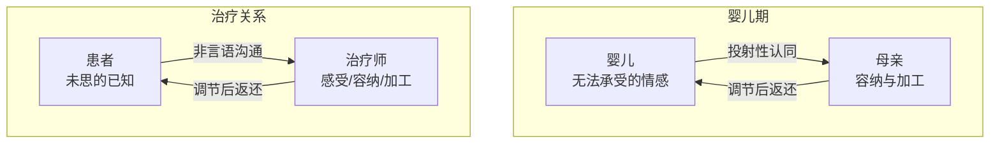
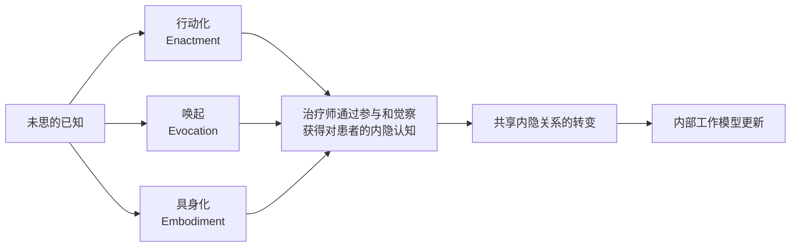

# 第08课：非言语经验与「未思的已知」

## 学习目标

- 理解「未思的已知」（the unthought known）这一核心概念及其临床意义
- 掌握非言语沟通的三种通道：行动化（enactment）、唤起（evocation）、具身化（embodiment）
- 认识内隐关系认知（implicit relational knowing）如何构成内部工作模型的基础
- 学会识别和利用治疗关系中的「当下时刻」（present moment）与「相遇时刻」（moment of meeting）

## 核心概念

### 什么是「未思的已知」？

> [!NOTE] 弗洛伊德的洞察
> 弗洛伊德曾描述过一种典型反应：当患者意识到某种被「遗忘」的东西时，他们会说：「事实上我一直都知道，只是从未想到过。」（Bowlby, 1988, p. 101）英国精神分析家克里斯托弗·博拉斯（Christopher Bollas）将这种状态精妙地命名为——**「未思的已知」（the unthought known）**。

**未思的已知**指的是那些我们「知道」但无法（或未能）思考的东西——因此也无法言说。由于这些知识存在于意识觉知之外，它们对我们有着巨大的影响力。在心理治疗中，**未言语化（unverbalized）乃至不可言语化（unverbalizable）的知识**扮演着关键角色。

Wallin 提出了一个核心公式：

> [!ABSTRACT] 核心命题
> **无法言说的东西，我们倾向于与他人行动化、在他人身上唤起、以及/或者通过身体具身化。**
> （That which we cannot verbalize, we tend to *enact* with others, to *evoke* in others, and/or to *embody*.）

这三个通道——**行动化（enactment）**、**唤起（evocation）** 和 **具身化（embodiment）**——是患者传达未思之已知的主要途径。理解它们，是进入患者内心世界的钥匙。

---

## 第一板块：为什么必须聚焦非言语经验

### 研究依据一：依恋研究的发现

依恋研究至少有两项发现要求治疗师关注患者无法（或不愿）用语言表达的经验：

1. **前语言期的影响**：多项纵向研究表明，我们关于「我是谁、他人是谁」的最重要、最持久的结论，早在**12个月龄前**就已奠定。Schore（2003）据此得出结论：**「自我的核心是非言语和无意识的，它存在于情感调节的模式之中」**。这意味着心理治疗必须为前语言经验留出空间，让其得以回响和展开。

2. **包容性（inclusiveness）**：最成功地促进安全型依恋的亲子关系是**包容的**——父母为孩子的全部主观经验留出最大空间。鲍尔比的理论指出，孩子只会整合那些依恋关系「可以容纳」的内容；那些可能危及依恋关系的想法、感受和行为会被排除在觉知之外。因此，治疗关系也必须足够包容，才能触及患者被防御性解离（defensive dissociation）的经验。

> [!TIP] 临床要点
> 要整合患者过去被排除的经验，我们就需要接触到那些**尚未被言说、尚未被思考、甚至尚未被感受到**的东西。

### 研究依据二：神经科学的证据

神经科学研究证实并扩展了依恋研究的结论：患者可能因为**发展性原因**（经验发生在语言获得前）或**防御性原因**（这些经验一旦被思考就会危及重要关系）而无法用语言描述关键经验。

- **前语言期原因**：语言中枢（左侧皮层、布罗卡区）和自传体记忆中枢（海马体）直到 **18-36个月** 才有效「上线」——这就是几乎普遍存在的「婴儿期遗忘」（infantile amnesia）。
- **创伤的影响**：创伤引发的压倒性情绪会**抑制**同样这些脑区的功能。创伤导致布罗卡区和海马体「关闭」，这被称为 **情绪劫持（emotional hijacking）**——杏仁核（amygdala）及其连接的右脑以情感导向的方式压倒了海马体的记忆编码与检索能力。

> [!WARNING]
> 创伤的印记是**躯体性和感官性的**（van der Kolk, 1996）。患者可能体验到「无声的恐惧」（speechless terror）——他们被混乱的情绪、躯体感觉、意象和冲动淹没，却缺乏语言来赋予这些体验以意义和背景。**身体保留着那份记录**（the body keeps the score）。

### 研究依据三：认知科学——内隐记忆

认知科学家发现记忆并非单一系统，可分为两种：

| 特征 | 外显记忆（Explicit Memory） | 内隐记忆（Implicit Memory） |
|------|---------------------------|---------------------------|
| 有意识提取 | 是 | 否（不可供意识反思） |
| 媒介 | 言语化、符号化 | 非言语、非符号化 |
| 内容 | 信息与图像 | 情绪反应、行为模式、技能 |
| 主观标志 | 回忆（recollection） | **熟悉感（familiarity）** |
| 核心知识 | **知道「那」（knowing that）** | **知道「如何」（knowing how）** |

最重要的内隐记忆涉及「与他人相处」和「与自己相处」的程序。这些记忆程序共同构成了所谓 **内隐关系认知（implicit relational knowing）**（Lyons-Ruth, 1998; Stern et al., 1998）。它通常存在于反思性觉知之外，不是因为无法承受，而是因为它以内隐形式注册，难以被语言提取。

内隐关系认知构成了**内部工作模型（internal working model）** 的基础。一名安全型依恋的婴儿会**内隐地**知道：他痛苦的哭声会很快唤起母亲的安抚。但对许多患者来说，早期互动存在问题，其内隐认知是一种令人沮丧的、「骨子里」对自我和他人的理解——他们难以清晰表达，却无法停止将其**行动化**，且往往对自己不利。

---

## 第二板块：理解非言语的语言

### 非言语沟通的要素

心理治疗中交换的语言「漂浮」在非言语沟通的溪流之上。对话的走向——什么被提及、什么不被提及、在哪一深度上——很大程度上由治疗互动表皮下流动的情感和关系暗流决定。

> [!NOTE] 惊人的连续性
> 婴儿期非言语行为的标志与我们在成人互动中观察到的之间存在显著的**一致性**（Beebe & Lachmann, 2002）。

非言语沟通的核心要素包括：
- **面部表情与语气**（facial expression and tone of voice）
- **姿势与手势**（posture and gesture）
- **言语与行为的节奏与轮廓**（rhythms and contours）

这些元素构成了一种本质上**身体对身体（body-to-body）** 的沟通媒介。从神经科学的视角看，这是 **「边缘系统之间的对话」**（a conversation between limbic systems）（Buck, 1994; Schore, 2003）。

### 临床案例：Eliot

作者以患者「Eliot」的案例展示了如何通过关注非言语副本来触及未思的已知：

- 作者发现自己的**声音比平时大、语速加快**——这是为了刺激自己以免被睡意淹没
- 当作者分享自己的体验时，Eliot 承认自己也感到困倦，甚至已经 **「解离」（dissociate）** 了
- 进一步探索发现：Eliot 感到被作者**挤占**——椅子太近、身体前倾太多、说话太多
- 这些不安的感受正是 Eliot 早年在与侵入性诱惑的母亲相处时学会的应对模式

这次互动的治疗价值：
1. **包容性（inclusiveness）**：将 Eliot 此前必须排除的感受（边界问题、亲密、安全、自我定义）容纳在关系中
2. **调谐性（attunement）**：作者退后、降低音调，让 Eliot 感到更安全、更有掌控感
3. **断裂-修复（disruption and repair）**：两人共同经历了一次 **「失调与重新调谐」（misalignment and re-alignment）**——这种体验可能有助于改变 Eliot 的 **内隐关系认知**

---

## 第三板块：行动化的已知——三种非言语通道

### 通道一：行动化（Enactment）

**行动化表征（enactive representations）**（Lyons-Ruth, 1999）描述了早期经验的**前符号性内化**——它们构成内部工作模型的基础。

在心理治疗中，**行动化（enactments）** 是共同创造的场景，反映了患者和治疗师最初无意识的重叠脆弱性和需求。弗洛伊德精辟地指出：**「患者不记得任何被遗忘和被压抑的内容，而是行动化它们。他不是作为记忆重现，而是作为行动。」**（Freud, 1958, p. 147）

然而从主体间性视角（intersubjective perspective）看，弗洛伊德忽略了一点：治疗师**绝不是一片空白屏幕**。患者的移情产生于对治疗师真实性格和行为的选择性感知。治疗关系中行动化的内容总是**相互影响的螺旋**，治疗师的贡献与患者的贡献同样重要。

#### 临床案例：Carol

Carol 是一位刚分手的女性患者。当作者试图表达共情时，她似乎觉得作者的表述毫无用处。最终作者坦承自己感到烦躁：

> **治疗师的自发性自我暴露往往比解释更有用。** ——Wallin

由此展开的对话揭示：Carol 与丈夫的互动模式重现在治疗中——她感到不可抗拒地想要挑起争吵。进一步的探索触及了她对情感、依赖和被拒绝的深层恐惧。

### 通道二：唤起（Evocation）

**投射性认同（projective identification）** 是理解唤起的关键概念。它不仅是一种防御机制，也是非言语沟通的一种方式。

- 比昂（Bion, 1962）认为「正常投射性认同」是婴儿期最重要的沟通媒介：婴儿将无法承受的情感投射到能够接受的母亲那里，母亲**容纳并加工**它们，然后将它们以**可消化**的形态返还给婴儿。
- 在成人关系中，投射性认同是**双向的**（bidirectional），治疗师不能轻易假定患者唤起的感觉完全属于患者本人。

#### 临床案例：Gordon

Gordon是一位高成就的高管，由妻子敦促前来治疗。在第3-4次治疗中，治疗师发现自己措辞异常小心，感到莫名的焦虑——「仿佛在被检察官威胁」。治疗师决定分享这种感受。

Gordon 极为震惊——治疗师描述的**正是他自己的体验**。他从未找到词语来表达它，但他称之为自己的「内心景观」。进一步的探索揭示：Gordon 的「防弹」行为源于对评判和攻击的恐惧，这种恐惧来自于他的母亲——一位大屠杀幸存者——并将焦虑传递给了他。

### 通道三：具身化（Embodiment）

身体经验在心理治疗中不可或缺。**身体的感受始终是情绪的基底**——在很大程度上，我们「感觉」到的东西就是我们在情绪上感受到的东西。

- 急性创伤和混乱型依恋的影响往往是**躯体性（somatic）** 的
- 患者可能在**过度唤起（hyperarousal）** 与**麻木性解离（numbing dissociation）** 之间摇摆
- 这些患者往往有巨大的**情感调节（affect regulation）** 困难——他们难以将躯体感觉转化为可以表达和指导行动的感受
- 因为「身体对过去记录的痛苦记忆得太过清晰」，以至于把日常困境也当作生死存亡的威胁

> [!EXAMPLE] 身体的智慧
> 一位治疗师同事分享：他曾在一个「硬汉」患者（Marlboro man）的治疗中感到胸口刺痛。他静静地感受着这种痛，意识到这是他作为孤独青少年时的躯体回响。当他与患者分享这一感受时，男子眼中涌起泪水，开始第一次谈论童年时无人知晓的孤独。

---

## 第四板块：波士顿变化过程研究小组的贡献

Daniel Stern 和波士顿变化过程研究小组（CPSG）的研究揭示了治疗改变的**行动性**（enactive）而非言语性过程：

| 概念 | 定义 |
|------|------|
| **当下时刻（present moment）** | 治疗情节中的「节拍」（beats），体现着「此刻我们之间发生了什么」的主观感 |
| **「当下此刻」（now moment）** | 当下时刻被强烈情感充注，将双方不可抗拒地拉入此时此地的即时性和情感热度 |
| **相遇时刻（moment of meeting）** | 一个「当下此刻」唤起治疗师真实的个人回应，深深共鸣于患者，从而改变共享内隐关系 |

**共享内隐关系（shared implicit relationship）** 反映了每一方关于「对方是谁、彼此对谁而言是谁、他们在一起是谁」的相对稳定但仍在演化的感知。它是实际持续的个人参与的产物，也必然受到双方内隐关系认知（内部工作模型）的影响。

> [!TIP] 关键洞见
> 改变发生在治疗双方的**共享内隐关系被改变**之时——通常是「过程引领内容」（process leads content）。治疗师通过试错方式的 **「关系步骤的即兴创作」**（improvisation of relational moves）而非刻意结构化治疗。

---

## 临床意义总结

### 与第一、二部分的联系

- [[0002-foundations-of-attachment-theory|依恋理论的奠基]]：非言语沟通的研究补充了鲍尔比关于内部工作模型如何在早期关系中形成的关键见解
- [[0004-fonagy-and-mentalizing|福纳吉与心智化]]：非言语经验的触及为心智化提供了前语言基础
- [[0006-varieties-of-attachment-experience|依恋经验的多样性]]：不同依恋类型的内隐关系认知在行动化中呈现出独特模式

## 自测问题

1. 「未思的已知」这个概念由谁提出，它的核心含义是什么？

由 Christopher Bollas 提出。它指的是那些我们「知道」但无法（或未能）「思考」的东西——因此无法言说。这些知识存在于意识觉知之外，却对人的信念、情感和行为产生巨大影响。正因如此，它们在心理治疗中扮演着关键角色。（来源：Bollas, 1987; Bowlby引用弗洛伊德的原话）

2. 请解释 Wallin 提出的「无法言说的东西倾向于以三种方式表达」这一公式，并举出一个临床例子加以说明。

公式：无法言说的内容，我们倾向于（1）与他人**行动化**（enact with others）、（2）在他人身上**唤起**（evoke in others）、（3）通过身体**具身化**（embody）。

以 Eliot 案例为例：
- **行动化**：Eliot 在治疗关系中重演了他在侵入性母亲面前退缩的模式——治疗师发现自己大声快语，而 Eliot 沉默解离
- **唤起**：Eliot 在治疗师身上唤起了挫败感和困倦感，这些感受恰好与 Eliot 自己否认的情感相对应
- **具身化**：治疗师的身体「知道」Eliot 需要离开——治疗师感到困倦，这是对身体层面回响的体验

3. 内隐关系认知（implicit relational knowing）与内部工作模型（internal working model）是什么关系？

内隐关系认知是构成内部工作模型基础的内隐的、程序性的知识。它通过早期依恋关系形成，决定了我们与他人和与自己相处的"方式"——即「知道如何」而非「知道那」。内隐关系认知通常存在于反思性觉知之外，通过行动化、唤起和具身化在治疗关系中显现。当治疗关系促成内隐关系认知的转变时，内部工作模型也随之得到更新。（来源：Lyons-Ruth, 1998; Stern et al., 1998; Bowlby）

4. 是什么构成了「相遇时刻」（moment of meeting）？它如何促成治疗改变？

相遇时刻的形成需要三个条件：（1）一个被强烈情感充注的「当下此刻」（now moment）出现；（2）治疗师作出**真实的个人回应**（authentic personal response）而非技术性回应；（3）这种回应深深**共鸣**于患者。当这些条件满足时，双方的共享内隐关系发生转变——患者对「治疗师是谁、自己是谁、他们之间是谁」的感知被更新。这为患者打开了超越既有移情倾向和内隐关系认知的新可能。（来源：Stern et al., 1998; CPSG）

## 参考文献

- Bollas, C. (1987). *The Shadow of the Object: Psychoanalysis of the Unthought Known*. Columbia University Press.
- Bowlby, J. (1988). *A Secure Base: Parent-Child Attachment and Healthy Human Development*. Basic Books.
- Lyons-Ruth, K. (1999). The two-person unconscious: Intersubjective dialogue, enactive relational representation, and the emergence of new forms of relational organization. *Psychoanalytic Inquiry*, 19, 576-617.
- Schore, A. N. (2003). Affect regulation and the repair of the self. *Psychoanalytic Inquiry*, 23, 33-80.
- Stern, D. N. et al. (1998). The process of change in psychotherpy: "The something more" than interpretation. *Psychoanalytic Dialogues*, 8, 5-45.
- van der Kolk, B. A. (1996). The body keeps the score: Approaches to the psychbiology of posttraumatic stress disorder. In van der Kolk, B. A., McFarlane, A. C., & Weisaeth, L. (Eds.), *Traumatic Stress* (pp. 214-241). Guilford Press.

