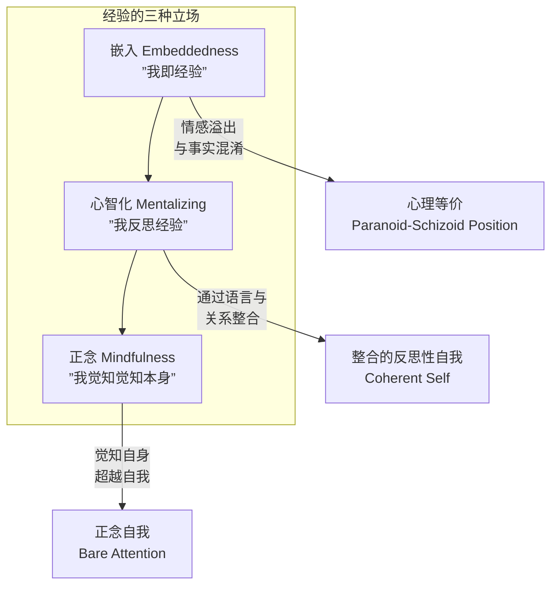
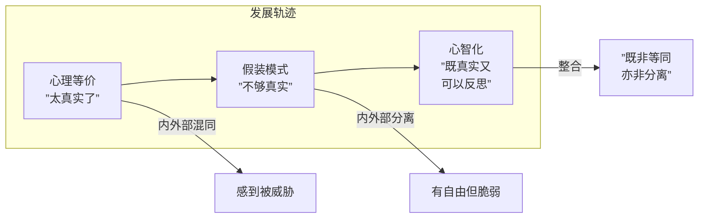
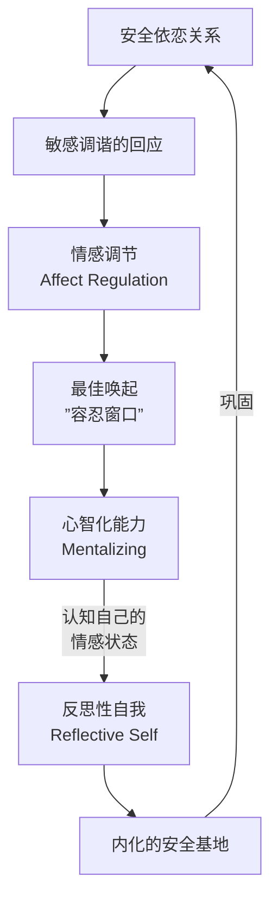
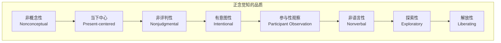
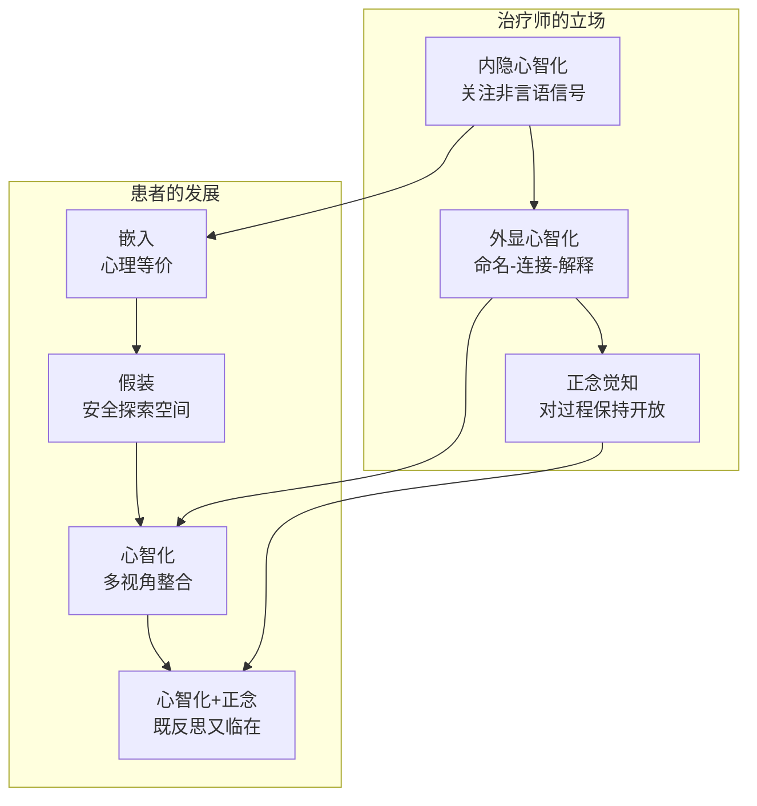

# 第09课：经验立场——嵌入、心智化与正念

## 学习目标

- 区分经验的三种立场：**嵌入（embeddedness）**、**心智化（mentalizing）** 和 **正念（mindfulness）**
- 理解「心理等价」（psychic equivalence）与「假装模式」（pretend mode）及其临床呈现
- 掌握「良性循环」（benign circle）：安全依恋、情感调节与心智化的相互促进
- 识别正念在心理治疗中的独特贡献及其与心智化的关系
- 通过 Rebecca 的案例，理解从嵌入到心智化的临床转化过程

## 核心概念

### 经验的三种立场

> [!NOTE] 引论
> 梅因（Main）和福纳吉（Fonagy）的研究表明：比早期经验本身更重要的，可能是我们**对经验的立场**。那些能够**不仅拥有经验，还能反思经验**的人，其安全感、灵活性和内在自由会大大提高。（Wallin, 2007）

Wallin 区分了经验的三种主要立场：

---

## 第一板块：嵌入——「我即经验」

**嵌入（embeddedness）** 是指我们完全沉浸于经验之中，仿佛在经验持续的这段时间里，**我们就是经验本身**。无论我们感受到什么、相信什么，都简单地将其当作事实取用。

### 心理等价（Psychic Equivalence）

嵌入的态度与福纳吉所说的 **心理等价模式（psychic equivalence）** 相似，在这种模式中，**内部世界与外部现实被简单地等同起来**。这种状态相当于梅兰妮·克莱因（Melanie Klein）所说的 **偏执-分裂位态（paranoid-schizoid position）**——分裂（splitting）占据主导，自我被感觉为经验的客体而非发起或解释的主体。

> [!WARNING] 困境
> 被禁锢在嵌入的立场中，我们既没有动机也没有心理空间去**有意识地思考自己的经验**——因为这里没有「主观性」的概念，而且**未受调节的感受会直接淹没思想**。

### 嵌入的临床呈现

- 感觉即事实，情感被当作通往真理的管道
- 只有一个视角，不存在多种解释的可能
- 无法调节情绪：恐惧时，环境被**毫无疑问地**视为真实危险
- 边界模糊：外部事件被感觉为「我是谁」的一部分
- 相当于"自动驾驶"模式——受制于过时的内部工作模型

大多数患者**有时**会处于嵌入状态，有些患者则**一直**被困其中。后者往往是边缘型人格组织、创伤后应激障碍或重度抑郁症患者。

---

## 第二板块：心智化——「我反思经验」

### 什么是心智化？

**心智化（mentalizing）** 或 **反思性功能（reflective functioning）** 是指根据潜在的心理状态（感受、信念、欲望、意图）来理解行为的能力。它与安全型依恋密切相关：

> Main（1991）强调**元认知（metacognition）** 能力，包括三个核心成分：
> - **表象/现实区分（appearance/reality distinction）**——事物可能不是看起来那样
> - **表征多样性（representational diversity）**——不同人对同一现实可能有不同视角
> - **表征变化（representational change）**——一个人对现实的看法在不同时间和情境中可能改变

> [!TIP] 心智化的三个维度（整合 Holmes, 1996）
> | 维度 | 含义 |
> |------|------|
> | **叙事能力（narrative competence）** | 随时间推移意识到自己的心理生活 |
> | **区分能力** | 区分自己的感受与他人的感受 |
> | **元认知能力** | 把握思维本身的表征性本质 |

### 心智化的两种形式

| 形态 | 过程 | 功能 |
|------|------|------|
| **内隐心智化（implicit mentalizing）** | 对当下经验中潜在心理状态的**直觉把握** | 允许治疗师在患者没有言语的当下触达、共振并调谐回应 |
| **外显心智化（explicit mentalizing）** | 运用**语言**帮助患者理解经验的背景 | 将经验置于过去、现在和未来的背景中，促进整合 |

### 心理等价与假装模式之间的桥梁

从嵌入到心智化的过程不是一跃而就的。儿童发展研究揭示了一个关键的中间站：**假装模式（pretend mode）**。

**假装模式**是儿童通过象征性游戏（symbolic play）发展的能力。在假装中，我们让一件事物代表另一件事，同时认识到**符号不等于被象征物**：

> [!EXAMPLE] 蝙蝠侠的隐喻
> Wallin 的四岁儿子在玩披肩当蝙蝠侠斗篷时，能回答「你是我的儿子还是蝙蝠侠？」——他带着微笑说：「我是蝙蝠侠。**有时候我穿上服装才是蝙蝠侠。**」他已经掌握了表象/现实区分。

但假装模式是脆弱的。福纳吉也讲了一个蝙蝠侠故事：他的四岁儿子激动地在异国要了一套蝙蝠侠服装，但当穿上服装、在镜中看到自己时，**吓得大哭**——因为太像真的了，假装崩塌为心理等价。

> [!WARNING] 治疗的启示
> 这种崩塌也会发生在治疗中。当治疗师的失调性回应与患者的脆弱性相遇时，治疗空间的「假装」性质——那个安全的中间地带——可能瞬间崩塌为充满恐惧的心理等价体验。

### 良性循环（The Benign Circle）

完全从嵌入到心智化的过程，需要将心理等价（非心智化的现实取向模式）与假装模式（心智化但非现实相连的模式）进行**整合**：

**整合的要点**：既不将心灵与世界等同（心理等价），也不将心灵与世界分离（假装），而是在两者之间——意识到**内部状态与外部现实之间存在关系**——并在此基础上**选择如何行动**。

---

## 第三板块：从嵌入到心智化的临床路径

### 镜像与标记（Mirroring and Marking）

在健康的亲子关系中，母亲对孩子感受的**调谐性镜像**是**有标记的（marked）**——她的感受表达显示了「这是你的感受，不是我的」的信号：

> [!EXAMPLE] Wallin 与女儿的互动
> 18个月大的女儿半夜哭喊要妈妈。作者感到紧张，但当他「感受到」女儿的愤怒逻辑时——「如果我足够愤怒和响亮，爸爸就会去叫妈妈来」——他做出了有标记的回应：
> 1. 夸张的「凶脸」和小小的咆哮（标记为假装）
> 2. 从咆哮转为长长的同情的「啊——」
> 3. 用语言表达：「当然你很生气，因为你那么想要妈妈，而爸爸不去叫」
> 4. 女儿回应：「爸爸，帮我感觉好起来。」

关键要点：
- 只有治疗师/父母先找到反思性立场、**调节自己的感受**，才能把握和镜像对方的感受
- 只有理解情感背后的**意图**，才能理解情感本身
- **心智化对方的情感经验**，正是让自己从被情感俘虏中解放的途径

### 语言与表征的形成

通过调谐性的镜像和对感受的言语标记，儿童逐渐发展出情感的**表征（representations）**。言语的使用——「难过」、「生气」等情绪词汇——使感受更容易被识别、分享、反思和调节。

> Fonagy 指出：**「语言是外显心智化的表征媒介的典范。」** ——正是语言让我们的情感变得可以交流和调节。

### 临床案例：Rebecca

Rebecca 是一位三十出头的医生，离婚后感到极大的不安全感。她聪明、活泼、迷人，却无法想象有人会对她感兴趣。

**背景**：
- 童年时，母亲是「不可预测地在场且常常暴怒」的人物，父亲被姐姐占据
- 她的不安全型依恋使她习惯于通过他人眼睛看自己，难以从内心体验世界
- 几年治疗后，她再婚了，但出现了新的问题：无法与丈夫保持亲密，尤其在身体亲密后习惯性退缩

**触发事件**：
在一次治疗结束时，治疗师称赞了她的外貌并轻轻碰了她的肩膀。Rebecca 被深深震撼，但在接下来的几周里**无法出说来**。

**非言语路径**：
- 沉默的开场、急促的「你知道吗？」、躲避的眼神
- 治疗师注意到了自己内心的焦虑和烦躁——这是对 Rebecca 未言语的情绪的共振
- 当治疗师试探性地说出「你可能已经在这里感到不安一段时间了」时，Rebecca 长出了一口气——她说担心治疗师会被她要说的话「击垮」

**从嵌入到心智化的转化**：
- 最初：嵌入在「我无法说出来」的恐惧中
- 裂缝：通过关注非言语信号（叹息、沉默、「你知道吗？」），治疗师创造了包容的空间
- 外显化：治疗师说出自己的观察（「你反复说'你知道吗'」）
- 整合：Rebecca 开始反思——「我必须让治疗保持隔间化。我必须让你保持一臂之遥。但当你的赞美和触碰发生，它变得太混乱地真实了。」
- 更深层：Rebecca 开始质疑自己的反应：「为什么这一切对我如此不可置信地威胁？」

**治疗的最终成果**：
Rebecca 开始识别自己内心的「小女孩」——那个愤怒、受伤、倔强的部分。她认识到：「她一直守护着我真正的感受——所有的伤害和愤怒，所有我不得假装没有的希望——因为家里没有人能和它们在一起。」

> [!TIP] 临床要点
> 从嵌入到心智化的转化，需要治疗师**先调节自己的情感**，然后**通过调谐性回应为患者提供一个「心理的镜子」**——让患者在其中看到自己作为一个有意图的、可以被理解的「意向性存在」。

---

## 第四板块：正念——「我觉知觉知本身」

### 什么是正念？

**正念（mindfulness）** 被定义为 **「赤裸的注意」（bare attention）**——即 **「清晰而专一的觉知，知晓当下每一感知时刻中发生在我们身上和我们内心的东西」**（Nyanaponika, 1972）。

Baer（2003）将其描述为 **「对持续涌现的内外刺激的非评判性观察」**。

### 正念的品质

### 正念与心智化的比较

| 维度 | 心智化 | 正念 |
|------|--------|------|
| 隐喻 | 望远镜——将「远距离」经验（过去、无意识）「拉近」 | 显微镜——近距离观察当下经验的细微纹理 |
| 焦点 | 经验的内容（有什么感受、信念） | 经验的**过程**（经验如何在当下展开） |
| 与自我的关系 | 建立**连贯的自我**（coherent self） | **超越自我**（transcendence of self） |
| 核心操作 | 反思、解释、叙事 | 观察、接纳、不评判 |

两者都服务于**从嵌入中解放**。正念和心智化一样，可以作为嵌入的解药——它们都促进了一种认识：**心理状态只是心理状态，是主观而非客观的，是流动而非固定的，是我们拥有的东西而非我们是谁。**

> [!QUESTION] 正念独特的贡献
> 正念提供了心智化所没有的东西：**正念自我觉知到反思性自我**，并且觉知到「反思经验」和「完全临在经验」是完全不同的两件事。
> 
> 通过反复成为**对觉知的觉知**，我们将主体性的**位置从对自我的表征转移到觉知本身**。（Engler, 2003）

### 正念的治疗作用

**研究证据**：
- 降低应激激素（糖皮质激素）、心率、耗氧量
- 增强免疫系统（Davidson et al., 2003）
- 增加左前额叶皮层（与积极情绪和杏仁核抑制相关）的激活
- 增强共情（Morgan & Morgan, 2005）
- 强化心智化（Allen & Fonagy, 2002）

**正念如何创造内化的安全基地**：
1. **欢迎和允许**——对困难体验持开放的温和态度
2. **识别**——找到内在的「寂静点」——平静接纳的地方
3. **与觉知认同**——不再是摇摆在积极或消极自我状态之间，而是与觉知本身认同
4. **注意能动性**——学会我们有能力将注意力重新导向当下

> [!TIP] 正念心理治疗的实践
> 心理治疗可以视为一种**两人正念练习**——治疗师帮助患者对当下经验保持正念而不评判。失去和重新获得正念注意力的过程，一次又一次，可以被视为心理治疗的冥想实践。

---

## 第五板块：心智化与正念的协同

心智化-正念关系的两个结论：

1. **正念强化心智化**——正念提供了关于心理状态「仅仅是表征性」（Main）本质的教育，而识别心理状态正是心智化的核心
2. **心智化促进正念**——心智化通过促进情感调节、共情和信任，使正念更易于获得

两者共同服务于：
- 内化的安全基地体验
- 整合（大脑的左右半球、皮层与边缘系统的沟通）
- 打开心理空间，增强患者自由感受、反思和爱的能力

---

## 临床意义总结

### 与第三部分各课的联系

- [[0008-nonverbal-and-unthought-known|非言语经验与「未思的已知」]]：非言语经验是触及患者嵌入经验的前沿通道，心智化为其提供整合框架
- [[0010-intersubjectivity-and-relational-perspective|主体间性与关系视角]]：心智化和正念的发展都发生在主体间性的关系背景中

## 自测问题

1. 经验的三种立场（嵌入、心智化、正念）的主要区别是什么？

- **嵌入（Embeddedness）**：我**就是**我的经验。感受即事实，只有一个视角。内部世界与外部现实被简单地等同（心理等价）。相当于自动驾驶模式。
- **心智化（Mentalizing）**：我可以**反思**我的经验——根据潜在心理状态（感受、信念、欲望）来理解行为。能保持多视角，区分表象与现实。
- **正念（Mindfulness）**：我**觉知到觉知本身**。对当下时刻的体验保持非概念性、当下中心、非评判性的开放觉知。从对表征的认同转移到对觉知本身的认同。

2. 什么是「良性循环」（benign circle）？它在治疗中如何运作？

良性循环是安全依恋、情感调节和心智化之间相互促进的过程：
- 安全依恋关系提供**调谐性回应** → 促进**情感调节**（将唤起维持于「容忍窗口」内）
- 情感调节的经验创造**安全基地感** → 使人能够**探索**（探索他人的心智）
- 当行为被理解为**意向性**（有感受和意图的）时 → 产生对经验的多层次和多视角的觉知
- 这培养了**心智化**能力 → 心智化又强化了调节情感和体验安全基地的能力

在治疗中，治疗师通过调谐性回应为患者提供这种良性循环的起点。（来源：Allen & Fonagy, 2002; Wallin, 2007）

3. 在 Rebecca 的案例中，从嵌入到心智化的转化是如何发生的？治疗师做了哪些关键工作？

转化过程分为几个关键步骤：
1. **关注非言语信号**：治疗师注意到 Rebecca 的沉默、急促的「你知道吗？」、叹息、躲避眼神——这些都是被嵌入经验无法言说的信号
2. **创造包容空间**：治疗师不急于解释，而是让 Rebecca 知道她的经验是优先的
3. **说出观察**：治疗师指出「你反复说'你知道吗'」——将隐含的经验**外显化**
4. **分享自身经验**：在被问及为何坚持讨论时，治疗师选择真实回应而非套话：「我没有破坏性冲动，我那时感到靠近你，可能只是笨拙地想传递我和你在」
5. **命名与连接**：帮助 Rebecca 将当下的感受（对治疗师触碰的反应）与历史关联（母亲不可预测的暴怒）

最终 Rebecca 能够内在地识别出那个「愤怒、受伤的小女孩」，并开始理解自己的反应模式。这不是某一次干预的结果，而是在关系中反复进行的良性循环的产物。

4. 正念如何促进内化的安全基地的形成？它的独特贡献是什么？

正念通过以下方式促进内化的安全基地：
1. **欢迎与允许**：对困难体验采取开放和温和的态度，创造一种自我慈悲
2. **识别寂静点**：在内在找到平静接纳的「寂静空间」
3. **与觉知认同**：不再与变化中的自我状态（积极或消极）认同，而是与觉知本身认同——这消除了保护的需求
4. **注意能动性**：确信自己有能力将注意力重新导向当下

正念的独特贡献在于：它**将主体性的位置从对自我的表征转移到觉知本身**。心智化帮助我们建立一个连贯的自我，而正念帮助我们**超越自我**——发现佛法心理学中所说的「无我」（no-self）——即「觉知经验的持续流动」。在心理治疗中，这有助于逐渐放弃对那些限制成长与理解的**固化自我形象**（如「我完全自足」或「我完全无助」）的情感投资。（来源：Engler, 2003; Germer et al., 2005）

## 参考文献

- Baer, R. A. (2003). Mindfulness training as a clinical intervention: A conceptual and empirical review. *Clinical Psychology: Science and Practice*, 10, 125-143.
- Engler, J. (2003). Being somebody and being nobody: A re-examination of the understanding of self in psychoanalysis and Buddhism. In J. Safran (Ed.), *Psychoanalysis and Buddhism* (pp. 35-79). Wisdom Publications.
- Fonagy, P., Gergely, G., Jurist, E., & Target, M. (2002). *Affect Regulation, Mentalization, and the Development of the Self*. Other Press.
- Germer, C. K., Siegel, R. D., & Fulton, P. R. (Eds.). (2005). *Mindfulness and Psychotherapy*. Guilford Press.
- Main, M. (1991). Metacognitive knowledge, metacognitive monitoring, and singular (coherent) vs. multiple (incoherent) models of attachment. In C. M. Parkes, J. Stevenson-Hinde, & P. Marris (Eds.), *Attachment Across the Life Cycle* (pp. 127-159). Routledge.
- Siegel, D. J. (1999). *The Developing Mind: How Relationships and the Brain Interact to Shape Who We Are*. Guilford Press.
- Stern, D. N. (2004). *The Present Moment in Psychotherapy and Everyday Life*. W. W. Norton.

