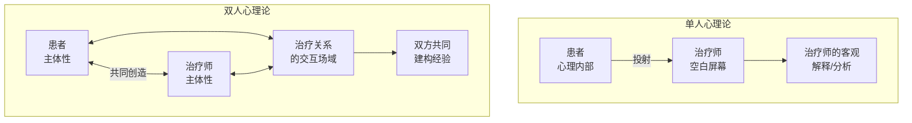
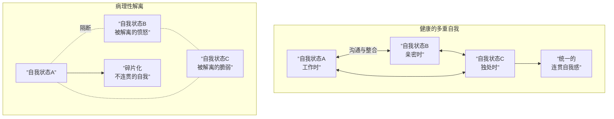
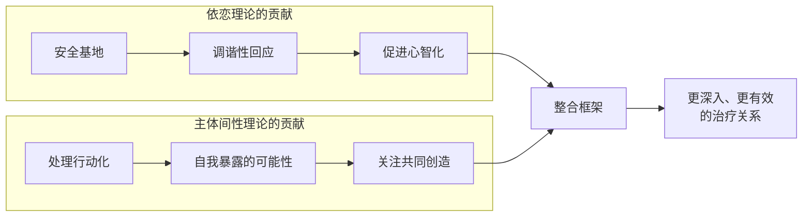

# 第10课：主体间性与关系视角

## 学习目标

- 理解「单人心理论」（one-person psychology）的局限性以及「双人心理论」（two-person psychology）的核心假设
- 掌握主体间性视角下对移情、反移情、阻抗和中立的重构
- 认识「行动化辩证法」与自我暴露在关系视角中的地位
- 理解整合与解离的多重自我模型
- 把握依恋理论与主体间性理论的互补与协同关系

## 核心概念

### 从单人心理论到双人心理论

> [!NOTE] 范式转换
> 在弗洛伊德经典模型中，治疗师被要求像外科医生一样搁置个人感情，作为「空白屏幕」（blank screen）或「映射镜」（reflecting mirror）。这是一种 **「单人心理论」（one-person psychology）**——假设患者的思想、感受和行为全部从内部生成，治疗注意力必须集中于患者内心的内部运作。
> 
> 而 **「主体间性理论」（intersubjectivity theory）** 和 **「关系理论」（relational theory）** 提出：患者的心理现实只能在双方共同创造的体验性现实的背景中才被有意义地解决。

**核心概念：相互影响（mutual reciprocal influence）**

Stephen Mitchell、Robert Stolorow 和 Jessica Benjamin 都强调：**治疗师和患者一样处于亲密关系中不可避免的相互影响状态**。治疗师将个人主体性「停在办公室门外」的努力不仅是注定失败的，而且是有反治疗效果的。

> [!WARNING] 治疗师「不可还原的主体性」
> Renik（1993）指出：治疗师的**不可还原的主体性（irreducible subjectivity）** 否定了治疗师作为基于无情客观性的真理仲裁者的权威。

---

## 第一板块：依恋与主体间性的汇合与互补

### 依恋理论的贡献

依恋理论为理解人的发展提供了一个以经验为基础的框架，但它**不是一个临床理论**（not a clinical theory），尽管它对心理治疗有着极其丰富的启示：

1. 因为发展从根本上是一个**关系过程**，心理治疗必须以关系术语来构想
2. 因为非言语互动的**发展核心性**，心理治疗需要找到通道，触及患者无法用语言表达的经验

### 主体间性理论的补充

主体间性理论填补了依恋理论大致未开发的临床维度。它提供：

| 依恋理论的发现 | 主体间性理论的补充 |
|------------|--------------|
| 安全基地是发展的前提 | 关注治疗关系的**共同创造本质** |
| 内部工作模型影响关系模式 | 关注**移情-反移情的相互构建** |
| 早期经验塑造自我 | 强调**多重自我（multiplicity of selves）** |
| 包容性关系促进整合 | 提供处理**解离（dissociation）** 的工具 |

---

## 第二板块：传统概念的关系学再思考

### 移情（Transference）再思考

**传统观点**：移情是将童年期对重要人物的感受、想法和行为**置换（displaced）** 到治疗师身上。治疗师是空白屏幕，移情是**扭曲（distortion）**——患者无法准确感知真实的人。

**关系视角下的移情**：

> [!ABSTRACT] 移情不是扭曲
> 在主体间性框架中，患者对治疗师的感知几乎**总是有合理的依据**。移情不是脱离治疗师实际人格的扭曲，而是**选择性注意和敏感性**的问题——在众多对治疗师行为的可信解释中，患者似乎**被迫只相信其中一个**。

关键洞见：
- 移情不仅是**被解释的**（construed），也是**被建构的**（constructed）——患者常常表现出**引发他人确认其特定解释**的行为
- 将患者关于治疗师态度或动机的看法归入「无根据的幻想」几乎总是**错误**的
- 治疗师同样有无意识——患者可能是识别治疗师未意识到的自我的**潜在有用合作者**

> [!TIP] 临床技术
> 最佳起点是**强调患者移情视角中合理（或准确）的部分**。尊重性的回应对于建立信任、促进包容性和解离经验的整合至关重要。

### 反移情（Countertransference）再思考

**传统观点**：反移情是偶尔发生的、由治疗师心理缺陷引起的障碍。

**关系视角**：反移情是**与患者关系的持续特征**，是另一条通往无意识的皇家大道。

| 传统 | 关系 |
|------|------|
| 必须消除 | 不可消除也**不应**消除 |
| 仅治疗师的弱点 | 治疗师全部主观经验（资源+阻力） |
| 被动的障碍 | 如被识别，是理解患者的**关键数据** |
| 隐藏/控制 | 在某些情形下可**有意暴露**给患者 |

> Renik 指出：**必然先行动化反移情，然后才能识别它。** 治疗师应允许自己被关系中的「当下人际暗流」所带动。波斯基（Boesky）写道：「如果分析师没有以他未曾预料的方式在情感上卷入，分析就无法通向成功的结论。」

### 阻抗（Resistance）再思考

**传统观点**：阻抗来自患者内心的抗拒——患者无意识地**反对**治疗的进展。

**关系视角**：阻抗几乎总是具有**人际意义**——它是患者和治疗师之间的**共谋**（collusion），以确保没有新事物或威胁性事物发生。

- 患者对经验的阻抗（通常是对难以承受的情感痛苦的恐惧）与对治疗师**无帮助回应**的恐惧有关
- 治疗师应考虑曾被教导视为阻抗的行为（迟到、肤浅、情感距离）**可能是对治疗师调谐不足的合理回应**
- Spezzano 和 Schafer 提出：应将阻抗理解为关于**患者难以忍受且难以言说的经验**的沟通

### 中立（Neutrality）再思考

**传统中立**：治疗师不偏向任何结果，不施加个人价值观或理论的影响。

**关系视角**：

> [!WARNING] 中立的幻象
> 主体间性理论认为：有意识地去「括起」主体性的努力，实际上**增加了**治疗师无意识地影响患者的可能性。中立不仅不可实现，而且**不可取**——因为治疗师的主体性是一种宝贵的治疗资源。

从主体间性视角看，中立是患者和治疗师**共同成就**——在有效处理某些人际阻抗时，双方共同获得的一种**开放感、广阔可能性感**，而非对当前关系现实的某种特定解释的执着（Gerson, 1996）。

---

## 第三板块：整合、解离与多重自我

### 多重自我模型

Harry Stack Sullivan（1964）曾指出：我们有多少种不同的关系，就有多少种不同的自我。当代关系临床学家在此基础上构建了**多重自我（multiplicity of selves）** 和**社会建构自我（socially constructed self）** 的概念。

> [!NOTE] 多重自我与依恋
> 鲍尔比和梅因所说的「多种（即互相矛盾的）内部工作模型」正是那些被早期依恋关系无法容纳的经验的产物——这些经验因此必须被**解离（dissociated）**。

对于关系治疗师来说，健康和病理的关键在于这些多重自我之间的**沟通渠道是否畅通**——患者能否从一个自我状态连接到另一个。

### 解离的双重含义

1. **防御性修改现实感**——「飘走」、「离开身体」、「感觉不存在」
2. **对与惯常自我不一致的经验的隔断**——「那不是**我**！」

在依恋研究中，安全个体**不存在**解离。而在关系视角中，所有人都会有「正常解离」——因为每个人都会经历情感上压倒性的经验。两种视角的临床含义是一致的：心理治疗的目的是**整合那些被解离且因此往往未发展的经验**。

---

## 第四板块：主体间性的临床创新

### 行动化的辩证法（The Dialectic of Enactments）

移情和反移情在关系框架中是**相互链接的**，不能孤立理解。治疗师的注意力最应指向这个复合体——**移情-反移情行动化**。

> [!ABSTRACT] 行动化无处不在
> Henry Smith 说很难想象在分析中有「免于行动化」的交换。波斯基也指出：「很难说**什么不是**行动化。」（Smith, 1993, p. 96）

**行动化的双重性质**：
- **被意识到**时：成为实现治疗任务的关键背景
- **自动运行、不被觉察**时：成为阻碍洞察和新经验的屏障

#### 临床案例：Rodney

Rodney 是一位回避型的中年男性患者。他表达了担忧：自己正在把身边所有人——客户、妻子——都变成**权威形象**。治疗师突然意识到他们的治疗也呈现出这同样的格局：

- 患者报告每周的成败 → 治疗师根据标准给予鼓励或指导
- 治疗师扮演了「向导或古鲁」的角色
- 当治疗师直言「这不也像我们之间正在进行的方式吗？」时，Rodney 回答：「所以你在告诉我这是需要避免的？」
- 治疗师回应：「也许这还是同样的模式？」
- 患者有了「啊哈！」体验

> [!TIP] 关键洞见
> 行动化有非凡的**黏附性**。治疗师和患者可以一起卡在其中。反复地，我们需要调动觉察和主动性，**走出行动化**，让意外的（unexpected）和有用的（useful）事情发生。

**Stern（1994）的重复关系与需要关系**：

- **重复关系（repeated relationship）**：患者将治疗师「拉入」早期熟悉的模式——通过投射性认同重演旧经验
- **需要关系（needed relationship）**：患者同时也在**隐性**地召唤回应那些未满足的发展性需求

### 自我暴露（Self-Disclosure）

如果说有一种技术革新最显著地划清了新旧范式的界限，那就是**开启有意自我暴露（deliberate self-disclosure）的可能性**。

| 传统禁忌 | 关系视角的辩护 |
|---------|-------------|
| 隐匿是客观性的基础 | 隐匿既不可能也不可取 |
| 暴露会破坏移情 | 暴露有助于患者认识和**拥有（own）** 之前必须否认的经验 |
| 暴露会削弱权威 | 暴露展示治疗师作为**情感可调节、可反思的人** |

**为什么自我暴露是有价值的？**

1. **促进整合**：福纳吉强调孩子需要另一个人的心智才能认识自己的心智——患者的「未思的已知」可以首先驻留在治疗师体内，直到暴露给患者
2. **解除行动化**：当行动化如紧身衣般困住治疗师时（思维、感觉或互动自由变窄），暴露自己的体验往往能**打破行动化的魔咒**
3. **激活僵死互动**：当感到与患者疏远——持续的厌倦、困倦或疏离——暴露体验可以让潜在的移情-反移情行动化显性化
4. **塑造心智化**：治疗师能反思自己的经验、质疑它而不是断然接受它、容纳多种解释——这种**心智化的示范**正是要培养患者的能力
5. **提供影响反馈**：让患者看到他们对治疗师的影响——从而可能看到对他人的影响

> [!WARNING] 自我暴露的风险
> - 暴露必须具有「**技巧性的试探性**」（skillful tentativeness），并愿意认真考虑患者的反应
> - 隐瞒困难的感受往往比透露造成破坏更大——隐藏时治疗师可能只能在**表演在场**而实际上已撤回
> - Maroda 和 Renik 都指出：不愿暴露的根源可能在于恐惧——暴露会摧毁治疗师在患者眼中「权威性善意的形象」

### 交互矩阵与分析第三方

**交互矩阵（Interactive Matrix）**（Jay Greenberg, 1995）：

治疗中特定事件的意义，由患者和治疗师**一致或冲突的主体性**共同创建。治疗应该如何进行——不取决于某本「标准技术手册」，而取决于**特定的互动矩阵**。和谐还是失调、融洽还是冲突，既有**人际层面**又有**内在层面**的问题。

**分析第三方（Analytic Third）**（Thomas Ogden, 1994）：

患者和治疗师的互动构成了一种**富含无意识意义的氛围**——它「渗入空气中」。这种主体间性共同创造的意义氛围就是「分析第三方」。

> [!EXAMPLE] 不可思议的共享经验
> Wallin 曾经治疗一位每周四次的年轻男性。这位患者是他周一晚上最后一位来访。第二天早上，他从一个关于「有三个阴茎的女人」的梦中醒来。当天下午见到患者时，患者说：「我昨晚做了一个最奇特的梦……一个有三个阴茎的女人。」
>
> 这个例子表明：强烈的主体间性关系可以生成既不属于患者也不属于治疗师单独拥有、而属于两者神秘混合体的**共享经验**。

---

## 第五板块：主体间性为依恋理论增添了什么

Charles Spezzano 曾带着调侃问：如果在行动化和自我暴露之间杀死时间，关系治疗师还做什么？这个问题触及了一个核心问题：

### 依恋理论的指导

依恋理论帮助治疗师**有意识地去提供**一些东西：
- 确定治疗师作为**潜在的新依恋对象**
- 识别并调谐于患者的特定依恋模式
- 通过提供一个**安全基地**并反映患者「意向性立场」的沟通来促进心智化

### 主体间性理论的补充

主体间性理论为依恋取向的治疗做出了**不可替代的贡献**：

1. **处理的非意图性部分**：治疗中大多数发生的事**不是**有意图的结果——是无预谋的、意外的、无意识动机的产物。主体间性理论提供了处理这种非意图参与的工具。
2. **触及未言语化经验**：通过行动化，治疗师能够以**语言无法中介的情感直接方式**体验和认识患者——这使治疗师能够接触患者的「未言语化和不可言语化」经验。
3. **扩大「敏感回应」的内涵**：除了促进共情和调谐，关系理论还强调那种**从沉浸于复杂的、困难的、有时痛苦的互动中**产生的深刻被理解和被抱持感——尽管这些互动是违背治疗师有意识的意图而发生的。
4. **处理冲突**：通过关注行动化，可以了解患者在接受治疗师所提供的「新依恋」时体验到的**冲突**。
5. **邀请患者作为「顾问」**：主体间性强调互惠性和对话——邀请患者占据治疗关系中的多种角色，包括治疗师经验的**解释者**。

> [!TIP] 最终视角
> 依恋理论与主体间性理论的联婚堪称「天作之合」。依恋理论深化了主体间性理论的发展性和诊断性维度；主体间性理论填补了依恋理论缺乏的临床维度。两者都认同：**亲密关系是塑造人的熔炉，也是治愈情感创伤的场所。**

---

## 临床意义总结

从主体间性和关系视角出发，治疗师应当：

1. **接受自己的主体性不可还原**——放弃客观性幻想，转而关系性地运用自己的情感体验
2. **关注共同创造的关系**——将移情视为患者对治疗师行为的**选择性关注**而非扭曲
3. **允许自己卷入行动化**——先被卷入才能识别，先识别后才能走出
4. **有选择地自我暴露**——当暴露有助于患者的整合时，不要被传统禁忌约束
5. **理解解离而非压抑**——患者被排除的经验更多是解离的，需要包容性关系的整合
6. **超越技术手册**——关注具体的「交互矩阵」，让每个治疗关系的独特性决定方法

### 与第三部分各课的联系

- [[0008-nonverbal-and-unthought-known|非言语经验与「未思的已知」]]：为主体间性工作提供了非言语经验的临床基础
- [[0009-stance-toward-experience|经验立场——嵌入、心智化与正念]]：主体间性关系为从嵌入走向心智化提供了关系背景
- [[0011-constructing-developmental-crucible|构建发展的熔炉]]：将在这基础上探索如何建立协作性的治疗关系

## 自测问题

1. 「单人心理论」与「双人心理论」的核心区别是什么？

**单人心理论**：患者的心理活动全部从内部产生，治疗师是「空白屏幕」或客观观察者。治疗师的主体性应当被削弱或隐藏，以保持客观性和中立。

**双人心理论**（关系/主体间性视角）：患者的心理现实只能在双方共同创造的体验性现实的背景中才有意义。治疗师的主体性**不可还原**——其个人特点、无意识反应和价值观**总是**在影响治疗关系。治疗师不是客观的真理仲裁者，而是共同参与者。治疗师的真实个人卷入、情感回应和不可避免的主体性不是干扰，而是成功治疗的**基本要素**。

2. 关系视角下如何重构「移情」概念？它与传统观点的根本差异在哪里？

| 维度 | 传统观点 | 关系视角 |
|------|---------|---------|
| 本质 | 童年经验的**置换**，是**扭曲** | 对治疗师行为的**选择性注意和敏感性** |
| 合理依据 | 无——是患者不准确感知治疗师 | 几乎总是**有合理依据** |
| 与治疗师的关系 | 脱离治疗师的实际人格 | 表达患者对关系**习惯性体验方式的漂移** |
| 影响因素 | 仅由历史决定 | 既是**被解释的**也是**被建构的**——患者往往做出引发他人确认其解释的行为 |
| 临床方法 | 解释其中的扭曲成分 | 先肯定其中**合理或准确**的成分，再探索背后的模式 |

3. 主体间性视角下，「中立」（neutrality）概念经历了怎样的重构？

**传统中立**：治疗师不对任何特定结果有投资，剔除自身个性、价值观或理论对患者的影响。

**关系视角**：
- 有意识地去「括起」主体性的努力**实际上增加了**无意识地影响患者的可能性
- 中立不仅是**不可实现的理想**，也是**不可取的**——因为治疗师的主体性是宝贵的治疗资源
- 患者的自主权在治疗师**愿意承认并研究自己的主观反应**时得到更好的保障
- Renik 提出：治疗师在「摊牌出牌」（play their cards face up）时往往最有帮助
- **真正的中立**是患者和治疗师**共同的成就**——在成功处理某些人际阻抗后获得的**开放感和广阔可能性感**，而非对当前关系现实的某种特定解释的执着（Gerson, 1996）

4. 什么是行动化的「辩证法」？治疗师如何利用它而不被它困住？

行动化的辩证法体现在两个方面：

**双重性质**：行动化既是潜在障碍也是关键资源。被意识到时，它为理解和转化提供背景；自动运行且不被觉察时，它妨碍洞察和新经验。这种矛盾需要治疗师在其中辩证地运作。

**双重策略**：
1. **走出行动化**：当行动化过于僵化、重复或难以逃脱时——也就是当治疗师的思维、感受或互动自由显著缩小——治疗师需要将自身经验用语言表达出来，以打破行动化的「魔咒」，恢复互动中的自由和清晰
2. **走进行动化**：当治疗关系僵死、无聊或疏离时——潜在行动化过于模糊——暴露经验可以激活僵死的互动，让隐性的移情-反移情行动化变得可见

关键点：治疗师先**被卷入**（才能识别和体验），然后**走出**（才能理解和转化）——卷入与走出的循环就是行动化辩证法。（来源：Renik, 1993; Wallin, 2007）

5. 依恋理论与主体间性理论如何互补？这种「联姻」对临床治疗意味着什么？

**依恋理论提供**：发展的框架——安全依恋如何塑造自我、促进心智化、建立内部工作模型。它帮助治疗师**有意识地**提供安全基地、调谐于患者的特定依恋模式、促进心智化。

**主体间性理论提供**：临床工具——处理非意图性参与、触及未言语化经验、理解患者对「新依恋」的冲突。它补充了依恋理论缺乏的临床维度。

**联姻的临床意义**：
- 依恋理论深化了主体间性理论的发展性和诊断性维度
- 主体间性理论为依恋取向治疗提供了具体的临床创新（行动化辩证法、自我暴露、交互矩阵、分析第三方）
- 两者都强调：**亲密关系既是塑造人的熔炉，也是治愈情感创伤的场所**
- 整合两者的治疗师既能**有意识地去提供**，也能**无意识地处理和利用**关系中发生的一切

（来源：Wallin, 2007, Chapter 10）

## 参考文献

- Aron, L. (1996). *A Meeting of Minds: Mutuality in Psychoanalysis*. The Analytic Press.
- Benjamin, J. (1990/1999). Recognition and destruction: An outline of intersubjectivity. In S. A. Mitchell & L. Aron (Eds.), *Relational Psychoanalysis: The Emergence of a Tradition* (pp. 181-210). The Analytic Press.
- Bromberg, P. M. (1998). *Standing in the Spaces: Essays on Clinical Process, Trauma, and Dissociation*. The Analytic Press.
- Greenberg, J. R. (1995). Psychoanalytic technique and the interactive matrix. *Psychoanalytic Quarterly*, 64, 1-22.
- Mitchell, S. A. (1993). *Hope and Dread in Psychoanalysis*. Basic Books.
- Ogden, T. H. (1994). *Subjects of Analysis*. Jason Aronson.
- Renik, O. (1993). Analytic interaction: Conceptualizing technique in light of the analyst's irreducible subjectivity. *Psychoanalytic Quarterly*, 62, 553-571.
- Stern, S. (1994). Needed relationships and repeated relationships: An integrated relational perspective. *Psychoanalytic Dialogues*, 4, 317-345.
- Stolorow, R. D., Brandschaft, B., & Atwood, G. E. (1987). *Psychoanalytic Treatment: An Intersubjective Approach*. The Analytic Press.

