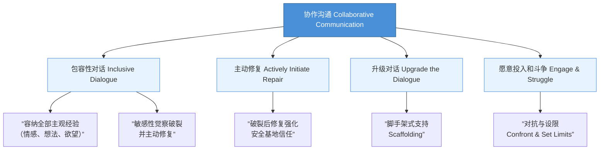
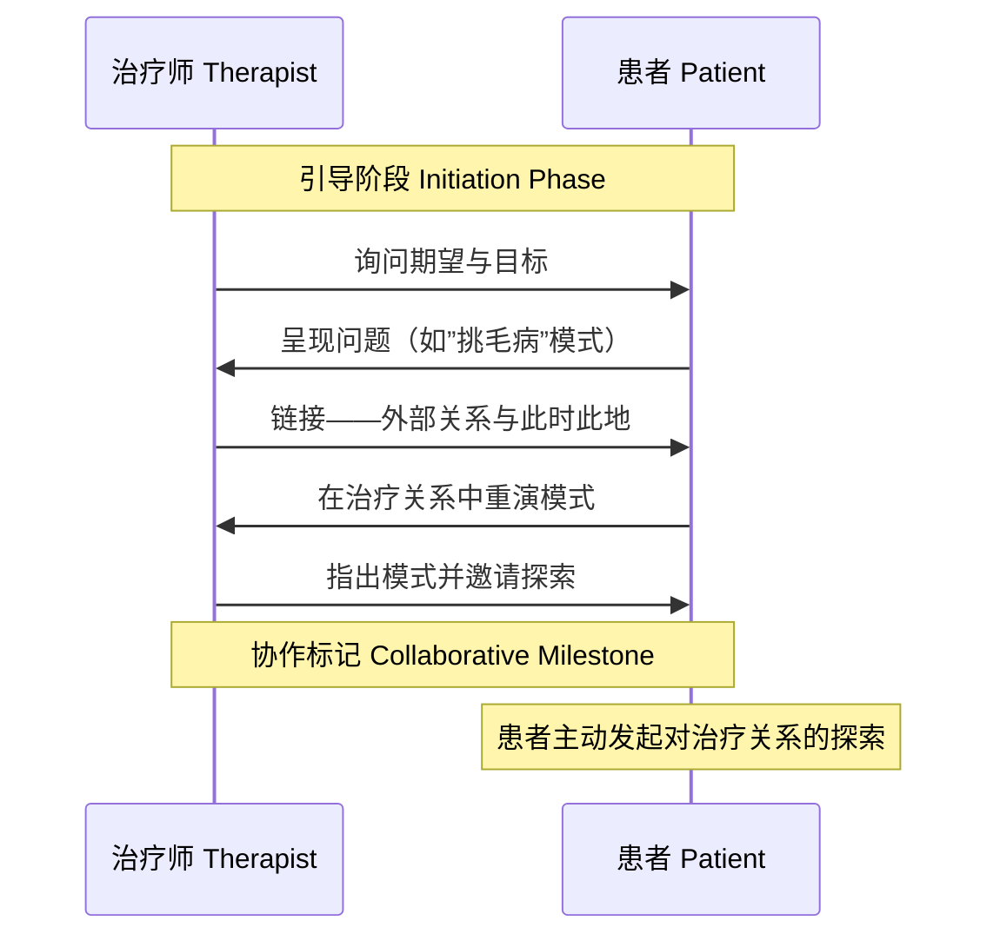
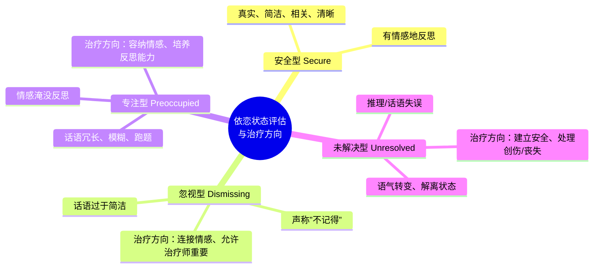

# 第11课：构建发展的熔炉

## 本课概述

如果说依恋理论的诊断框架是地图，那么治疗关系就是旅程本身。本课标志着第四部分"心理治疗中的依恋模式"的起点——我们将注意力从"理解"转向"干预"。Wallin 在本章中提出了一个核心问题：**我们如何为患者构建一个能够促进心理发展的"熔炉"（developmental crucible）？**

答案在于：治疗师必须提供一种"足够好的依恋关系"（good enough attachment relationship），这种关系能够修复患者早年被损毁的发展轨迹。

---

## 第一节：协作沟通的四大要素

Lyons-Ruth（1999）整合了多项研究传统，识别出与最佳发展结果相关的**亲子沟通四大特征**。这些特征在治疗关系中同样适用。

### 1.1 包容性对话（Make the Dialogue Inclusive）

患者需要治疗师帮助他们接触和表达**全部主观经验**，特别是情感经验。Bowlby（1988）写道："患者与治疗师之间的情感沟通扮演着关键角色。"

**关键问题**（可以明确提问，也可以在治疗师心中默问）：
- 你感受到了什么？（What do you feel?）
- 你想要什么？（What do you want?）
- 你认为我们之间此刻正在发生什么？（What do you believe is going on here now between the two of us?）

> [!NOTE] 从非语言到语言
> 患者往往无法回答这些问题，因为这些问题涉及他们最早的关系中被排除的经验。治疗师需要调谐到患者只能通过非语言传达的内容——面部表情、音调、姿势、手势。这需要"双焦点注意"（oscillating attention）：一边关注患者，一边关注自己的主观体验。Mitchell 称之为"自我反思性回应"（self-reflective responsiveness），Stolorow 称之为"共情内省式探究"（empathic introspective inquiry）。

**案例：未被言说的不配感**

一位女性患者在讲述关系困扰时，每句话结尾都用升调（像在提问），语速极快。治疗师分享了自己的观察：她似乎对自己说的内容感到不安，或怀疑治疗师是否在意。患者起初否认，但治疗师坚持，并讲了一个关于两个小女孩对话的故事——一个确信对方感兴趣，另一个则缺乏信心。患者回应："我想你说对了，因为在你说话时，我感到自己安顿下来了，而之前我只是在嗡嗡响。"后来双方都清楚：她感到自己的经验**不配被认真对待**（unentitled to her experience）。

### 1.2 主动修复（Actively Initiate Repair）

共情、有意的自我表露（deliberate self-disclosure）和/或解释（interpretation）都可以用来恢复治疗双方的平衡。无论使用何种干预，修复破裂通常涉及某种形式的**主体间协商**（intersubjective negotiation）。

> [!TIP] 修复的意义
> 通过协商解决冲突，增强了患者的信任——安全基地确实是安全的（secure base is secure），它能经受住失望、差异和抗议的压力。

**案例：Randall 与度假后的裂痕**

一位治疗多年的患者在治疗师休假两周后回来，以"客观"的方式谈论对亲密关系的恐惧。治疗师在回应中玩笑般说"那你试试心理治疗"，但患者并不觉得好笑。治疗师反思后意识到，自己休假前的心不在焉可能让患者感到被疏远和拒绝。在随后的对话中，治疗师坦承自己的状态："我知道那次会谈我脑子里有很多事……我可能很难在场，你可能感觉到了。"患者听后含泪说，他原本以为治疗师生气了。这种破裂-修复序列强化了患者对关系能容纳困难情感的信心。

### 1.3 升级对话（Upgrade the Dialogue）

Bromberg（1998）将心理治疗描述为"让患者**在保持不变的同时发生改变**"（change while staying the same）。Friedman（1988）则建议：治疗师需要按患者自己的方式接受他们，同时拒绝满足于这些方式。

**脚手架（Scaffolding）**：

家长通过"说给孩子听"来搭建语言能力的脚手架，治疗师也可以类似地搭建患者的情感、反思和主动性的脚手架。具体方式包括：
- **代为言说**：为患者表达她尚未言说或未被识别的情感
- **接受沉默**：为患者感受——或更深地感受——留出空间
- **先行一步**：通过先表达自己的感受，将对话引向更开放的情感层面

**对话中的对话（Conversation about the Conversation）**：

这是升级对话最有效的方式之一。通过元沟通（metacommunication）——关于沟通的沟通——来促进元认知（metacognition），即关于思考的思考（thinking about thought）。

> [!EXAMPLE] Randall 的"护城河"
> 在修复破裂后的下一次会谈中，治疗师和 Randall 回到了"犯罪现场"。Randall 意识到自己总是在"寻找被拒绝的证据"。他描述道："我周围有一条护城河……我不愿意接受你的回应，所以它从未真正进入我内心，总是让我感到惊讶。现在我在想，如果你或其他人真的在乎我、看起来安全，我反而不知道该怎么处理。"这种关于对话的对话，让患者能够同时站在两个位置——作为参与者体验内部，作为观察者审视外部。

### 1.4 愿意投入和斗争（Be Willing to Engage and Struggle）

患者有时需要的是**对抗**（confrontation）而非共情。治疗关系同时也是一个**真实的关系**（real relationship）。接受患者绝不意味着纵容其自我挫败的行为。

**案例：被激怒的治疗师**

一位长期有严重自杀倾向的患者，在治疗取得进展后告诉治疗师："我最终还是会自杀的。"治疗师勃然大怒："你可以说你想说的任何关于自杀的话，但我不允许你把自杀的威胁悬在我头上！你没有绝症，我绝不会签署同意为你提供临终关怀。"患者听后反而安定下来，似乎感激治疗师的愤怒。他说他需要治疗师"比他更大"。Wallin 指出，这虽不是推荐的技术，但说明**调谐性回应**（attuned responsiveness）可以有出乎意料的形式。

---

## 第二节：引导患者进入心理治疗

Lyons-Ruth（1999）指出，协作对话需要"了解另一个人的心智，并在构建和调节互动时将其考虑在内"。大多数患者需要**被引导进入心理治疗**（initiation into psychotherapy）——帮助他们理解心理治疗的规则和角色。

治疗师需要明确以下几点：
- 对患者的期望是什么（如说出脑海中浮现的内容）
- 患者可以对治疗师有什么期望
- 聚焦治疗关系的理由是什么（为什么关注"此时此地"的互动）

> [!WARNING] 安全型 vs 不安全型患者的需要
> 对治疗关系焦点的解释对大多数患者都有用，但对不安全依恋或未解决型（unresolved）患者是**必需的**，因为他们仅凭非语言线索往往难以准确解读他人的意图。

**案例：将外部问题与治疗关系连接**

一位女性患者在第一次会谈中说，她与男性的关系总以失败告终，因为她"从未遇到一个我挑不出毛病的男人"。果然，她开始对治疗师挑毛病——说他冷漠、缺乏同情心。治疗师回应："我记得你告诉我，你想和男性治疗师一起工作，以了解你与男性的关系。我打赌，如果我们看看现在我们之间正在发生什么，我们很可能能获得一些关于你与外界男性关系模式的洞见。因为你可能正要把与我之间的事情，重演成你与其他男人的关系模式。"这番话引起了她的注意。

---

## 第三节：分离、中断与终止

分离和丧失与依恋一样，是 Bowlby 理论的核心。在患者的新依恋关系中，涉及治疗师真实或恐惧的丧失（暂时或永久）的事件，通常会唤起与患者依恋历史直接相关的情感——或防御这些情感的防御。

### 3.1 分离反应的三个阶段（Bowlby, 1969/1982）

| 阶段 | 表现 | 对应的成人依恋模式 |
|------|------|---------------------|
| **抗议（Protest）** | 激烈哭泣、愤怒 | 专注型（Preoccupied） |
| **绝望（Despair）** | 安静、不活动、哀悼 | — |
| **疏离（Detachment）** | 表面社交、实则疏远 | 忽视型（Dismissing） |

### 3.2 不同依恋类型的分离反应

- **专注型（Preoccupied）**：对分离感到焦虑，害怕被抛弃——需要治疗师容纳他们的抗议（眼泪和愤怒），而不认可他们独自一人就无助的感觉
- **忽视型（Dismissing）**：表现得若无其事——需要治疗师帮助他们连接到被最小化的需求和被回避的情感
- **未解决型（Unresolved）**：在面对分离时可能变得混乱或迷失方向——需要治疗师帮助建立"暂时分离不等于永久遗弃"的区别

> [!QUESTION] 对治疗师的自我觉察
> Wallin 特别强调：治疗师需要觉察自己对分离的典型反应。一位忽视型的治疗师可能与忽视型患者共谋，将分离视为无足轻重——这等于是肯定依恋本身是无足轻重的。

### 3.3 终止（Termination）

- **专注型患者**：需要治疗师在适当时候结构化治疗的结束，并为患者的抗议留出空间
- **忽视型患者**：需要治疗师"挡住门"，为患者既害怕又渴望的情感体验留出空间
- **未解决型患者**：可能需要分阶段终止（staggered termination），允许他们"提前"离开，同时理解他们可以（且很可能会）在感到必要和可耐受时回来

---

## 第四节：评估患者的依恋状态

识别患者的主导依恋状态，可以让治疗师识别组织患者关系和个人各方面经验的主要原则。

### 4.1 AAI 与临床评估

AAI（成人依恋访谈）虽然没有被设计为临床工具，但它的结构非常类似于临床访谈。关键的发现是：**关于依恋的连贯且协作的话语反映了安全的工作模型，而被不连贯、不相关和/或推理失误所损害的话语反映了不安全或混乱的工作模型。**

### 4.2 Grice 四准则（Grice's Maxims）

在倾听时，需要关注患者话语的四个方面：

| 准则 | 定义 | 安全型 | 忽视型 | 专注型 |
|------|------|--------|--------|--------|
| **质量 Quality** | 真实性：是否有证据支持？ | 真实 | 缺乏支持或自相矛盾 | 通常是真实的 |
| **数量 Quantity** | 简洁而完整？ | 是 | 过于简洁（"不记得"） | 不简洁，细节漫溢 |
| **关系 Relation** | 是否与话题相关？ | 相关 | 回避依恋相关话题 | 发散、跑题、难以跟随 |
| **方式 Manner** | 是否清晰有序？ | 清晰 | 沉默或过于简短 | 模糊、混乱、不合逻辑 |

> [!NOTE] 未解决型（Unresolved）患者的话语特征
> Main（1995）称之为"推理或话语监控的失误"（lapses in the monitoring of reasoning or discourse）。当触及创伤或丧失主题时，他们的话语可能短暂偏离对空间、时间、因果关系的常规推理。他们可能用现在时讲述过去的事件，或者出现明显的语气转变，暗示进入了不同的解离状态。

---

## 第五节：治疗意义总结

---

## 自测问题

> [!QUESTION] 1. Lyons-Ruth 提出的"协作沟通"四大要素是什么？请逐一简述。
>
> 

> 
点击查看答案

>
> （1）**包容性对话**：容纳患者全部主观经验，特别是情感经验；（2）**主动修复**：敏感察觉关系破裂并主动修复；（3）**升级对话**：通过脚手架和元沟通不断提升对话水平；（4）**愿意投入和斗争**：在适当时对抗和设限。
> 

> [!QUESTION] 2. 根据 Bowlby 的描述，儿童经历长期分离后的三个反应阶段是什么？它们各自与哪种成人依恋模式相关？
>
> 

> 
点击查看答案

>
> 抗议（Protest）——专注型（Preoccupied）；绝望（Despair）；疏离（Detachment）——忽视型（Dismissing）。未解决型（Unresolved）患者在面对分离时可能出现混乱/迷失方向。
> 

> [!QUESTION] 3. 在 Grice 四准则框架下，忽视型患者的话语特征是什么？
>
> 

> 
点击查看答案

>
> 忽视型患者在**质量**上常缺乏证据支持或自相矛盾；在**数量**上过于简洁，常常声称"不记得"；在**关系**上回避依恋相关话题；在**方式**上可能陷入沉默。AAI 转录稿中最短的通常是忽视型。
> 

> [!QUESTION] 4. 什么是"未解决型"患者在话语中的"推理或话语监控的失误"？请举例。
>
> 

> 
点击查看答案

>
> 当触及创伤或丧失主题时，未解决型患者的话语短暂偏离对空间、时间、因果关系的常规推理。例如：一位患者担心她的母亲去世是因为她停止了思念母亲；另一位患者谈论早已去世的父亲时仿佛他仍然活着。也可能表现为语气的突然转变，暗示进入了不同的解离状态。
> 

---

## 总结

本章为第四部分奠定了基础。核心信息是：**治疗关系本身必须是发展的熔炉**——一个能够促进整合的依恋关系。这需要治疗师在四个方面做出有意的努力：包容、修复、升级和斗争。同时，治疗师需要像 AAI 研究者一样倾听——关注患者**如何**说而非**说了什么**——以识别患者的依恋状态，从而为接下来三章针对不同依恋模式的治疗策略做好准备。

---

> [!NOTE] 接下来
> [[0012-dismissing-patient|第12课：忽视型患者——从隔离到亲密]] 将探讨如何与**忽视型**患者工作，帮助他们从封闭的情感城堡中走出来。

---

*— 第11课完 —*