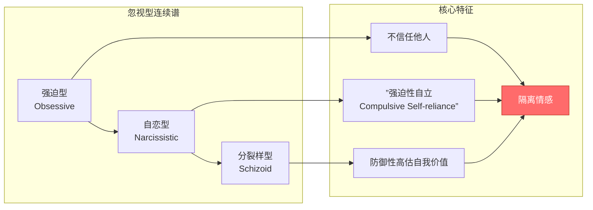
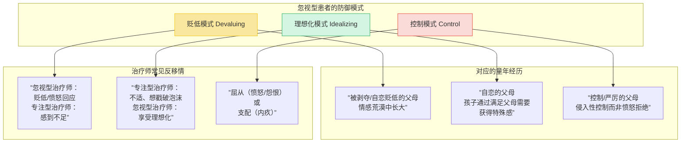
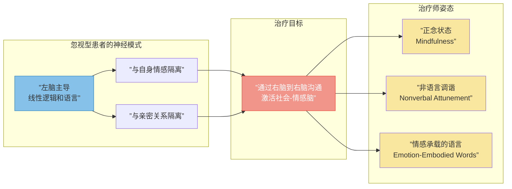

# 第12课：忽视型患者——从隔离到亲密

## 本课概述

忽视型（Dismissing）患者处于一个连续谱上：一端是强迫型（obsessive），另一端是自恋型（narcissistic）和分裂样型（schizoid）。他们共有的核心特征是：**极度难以信任他人到真正亲密的地步**——即使他们可能拥有稳定的长期关系。更重要的是，他们对自身同样不亲密。Bowlby 称之为"强迫性自立"（compulsive self-reliance）。

**核心悖论（Catch-22）**：患者在 AAI 中声称"一切都好"，但生理测量显示截然不同的故事——就像回避型婴儿在"陌生情境"中很少表现出痛苦，但心率和应激激素水平却升高了。他们不愿感受可能促使他们深层联结的情感，更不愿表达这些情感。然而，**只有通过建立情感连接，我们才能真正吸引他们进入能促成改变的关系**。

> [!TIP] 核心治疗原则：跟随情感（Follow the Affect）
> 治疗师必须敏锐地调谐（attune）到忽视型患者细微的情感线索——通常通过身体传达。眼睛、下巴、姿势、音调的变化都可能透露情感线索。更重要的是，要调谐到我们自身心理生理状态的微妙变化——因为患者不愿感受的东西，常常会无意间在我们身上唤起。

---

## 第一节：共情与对抗——打开封闭的情感系统

忽视型患者在情感上是**封闭系统**（closed system）。他们从小就知道：承认和表达困扰很可能带来挫败——甚至更糟。

### 1.1 共情的两面性

将共情化为语言，可以减轻患者对治疗师控制或拒绝的恐惧。但共情也可能适得其反：
- 患者可能从未从依恋对象那里体验过共情——因此我们的共情对他们像"天书"
- 他们可能将共情体验为"真实帮助"的劣质替代品（"你只有这些可提供吗？"）
- 因为共情会唤起亲近和依赖所带来的多重威胁，他们可能无意识地被驱使去拒绝它

### 1.2 对抗的力量——让治疗师存在（Let the Therapist Matter）

> [!WARNING] 超越解释
> Wallin 发现，对于忽视型患者，**比共情更进一步的东西是必要的，甚至比解释更进一步**。这个"更进一步"就是——有意的或自发的表达我们关于"处于患者沟通接收端是什么感觉"的主观体验。这就是他称之为"对抗"（confrontation）的东西。

原因有三：
1. **患者无法在自身中找到的情感，可能在他人（包括治疗师）那里被唤起**
2. 忽视型患者的防御策略损害了他们的共情能力，并阻断了他们对自身影响力的觉察
3. **让患者知道我们如何被他影响**（letting the patient know how he gets to us），这对于打破孤立至关重要

**案例：Gordon 与"防弹准备"**

一位强势、相当理智的高管患者，让治疗师感觉自己像是在"防弹准备"（bulletproofing）每一句话——仿佛在面对检控的威胁。治疗师向 "Gordon" 坦承了这一体验，Gordon 大为震惊。他感到治疗师说出了他自己的体验——一种某种程度上的"被威胁感"，他之前缺乏词汇来表达，但这驱使他"镀金"（goldplate）他的工作表现，以免被评判或攻击。他随后回忆起他的母亲（一位大屠杀幸存者）总是假设他在工作中感到焦虑。这种受威胁感是他母亲历史的遗产——创伤的代际传递（intergenerational transmission of trauma）的产物。

### 1.3 "抵抗"作为沟通

忽视型患者看似"抵抗"（resistant），但将他们表面的抵抗理解为**沟通**远比将其视为对立更有效。在犹豫不决、未投入或试图控制时，这些患者在传达他们对亲近和依赖的恐惧。承认需要帮助可能感觉像是邀请拒绝或耻辱性的不足承认。

即使**获得**帮助也可能是更大的风险。在一个重要关系中感到被帮助，意味着冒着打破一个主导意识模型的风险——在该模型中，自我被评价为强大和完整，而他人被贬低为弱小和依赖。浮出水面的很可能是被恐惧的无意识模型：自我是无助和脆弱的，而他人是拒绝、控制或惩罚性的。

---

## 第二节：三种治疗互动模式

Wallin 描述了三种突出的移情/反移情模式，每种都与略有不同的回避型依恋历史相关。

### 2.1 贬低模式（The Devaluing Pattern）

这些患者用传统诊断术语通常被称为"自恋型"。他们是"害怕融合且**破坏爱情**的人"（merger wary who sabotage love）。童年生活在情感荒漠中，他们借用了父母的防御——通过过高评价自己、过低评价他人来保护自己免受未满足需求和愤怒挫败的伤害。

**治疗策略**：
- 直接聚焦患者的敌对性很少有效
- 更有效的是**突出他们难以让他人重要化的困难**——例如，面对治疗中断，患者可能取消会谈或评论"省钱"
- 当患者进入办公室时闭眼、不打招呼递上支票、离开时背对治疗师——治疗师可以简单描述这些行为，并指出它们"可能有一些意义"

> [!NOTE] 案例分析
> 一位患者结束时总是背对治疗师离开。在探索中，他承认信任是个问题，并回忆起母亲经常一声不吭地退入卧室，"回家就像回到空房子"。他的行为是在重演与母亲的早期关系，同时保护自己免于太"个人化"。

### 2.2 理想化模式（The Idealizing Pattern）

理想化的患者与贬低型患者有相似的童年——自恋的父母。他们发现，通过满足父母的需要（让父母感觉特别），他们可以在情感沙漠中找到一片绿洲，同时避免依赖和愤怒的风险。

**关键洞见**：这种理想化是**过度的，因为它是过度决定的**（overdone because it is overdetermined）。无论我们有多棒，患者通常无意识地觉得他们对我们的钦佩是**义务性的**。他们"知道"为了维持关系，他们必须支撑我们摇摇欲坠的自恋平衡。

> [!WARNING] 治疗师的陷阱
> 患者把对治疗师"泥足"（feet of clay）的假设藏在心里，保持沉默。这使得他们的关系具有"仿佛"（as if）性质，并保持着距离。表面上看理想化患者比贬低型患者更投入，但实际上**他们可能同样是回避的**。

**案例：Andrew 的悲剧性教训**

一位经过长期看似成功的治疗后，Andrew 痛苦地意识到他与治疗师的关系重演了与自恋母亲的关系——他被迫理想化母亲，而母亲只在表面上可用。Andrew 愤怒地终止了治疗，指责治疗师对这个维度视而不见。后来治疗师承认："我是对的……我对这种重演视而不见，对他早期请求我更多情感卷入、更多自我表露和更多自我反思充耳不闻。"

### 2.3 控制模式（The Pattern of Control）

这些患者通常被称为"强迫型人格"（obsessive personalities）。他们常常在控制与害怕被控制的恐惧之间挣扎。童年期的父母是控制型的、严厉的、对孩子的痛苦和混乱缺乏耐受的。

**治疗挑战**：既不通过屈从来回避控制斗争，也不简单地试图支配。两种选择看起来都不具有治疗性——然而，如果我们意识到自己在重演中的角色，两者都可能打开有意义的探索。

**案例：Selena 与费用的斗争**

一位女企业家坚持"不能被人坑"。治疗师提供了一个降低的费用，但她觉得不够低。经过议价，治疗师同意了。后来发现患者有相当的财务资产未披露，治疗师建议重新讨论费用问题。患者感到被背叛和利用，中断了治疗。两年后她回来了，事业大获成功。治疗师一年多没提费用——直到他意识到自己的沉默也被恐惧驱动：害怕重新点燃患者的愤怒和怀疑。最终他鼓起勇气提高了费用。患者说："我在想你什么时候才会这样做。"她深受感动——治疗师如此考虑她的感受。但治疗师没有停留在这个光鲜的形象上，而是坦承了自己的恐惧。

> [!TIP] 从攻击到爱
> 随着治疗的推进，焦点往往从攻击转向爱——从被控制或控制的风险转向爱与被爱的风险。
>
> 对 Selena 来说，早期治疗中体验到的"危险"实际上反映了她对亲近、脆弱和依赖的恐惧——控制成为逃避亲密风险的避难所。

---

## 第三节：神经生物学视角——右脑到右脑沟通

右脑被描述为**社会-情感脑**（social-emotional brain）。依恋和养育行为、面部识别、以及解读自己和他人的非语言身体线索，都是右脑的功能。

Schore（2003）将这种治疗性沟通描述为**右脑到右脑沟通**（right-brain-to-right-brain communication），很大程度上是非语言和内隐的，但也可能通过承载和唤起情感的词语交流来实现。

> [!WARNING] 双侧均衡的重要性
> 一位**忽视型**的治疗师（仅从左脑运作）不太可能激活患者发展亲密和感受能力的未开发潜能。反过来，一位**专注型**的治疗师（难以利用左脑的语言和解释资源）可能无法用患者能回应的语言说话。我们需要根据自身的心理组织——要么安顿思维以用情感充注思想，要么让情感被有效地翻译为思想。

**正念的作用**：进入正念状态对于与忽视型患者的工作尤其有帮助，因为正念培养了治疗师那种我们希望鼓励在患者身上发展的——开放和整合的体验。忽视型患者（如一位患者对自己描述的那样）常常"悬停在生活之上"，从未真正降落在自己的身体里。

---

## 自测问题

> [!QUESTION] 1. 什么是忽视型患者的"核心悖论"（Catch-22）？
>
> 

> 
点击查看答案

>
> 患者对情感的防御性收缩和对亲近的回避，正是导致他们寻求治疗的情感和关系困难的原因。但患者对情感的障碍使其无法对治疗师产生情感，而治疗师对患者的相对"不重要"又强化了他们的情感障碍。打破这一循环需要治疗师在共情与对抗之间取得平衡。
> 

> [!QUESTION] 2. 为什么对于忽视型患者，治疗师的"对抗"（confrontation）可能是必要的？
>
> 

> 
点击查看答案

>
> 因为：（1）忽视型患者是封闭的情感系统，他们在自身中无法找到的情感可能在治疗师身上被唤起；（2）他们的防御策略损害了共情能力，阻断了对自身影响力的觉察；（3）让患者知道他们如何"影响"治疗师，有助于打破情感隔离，让治疗师"变得重要"（matter）。
> 

> [!QUESTION] 3. 忽视型患者的三种治疗互动模式是什么？每一种的治疗重点是什么？
>
> 

> 
点击查看答案

>
> （1）**贬低模式**：重点突出患者难以让他人重要化的困难，而非直接聚焦其敌对性；（2）**理想化模式**：聚焦患者对治疗师脆弱性的担忧，而非挑战理想化本身；（3）**控制模式**：既不屈从也不支配，而是识别权力斗争背后对亲近和依赖风险的逃避。
> 

> [!QUESTION] 4. Schore 所说的"右脑到右脑沟通"对于忽视型患者意味着什么？
>
> 

> 
点击查看答案

>
> 忽视型患者习惯于生活在左脑主导的世界中（线性逻辑和语言），而与社会-情感右脑隔离。治疗需要激活右脑的调谐、面部识别、非语言沟通功能。这要求治疗师不仅要通过语言工作，还要通过非语言渠道（语气、姿态、情感承载的词语）进行沟通。正念状态有助于治疗师培养这种开放的、整合的体验，并将其传递给患者。
> 

---

## 总结

与忽视型患者的工作是一场从隔离到亲密的旅程。治疗师需要：

1. **跟随情感**——调谐到患者微妙的非语言情感线索和自身的主观体验
2. **平衡共情与对抗**——让患者感受到被理解和被"碰到"（exist for the therapist）
3. **识别三种防御模式**——贬低、理想化、控制——并相应地调整干预策略
4. **利用右脑到右脑沟通**——通过非语言调谐和正念激活患者发展停滞的社会-情感脑

正如 Bowlby 所说，忽视型患者需要的是**帮助他们连接到那些被最小化的需求和被回避的情感**。当治疗师"存在"于关系中，并允许自己"被患者影响"时，打破强迫性自立的可能性就出现了。

---

> [!NOTE] 接下来
> [[0013-preoccupied-patient|第13课：专注型患者——为自己留出空间]] 将探讨与**专注型**患者的工作——他们的世界完全相反：情感泛滥，害怕距离而非亲近。

---

*— 第12课完 —*