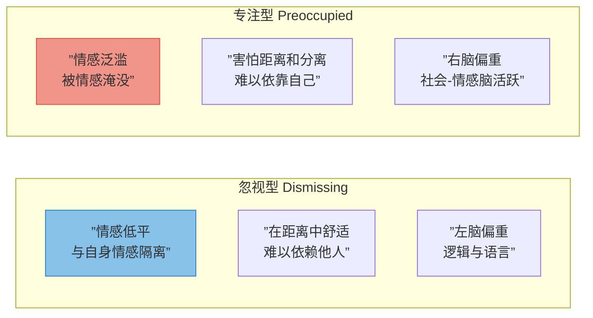
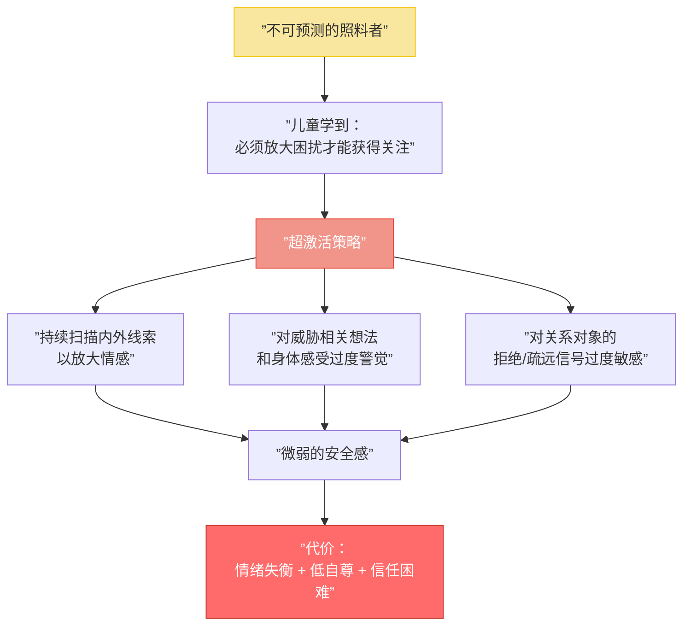
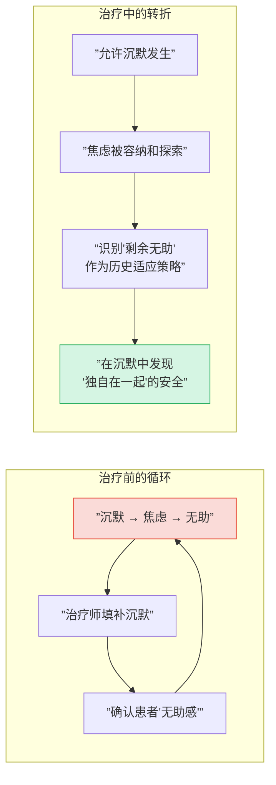
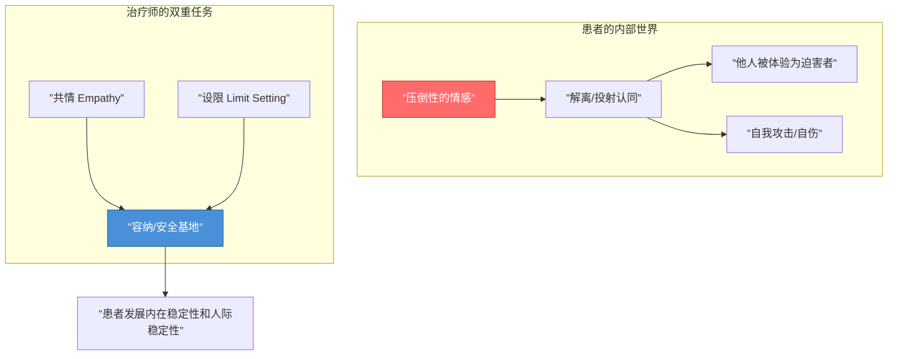

# 第13课：专注型患者——为自己留出空间

## 本课概述

如果说忽视型（Dismissing）患者活在情感的荒漠中，那么专注型（Preoccupied）患者则活在情感的洪水中。Diana Fosha（2003）精准地总结了两者的对比：

- **忽视型**：能**应对**（deal），但不能**感受**（feel）
- **专注型**：能**感受**（feel，且被情感冲垮/reel），但不能**应对**（deal）



专注型患者位于一个诊断连续谱上：一端是**癔症型**（hysteric，看起来被淹没、无助、合作、有时诱惑），另一端是**边缘型**（borderline，愤怒、苛求、混乱）。无论哪种变体，他们的生活根本上被**被抛弃的恐惧**（fear of abandonment）所塑造。Goldbart & Wallin（1996）将他们描述为"渴求融合的人"（merger hungry）："因为最大的威胁是分离、丧失和孤独，所以亲近被体验为最大的善——它是解决方案，从来不是问题。"

---

## 第一节：超激活策略及其代价

专注型患者在不可预测地响应的依恋对象照料下长大，学到了一个深刻的教训：**确保他人注意和支持的最佳方式，是让自己的困扰变得太显眼以至于无法忽视。**

这种"超激活策略"（hyperactivating strategy）运作方式如下：



> [!WARNING] 策略即身份
> 患者体验其压倒性的情感、不安全感和不信任——不是作为一种"策略"，而是作为**锚定自我感的现实面向**。因此，放弃超激活策略不仅是行为改变，更是身份重塑。

治疗师需要提供的是一种替代关系——患者可以**信赖治疗师的情感在场和接纳**（emotional availability and acceptance），而不必通过防御性地放大情感、无助或表面合作来获取这种回应质量。**我们的目标：让超激活策略变得日益不必要。**

---

## 第二节：无助模式（The Pattern of Helplessness）

### 2.1 癔症型变体

这些患者被标记为"癔症型"是因为他们看起来过度情绪化甚至戏剧化。他们更通过**无助**（helplessness）而非愤怒（anger）与他人连接。

**核心矛盾**：

表面上，他们可能拥有相当的心理资源，甚至在事业上颇有成就。但在治疗情境中，他们表现得好像既无力管理自己的困扰，也无力理解它。早期，他们可能给我们留下热情蓄意投入的"好患者"印象。

但第一印象可能有误导：

> [!TIP] 表象之下
> 这些患者**比自己相信的更有能力**管理情感、**比愿意承认的更了解自己的经验**、**比准备好承认的拥有更丰富的优势**。他们表面的治疗投入更多地表明了**取悦和顺从的欲望**（desire to comply and to please），而非真正的协作能力。

**治疗陷阱：不要将表象误认为现实**

如果我们把无助当回事，可能会以确认患者无助感的方式提供帮助。如果被魅惑或诱惑去扮演"伟大的治疗师"，我们可能看不见患者需要做"完美病人"的压力。

**案例：Elaine 与沉默**

一位非常能干的学者因惊恐发作寻求帮助。她告诉治疗师，对话中的沉默让她极度焦虑。治疗师最初的习惯是填补每一个沉默——直到几个月后才意识到这并没有帮到她。当他终于鼓起勇气让沉默发生时，Elaine 感到焦虑——但两人能够谈论它。

结果发现：沉默中焦虑是因为她**独自一人无法理解自己的经验**，而无助感让她害怕。治疗师提出一个关键问题："一个靠理解经验谋生的人，竟然感到无法理解自己的经验——这难道不是一个悖论吗？"

Elaine 随后意识到她已经培养了一种"剩余无助"（surplus helplessness），这是在童年时与不可预测的母亲连接的最佳策略。后来，随着治疗的深入，她开始在沉默中体验到一种更确定和持续的连接——一种"独自在一起"（alone together）的宝贵体验。



### 2.2 包容性（Inclusiveness）

专注型患者的情感性往往带有"他指向"（other-directed）的质量。当他们表达情感时，目的往往不完全是表达自我，而是获取他人的关注或帮助。

**治疗策略**：
- 不要在患者表达"公共"情感时过度关注，也不要在她不表达时冷淡——保持一致的可用性
- 运用"共情盖革计数器"（empathic Geiger counter）——调谐到患者只能间接表达的"私人"情感

> [!NOTE] 常见浮现次序
> Wallin 的临床经验表明，在专注型患者的治疗中，以下情感往往**依次浮现**并被整合：
> 1. **不信任和被抛弃的恐惧**
> 2. **愤怒与说"不"的能力**
> 3. **悲伤与真实的需要，以及说"是"的能力——并真心实意**

### 2.3 发展梯度（The Developmental Gradient）

Lyons-Ruth（1999）提出的关键原则之一：治疗师必须**期望患者比她认为自己能做的多一点**。

> [!TIP] 期望太少 vs 期望太多
> **期望太少**：患者感到希望被背叛
> **期望太多**：患者感到脆弱未被认可

在实践中，治疗师有时需要"为患者思考"——但不能太多。我们需要**示范心智化**（model mentalizing）——例如，通过表述我们在与患者相处时被唤起的感受，然后邀请患者一同参与理解过程，而非独自承担所有解释责任。

**关键干预示例**：

一位患者愤怒地讲述与丈夫的互动后，承认丈夫实际上并没有真正忽视或攻击她："只是我感觉那样。"当治疗师问"这是怎么发生的"——患者说"我真的不知道"，仿佛那就是探索的终点。治疗师回应："**仅仅因为你不知道，就意味着你不能思考它吗？**"患者随后确实开始富有成效地思考。

---

## 第三节：愤怒与混乱模式（The Pattern of Anger and Chaos）

边缘型患者中有很大一部分是专注型，且常属于**对创伤事件的恐惧性专注**（fearful preoccupation with traumatic events）这一特殊子分类——他们通常同时具有专注型和不安全/未解决型特征。

### 3.1 边缘型变体的体验

- 生活是一场持续危机
- 情感不仅是痛苦的，而且是压倒性的强度
- 内部感觉是混乱和空虚的，而非稳定的自我感
- 关系风暴般动荡，常以被背叛的感觉结束
- 在依赖的恐惧和无底的需要之间被撕裂

> [!WARNING] 救生员悖论
> Wallin 的经典描述："作为一名治疗师，与这样的患者在一起，我常常感觉自己像一个试图救一个溺水者的人——这个人像拒绝攻击一样拒绝帮助。"



### 3.2 共情（Empathy）

对边缘型专注患者的共情取决于三个方面：
1. **利用相关理论和研究的能力**
2. **对自身全部经验的开放性**
3. **以能够暂时中和双方共同产生的障碍——与共情和连接的障碍的方式互动**

> [!NOTE] Fonagy 的"异己自我"理论
> 这些患者不是内化了一个"真正的自我"（true self），而是内化了一个代表**虐待性依恋对象回应**的"异己自我"（alien self）。由于这个异己自我既是迫害性的又与真我相悖，它必须被**驱逐**（expelled）。被投射到他人身上后，他人被体验为迫害者。当没有他人可用时，患者被迫通过恶毒的自我攻击——包括自伤——来迫害自己。

**案例：警察的儿子**

一位父亲的父亲是酗酒的警察，可以不可预测地变得暴虐。患者的任务是分散父亲的注意力，防止暴力爆发——有时成功，有时成为目标。一次父亲拔出手枪指向他的头。

在一次特别协作的会谈后，患者迟到20分钟、没有支票本、说"他受够了治疗"。治疗师意识到自己正在被"邀请"扮演愤怒的迫害者。治疗师说："也许你是在试图挑起争吵，而不是感受亲近。我猜像上周那样我们能紧密合作的那次会谈，可能让你感到焦虑。"这个解释让治疗师能够"留在"关系中而不是被推开。

### 3.3 设限（Limit Setting）

当我们沟通一个界限时，我们不是要控制患者。我们是在告诉患者：**在特定情况下，我会做什么或不做什么**。

**公式**：如果你做 X，我会做 Y。
- 如果你扔东西，会谈结束
- 如果你允许我与你的医生和精神科医生沟通，我会继续会见你
- 如果你打电话谈论自杀感受，我能谈的唯—件事是我是否需要叫警察送你到医院

> [!WARNING] 设限是保护，而非惩罚
> 对某些患者来说，界限是必然必要的。它们保护双方免受过于强烈的负性反移情的影响——负性反移情会使共情变得不可能，并消除患者体验治疗关系作为安全基地的潜力。设限后的破裂也是修复的契机。

**案例：枪的故事**

一位父亲用枪威胁过他的患者告诉治疗师，他买了一把手枪放在床边抽屉里，拿着它让他感到安慰。治疗师感到极度焦虑和愤怒。他的回应："枪让我害怕。有枪的自杀患者更让我害怕。如果继续这样害怕下去，我无法帮助你。如果你希望我继续与你工作，你必须把枪带给我。"这个以**行动对话**（action dialogue）为特征的干预——反映了患者的内在主观世界是由物理行动而非语言组织的——最终帮助患者将自己作为"一个有思想和情感的存有，存在于一个善意的他人的心智中"（find himself in the mind of a benevolent other as a thinking and feeling being）。是的，他带来了枪。

---

## 第四节：情欲移情（The Erotic Transference）

情欲移情在专注型患者的治疗中并不罕见。Wallin 指出，其性质主要取决于**患者和治疗师的性别与依恋风格**。

```mermaid
graph LR
    subgraph 女性患者（尤其是专注型）
        A[”追求浪漫/性连接”] --> B[”防御距离”]
        B --> C[”也防御更深层的<br/>依恋议题”]
    end

    subgraph 男性患者（尤其是忽视型）
        D[”回避浪漫/性感受”] --> E[”防御深层投入”]
        D --> F[”或将性欲化作为<br/>贬低依恋对象的方式”]
    end

    style A fill:#f9e79f
    style D fill:#85c1e9
```

**治疗师的姿态**：
> [!TIP] 理想的回应
> 理想情况下，我们允许自己成为患者渴望的对象，既不过度鼓励也不感到被迫关闭它。患者对治疗师的渴望**永远无法被完全满足**——这本身就是受挫欲望模式的活现，可能正是患者早年依恋的特征。情欲移情可能是专注型患者发展更深度信任和爱之能力的重要中转站（waystation）。

---

## 第五节：正念与冥想（Mindfulness and Meditation）

边缘型专注患者的"超超激活策略"与高度反应性的自主神经系统有关。他们的**杏仁核**（amygdala）过度活跃，而**海马体**（hippocampus）的调节功能弱化。

> [!NOTE] 正念的作用
> 冥想似乎具有平静身体和加强心智化的双重潜力。Wallin 报告说，他会与一些患者在每次会谈开始时进行短暂的正念练习。经过5-10分钟的冥想，患者通常显得更平静，更有能力思考自己的体验而不被情感和生理反应压垮。

---

## 自测问题

> [!QUESTION] 1. 什么是专注型患者的"超激活策略"（hyperactivating strategy）？它的代价是什么？
>
> <details>
> <summary>点击查看答案</summary>
>
> 超激活策略是患者从不可预测的照料者那里学到的生存策略：通过放大自己的困扰来确保他人的注意和支持。运作方式包括持续扫描内外线索以放大情感、对威胁过度警觉，以及对关系对象的拒绝信号过度敏感。代价包括情绪失衡、低自尊和信任困难。该策略不仅仅是一种行为模式，更是患者自我感的锚点。
> </details>

> [!QUESTION] 2. 在与"无助型"专注患者工作时，治疗师的常见陷阱是什么？
>
> <details>
> <summary>点击查看答案</summary>
>
> （1）将患者的无助感当真，以确认其无助感的方式提供"帮助"；（2）被诱惑扮演"伟大的治疗师"，看不见患者做"完美病人"的需要。治疗师需要识别"剩余无助"（surplus helplessness）——这是患者与不可预测的照料者连接的历史适应策略，并期望患者比她认为自己能做的更多。
> </details>

> [!QUESTION] 3. Fonagy 对边缘型患者的"异己自我"（alien self）理论说明了什么？它如何帮助治疗师保持共情？
>
> <details>
> <summary>点击查看答案</summary>
>
> 边缘型患者内化了一个代表虐待性依恋对象回应的"异己自我"，它与真我相悖，因此必须被驱逐（投射）到他人身上。当他人不可得时，患者通过自我迫害来应对。理解这一理论帮助治疗师看到：患者看似"攻击"或"推开"治疗师的行为，实际上是驱逐内部迫害者的过程，而非对治疗师的真正敌意。这有助于治疗师保持共情并设定必要的界限。
> </details>

> [!QUESTION] 4. Wallin 描述的"行动对话"（action dialogue）是什么意思？请结合案例说明。
>
> <details>
> <summary>点击查看答案</summary>
>
> "行动对话"是指与边缘型专注患者的沟通主要通过行动而非语言进行——因为患者的内心世界是由物理行动而非词语定义的。例如，当患者告诉治疗师他有枪并感到安慰时，治疗师的回应不是语言解释而是实际行动："如果你希望我继续与你工作，你必须把枪带给我。"这反映了对患者交流方式的理解，通过匹配的行动而非语言来进行干预。
> </details>

---

## 总结

与专注型患者的工作，核心在于帮助他们**为自己留出心智空间**——在一个被他人殖民的内部世界里，为自己找到一个安全的位置。

| 维度 | 无助模式（癔症型） | 愤怒模式（边缘型） |
|------|-------------------|-------------------|
| 首要情感 | 无助、恐惧 | 愤怒、绝望 |
| 移情特征 | 理想化、取悦 | 贬低、攻击 |
| 治疗重点 | 识别"剩余无助"，培养自主性 | 共情+设限，容纳行为 |
| 核心技术 | 发展梯度（期望多一点点） | 行动对话、修复破裂 |
| 反移情陷阱 | 过度保护/拯救 | 惩罚/放弃 |

对于专注型患者，治疗关系提供了一个机会——让超激活策略变得不必要，让分裂的自我得到整合，让被抛弃的恐惧被另一种信念所取代：**即使保持独立和自主，亲近仍然是可能的。**

---

> [!NOTE] 接下来
> [[0014-unresolved-patient|第14课：未解决型患者——疗愈创伤与丧失]] 将探讨如何与因创伤和丧失而产生解离的**未解决型**患者工作。

---

*— 第13课完 —*