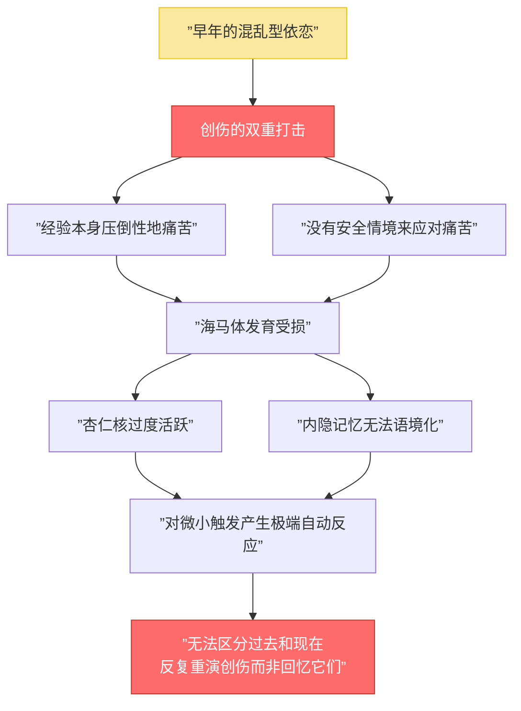
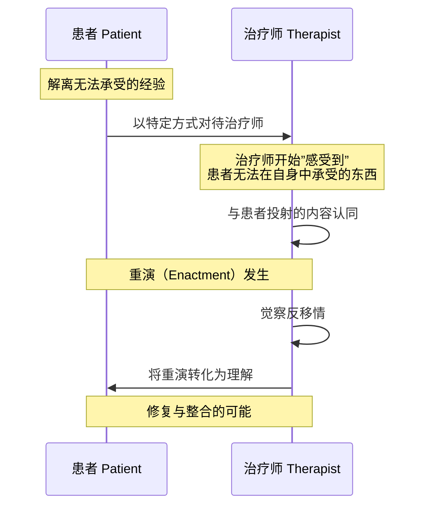
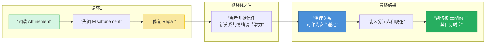
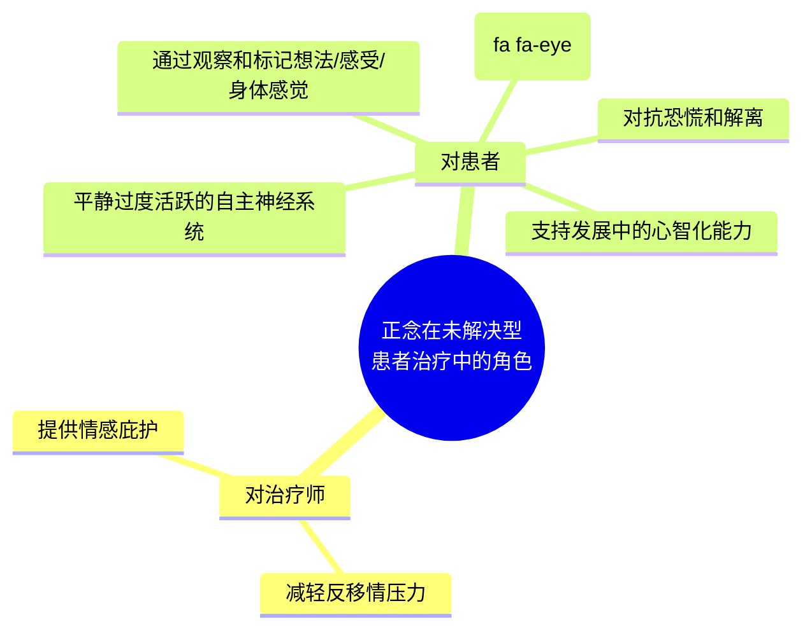
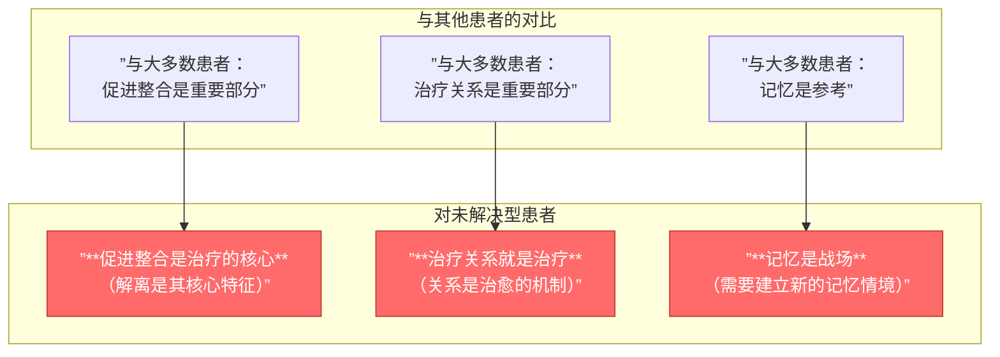

# 第14课：未解决型患者——疗愈创伤与丧失

## 本课概述

AAI 识别为"未解决型"（unresolved）的个体，不仅可能是专注型的，也可能是忽视型乃至安全型的。但临床现实是：**未解决状态与严重心理问题之间确实存在明确的关联**。边缘型障碍、解离障碍和创伤后应激障碍都与创伤未解决有关，正如儿童期的混乱型依恋（disorganized attachment）历史。

> [!WARNING] 定义的关键：创伤未解决，而非创伤本身
> 对人格产生持续的混乱性影响的，并非压倒性的痛苦经验本身，而是患者**对这些经验的缺乏解决**（lack of resolution）。当患者触及创伤或丧失经历时，出现"推理或话语监控的失误"（lapses in the monitoring of reasoning or discourse），才是识别的标志。

---

## 第一节：创伤的印记与治疗的悖论

### 1.1 创伤的心理生物学影响

安全环路通过"触发-复位"工作：杏仁核（amygdala）感知威胁并触发应激反应，海马体（hippocampus）和眶额皮层（orbitofrontal cortex）将事件置于情境中并帮助回复平衡。

**创伤破坏了这一系统**：

### 1.2 "大T创伤"与"小T创伤"

| 类型 | 定义 | 例子 |
|------|------|------|
| **大T创伤（Large-T Trauma）** | 明显、单一的重大事件 | 发现母亲被父亲谋杀 |
| **小T创伤（Small-T Trauma）** | 反复的恐惧、无助、羞耻与遗弃，且无修复 | 面对不可预测的愤怒父母、累积性关系创伤 |

> [!NOTE] 关系创伤（Relational Trauma）
> 也被称为"累积性创伤"（cumulative trauma, Kahn, 1963），即患者童年期在与照料者的关系中反复经历恐惧、无助和羞辱，且从未获得修复。这要求孩子——后来也预设了成人——诉诸原始防御机制：**解离**（dissociation）和**投射认同**（projective identification）。

### 1.3 安全悖论

**未被解决型患者难以容忍与共情调谐的治疗师之间的安全关系**——这是一个定义治疗的悖论。

> [!TIP] 悖论的解决
> 创造关系使患者**能够**感到安全既是治疗的终极目标，又是开始解决创伤的先决条件。两者相互交织：**安全感的渐进性成就在解决创伤，而创伤的渐进性解决在不使治疗关系被体验为旧威胁的重现方面起作用。**

---

## 第二节：解离、投射认同与反移情

### 2.1 解离（Dissociation）的双重含义

| 含义 | 描述 | 表现 |
|------|------|------|
| **解体（Disintegration）** | 将无法承受的心智状态分裂出去，与其他心智状态隔离 | 全有或全无的思维，好/坏、迫害者/受害者的二分 |
| **催眠样状态（Trance-like State）** | 防御性地改变意识状态 | 患者突然恍惚，语调如耳语，用现在时讲述过去 |

**解离是"无路可逃时的逃跑"**（Putnam, 1992, p. 173）。它使人对现实的感知变得模糊，缓冲了压倒性经验的冲击——但也使人无法有效面对这些经验。

> [!WARNING] 解离的身体代价
> 为了回避痛苦体验而"离开"的身体，在某种意义上**被丢失了**——它不再是这个人自己的身体。情感的身体标记（somatic markers）变得不可读。自伤（切割、灼烧、击打）成为一种让患者重新感到"具身"（embodied）的手段，对抗解离造成的令人不安的"脱离身体"的感觉。

### 2.2 投射认同（Projective Identification）

被解离的经验、记忆、表征和情感如果不能在患者内部被心理容纳，它们必须在**他人**中找到居所。这个他人——在治疗情境中——就是治疗师。

**运作方式**：

### 2.3 未解决型患者的四种工作模型

Liotti（1995, 1999）理论化，受过创伤并解离的患者可能有多达**四种对自我-他人关系的独特体验模型**：

| 模型 | 自我 | 他人 | 来源 |
|------|------|------|------|
| **受害者（Victim）** | 受伤、无助 | 加害者 | 直接经历虐待/忽视 |
| **迫害者（Persecutor）** | 愤怒、攻击 | 受害者 | 与加害者认同 |
| **拯救者（Rescuer）** | 照料、负责 | 被照料者 | 被亲职化（parentified）角色反转 |
| **无能者（Incompetent）** | 困惑、认知障碍 | — | 频繁使用解离的后果 |

> [!NOTE] 被激活的是**关系**
> 在移情-反移情互动中被活化的，是一对**关系模式**。例如，治疗师感到自己被驱使去"拯救"患者——很可能是患者曾经被恐惧驱使去"拯救"父母的感觉。而患者则表现得仿佛对自己的照料毫不在意——正如患者的父母曾经那样。

**案例：Casey——被"抱住"然后被"摔下"的婴儿**

Casey 两位父母都通过酗酒"慢慢自杀"。从小他被迫扮演父母的照料者。在治疗中，他出现自杀倾向。在无数次的危机、半夜电话、住院之后，治疗师陷入了愤怒、焦虑和困惑之中。

关键转折点：Casey 开始迟到，威胁要退出治疗。治疗师感到被"摔下"（dropped）。这个身体感觉催生了一个意象——**一个被抱住然后突然被摔下的婴儿**。治疗师说："我们的关系，我猜，一定感觉像是被邀请被抱住——然后不可避免地——被摔下。"

Casey 被震撼了。他长时间凝视治疗师，仿佛第一次真正"在场"。他承认他无法相信治疗师不会"摔下"他，但他也渴望能够相信。

治疗师随后设定了界限：如果迟到超过20分钟，他不会见他，但会收费。这不仅让治疗师感到不那么愤怒，也让 Casey 感到更有效地"被抱住"。

---

## 第三节：对安全的恐惧——治疗之路

### 3.1 建立安全感的渐进过程

> [!TIP] 共情与设限的治疗协同
> 对未解决型患者，共情调谐和设限**两者都必需，单独皆不足**。
> - **没有共情调谐**：患者感到既不被理解也不被感受到
> - **没有设限**：治疗师被压垮，无法提供共情

### 3.2 将创伤诉诸语言（Putting the Trauma into Words）

创伤记忆被"冻结"在时间中，历史性过去被体验为主观现在。当旧的创伤经验可以在不被再次创伤的情况下重新访问时——在"更强壮或更智慧的他者"的关系中相对安全地回忆——记忆本身就被改变了。Stern（2004）称之为**"新的记忆情境"**（new remembering context）。

**案例：Yassir 与幽闭恐惧**

一位巴勒斯坦建筑承包商在一次会谈中突然感到幽闭恐惧和害怕。当他探索这种感觉时，8岁的记忆涌入——1967年战争开始时，防空洞过度拥挤，他感到窒息，试图爬出去被拽回。

在治疗中，他说"这里太闷了"。治疗师打开了窗户。然后他们探索为什么他不能更早地请求他需要的东西——更多的空气。这引导到幸存者内疚的探究。一年前，他的母亲生下了一个严重残疾的婴儿，父亲心脏病发作。正是在那时，Yassir 决定他的需要必须退居他人需要之后。

> [!NOTE] 治疗的意义
> 命名与创伤相关的情感带来了掌控感。建立过去创伤与新情境之间的连接——这里，Yassir 的幽闭恐惧不仅与1947年有关，也与当前他无法表达需要的模式有关——这是治疗的持续工作。

---

## 第四节：心智化与正念

### 4.1 心智化（Mentalizing）

当我们根据患者行为背后的**感受、需要和信念**来回应时，我们开始点燃他们基于生物学的心智化能力。凭借这一能力，患者可以越来越多地从即时经验中退后一步——例如，从恐惧的体验中退后——去理解它。

这种反思赋予了对情感和行为的更大控制感，使之更有意义和可预测。这对于安全感通常极度缺乏的未解决型患者尤其重要。

### 4.2 正念（Mindfulness）

正念在未解决型患者的治疗中扮演双重角色：

> [!TIP] 正念与情绪风暴
> 聚焦身体（特别是呼吸）的正念关注，可以作为恐慌和解离的解药，以及逐渐降低患者自主神经过度反应性的手段。对于未解决型患者而言，情感、感觉和信念的牵引几乎不可抗拒，这种支持可以非常有用（Allen & Fonagy, 2002）。

---

## 自测问题

> [!QUESTION] 1. 什么是"大T创伤"和"小T创伤"的区别？为什么"小T创伤"对依恋的影响可能同样深远？
>
> 

> 
点击查看答案

>
> "大T创伤"是明显的重大事件（如发现母亲被谋杀），而"小T创伤"是儿童期反复的恐惧、无助、羞辱和遗弃经历——在与照料者的关系中发生且从未获得修复。后者也被称为"关系创伤"（relational trauma）或"累积性创伤"。它的影响可能同样深远，因为它迫使儿童诉诸解离和投射认同等原始防御机制，这些机制虽然保护了当时的生存，却预设了成年后的关系困难和心理症状。
> 

> [!QUESTION] 2. 什么是未解决型患者的"安全悖论"？治疗师如何解决这一悖论？
>
> 

> 
点击查看答案

>
> 患者难以容忍与共情调谐的治疗师之间的安全关系——因为他们过去的"安全"从未安全过。解决这一悖论的关键是认识到：创造安全关系和处理创伤是**交织的过程**。安全感的渐进性成就在解决创伤，而创伤的渐进性解决使患者不再将治疗关系体验为旧威胁的重现。这需要反复的调谐-失调-修复循环。
> 

> [!QUESTION] 3. 解离的双重含义是什么？解离如何影响身体？
>
> 

> 
点击查看答案

>
> （1）**解体**——将不可承受的心智状态分裂出去（Sullivan 的"坏我"和"非我"）；（2）**催眠样状态**——防御性地改变意识。解离对身体的代价：为了回避痛苦而离开的身体被"丢失"——身体标记变得不可读。情感被体验为物理问题而非心理状态。自伤（切割、灼烧）成为重新感到"具身"的手段。
> 

> [!QUESTION] 4. Liotti 描述的未解决型患者的四种工作模型是什么？在治疗中它们如何被激活？
>
> 

> 
点击查看答案

>
> （1）**受害者**——自我受伤，他人为加害者；（2）**迫害者**——自我愤怒，他人为受害者；（3）**拯救者**——自我负责照料，他人被照料；（4）**无能者**——自我困惑/认知障碍。在治疗中，被激活的不是单一模型，而是**关系对**（如治疗师感到被迫"拯救"，患者表现得仿佛不关心自己的照料）。治疗师的反移情反应往往是理解患者内部世界的关键线索。
> 

> [!QUESTION] 5. "将创伤诉诸语言"对未解决型患者意味着什么？为什么"新的记忆情境"是治疗性的？
>
> 

> 
点击查看答案

>
> 创伤记忆通常被"冻结"在时间中，过去被体验为主观现在。当旧的创伤经验在治疗关系中被重新访问——在相对安全的情境中以情感承载的方式被回忆和语意化——记忆本身被改变。Stern（2004）称之为"新的记忆情境"（new remembering context）。这使得创伤可以被限定于其自身时空，而不是无处不在的干扰性存在。命名与创伤相关的情感也赋予患者掌控感。
> 

---

## 总结

未解决型患者的治疗是**心理治疗的极限考验**——它与其他患者的工作相似，但规模被放大了：

**治疗的核心要素**：
1. **建立安全感**（尽管患者对此充满矛盾）——通过反复的调谐、失调、修复
2. **容纳解离和投射认同**——觉察反移情以减少破坏性重演
3. **设定必要界限**——保护双方，使共情成为可能
4. **将创伤诉诸语言**——在安全关系中创造"新的记忆情境"
5. **培养心智化和正念**——帮助患者从即时经验中退后一步

如 Bowlby 所言，依恋理论的核心是：**断裂的关系可以被修复**。对于未解决型患者，这不仅是治疗的目标——它是治愈的全部意义所在。

---

> [!NOTE] 完整的学习路径
> 本课是第四部分"心理治疗中的依恋模式"的核心课程之一。建议回看：
> - [[0011-constructing-developmental-crucible|第11课：构建发展的熔炉]]（治疗关系的四大要素）
> - [[0012-dismissing-patient|第12课：忽视型患者——从隔离到亲密]]
> - [[0013-preoccupied-patient|第13课：专注型患者——为自己留出空间]]

---

*— 第14课完 —*