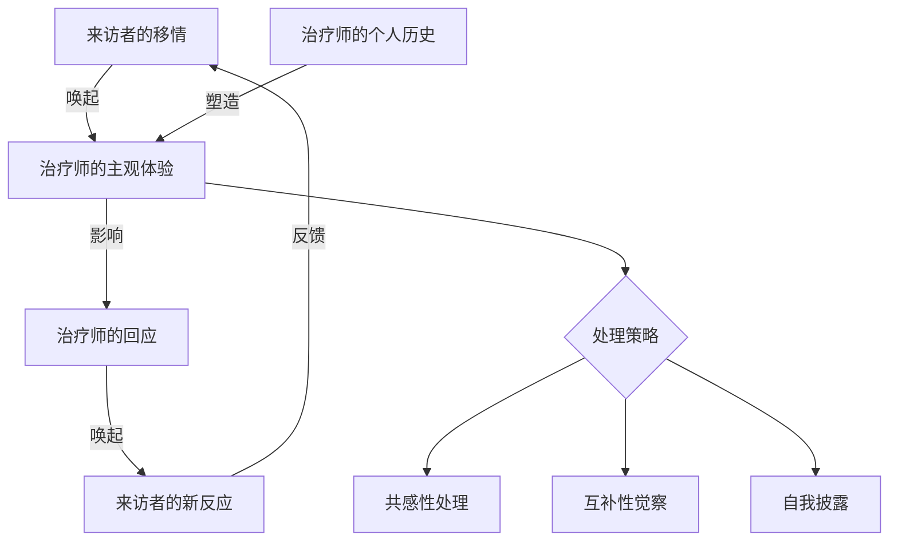
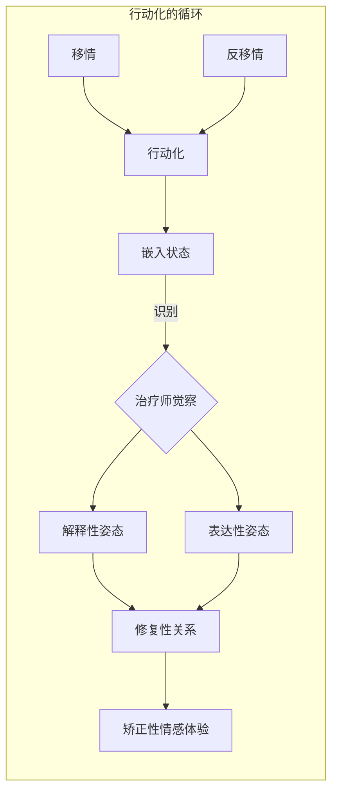

# 第15课：非言语领域 I：唤起与行动化

## 引言：超越语言的临床聚焦

在依恋导向的心理治疗（attachment-oriented psychotherapy）中，我们的核心目标是**与来访者共同创造一种比其早期塑造性关系更具调谐性（attuned）、包容性（inclusive）和合作性（collaborative）的全新关系**。要实现这一目标，治疗师必须将注意力高度集中于治疗对话中那些以情感为基础的非言语潜台词（nonverbal subtext）。

来访者前言语期的依恋经验、无法用语言描述的创伤、以及被解离（dissociated）的感受和需求——所有这些内容通常不是通过来访者的直接言语表达来触及的，而是通过三种途径显现：

- **唤起（evoked）** ——来访者在治疗师身上唤起某种感受
- **行动化（enacted）** ——来访者与治疗师共同演出某种关系模式
- **具身化（embodied）** ——来访者通过身体来表达

> [!TIP] 核心洞见
> 当我们倾听来访者的言语并用言语回应时，需要投入**至少同等（甚至更多）的注意力**去感知那些塑造言语交流的情感、关系和内脏/躯体层面的暗流。言语本身可能传达也可能不传达重要意义，但**隐晦的非言语潜台词几乎总是有意义的**。治疗关系中的"当下感受"——即双方之间真正在发生什么的感觉——可以引导我们触及来访者体验中最即时、最关键的内容。

## 非言语沟通与依恋风格

### 安全型与非安全型的差异

"敏感回应性（sensitive responsiveness）"——即依恋对象准确阅读婴儿非言语信号并以**恰如其分（contingent）**的方式非言语回应的能力——是培养安全型依恋的关键。同样，治疗师对来访者的共情调谐（empathic attunement）也很大程度上依赖于我们准确阅读来访者的非言语线索的能力，以及以让来访者感到其内在状态不仅被理解、也被治疗师**感受到**的方式做出回应的能力。

社会心理学研究表明，**安全型**个体在非言语沟通方面比非安全型更加娴熟：他们对他人非言语信息的解读更准确，自身发出的非言语信息也更清晰、更直接。

### 回避型与 preoccupied 型的不同模式

**回避型（dismissing/avoidant）**个体的非言语行为通常受到**限制**：
- 面部表情显露较少
- 目光接触和触摸他人较少
- 声音语调传达的积极情感较少
- 在依恋相关情境中较少寻求非言语支持，更多转向别处

** preoccupied 型（anxious/preoccupied）**个体的非言语行为则**高度表达**，尤其是在寻求支持或体验负面情绪时。

在解读非言语线索（尤其是信号传递需求或痛苦的线索）方面：
- **回避型**倾向于**忽略或视而不见**
- **焦虑型**倾向于**过度反应**，有时甚至对想象中的信号做出反应

### 投射与偏差的临床意义

研究还发现，这两种非安全类型的**偏差（bias）**和**投射（projection）**模式存在差异：

- **回避型成人**倾向于假设自己与他人不同且有区别（虚假独特性，false distinctiveness），并倾向于在他人身上看到自己**不想要的特质**（投射）
- **焦虑型成人**倾向于假设他人与自己相似（虚假共识，false consensus），并倾向于在他人身上看到自己**实际的特质**（投射）

这些模式不仅影响来访者的移情反应（transference reactions），也影响治疗师的反移情（countertransference）反应。

> [!EXAMPLE] 临床实例
> 一位**回避型来访者**习惯性地否认自己的攻击性，却经常在我的语气或表情中"读到"愤怒。从投射和虚假独特性的角度看：按照他对我的非言语线索的解读，**我是愤怒的，而他不是**。然而，他的移情在某些时候确实被我的反移情"确认"了——他对敌意的敏锐察觉，加上我倾向于假设我们共享某种脆弱性（虚假共识），共同在我身上唤起了一种过度保护、过度控制的反应。感到被束缚后，我逐渐对他产生了恼怒。

## 工作方向一：处理被唤起的内容（What Is Evoked）

### 治疗的双向唤起

治疗关系中唤起性影响是**双向流动**的。来访者在我们身上唤起的东西，与我们来访者身上唤起的东西同样重要。

> [!EXAMPLE] 临床实例：Neil
> 一位50出头离异律师Neil因焦虑问题寻求帮助。某次会谈以漫长的沉默开始。Neil说他在开车来的路上听到Jerry Garcia去世的广播，体验到了"一点点悲伤"——随后迅速补充说他的朋友们（Grateful Dead乐迷）"一定真正感受到了什么"。
>
> 我意识到自己的悲伤也被唤起——那天早上我也听到了Garcia去世的消息，但当时我的反应是压抑的。我选择向来访者坦白我的体验，说："我不太确定这与什么有关，但我发现刚才我也想起了开车来这里的路上听到Garcia去世的消息。我想我当时阻止自己去感受太多，因为我担心我得保持状态来工作。我想有时候我们每个人都会面临一个问题：我们允许自己感受多少。"说这些话时，我感到自己的眼睛湿润了。然后我看到Neil也流泪了——接着他陷入了强烈的焦虑。
>
> 这个互动展示了几个要点：
> 1. 唤起性工作可以使治疗关系更具包容性，并邀请来访者体验比他们自己预期更多的内容
> 2. 唤起性影响是双向的——Neil（防卫性地最小化的）悲伤唤起了我的悲伤，而我传达出去的悲伤又唤起了Neil的眼泪和随后的焦虑
> 3. 被唤起的内容必须在治疗师身上有"钩子（hook）"——也就是说，来访者成功唤起的内容必须在治疗师身上有可被唤起的内部基础

### 共感性与互补性反移情

在处理来访者唤起的体验时，区分两种反移情反应是有帮助的：

- **共感性认同（concordant identification）**：来访者在治疗师身上唤起了与来访者**自我体验**中被否认的方面的认同。例如，Neil部分未被感受的悲伤在我身上被强烈体验到。

- **互补性认同（complementary identification）**：来访者在治疗师身上唤起了与来访者内化的**他人体验**的认同。例如，后来与Neil的工作中，我发现自己对他的"缺乏投入"感到愤怒——这很可能是我认同了他心目中那个对他"过于独立"而生气母亲的形象。

### 治疗师的不可还原的主体性

然而，我们需要认识到：我们从来不可能是一块空白的屏幕（blank screen），让来访者将他们的移情形象投射其上。我们也从来不可能是一个纯粹干净的容器，纯粹地容纳来访者在我们身上唤起的东西。

> [!WARNING] 关键提醒
> 我们对来访者唤起性体验的感受，始终有一部分是我们自身不可还原的主体性（irreducible subjectivity）的产物。平衡两面至关重要：**完全不受影响**与**过度受影响**这两种极端通常都遗漏了什么。

## 工作方向二：处理行动化（What Is Enacted）

### 行动化的定义

正如在其他关系中一样，治疗关系中**言语不仅仅是言语——它们也是行为（acts）**："言语行为（speech acts）"。

**行动化（enactment）**这一术语将内在经验转化为行动。行动化必然涉及**行为**——包括言语行为和非言语行为。但即使行动化通过言语来演出，其本质意义也不在于说出的词语，而在于这些词语实际**做**了什么。来访者的言语可能将我们拉近或推开、让我们开放或关闭、让我们舒适或焦虑——我们的言语对来访者也有同样的影响。

在移情-反移情行动化（transference–countertransference enactment）中，被演出的是一种特定类型的关系——可能是亲子关系、浪漫关系、同盟关系或敌对关系。

### 行动化的本质：交叉与重叠

行动化是在来访者的无意识需求和脆弱性**与**治疗师的无意识需求和脆弱性的**交叉点**上出现的场景。在这个交叉点上，双方的 relational patterns 相遇并锁定。

如果我们将移情和反移情表示为两个圆圈，行动化就出现在这两个圆圈**部分重叠的共享空间**中。

只要行动化未被识别，治疗师和来访者都只是**嵌入（embedded）**在共同的体验中，自动地、无反思地相互行动。两者不仅在对人际相遇的现实做出反应，也在对自己尚未意识到的内部压力做出反应。

### 识别行动化的挑战

由于行动化在定义上就是**初始无意识的**，识别它们是一项相当大的挑战。

有助于识别行动化的策略：
1. **采用正念（mindfulness）的立场**——以接纳的态度觉察当下，将我们所做的事情视为需要观察和注意的"事实"，而非评判为好与坏、对与错
2. **识别自身行为的独特特征**——询问两个问题：这种行为在我自身心理中的根源是什么？我的行为如何影响来访者？
3. **寻求督导师或个人治疗的帮助**

> [!TIP] 根本问题
> 关键问题不是我们**是否**参与了行动化，而是**如何**参与的。我们真正在**做**什么？我们倾向于承担什么角色？我们选择关注什么？我们回避什么？什么样的无意识动机在驱动我们的这一面行动化？

### 行动化的两种经典模式：合谋与碰撞

非常广泛地说，行动化可以分为两种模式：**合谋（collusion）**和**碰撞（collision）**。

#### 合谋

治疗对子（therapeutic couple）通过**无意识的"协议"**来服务双方自我保护的需要。在这种协议中，一方的个体防御要么**镜像（mirror）**另一方的防御，要么**啮合（mesh）**另一方的防御。

- **镜像型合谋**：一位回避型治疗师和一位回避型来访者可能**合谋避开强烈的情感**，演出一种双方都熟悉的情感疏远的关系
- **啮合型合谋**：一位preoccupied治疗师可能容纳甚至表达其回避型来访者否认的所有情感——来访者被免除了直接处理情感和关系议题的焦虑，而治疗师则在重新演出一个熟悉（即使令人痛苦）的角色

#### 碰撞

当啮合型合谋破裂时，治疗对子可能发现自己处于**对立状态**。这**不一定是坏事**——只要双方合谋，深层的恐惧和需求就可能保持隐藏；当合谋破裂、碰撞发生时，一些困难但可能具有解放性的现实可能首次浮现。

### 行动化的双重维度：重复与修复

行动化中同时交织着两种力量：使我们保持不变的力量和促使我们改变的力量。

- **重复维度（repetitive dimension）**：来访者和治疗师都被无意识地抓住，需要重复习惯性的关系模式、感受模式和思维模式
- **修复维度（reparative dimension）**：大多数治疗师和来访者也无意识地（以及有意识地）被激励去体验比他们在早期关系中习得的更包容、更开阔的新存在方式

### 从行动化意识到临床干预

一旦治疗师识别了自己在行动化中的角色，在同一程度上就从行动化的控制中解放出来。接下来的关键问题是：**这个来访者需要什么？以及，根据我们自身的心理构成，我们能够提供什么？**

两种可能的干预姿态：

1. **解释性姿态（interpretive stance）**：将治疗师定位为"参与式观察者（participant observer）"，重点是充分容纳和内部处理我们对行动化的体验，以便理解它并将这种理解传达给来访者

2. **表达性姿态（expressive stance）**：将治疗师定位为"观察式参与者（observing participant）"，重点是以来访者情感上足够有说服力的表达性和真实性来回应，以"打破行动化的魔咒（break the spell）"

> [!EXAMPLE] 临床实例：Ellen的两种干预
> 治疗师在与创伤来访者Ellen的工作中，先后使用了两种不同的姿态：
>
> **解释性工作**：当识别出围绕治疗中断时自己和来访者惯常的模式后——Ellen因感到依赖而恐惧、羞耻、愤怒，然后威胁减少会谈频率；治疗师则以"拯救"的愿望回应——治疗师将这种理解传达给Ellen，使她能够从被模式困住的感觉中解脱出来。
>
> **表达性工作**：在另一节会谈中，治疗师以自我表露回应："我觉得此刻有一种非常强烈和不寻常的连接感和接纳感在我们之间……我想这就是爱。"这个即兴的表达创造了一个"相遇时刻（moment of meeting）"，帮助Ellen体验到了被深刻关怀的感受。

## 治疗师改变的能力

治疗师在某种程度上改变自己——有时需要"逆着性格的纹理（go against the characterological grain）"行事——的能力，是来访者改变得以发生的关键条件。

当不安全依恋的历史限制了灵活性时，个体的脆弱性与治疗师的脆弱性相交汇，导致治疗对子选项的**缩窄**——此时行动化发生。但治疗师若能找到资源以更自由的方式思考、感受和建立关系，就能为来访者**打开新的选项**。每一次我们足够改变自己、从自身的局限和行动化的双重控制中挣脱出来，我们都在证明**改变是可能的**，从而逐步促进来访者自身既渴望又恐惧的改变。

## 自我检测

> [!QUESTION] 自测题1
> 什么是治疗关系中的"合谋（collusion）"？它与"碰撞（collision）"有何不同？为什么碰撞有时在治疗中有益？

点击查看答案

**合谋**是治疗对子之间的一种无意识"协议"，服务于双方自我保护的需要。在这种协议中，双方的个体防御要么相互镜像（如回避型治疗师与回避型来访者共同避开强烈情感），要么相互啮合（如preoccupied治疗师为回避型来访者容纳所有情感）。

**碰撞**是合谋破裂后双方进入对立状态的结果。**碰撞在治疗中有益的原因**是：只要双方还在合谋，深层的恐惧和需求就会保持隐藏；当合谋破裂、碰撞发生，一些原本被掩盖的困难但可能具有解放性的现实才能首次浮现，为真正的治疗工作打开空间。

> [!QUESTION] 自测题2
> 什么是"共感性认同（concordant identification）"和"互补性认同（complementary identification）"？请各举一例。

点击查看答案

**共感性认同**：来访者在治疗师身上唤起了与来访者**自我体验**中被否认的方面的认同。例如Neil案例中，他部分未被感受的悲伤被治疗师强烈体验到——治疗师认同的是Neil自身否认的那个悲伤的部分。

**互补性认同**：来访者在治疗师身上唤起了与来访者**内化的他人体验**的认同。例如Neil案例后期，治疗师发现自己在愤怒于Neil的"缺乏投入"——这很可能是在认同Neil心目中那个对他"过于独立"而愤怒的母亲的形象。

> [!QUESTION] 自测题3
> 为什么说在行动化中，关键问题不是"是否"参与而是"如何"参与？

点击查看答案

因为行动化是**持续发生且不可避免的**。治疗师的主体性渗透进与来访者互动的每一个方面——从最深思熟虑的干预到最明显的基于反移情的失误。我们**一直在参与**行动化，正如来访者也在参与。因此，唯一有意义的问题是：我们以**何种方式**参与？我们扮演了什么角色？我们关注什么？回避什么？什么无意识动机在驱动我们的这一边？只有持续追问这些问题，我们才能逐步从行动化的控制中解放出来。

> [!QUESTION] 自测题4
> 在处理行动化时，"解释性姿态"和"表达性姿态"各有什么侧重点？

点击查看答案

**解释性姿态**（participant observer模式）：重点在于充分容纳和内部处理对行动化的体验，以理解行动化并将这种理解传达给来访者。治疗师的功能更接近"理解者"。

**表达性姿态**（observing participant模式）：重点在于以情感上足够有说服力的表达性和真实性回应来访者，以"打破行动化的魔咒"。治疗师的功能更接近"真实的互动者"。

理想情况下，治疗师应具备在这两种姿态之间灵活转换的能力，以松解重复性行动化的控制。

## 总结

本章探讨了非言语领域的第一条通道——**唤起与行动化**。核心要点包括：

1. **三条通道**：来访者无法言说的内容通过**唤起、行动化和具身化**三种方式显现
2. **双向影响**：治疗关系中的非言语影响是双向的——我们从来访者身上唤起的与来访者在我们身上唤起的同样重要
3. **两人心理学**：治疗关系是共同建构的（co-constructed），治疗师的不可还原的主体性始终在发挥作用
4. **行动化不可避免**：关键不是是否参与而是如何参与
5. **合谋与碰撞**：两种行动化模式，碰撞有时具有治疗潜力
6. **治疗师改变的能力**：治疗师自身的改变是来访者改变的前提条件

---

> [!NOTE] 延伸阅读
> 继续学习 [[0016-nonverbal-realm-2|第16课：非言语领域 II —— 身体工作]]，探索如何通过关注身体来触及和整合解离的体验。