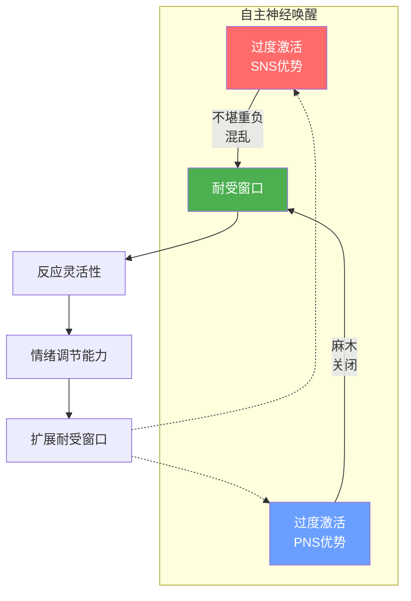
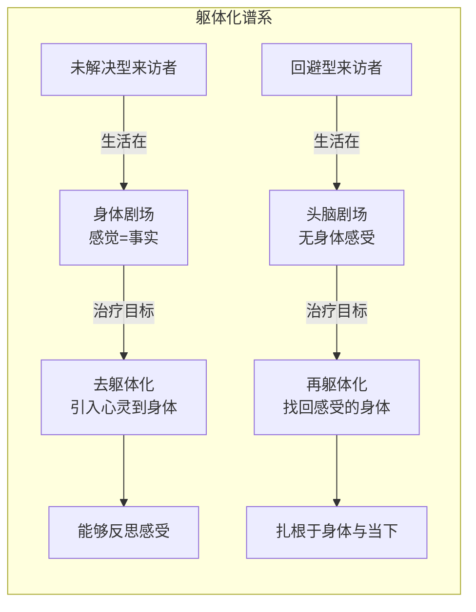

# 第16课：非言语领域 II：身体工作

## 引言：为何聚焦身体？

精神分析——"谈话疗法（talking cure）"——以及一般意义上的谈话治疗，在将身体纳入临床工作方面做得远远不够。事实上，我们都通过身体来体验自己和世界。情感是对身体的体验，而依恋关系正是我们学习情绪调节（emotion regulation）的语境。正是这种**互动的心理生物学调节（interactive psychobiological regulation）**逐步使我们能够将身体感觉"翻译"成可以被识别、命名、容纳和解释的感受。

> [!QUOTE] Wilma Bucci
> "……改变最终需要与曾经被解离的身体体验建立连接。"

最初，婴儿通过体验敏感回应的依恋对象的调谐性身体行为（触摸、注视、面部表情、语调）来学习身体感觉的情感意义。当来访者缺乏这种早期的调谐回应，尤其是还经历过创伤时，他们通常被一种受损的情绪调节能力所困扰。如果他们的情感仅被体验为躯体感觉或身体症状，那么**身体在记分，而非头脑在记分（the body keeps the score, not the mind）**。在那个世界里，感受就是事实——因为它们是物理现实。它们要么令人不堪重负，要么被否认，但**无法被反思**。

在依恋导向的治疗中关注身体具有三重价值：

1. **提升情绪调节能力**——将身体的语言翻译成感受的语言，促进来访者学习解码躯体感觉，使情感能够被用作对自身和他人的信号
2. **促进整合**——通过身体状态和身体表达，来访者揭示他们一直无法或不愿承认的感受和防御
3. **触及创伤记忆**——解离的记忆通常以躯体方式存储，不仅作为可被重新体验的感觉，也作为与原始创伤体验相关的身体姿势和初始动作

## 关注身体的治疗态度：正念

要使身体成为治疗资源，治疗师需要具备**正念（mindfulness）**——有意识地将注意力导向此时此地的体验，特别是内部体验，并以接纳和强烈好奇心的态度来观察，而非怀有改变或解释它的欲望。

> [!TIP] 核心操作
> 治疗师引导来访者："**停留在你正在感知的东西上，更好地了解它。**"——这种态度就是正念的实践。

培养来访者正念的方式是通过需要他们正念的干预——即在体验的同时有意识地觉察自己的体验。

然而，大多数治疗师更习惯于关注来访者的**情绪**而非**身体**。这种偏斜需要纠正。

### 阅读身体

观察双方身体时时刻刻的变化，是获取治疗对话非言语潜台词的一种方式。阅读身体有助于：

- 了解我们自身的感受和来访者的感受
- 衡量治疗对子之间的连接程度
- 评估来访者的心智状态——充分表达愤怒或悲伤是否有用，或这种宣泄可能令人不堪重负或造成再次创伤

## 情感词汇（Affective Lexicon）

达尔文以来，科学家们观察到每种"基本情绪（categorical/basic emotions）"都有一套标志性的躯体表达——这些普遍表达在内部注册为内脏感觉，在外部表现为肌肉/骨骼反应（面部和姿势上可见，音调、节奏上可闻）。

| 情绪 | 身体表达 |
|------|----------|
| **快乐（Happiness）** | 深呼吸；叹息；微笑；大笑；眼睛明亮 |
| **悲伤（Sadness）** | 喉咙哽咽感；嘴角下拉；眼睛湿润泛红；动作缓慢；哭泣 |
| **恐惧（Fear）** | 心跳加速；口干；呼吸急促浅表；颤抖；眼睛睁大、眉毛上抬；逃跑冲动 |
| **愤怒（Anger）** | 肌肉紧张（尤其下颌和肩膀）；嘴唇紧闭、下颌紧咬并前伸；眉毛下压、目光怒视；脖子泛红；喊叫；攻击冲动 |
| **厌恶（Disgust）** | 恶心；皱鼻、上唇上抬；转身避开 |
| **羞耻（Shame）** | 面部发热；脸红；目光回避；躲藏冲动 |

## 躯体反移情（Somatic Countertransference）

> [!QUOTE] Lewis Aron
> "我们从来访者那里接收到的许多内容，可能首先在身体中感受到，并且可能最直接地体现在我们的呼吸中。"

由于大脑的**镜像神经元系统（mirror neuron system）**确保我们实际上在自主神经系统层面与来访者共振，我们的躯体状态很可能代表了对来访者非言语沟通的无意识回应。我们无意识感知到的来访者的恐惧，可能从脑岛（insula）传递到杏仁核（amygdala），当我们镜像神经元因感知到的恐惧而"同情性"地激发时，我们自己也感到恐惧。

另一方面，反移情（包括躯体反移情）通常是**双行道**。我们需要谨慎，有时需要启动与来访者的对话，以区分共情性共鸣和将我们自身感受状态投射到来访者身上。

### 治疗师的身体在场

当治疗师舒适地"在身体中（in our body）"时，更容易在场并提供帮助。来访者不必读我们的思想，因为他们可以**读我们的身体**——以这种方式知道我们在场，他们就能专注于自己的体验。

相反，当治疗师感觉不在自己身体里——如不舒服、焦躁不安、昏昏欲睡，或过于"在头脑中"——这可能是自我反思坍塌、在场能力丧失和/或与来访者脱节的信号。

**对呼吸的觉知——尤其是深沉、相对缓慢的呼吸——是通往更具正念性体验的门户**，包括对身体的体验。它可以将我们带回此时此地。

## 耐受窗口（Window of Tolerance）

**耐受窗口**（Siegel, Rothschild, Ogden）是指临床干预在短期内有效的程度——即帮助保持来访者的自主神经唤醒在可忍受范围内；长期而言，有效干预可以**扩展耐受窗口**，使来访者能够体验更高水平的唤醒而不瓦解思考和感受的能力。

### 识别自主神经系统的过度激活

**交感神经系统（SNS）过度激活**的迹象：
- 呼吸和心率加快
- 瞳孔散大
- 面色苍白（血液从头部流向四肢）
- 来访者可能感到**不堪重负、混乱**

**副交感神经系统（PNS）过度激活**的迹象：
- 呼吸和心率显著减慢
- 瞳孔收缩
- 面色潮红
- 来访者常感到**麻木、关闭**

当观察到两个分支同时过度激活（如呼吸急促但面色潮红），说明来访者正在被创伤相关情感淹没——此时需要**踩刹车**。

### 调节策略

1. **聚焦身体感觉而非感受**——邀请来访者注意并描述躯体感觉
2. **向外引导注意力**——如果内部聚焦过于强烈，引向对治疗室感官印象的觉察
3. **呼吸练习**——减缓并调节呼吸

> [!TIP] 治疗目标
> 成功的干预将唤醒水平恢复到"耐受窗口"内，使来访者前额叶中介的"反应灵活性（response flexibility）"得以重新接合。

## 谈论身体

关于身体的交谈可以以多种方式结构化：

1. **观察并直接评论**——向来访者反馈我们所看到的身体信号
2. **邀请自我觉察**——请来访者注意并描述他们自己身体中的感觉
3. **建立连接**——发展来访者对身体感觉、感受和思想之间联系的觉知

> [!WARNING] 临床警示
> 关于身体的评论必须以**试探性和尊重性**的方式提出，要意识到其可能让来访者感到暴露、自我意识过强或被批评。

> [!EXAMPLE] 临床实例：Eliot的哈欠
> 来访者Eliot（回避型依恋风格）在一次会谈中接连打哈欠。治疗师说："你正在打哈欠。这可能是有意义的。我想知道你是否意识到你可能正在感受什么？或者也许是不想感受什么？"
>
> Eliot回答说自己"感到累"。当治疗师追问这种"累"的感觉可能是什么时，Eliot变得愤怒——他感到治疗师有"议程"，邀请他暴露脆弱性后又"操控"他。在修复裂痕的过程中，治疗师承认了来访者的脆弱性，并解释自己的意图是出于真正的好奇而非预设。
>
> 随后Eliot揭示了一个幻想：他在治疗室楼外看到一张海报，最初以为是一个心怀不满的来访者发布的"通缉令"，警告某位越界的治疗师——那张海报实际上只是寻找走失狗的信息。讨论这个幻想后，双方更深入地理解了Eliot的愤怒与警惕，以及它们与他需要从妻子那里退缩的关系。

## 调动身体（Mobilizing the Body）

依恋理论的一个基石是：当面临危险时，我们被生物性地预先编程为寻求"更强壮或更智慧的他者"的**安全港湾（safe haven）**。如果没有这种保护性人物，主动选项就缩小为战斗或逃跑；当这两种选项都无法实施时，剩下的只有**冻结或不动（freezing/immobility）**。

**无助的被动性——面对难以承受的威胁时主动应对的抑制——是许多创伤的根源。** 通过调动身体来解除这种抑制，对于逆转创伤的影响至关重要。

> [!EXAMPLE] 临床实例：Lowell
> 来访者Lowell（有童年被身体虐待史）感觉被老板"暴政"所困，决定辞职却无法"扣动扳机"。他在恐惧中陷入了恐慌和创伤性强度。
>
> 治疗师引导他关注此时此地的身体体验。Lowell描述了腹部紧张，随后感觉压力在上升、从腹部移动到肩膀再到手臂。治疗师鼓励他："如果你就让你的身体去做它想做的事呢？"
>
> Lowell双手握拳，腿蹬出去，反复大声喊道："滚他妈的蛋！"
>
> 随后他的抑郁感消失了。通过这个身体工作，治疗使Lowell的恐慌与他童年时对释放几乎自杀性的暴力冲动的恐惧之间的情感联系变得真实。

## 去躯体化（Desomatization）与未解决型来访者

### 什么是去躯体化？

**去躯体化（desomatization）**（Krystal, 1988）描述了对创伤来访者治疗过程的一个关键面向。这些来访者常规地将他们的情感体验为**躯体感觉或身体症状**，而非感受。未解决型来访者似乎生活在一个"**身体剧场（theater of the body）**"中，解离和"心身爆炸"似乎是唯一的出口。去躯体化——将**心灵（psyche）**重新引入这些来访者的躯体体验——提供了另一条出路。

### 创伤对大脑的影响

创伤压力和未调节的情感直接影响大脑：
- 抑制海马体（hippocampus）的激活甚至导致其萎缩
- 杏仁核对感知到的危险"毫发可触"地反应
- 结果：来访者的生活成为一个**持续的紧急状态**——身体被真实或想象的危机所消耗，头脑没有空间将躯体状态翻译成可共享、可反思和可调节的感受

### 去躯体化的过程

去躯体化过程首先依赖于治疗师使这些来访者能够**忍受而非解离**他们的身体感觉。在治疗关系的相对安全中，我们调节这种过度唤醒、帮助解除解离：

1. **鼓励观察身体的感受及其变化**
2. **将身体的语言翻译成言语**
3. **建立描述身体体验的词汇**

这种词汇有两个重要功能：
- **分化身体感觉与感受**——帮助从来访者"躯体等同（somatic equivalence）"的暴政中解放出来（例如，心跳加速**就是**恐惧——而非可能是一个条件化的自主反射）
- **关联感觉与感受**——帮助从来访者"解耦（decoupling）"的模式中解放出来（心跳加速仅仅是心脏症状，绝非恐惧的标志）

> [!EXAMPLE] 临床实例：Marla
> Marla有早期丧失、忽视和创伤史。在一次会谈中，她比平时更加脱离接触，几乎没有任何感受或思考。当治疗师询问她当前身体中的觉察时，她说上腹部（肋骨下方）有紧张感。
>
> 随着探索，她意识到胃部肌肉的紧张使她难以做完整的深呼吸。这种紧张感很熟悉，并与使她焦虑的社交互动相关——尤其是当她在互动中想要从对方那里得到什么时。
>
> 身体工作成为治疗师和来访者开始将她的解离情感直接带入治疗关系的途径——特别是那些会激发其早期经验教会她否认的依赖需求的情感。

## 再躯体化（Resomatization）与回避型来访者

如果去躯体化适合未解决型来访者，那么**再躯体化（resomatization）**——重新夺回会感受的身体——则适合**回避型来访者**。

回避型成人通常在讨论依恋历史时看起来平静——而生理测量却揭示着他们几乎（如果有的话）没有察觉到的情感痛苦。这些来访者常常同时与躯体感觉和感受**断连**——这是他们的"去活化（deactivating）"依恋策略的结果，该策略要求调低所有可能唤起对他人需要的觉察的内部信号。

> [!TIP] 临床方向
> 与回避型来访者工作的一部分必须针对**重新夺回会感受的身体**。当治疗师帮助回避型来访者更扎根于他们的身体时，也在帮助他们更**在场**——相对于他们的感受、相对于他人、相对于他们自己。

这些来访者通常生活"在头脑中"，身体是"做"而非"感受"的。他们通常缺乏早期被身体性地抱着和被养育的经验，因此与自己的身体没有这种养育性或接受性的关系。通过传达对身体体验的兴趣，治疗师传达出一个信息：**身体感受的东西确实重要**——既以其自身的方式重要，也作为来访者情感体验的信号重要。

## 总结

身体是通往潜意识、解离经验和情感调节的关键通道。本章要点：

1. **情感是身体的体验**——我们感受情感在身体中，这些感受塑造我们的现实
2. **情感词汇**——每种基本情绪都有标志性的躯体表达，可以作为"翻译"身体的工具
3. **躯体反移情**——治疗师的身体感受是理解来访者非言语沟通的重要渠道
4. **耐受窗口**——帮助来访者保持自主神经唤醒在可忍受范围内，并逐步扩展这一窗口
5. **去躯体化**——对未解决型来访者，将心灵重新引入躯体体验
6. **再躯体化**——对回避型来访者，重新夺回会感受的身体
7. **正念的呼吸**——对呼吸的觉知是通往更具正念性体验的门户

## 自我检测

> [!QUESTION] 自测题1
> 什么是"躯体等同（somatic equivalence）"？它对未解决型来访者的影响是什么？

点击查看答案

**躯体等同**是指未解决型（创伤）来访者将躯体反应**直接等同于**情绪反应的倾向。例如，心跳加速**=**恐惧，而非可能仅仅是一种条件化的自主神经反射，没有情感意义。这种模式的后果是：来访者生活在"身体剧场"中，感受就是事实（物理现实），无法被反思、无法被理解为可解释的符号。他们要么被这些感受压倒，要么否认它们，但无法在二者之间找到心智空间进行反思性加工。

> [!QUESTION] 自测题2
> "去躯体化"和"再躯体化"分别适用于什么类型的来访者？它们各自的治疗目标是什么？

点击查看答案

**去躯体化**适用于**未解决型（创伤）来访者**：他们常规地将情感体验为躯体感觉或身体症状，生活在"身体剧场"中。治疗目标是**将心灵（psyche）重新引入躯体体验**，帮助他们学会将躯体感觉翻译成可被识别、命名、容纳和解释的感受，建立情感词汇，分化和关联感觉与感受。

**再躯体化**适用于**回避型来访者**：他们与身体感觉和感受断连，生活"在头脑中"、身体只是"做"的工具。治疗目标是**帮助重新夺回会感受的身体**，通过关注和重视身体体验，帮助他们更扎根于身体、更在场，与感受和他人建立连接。

> [!QUESTION] 自测题3
> 什么是"耐受窗口（window of tolerance）"？当来访者超出耐受窗口时，治疗师可以采取哪些干预策略？

点击查看答案

**耐受窗口**是来访者的自主神经唤醒保持在可忍受范围内的区间。在此范围内，前额叶中介的"反应灵活性"可以运作。超出窗口时，来访者要么进入SNS过度激活（不堪重负、混乱），要么进入PNS过度激活（麻木、关闭）。

三种调节策略：
1. **聚焦身体感觉而非感受**——邀请来访者描述躯体感觉（如紧张、温度、压力），这种更具体的关注通常比感受本身更容易耐受
2. **向外引导注意力**——如果内部聚焦太强烈，引导到来访者对治疗室中感官细节的觉察（颜色、声音、触感）
3. **呼吸练习**——通过减缓并调节呼吸来帮助重新接地

> [!QUESTION] 自测题4
> 镜像神经元系统如何影响治疗师的躯体反移情？

点击查看答案

大脑的镜像神经元系统确保治疗师在自主神经层面与来访者**共振**。例如，当治疗师无意识地感知到来访者的恐惧时，该信息从脑岛传递到杏仁核，治疗师自身也被激发感到恐惧——因为镜像神经元在"同情性地"回应所感知到的恐惧。因此，治疗师的身体/情绪体验可以**模拟**来访者的身体/情绪体验。

然而，反移情（包括躯体反移情）是双行道——治疗师自身的感受状态也可能被投射到来访者身上。因此治疗师需要审慎地区分共情性共鸣与自我投射。

---

> [!NOTE] 延伸阅读
> 本课是[[0015-nonverbal-realm-1|第15课：非言语领域 I]]的延续。继续学习[[0017-mentalizing-and-mindfulness|第17课：心智化与正念的双螺旋]]，探索心智化与正念如何作为互补路径促进心理解放。