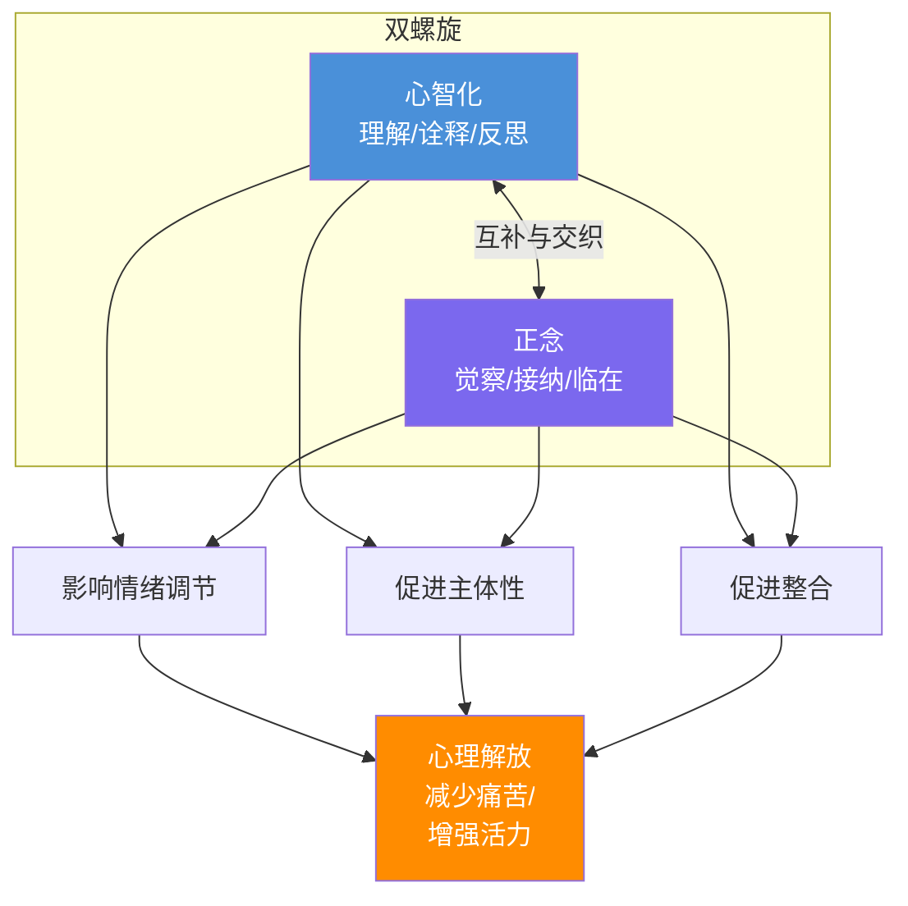
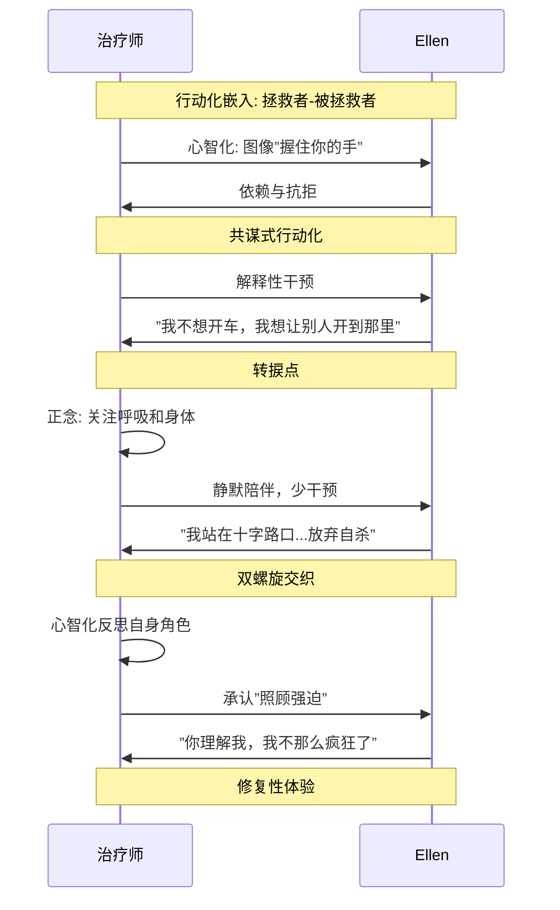

# 第17课：心智化与正念的双螺旋

## 引言：两种心理解放的路径

依恋理论研究强烈表明，我们相对持久的**心智状态**以及我们时刻变化的主观体验，受我们对待内在和外在环境的**姿态（stance）**的影响，可能不亚于（甚至超过）这些环境本身的影响。

- **安全型依恋**培养我们采取**反思性心智化姿态（reflective mentalizing stance）**的能力——允许灵活的注意力、对新信息的开放态度，以及考虑同一体验的多重视角的能力
- **不安全依恋和/或未解决的创伤**则导致**刚性的注意策略**——限制我们更新旧的内在模型、考虑多重视角、特别是采取心理学视角（没有这一视角就不可能理解我们自己或他人的行为）

许多来访者**慢性或间歇性地嵌入（embedded）在他们的体验中**——无法区分原始体验和他们对此的反应，感到被情绪和信念囚禁，仿佛这些都具有事实一般的不可改变的具体性。

> [!QUOTE] Mark Epstein
> "心智流的内容不如知道它们的意识重要。"

**心智化（mentalizing）**和**正念（mindfulness）**是两种互补的心理解放路径：
- **心智化通过理解来解放**——以对潜意识的觉知和对心理深度的探索为特征
- **正念通过接纳、临在和觉察来解放**——以对当下体验广度的专注为特征

## 心智化 vs 正念：脱嵌入的两种过程

### 嵌入与非嵌入

当**简单地嵌入**在体验中时，我们同时被两样东西所控制：我们自身的内在表征世界，以及外部世界的现实（包括他人的行为）。**心智化姿态和/或正念姿态可以松动这种双重嵌入的控制。**

| 维度 | 心智化（Mentalizing） | 正念（Mindfulness） |
|------|----------------------|-------------------|
| 关注方向 | 体验的心理深度——包括无意识维度和历史 | 体验在当下的**广度**——全景式的觉察 |
| 核心操作 | 思考体验的意义；将行为解释为心智状态的产物 | 简单地**注意**此时此地的全景，尽可能直接地领会 |
| 关键能力 | 表征性再描述（representational redescription） | 元觉察（awareness of awareness） |
| 时间指向 | 过去—现在—未来的心理时间旅行 | 纯粹的当下 |
| 改变机制 | 理解使去自动化（deautomatization） | 接纳使不认同（disidentification） |

从关键的临床发现说起：**成人思考思维（元认知，metacognition）的能力以及根据潜在心智状态解释人类行为（心智化）的能力，比其自身依恋历史的记忆事实更能预测依恋安全性和养育安全儿童的能力。** 这意味着，高度发展的反思性姿态可以**战胜个人历史**——即使那段历史相当可怕。

> [!EXAMPLE] 临床实例：一位幸存者
> 一位来访者在童年时期遭受了近乎骇人听闻的忽视和虐待。然而，令人瞩目的是，他并没有被创伤历史所残障。他情感生存的关键是：**大约五岁时，他识别出他的母亲是"疯狂的"。** 这种早期的心智化软化了他原本可能是灾难性的发展环境的影响——他不是将母亲视为正常的而将自己视为坏的，而是将母亲重新描述为"疯狂"，从而保存了自己是"好"的可能性。

### 心智化：脱嵌入

心智化通过促进对自身和他人主观体验的**诠释性深度和表征性本质**的觉察，使我们有潜力从嵌入中解放出来。它促成了"去自动化（deautomatization）"——对我们习惯性的思维、感受和行动模式的**不认同（disidentification）**。因为它在我们的体验和我们对此体验的反应之间打开了一个心智空间（往往还有一个时间间隔），心智化是"**脱嵌入的（disembedding）**"。

### 正念：脱嵌入

正念通过**有意识地、非评判性地将注意力集中在当下体验的全景上**来松动内在和外在环境的控制。在正念姿态中，我们不是思考体验的意义，而只是注意此时此地的全景——允许自己尽可能充分地居住于即时的体验中，以尽可能直接地领会它。

正念的关键要素：
1. **觉察（awareness）**——定位我们的注意力
2. **当下体验（present experience）**——聚焦"是什么"，而非"应该是什么"
3. **接纳（acceptance）**——敞开面对，而非抵抗

> [!TIP] 正念的治疗性机制
> 正念觉察揭示了体验的**万花筒般的、不断变化的本质（impermanence）**——通常使体验变得不那么固态、更具弹性，使我们更容易穿越它。同时，它使我们对自身和他人的体验**更加丰满、更可及、更经验性地"真实"**——当过去和未来被主观地从当下剥离时，此时此地突然充满了一种解放性的**无时间性**。

## 双螺旋模型（The Double Helix）

心智化和正念在心理治疗中的关系可以比作**双螺旋（double helix）**——一对部分重叠的螺旋，一次又一次地汇聚和发散。

它们既是**不同的**认识与回应体验的方式，又是**互补和交织的**：
- **"领悟引发平静，平静引发领悟。"**（Cooper, 1999）
- 正念可以使我们成为更好的"心智化者"——通过使我们更充分、更平静地在场，促进对来访者和自身最情感突出的内容的更高接受性
- 心智化则可以为正念所触及的经验提供理解和整合的框架

## 发展心智化与正念的关系性语境

正如Bowlby所言，依恋关系之所以在发展语境中如此强大有力，是因为它们被体验为**必需的**。正如Ainsworth所阐明的，是发展性对话（起初是非言语的）中沟通的质量——其包容性、灵活性和调节情感的有效性——决定了它赋予安全性或不安全性的潜力。

在心理治疗中，如同在儿童发展中一样，对体验的姿态——特别是对充满情感的体验——是在**依恋关系的矩阵中**被塑造和重塑的。治疗师（或父母）如果能从体验中脱嵌入，就能创造一种关系，在此关系中来访者（或儿童）可以学习同样地做到这一点。

### 内隐与外显心智化

**内隐心智化（implicit mentalizing）**：涉及对非言语情感线索的持续直觉性阅读——这是右脑的专长领域，使我们能够根据心理意义来回应行为。当我们自发地用面部表情的相应变化或语调的转换来"镜像"来访者的情绪状态时，我们就在内隐地心智化。

**外显心智化（explicit mentalizing）**：这是一个对比性的**有意识**过程——调动"左脑解释者"的语言资源来有意识地反思行为的意义及其心理基础，常常使内隐的内容变得外显。

是治疗师在日益安全的依恋关系语境中**内隐和外显地心智化**，逐步增强了来访者采取心智化姿态的能力。同样，能够正念的治疗师可以利用这种关系来帮助培养来访者自身的正念能力。

## 心智化和正念与主体性、情绪调节和整合

### 情绪调节与双螺旋

**Buemi（2003）**使用"情绪图式（emotion schemas）"而非"工作模型"来强调内部表征如何与情感焊接在一起。要有效调节情绪，我们必须：
- **识别**情绪
- **忍受**情绪
- **调节**情绪

**心智化**强化情绪调节：越能识别、命名和理解自身感受，就越能容纳它们。

**正念**也使我们能够承受更多感受——其本质是对体验的全心全意的、慈悲的觉察，包括痛苦的体验。正念涉及"**转向（turning toward）**"困难的情感和思想，以"**彻底接纳（radical acceptance）**"的态度。

> [!QUOTE] 一位来访者的洞见
> "**痛苦 × 抗拒 = 受苦 (pain × resistance = suffering)**" —— 因此，"软化"或"呼吸"进入痛苦体验——而非试图避免或改变它——实际上可以减少受苦。

### 主体（Agency）与双螺旋

**心智化**治疗师培养来访者将自己视为**心智主体（mental agent）**——即认识到主观体验不是"就这样发生了"，而是可以通过我们的理解被塑造和重塑。

**正念**治疗师培养来访者将自己视为**注意主体（attentional agent）**——即掌控自己的注意力和焦点的人，因此能够对自己的体验施加影响。

无论是在心智化姿态还是正念姿态中——但不是嵌入状态中——我们可以**选择**如何使用我们的觉察。

### 整合与双螺旋

治疗师有意识地选择采用心智化或正念姿态时就在行使主体性。这种有意识的选择在觉察到我们嵌入在回避型或焦虑型preoccupied心智状态时尤其重要。

在整合过程中：
1. **正念**使我们可以"**知道**"（感知、感受、直觉）互动中最本质的内容——通过一种整体的、基于身体的接纳性，穿透言语到达情感核心，触及在此之前双方都无法言说的经验维度
2. **心智化**则将这些触及的内容置于多重视角之下，赋予其深度语境，允许其意义被更有效地把握——将此时此地的经验与过去和未来联系起来

## 临床插图：Ellen的治疗

> [!QUOTE] T. S. Eliot
> "教我们关心和不关心 教我们静坐。"

Ellen是一位长期与自杀念头斗争的来访者。她与治疗师（David Wallin）的工作生动地展示了双螺旋模型。

### 关键进程

**"谢谢你又多了一年"**——Ellen在给治疗师的圣诞卡上如此结尾。经过多年的挣扎（自杀威胁、午夜电话、警察、急救、住院），现在进入相对平静期。

核心议题：**依赖**。谁照顾谁？Ellen从小就照顾他人，而激烈抗拒依赖治疗师。然而她也无意识渴望被拯救——正如治疗师无意识渴望拯救她。

**螺旋一：心智化介入**
治疗师形成了一幅心理图像："Ellen坐在驾驶座上，但车没有动，她不愿或不能把握方向盘。"将这个隐喻传达给Ellen后，引发了重要的对话——关于她希望别人来"开车"的渴望，以及她的羞耻和愤怒。

**螺旋二：正念姿态**
在另一节会谈中，治疗师有意识地采取正念姿态——不仅关注Ellen，也关注自己的呼吸和身体。他感到平静、在场，比平时更少需要行动的压力感。在长久的沉默后，Ellen说："我感觉我站在一个十字路口……但我不太能定义它。"

随后她说出了那句关键的话：**"David，我正在挣扎于放弃杀掉自己的念头。"**

**螺旋三：行动化觉察与修复**
在一次会谈中治疗师注意到自己说得太多、留给Ellen的空间太少。他承认自己的"照顾强迫"实际上妨碍了Ellen学会自己担当。治疗师自我披露了自己的成长经历——他不得不照顾母亲否则就"有麻烦"——Ellen回应说这让她感到不那么疯狂、更安全。

### 双螺旋在行动中的运作

治疗师自身的**心智化和正念**逐步使他：
1. 识别出自己在行动化中的角色
2. 改变相应的行为
3. 从照顾强迫中获得一定自由

通过正念——关注呼吸和身体——治疗师获得了对这种现状的接纳，而非抵抗和改变的需要。Ellen在这种情况下逐渐能够同时**感受**和**思考**她的感受——即能够心智化。她的情绪调节能力、主体感和整合能力都得到了显著提升。

## 培养来访者的正念

### 正念的治疗师

进行正式冥想练习的治疗师是在锻炼使正念成为可能的"肌肉"——不仅在静坐时，也在与他人（包括来访者）互动时。

- **禅宗的"初心（beginner's mind）"**：如果心智是空的，它随时准备好迎接一切；在初学者的心智中有许多可能性，在专家的心智中则很少
- **弗洛伊德的"均匀悬浮注意（evenly hovering attention）"**：不作任何努力将注意力集中在任何特定事物上，以同样冷静、安静的注意力对待所听到的一切

### 培养来访者正念的干预策略

针对正念的三个要素——觉察、当下体验、接纳：

**1. 引导觉察此时此地的体验**
- "此刻你在身体里感受到或感觉到什么？"
- "你现在想从我这里得到什么？"

**2. 培养对当下体验的接纳**
- 帮助来访者识别对体验的抗拒
- 邀请来访者"靠近"或"放松进入"他们一直试图避开的体验
- 传达一个悖论：**抵抗痛苦体验使其固定原地，而拥抱它允许它改变**

**3. 帮助区分事件与反应**
- "你是否注意到，只有在你情绪低落的时候，你才把妻子加班视为拒绝？"
- 帮助来访者认识到思想和感受是**流动的、不断变化的心智事件**，而非具体的、不变的"现实"

## 培养来访者的心智化

### 通过读心来教"读心"

要读懂来访者的心智，治疗师必须与来访者的内部经验**共鸣、反思并准确镜像**——用身体或语言。内隐心智化（主要是非言语回应）在这个主体间过程中扮演关键角色，而正念可以提高这种自动的直觉性回应。

### 好奇姿态 vs 专家姿态

Fonagy建议避免"**专家姿态（expert stance）**"——治疗师告诉来访者发生了什么，如"我觉得你现在很生气。"——而推荐"**好奇姿态（inquisitive stance）**"——通过提问、指出此时此地互动的特征、重述事实等方式来澄清来访者的经验，如"你现在这种方式让我觉得，唯一使之有意义的方式就是你感到很生气。可能是这样吗？"

关于诠释，Fonagy强调：**"重要的不是目的地，而是旅程。"** 主要目标不是用我们的洞见启发来访者，而是**鼓励来访者自己的诠释过程**。

### 评估来访者的心智化能力

需要时刻评估来访者当前的心智化能力（这是波动的）和占主导的体验模式：

| 模式 | 特征 | 治疗策略 |
|------|------|----------|
| **心理等同（Psychic Equivalence）** | 感受和信念等于是真实和事实 | 支持来访者的视角，同时呈现替代视角；像父母与孩子玩耍时既承认"真实"又承认"假装" |
| **假扮模式（Pretend Mode）** | 想法和感受与现实脱节，治疗看似在"工作"但无真实情感基础 | 避免共谋；帮助来访者承认不愉快体验的影响；跟随情感的线索 |
| **心智化模式（Mentalizing）** | 能够反思、诠释、考虑多重视角 | 呈现替代视角和诠释 |

判断来访者所处的模式后，治疗师需要在**支持**与**挑战**之间找到平衡——"期待比来访者认为自己能够做到的稍微多一点"。

> [!WARNING] 过犹不及
> 过高估计来访者的心智化能力会使其感到被指责或遗弃。过低估计则可能阻碍成长。这需要持续地"在句子中间重新调整干预的深度"。

### 解决心智化受阻

当遇到来访者反思功能暂时冻结时，常见的原因包括：
- 治疗师无意中激发了来访者的羞耻
- 触到了脆弱区域
- 踏入了一个解离性行动化

需要**立即关注和修复**，以确保对合作性心智化的限制是暂时的。

更持久的限制可能源于：
- 恐惧被压倒或解体
- 维持解离的心理需要
- 创伤和侵犯带来的"禁止知晓（prohibitions against knowing）"
- 保护脆弱身份认同的需要——必须维持只有一个现实的幻想
- 对"**不灭的希望（relentless hope）**"的执着——如同Ellen那样，为自己思考和感受意味着放弃对获得童年缺失之物的希望

## 治疗师的贡献

治疗师干预的能力和提供安全关系的能力，在很大程度上取决于**我们自身的整合能力**。像我们的来访者一样，我们在童年及以后的依恋历史很大程度上决定了我们能允许自己和他人体验的主观经验范围。

在心理治疗中，通过正念和心智化的**反复非嵌入体验**，可以在心智和大脑中建立一个新的组织中心——这种方式有可能以"**挣得的安全型（earned secure）**"工作模型取代来访者的不安全工作模型。

来访者的心智化既是一种关键技能，也是"重写"自传叙事的工具。正念则改变作者而非重述生命。通过对这些技能的培养，有效的心理治疗可以产生新的安全体验——而对于有（或将有）孩子的来访者来说，治疗师的贡献可能更为深远：**它有潜力打破跨代传递不安全感和创伤的链条。**

## 自我检测

> [!QUESTION] 自测题1
> 什么是"双螺旋（double helix）"模型？心智化和正念如何互补？

点击查看答案

**双螺旋模型**将心智化和正念的关系比喻为一对部分重叠的螺旋，两者反复汇聚和发散。

**互补方式**：
- **心智化**关注体验的**心理深度**（包括无意识维度和历史），通过**理解**来解放——将行为解读为潜在心智状态的产物，促进"心理时间旅行"
- **正念**关注体验在当下的**广度**，通过**接纳和临在**来解放——觉察体验的不断变化性，促进不认同
- 两者相互促进：正念使治疗师更充分、更平静地在场，提高对来访者和自身情感突出内容的理解，从而增强心智化；心智化的洞见和领悟又能带来平静，为正念创造空间
- 两者共同促进情绪调节、主体感和整合

> [!QUESTION] 自测题2
> 什么是"心理等同（psychic equivalence）"和"假扮模式（pretend mode）"？治疗师如何干预这两种模式？

点击查看答案

**心理等同模式**：来访者将所感受和相信的**等同于**真实和事实。情绪和信念像事实一样具有不可改变的强制性。此模式常出现在preoccupied或未解决型来访者中。

**干预策略**：像父母与孩子玩耍时既承认"真实"又承认"假装"的维度——支持来访者的视角（承认其经验的合理性），同时呈现替代视角（考虑复杂性的其他解释）。关键是**在接受来访者视角的同时坚持治疗师自己的视角**，尤其是在被来访者以负面方式看待时。逐步帮助来访者认识到内在经验不是现实的直接反映，而是主观反应的特异性产物。

**假扮模式**：想法和感受与现实**脱节**，来访者可能给人留下"正在治疗中工作"的印象，但洞见和关系体验未扎根于情感现实。常见于dismissing来访者。

**干预策略**：避免共谋——不要配合"实际上情感缺席的来访者完全在场"的假象；帮助来访者承认不愉快体验的影响；跟随情感的线索，指出来访者可能回避的情感迹象；有时通过自我披露使治疗体验变得更"真实"。

> [!QUESTION] 自测题3
> Fonagy为什么建议采用"好奇姿态（inquisitive stance）"而非"专家姿态（expert stance）"？

点击查看答案

**专家姿态**（"我觉得你现在很生气。"）——治疗师直接告诉来访者"发生了什么"——可能削弱来访者发展自身"读心"能力的机会，使来访者依赖治疗师的诠释而非发展自己的心智化能力。

**好奇姿态**（"你现在的方式让我觉得，唯一使之有意义的就是你感到很生气。可能是这样吗？"）——通过提问、指出来访者此时此地互动的特征、重述事实等方式——鼓励**来访者自身的诠释过程**。主要目标不是用我们的洞见启发来访者，而是培养来访者自己进行诠释的能力。如Fonagy所说："**重要的不是目的地，而是旅程。**"

> [!QUESTION] 自测题4
> 请用自己的话解释"痛苦 × 抗拒 = 受苦"这一公式的治疗意义。

点击查看答案

这个公式揭示了一个核心治疗洞见：**痛苦（pain）是不可避免的**（失去、受伤、失望等），但**受苦（suffering）来自我们对痛苦的抗拒**。抗拒——试图避免、压抑、否认或逃离痛苦体验——实际上放大了痛苦，使其固定下来并持续影响来访者的生活质量。

治疗意义：
1. **正念的"转向"策略**：鼓励来访者"靠近"或"放松进入"痛苦的体验，而非抵抗它
2. **彻底接纳（radical acceptance）**：接纳不等于认可或坚持，而是承认"事情就是这样"，然后放下
3. 接纳痛苦体验实际上可以**减少受苦**，因为停止抗拒后，痛苦就能按其自然轨迹——生起和落下——流动，而不被凝固为持久的受苦状态
4. 这为培养来访者**忍受情感**的能力提供了关键框架——来访者不必先消除痛苦才能好转，而是可以通过改变与痛苦的关系来减少受苦

> [!QUESTION] 自测题5
> 在临床插图Ellen的案例中，治疗师如何通过自身的改变促进了Ellen的改变？

点击查看答案

治疗师通过**心智化和正念**逐步识别了自己在行动化中的角色——他的"拯救者"需求与Ellen的"被拯救"渴望完美啮合，形成了控制-照顾（controlling-caregiving）策略的共谋。

具体过程：
1. **心智化**：形成的隐喻图像（"握住Ellen的手领她进入新世界"、"Ellen在驾驶座上但不愿开车"）帮助治疗师理解了双方共演的场景
2. **正念**：有意识地关注自己的呼吸和身体，从"必须让事情发生"的紧迫中获得自由，获得了对现状的接纳
3. **行为改变**：从过度干预转向为Ellen创造空间，允许她体验自己的主体性
4. **自我反思**：意识到对Ellen的"照顾强迫"源于自身成长经历，并通过自我披露与Ellen分享了这一理解

Ellen的变化跟随了治疗师的改变：学会同时感受和思考感受（心智化），能够有意识地选择转向感受而非回避它们（正念），逐步从"让别人开车"转向"自己把握方向盘"。

---

> [!NOTE] 延伸阅读
- 本课是[[0015-nonverbal-realm-1|第15课：非言语领域 I]]和[[0016-nonverbal-realm-2|第16课：非言语领域 II]]的心智化维度整合
- 双螺旋模型与[[0004-fonagy-and-mentalizing|第04课：福纳吉与心智化]]中的反思功能概念有深度呼应
- 正念在治疗中的应用与[[0010-intersubjectivity-and-relational-perspective|第10课：主体间性与关系视角]]中的临床讨论密切相关