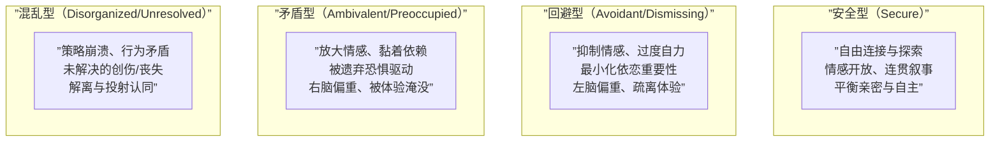
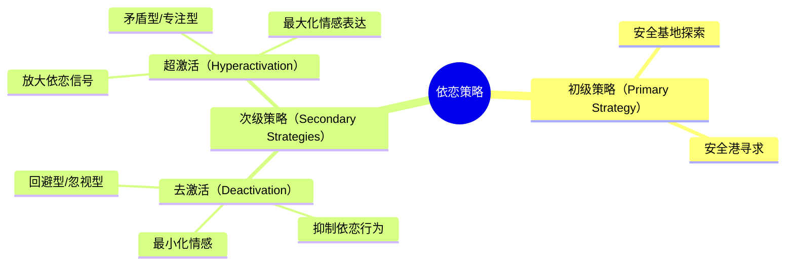

# 依恋模式速查表

## 四种依恋模式概要

## 跨年龄特征对比

### 安全型 / 自主型（Secure/Autonomous）

| 发展阶段 | 典型特征 |
|---------|---------|
| 婴儿期 | 分离时适度痛苦，重聚后被安抚，灵活平衡亲近与探索 |
| 6岁儿童 | 情感开放、语言流畅，对分离情境能想象解决方案；画出"安全-足智多谋"的图画 |
| 成人（AAI） | 话语连贯、协作、平衡，无论经历好坏都能客观评价，重视且能反思依恋关系 |

### 回避型 / 忽视型（Avoidant/Dismissing）

| 发展阶段 | 典型特征 |
|---------|---------|
| 婴儿期 | 表面上不在乎分离，持续探索，内心生理指标显示痛苦（心率、皮质醇升高） |
| 6岁儿童 | 互动受限，对分离说不出解决方案；画出"安全-不可伤害"的图画（无臂、漂浮、遥远） |
| 成人（AAI） | 最小化依恋重要性，坚持缺乏记忆，理想化描述与实际经历矛盾；违背Grice"质量"和"量"准则 |

### 矛盾型 / 专注型（Ambivalent/Preoccupied）

| 发展阶段 | 典型特征 |
|---------|---------|
| 婴儿期 | 对母亲行踪高度警觉，分离时极度痛苦，重聚时既寻求接触又表达愤怒或被动无助 |
| 6岁儿童 | 传递混合信息（坐腿上又挣脱），画出"脆弱"的图画（人物极大或极小、紧靠、突出身体部位） |
| 成人（AAI） | 对过去依恋关系过度纠缠，语言冗长混乱；过去的不满直接滑入当前叙述；违背"方式"和"关联"准则 |

### 混乱型 / 未解决型（Disorganized/Unresolved）

| 发展阶段 | 典型特征 |
|---------|---------|
| 婴儿期 | 重聚时表现矛盾/古怪行为：接近时突然冻结、捂住嘴倒地、在母亲靠近时退开 |
| 6岁儿童 | 角色颠倒的控制策略：关怀型（"妈妈你累了吗？"）或惩罚型（"坐下，闭嘴"） |
| 成人（AAI） | 讨论丧失/创伤时出现推理或话语监控失误；相信死者仍活着；语域切换；长时间沉默 |

## AAI 分类：Grice 四条准则

| 准则 | 含义 | 违反表现 |
|------|------|---------|
| 质量（Quality） | 真实，有证据支持 | 忽视型：断言无证据，自相矛盾 |
| 量（Quantity） | 简洁但完整 | 忽视型：过于简短，"没有记忆" |
| 方式（Manner） | 清晰有序 | 专注型：冗长混乱，难以跟上 |
| 关联（Relation） | 切题相关 | 专注型：离题，话外有话 |

## 两种基本策略维度

## 治疗中的三种依恋模式应对

| 患者类型 | 核心挑战 | 治疗策略 |
|---------|---------|---------|
| 忽视型 | 让治疗师变得重要 | 共情+面质平衡；关注身体和情感线索；治疗师使用主观体验 |
| 专注型 | 为自己心智留出空间 | 回应深层感受；设置界限；将无助/愤怒与早年经历连接 |
| 未解决型 | 克服对安全的恐惧 | 提供安全关系；共情+设限；帮助将创伤用语言表达；处理解离和投射认同 |

## 推荐的课程衔接

- [[../lessons/0006-varieties-of-attachment-experience|第06课：依恋经验的多样性]]
- [[../lessons/0011-constructing-developmental-crucible|第11课：构建发展的熔炉]]
- [[../lessons/0012-dismissing-patient|第12课：忽视型患者]]
- [[../lessons/0013-preoccupied-patient|第13课：专注型患者]]
- [[../lessons/0014-unresolved-patient|第14课：未解决型患者]]