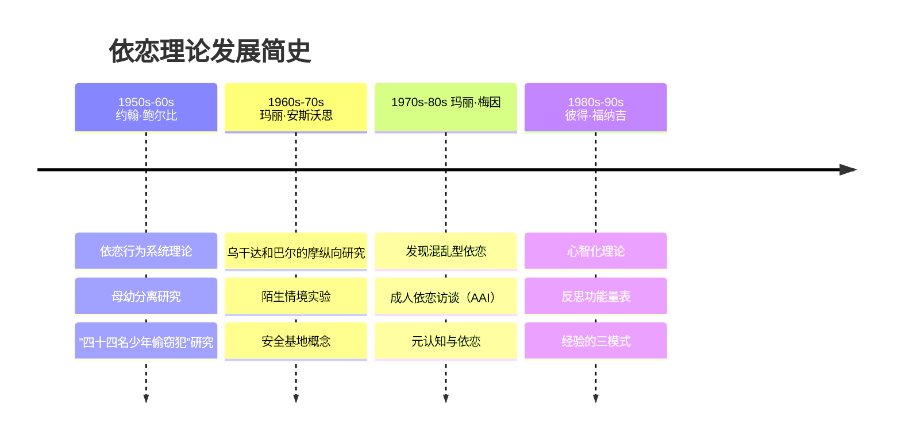

# 依恋理论的四位奠基人

## 人物与贡献概览

## 约翰·鲍尔比（John Bowlby, 1907-1990）

### 核心理论贡献

1. **依恋行为系统（Attachment Behavioral System）**：从进化生物学出发，认为依恋不是弗洛伊德所说的衍生自口欲驱力，而是一个独立的、与生存直接相关的先天行为系统。

2. **内部工作模型（Internal Working Model, IWM）**：个体在早期依恋经验中形成关于自我和他人的心理表征。模型具有"工作"性质——理论上可修改，但越早期形成的越稳固。

3. **分离反应的三个阶段**：抗议（protest）→ 绝望（despair）→ 疏离（detachment）。这不仅是婴儿对分离的反应，也是成人对丧失的反应模式。

4. **治疗师的角色**：类似于母亲为孩子提供安全基地。让患者"感受不该感受的、知道不该知道的"。

### 关键概念速查

| 概念 | 定义 |
|------|------|
| 亲近寻求（Proximity Seeking） | 依恋行为的标志性表现 |
| 安全基地（Secure Base） | 探索的出发点，归来时的避风港 |
| 安全港（Safe Haven） | 面临威胁时返回寻求安慰的地方 |
| 感受的安全（Felt Security） | 依恋系统的设定目标（Sroufe & Waters） |
| 强迫性自理（Compulsive Self-Reliance） | 回避型个体的典型防御模式 |

## 玛丽·安斯沃思（Mary Ainsworth, 1913-1999）

### 核心研究贡献

1. **陌生情境实验（Strange Situation）**：标准化21分钟实验程序，通过8个情节激活婴儿的依恋系统，识别出安全型（B）、回避型（A）、矛盾型（C）三种依恋模式。

2. **安全基地的实证基础**：发现婴儿对母亲的信任程度取决于母亲对婴儿信号的敏感回应（sensitive responsiveness）——包括敏感性、接受性、合作性和情感可及性。

3. **沟通是核心**：婴儿依恋安全性的质量取决于亲子间非言语沟通的质量。

### 关键发现

> 三个月内哭声得到迅速安抚的婴儿，在12个月时哭得最少、最安全——这与"让婴儿哭"的传统观念截然相反。

## 玛丽·梅因（Mary Main, 1943-）

### 核心理论贡献

1. **成人依恋访谈（Adult Attachment Interview, AAI）**：半结构化访谈协议，通过分析成人叙述依恋经历时的**话语形式**（而非内容）来评估其"关于依恋的心智状态"（state of mind with respect to attachment）。

2. **混乱型依恋（Disorganized/Disoriented Attachment, D型）**：发现并命名第四个依恋分类。源于依恋对象同时是安全源和恐惧源——"无解的恐惧"（fright without solution）。

3. **元认知（Metacognition）**：将认知心理学的元认知概念引入依恋领域，认为认识到心理状态的"仅表征性质"（merely representational nature）是安全依恋的核心特征。

4. **传递缺口（Transmission Gap）**：父母敏感性只能部分解释依恋模式的代际传递，为福纳吉的心智化理论留下空间。

### AAI 话语分析核心

| 内容 | 分析方法 |
|------|---------|
| 依恋经历 | 肯定/否定某种经历不如**如何叙述**重要 |
| 连贯性（Coherence） | 安全型标志：内部一致、可信、协作的话语 |
| Grice四条准则 | 评价话语质量的框架 |
| 推理和话语监控失误 | 未解决型的标志 |

## 彼得·福纳吉（Peter Fonagy, 1952-）

### 核心理论贡献

1. **心智化（Mentalizing）**：认识到拥有心智中介着我们对世界的体验。不仅是自我认知，更是对"心智"本身的理解。

2. **反思功能（Reflective Function）**：心智化的操作性指标。在AAI语境下评估个体看到自我和他人作为具有心理深度的存在的能力。

3. **三种经验模式**：
   - 心理等同模式（Psychic Equivalence）：内在=外在
   - 假装模式（Pretend Mode）：内在与外在脱钩
   - 心智化模式（Mentalizing/Reflective Mode）：内在与外在既分离又关联

4. **情感镜映（Affect Mirroring）**：安全型依恋的发展取决于照顾者能否提供**相即的**（contingent）且**标记性的**（marked）情感镜映。

### 关键发现

> 在贫困母亲群体中，具有强反思功能者**全部**养育出安全型依恋的孩子；而弱反思功能者只有 **1/17** 养育出安全型孩子。反思功能是打破代际困境的"解药"（antidote）。

---

## 推荐的课程衔接

- [[../lessons/0002-foundations-of-attachment-theory|第02课：依恋理论的奠基]]
- [[../lessons/0003-mary-main-and-aai|第03课：梅因与成人依恋访谈]]
- [[../lessons/0004-fonagy-and-mentalizing|第04课：福纳吉与心智化]]