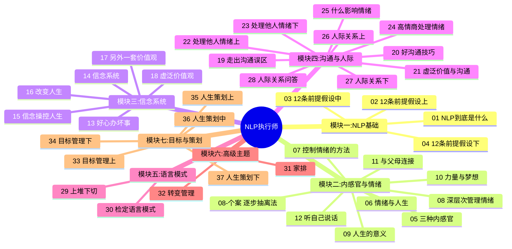
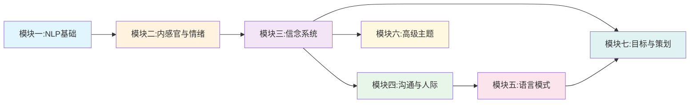

# 课程地图：NLP执行师学习路径

## 模块依赖关系

## 学习进度

> [!INFO] 当前进度
> 模块一：□ 01 □ 02 □ 03 □ 04
> 模块二：□ 05 □ 06 □ 07 □ 08 □ 08-个案 □ 09 □ 10 □ 11 □ 12
> 模块三：□ 13 □ 14 □ 15 □ 16 □ 17 □ 18
> 模块四：□ 19 □ 20 □ 21 □ 22 □ 23 □ 24 □ 25 □ 26 □ 27 □ 28
> 模块五：□ 29 □ 30
> 模块六：□ 31 □ 32
> 模块七：□ 33 □ 34 □ 35 □ 36 □ 37

点击方框替换为 `[x]` 标记已完成课程。
