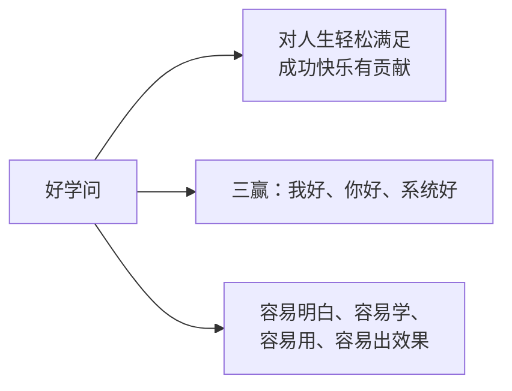

# NLP到底是什么？

李中莹老师以自己学习NLP的经历开场——从16岁出社会工作，到接触NLP后人生发生根本转变——引出了这门学问的核心价值：**NLP是一套帮助你人生有更多轻松满足、成功快乐的实用心理学。**

> [!QUOTE] 李中莹
> NLP不是宗教，不是信仰，不是一成不变的定律。它是一套学问，让我们面对人生有更多的工具、有更充分的选择、有更有效的态度。

## 李中莹的三个好学问标准

李中莹老师提出，判断一门学问是否"好学问"，可以用三个标准来衡量。他邀请学员用这三个标准来检验课程中的每一句话、每一个技巧：

### 1. 对人生轻松满足成功快乐有贡献
任何学问，如果不能让你的每一天有更多的轻松满足，不能让你的整个人生更成功快乐，那就没有价值。

### 2. 三赢：我好、你好、系统好
底线是**不伤害自己、不伤害对方、不伤害其他人（系统）**。这是NLP伦理的核心——任何一个技巧、一句话，都必须经得起三赢的检验。

### 3. 容易明白、容易学、容易用、容易出效果
好的学问不是复杂的理论，而是**落地**的——你听了就能做，做了就有效果。

## Practitioner的真正含义

课程标题中的"Practitioner"（执行师）并不是一个高深的专业职称。它的词根是 **Practice**（练习、运用）：

> **Practitioner就是在不断运用NLP技巧、不停使用NLP工具的人。**

学了NLP就变成Practitioner——不是因为你拿了证书，而是因为你**在用**。你在生活中用NLP的模式思考，用NLP的工具对人待事。

## NLP是什么：一句话总结

> [!SUMMARY] NLP的核心
> **每个人都有能力让自己的人生有更多的成功快乐。**
>
> NLP是一套关于人类主观经验、沟通和心理运作模式的实用心理学，它帮助你：
> - 以更有效的方式看待人事物
> - 面对问题困境时有更多选择
> - 对自己更有信心、更爱自己
> - 与人相处时有更多和谐
> - 生活中有更多的轻松满足

### NLP不是……
- 不是宗教，不需要"相信"
- 不是包治百病的万能药，它有不足的地方
- 不是一套讲的理论，而是一套**做**的学问

## NLP的关键态度

| 比较项 | 传统方式 | NLP方式 |
|-------|---------|---------|
| 关注点 | 对错 | **效果** |
| 面对问题 | 找原因怪谁 | **找方法解决** |
| 学习的衡量 | 能说出来 | **能做出来** |
| 时间指向 | 活在过去 | **面向未来** |
| 对他人 | 评判对错 | **尊重差异** |

> [!WARNING] 重要提醒
> NLP不在乎对错，它在乎的是**效果**。不是说可以不理对错，而是不要停留在对错上——穿越对错的层面，去追求效果和意义。

## 课程地图预览

李中莹老师在开课第一天给出了12天的内容预览：

| 天次 | 主题 | 核心内容 |
|------|------|---------|
| 第1天 | NLP是什么 + 内感官 | NLP定义、12条前提假设、了解自己的思考模式 |
| 第2天 | 情绪压力管理 | 轻松改变情绪状态，自己就能做到 |
| 第3天 | 人生意义 | 我们来到这个世界为什么 |
| 第4天 | 信念系统 | 信念系统是什么，如何影响人生 |
| 第5天 | 提升内在力量 | 把本来有的力量全部提炼出来 |
| 第6天 | 与他人连接 | 沟通、人际关系、系统 |

> [!NOTE] 关于课程
> 李中莹老师的课程经过50多次迭代修改，不断完善提升。他的初心是：**把好的学问送到中国人的地方**。

## 反思与自测

> [!QUESTION] 自测问题
> 1. 用你自己的话来说，NLP是什么？（不是背定义，而是你理解了它的本质）
> 2. 李中莹老师说"NLP是一个做的学问，不是讲的学问"，这对你的学习方式有什么启发？
> 3. 三赢（我好、你好、系统好）在你的工作和生活中可以如何应用？

思考方向

1. NLP是一套帮助你更有效生活的工具——不是让你变得"正确"，而是让你有更多选择、更有效果。
2. 这意味着每学一个技巧，应该问"我如何能做出来？"，而不是"这听起来很厉害"。
3. 做任何一个决定前，检查三个层面：对自己好（不伤害自己）、对别人好（不伤害对方）、对系统好（不影响更大的整体）。

## 下一步

学习 [[0002-12tiao-qian-ti-jia-she-1|第02-04课：12条前提假设 →]]
