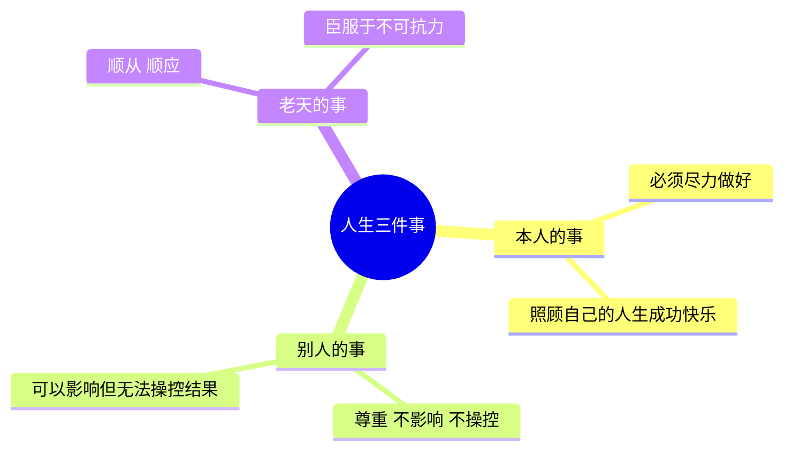

# 12条前提假设（上）

> [!QUOTE] 李中莹
> 这12条不要小看它，它甚至**有治疗作用**。你人生里有什么事，看一看12条，很有可能就解决了。

**12条前提假设**是NLP最底层的哲学基础。它们不是绝对真理，而是"假设其为真会有用"的实用信念。NLP不在乎对错，在乎**效果**——用这12条的视角看世界，你会发现人生轻松了很多。

## 人生三件事

在进入12条之前，先学习一个重要的分类框架：**人生只有三件事**。

- **本人的事**：你必须尽力做好的事。照顾自己的人生成功快乐，这是你的权利，也是你的责任。
- **别人的事**：你只能影响，不能操控。再亲近的人，也不能替他们做决定。
- **老天的事**：你无法改变的客观事实（生老病死、时代变迁）。顺应它，不要做无谓的对抗。

> [!TIP] 情绪保姆陷阱
> 很多人会无意识地邀请别人做自己的"情绪保姆"——"你应该照顾我"、"你让我成功快乐"。这其实是在放弃自己人生的责任。**自己照顾自己的人生成功快乐，是底线，不是可选项。**

## 12条前提假设

### 第一条：没有两个人是一样的

> 没有两个人对同一事物的看法完全一致。

- 人与人之间的**不同**让我们相互学习；人与人之间的**相同**让我们和谐相处。
- 你以为团队里所有人都同意"这个方案好"——其实每个人心里的"好"都不一样。
- 管理、沟通、教育中最大的错误就是"我以为他跟我一样"。

> [!EXAMPLE] 管理中的应用
> 五个下属说五个不同的看法怎么办？你是老大，你说了算。
> 下属的责任是提供意见，你的责任是综合决策。也许你采用了第二的一半、第四的一部分，最终的决定就变得更好。
>
> **不要活在"要对立"的二元思维里，用两个可能性的最好。**

### 第二条：一个人不能改变另外一个人

> 一个人不能改变（操控）另一个人，每个人只能被自己的价值观推动。

- 改变意味着"按照我的意愿让对方变化"。这是不可能的。**没有人可以被操控**。
- 当你越试图操控别人，对方就越会用反操控跟你对抗。
- 你可以**影响**、可以**引导**，但前提是对方**自愿**。

> [!TIP] 改变 vs 影响 vs 操控
> - **操控**：减少选择，强迫对方按你的意思做 → 招致反抗
> - **影响**：提供信息，让对方自己选择 → 对方愿意被你引导
> - **帮助**：增加选择，允许对方有选择的自由

#### 价值观推动原理
每个人都在追求自己内心的价值观。如果你想推动一个人，不要试图"改变他"，而是**理解他在乎什么价值**，然后让他看到：按你指引的方向走，他能得到他在乎的价值。

> [!WARNING] 企业管理的常见误区
> 很多管理者想要"改变下属的价值观"，这是不可能的。你能做的是：**创造一个环境，让员工在这里能得到他们在乎的价值**（成长、认同、报酬、归属感等），让他们自愿跟着你走。

### 第三条：人生只有三件事（见上文）

### 第四条：凡是照顾三赢（我好、你好、系统好），不会有后遗症

> 三赢的最低底线是：不伤害自己、不伤害对方、不伤害其他人。

- **系统**的概念很重要：一个团队、一个家庭、一家公司都是一个系统。
- 所有系统的方向都是：**平衡、稳定、发展**。
- "三赢"不是表面的不吵架，而是如何让系统往更健康的方向发展。

> [!EXAMPLE] "为了孩子不离婚"的三赢问题
> 为了孩子不离婚，夫妻每天吵架，孩子生活在恐惧中。这既不是"我好"（你牺牲了下半生），也不是"系统好"（孩子在更大的伤害中成长）。有时分开，但继续做好父母，才是真正的三赢。

### 第五条：效果比道理更重要

- "对错"是理性的，而人生中最重要的东西（爱、公平、深层情感）没有绝对的对错。
- 当你在争论"应该怎样"的时候，停下来问：**"这有效果吗？"**

> [!QUOTE] 李中莹
> 我们中国人太多人在讲对错、应该不应该。实际上，如何做的效果比怎么做更重要。做到没效果，也许都是"应该做的"吧？

### 第六条：我们用主观认知塑造自己的世界，而不是用感官经验来塑造

- 你的感官接收信息，然后你的脑袋用已有的经验来解读——整个过程是**主观**的。
- 你永远无法真正"客观"地看待世界。
- 但正因为是主观的，**你才有可能改变**——你改变了脑袋里的主观世界，你的世界就变了。

> [!NOTE] 心理治疗的底层原理
> 所有的心理辅导、心理治疗，本质上都是在**改变来访者脑袋里对世界和人事物的认知**。

## 反思与自测

> [!QUESTION] 自我检查
> 1. 今天有哪件事让你生气或焦虑？用"三件事"来区分：这是你的事、别人的事，还是老天的事？
> 2. 你是否有过"想改变某人"的经历？效果如何？如果改用"影响而非操控"，会有什么不同？
> 3. 回想一次你坚持"我是对的"的争论。如果放下对错问"效果"，你的处理方式会怎样改变？

练习：自测12条的应用

拿出一件让你困扰的事，逐一对照前6条前提假设问自己：
1. 我是否忽略了对方跟我"不一样"？（他可能有不同的想法）
2. 我是否试图"改变"他？（而不是影响他）
3. 这是谁的事？
4. 这个做法照顾三赢了吗？
5. 我是在坚持"对"，还是追求"有效"？
6. 我的主观认知是不是把这件事看"坏"了？

## 下一步

继续学习 [[0003-12tiao-qian-ti-jia-she-2|第03课：12条前提假设（中） →]]
