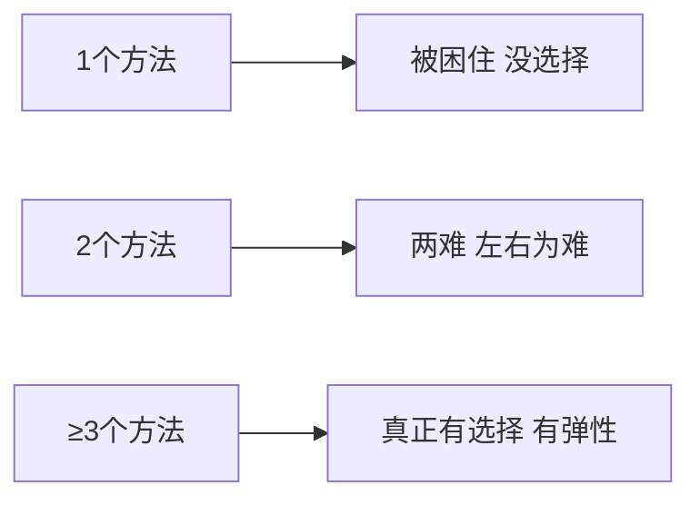
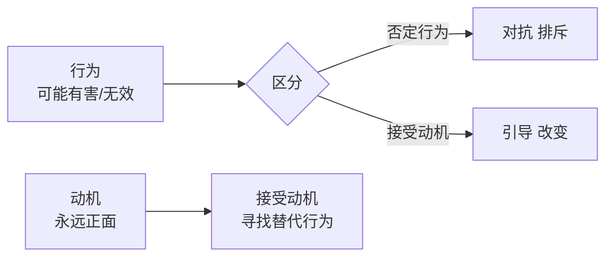

# 12条前提假设（中）

承接上一课，继续学习12条前提假设的第7到第10条。

## 第七条：凡事必有至少三个解决方法

> NLP最基本的信念之一：如果只有一个方法，你等于被困住；如果有两个方法，你面临两难；只有**三个方法以上**，你才真正有选择。

- 当你坚持"第三个选择"的时候，很快第四、五、六、七个选择就会出现。
- 人类习惯活在"过去"里找方法——"到现在为止我还没找到" ≠ "没有方法"。焦点应放在**未来还能做什么**，而不是过去为什么做不到。

> [!TIP] 突破思维局限
> 当你或你的团队说"不行"、"没办法"、"试过了"的时候，问一句：
> **"如果还有第三个方法，那会是什么？"**
> 这个问题会打开新的神经通路。

### 为什么是三？
电脑是二进制（0和1），但人脑是由上万亿个神经元连接而成的网络。当你有第三个选择，你就从一个神经元连接到另一个，形成了**网络**。有了网络，更多的连接就会自然出现。

## 第八条：每个人都做了当下他能做的最好

> 不要后悔过去。当时的你，就是**当时你能做到的最好**。

### 如何理解这句话
- 你愿意做（有动机），懂得做（有知识），没有条件限制你（能做）——你才会去做。
- 当时的你，以当时的认知状态和条件限制，**只能做出那样的选择和行动**。
- 后悔是无意义的——如果你回到那个时间点，带着同一套认知，你还会做同样的事。

> [!NOTE] 治疗作用
> 每天照镜子对自己说："我不完美，同时我每天都可以更好。"
>
> 接受过去的自己，你才有力量走向未来的更好。

### 怎么用这句话？
- 对**自己**：停止后悔，把力量放在"今天我可以更好"
- 对**别人**：不再评判"他当时怎么那样做"，而是理解"在当时的情况下，他已经做了最好"

## 第九条：动机和情绪不会错，只是行为没有效果

> 任何一个让你无法接受的行为背后，都有一个**你可以接受的动机**。

### 原理
每个人的行为背后，都有正面的动机——追求某些价值、满足某些需求。动机本身没有错，只是**选择的行为**可能没有效果，或者伤害了三赢。

> [!EXAMPLE] 极端例子的理解
> 即使是一个罪犯，他的行为背后也有一个他以为能解决问题的动机（例如获得尊重、证明自己、逃避痛苦）。你不需要认同行为，但理解动机后，才有引导的空间。

### 教育/管理中的应用
- 当你否定孩子的**行为**，他跟你对抗
- 当你接受孩子的**动机**，他愿意被你引导
- 你的角色是：**帮他找到更有效的方法来实现那个正面的动机**

## 第十条：假如没有从中学到，失败只会是失败

> 失败是成功之母——但这句话只有在一种情况下成立：**你从中学习了**。

- 坚持还是灵活？——**坚持效果，灵活方法**。
- 如果你一直在用同样的方法，却期待不同的结果，那不是坚持，而是固执。

> [!QUOTE] 李中莹
> 坚持与灵活是为了同一个东西——**效果**。有效果就坚持；没效果就灵活改变方法。你要坚持灵活，同时灵活地坚持。

### 从生理学看"有效果"
人的大脑中有三种关键化学物质：

| 物质 | 作用 | 对学习/工作的影响 |
|------|------|-----------------|
| **压力荷尔蒙** | 准备拼命或逃命 | 关闭高级思考，无法专注 |
| **内啡肽** | 无忧无虑，轻松愉快 | 让人想重复这个经验 |
| **多巴胺** | 奖赏机制 | 让人想做得好，做得好就做得开心 |

> [!TIP] 创造正向循环
> 当你做得好 → 产生多巴胺 → 做得开心 → 想继续做 → 做得更好
> 当你有压力 → 产生压力荷尔蒙 → 无法专注 → 做得不好 → 更大压力
>
> 教学、管理的关键：**做一个做得好就做得开心的循环。**

## 第十一条：每人都拥有让自己人生成功快乐的权利与责任

- **权利**：你可以享受成功快乐的人生
- **责任**：你必须**自己经营**，不能假手于人

> [!WARNING] 常见误解
> 很多人把"成功快乐"当成一个目标放在前面追——"等我有了一千万就快乐了"。但成功快乐不是目标，而是**内心的感觉**。感觉只能从里面产生，不能放在对面跑过去追。

## 第十二条：每人都拥有让自己人生成功快乐的权利与责任

（与第十一条合并展开，请参见上文）

## 反思与自测

> [!QUESTION] 回顾练习
> 1. 今天你遇到一个"没办法"的问题吗？尝试逼自己找出第三个解决方法。
> 2. 回想一件你还在后悔的事。对自己说："当时的我已经做了最好。" 你什么感觉？
> 3. 观察身边一个人让你生气的行为。背后的动机可能是什么？你能否只否定行为，而接受动机？
> 4. 你是在"坚持对的方法"，还是"坚持效果"？

练习：12条完整默记

尝试默写12条前提假设（不用一字不差，理解核心即可）：
1. 没有两个人是一样的
2. 一个人不能改变另外一个人
3. 人生只有三件事
4. 凡是照顾三赢
5. 效果比道理更重要
6. 主观认知塑造世界
7. 凡事至少三个解决方法
8. 每个人都做了当下能做的做好
9. 动机和情绪不会错
10. 没有学到，失败只是失败
11. 每个人拥有成功快乐的权利
12. 每个人拥有成功快乐的责任

## 下一步

继续学习 [[0004-12tiao-qian-ti-jia-she-3|第04课：12条前提假设（下）→]]
