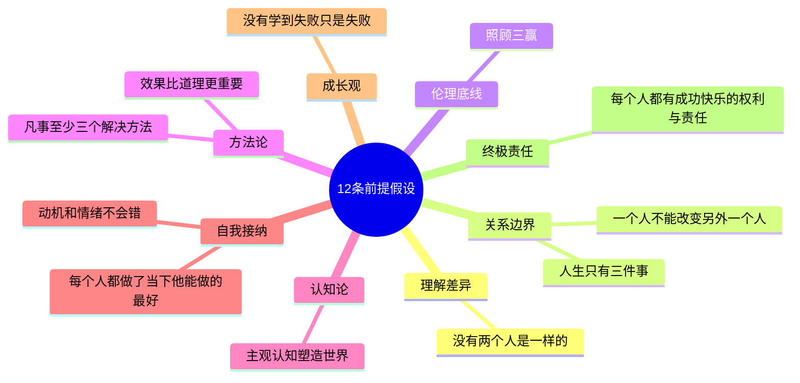

# 12条前提假设（下）

这堂课上，李中莹老师通过与学员的深入互动（PK），把12条前提假设的内在逻辑和相互联系讲透了。这12条不是孤立的，它们交织在一起，构成一套完整的"做人做事的世界观"。

## 12条前提假设的内在结构

## 六个方向性理解（横向拓展）

这12条不仅能纵向运用（逐一对照），还能**横向覆盖**六个重要领域：

### 方向的平衡：坚持与灵活
- 坚持的是**效果**，灵活的是**方法**
- 当你坚持一个没效果的方法十年，你不是在坚持，你是在**坚持失败**
- "我坚持"往往成了"我拒绝改变"的借口

### 时间的方向：过去与未来
- 过去是**学习**的来源，不是**停留**的理由
- NLP不问"为什么"（指向过去），而是问"如何"（指向未来）
- 失败只有在学到东西时才有价值

### 系统的方向：个人与系统
- 每个人是一个独立的单元，同时每个单元都在系统中
- "我好"是起点——只有照顾好自己，才能真正做到"你好、系统好"
- 牺牲自己不是三赢，因为你也是系统中的一员

### 关系的方向：操控与影响
- 操控 = 减少选择（招致反抗）
- 影响 = 提供选择（自愿跟随）
- 你越不操控别人，越被别人跟随

### 学习的方向：讲与做
- NLP不是说的学问，是做的学问
- 真正的学习，是你变了而不自知
- 说得好听不如做得出来

### 情绪的方向：行为与人
- 否定行为 ≠ 否定人
- 情绪有自己的正面意义
- 做情绪的主人，而非奴隶

## 深入场景应用

### 场景一：团队管理中的"不同意见"
**矛盾点**：我是领导，我该坚持我的意见还是听大家的？

**12条的应用**：
1. 没有两个人是一样的 → 不同意见是常态
2. 一个人不能改变另外一个人 → 我不能操控他们同意我
3. 效果比道理更重要 → 目标是有效决策，不是证明我对
4. 凡事至少三个解决方法 → 综合不同意见可能产生最优方案

**结论**：你是决策者，下属提供意见。你可以把不同意见融入决策，做出更好的方案。**而不是压制不同意见来维护权威。**

### 场景二："我没办法改变他了"
**矛盾点**：孩子/下属/伴侣总是同样的问题。

**12条的应用**：
1. 动机和情绪不会错 → 他行为的背后有他认可的动机
2. 每个人都做了当下他能做的最好 → 他已经用他知道的最好的方式
3. 一个人不能改变另外一个人 → 不要操控，要影响
4. 凡事至少三个解决方法 → 逼自己找出新的影响方式

**结论**：改变你自己的方式，他才会改变他的方式。

### 场景三：后悔过去的决定
**矛盾点**：如果当时知道现在知道的，就不会那样做了。

**12条的应用**：
1. 每个人都做了当下他能做的最好 → 当时的你只能那样
2. 主观认知塑造世界 → 你的认知变了，世界就变了
3. 没有学到，失败只是失败 → 从后悔中学到什么？
4. 每个人有让自己成功快乐的责任 → 把焦点放在"今天可以更好"

### 场景四：企业招投标的"三赢"
**矛盾点**：我们投标没中，三赢在哪里？

**应用**：
- 分析差距 → 从中学习如何提升 → 下次做得更好（你好）
- 或者认识到这领域竞争不过 → 转做供应商，服务中标方（我好、你好）
- 两种都是三赢，关键是从中学习并采取新行动

## 如何运用12条前提假设

> [!TIP] 李中莹的建议
> 你不需要刻意背诵。把这12条融在日常看人待物中。发现有什么事情不舒服，拿出这12条来，一条一条对照，你很快会找到答案。

### 三月养成法
1. **每天**读一遍12条，不必背诵，默读即可
2. **遇到困扰**时，找出相关的1-3条来对照
3. **三个月后**，你会发现自己看人待事的眼光完全不同了

### 一句话总结每条
试着用一句对你最有用的"提醒语"来总结每条：

> 1. 每个人都不一样，别以为他会跟你想的一样
> 2. 我不能改变他，只能影响他
> 3. 这是谁的事？
> 4. 这个决定三赢了吗？
> 5. 我追求的是效果，不是对错
> 6. 我看到的只是我的主观
> 7. 一定有第三个方法
> 8. 我已经做了当时能做的最好
> 9. 他的动机是好的，只是方法有问题
> 10. 我学到了什么？
> 11-12. 我对我自己的人生成功快乐负责

## 反思与自测

> [!QUESTION] 综合自测
> 1. 试着在一件事上同时用3条以上的前提假设来分析，你发现了什么？
> 2. 12条中哪一条对你来说最难接受？为什么？
> 3. 选一条你今天就用得上前提假设，在生活中有意识地用它一次。

12条完整对照表

| # | 前提假设 | 一句话提醒 |
|---|---------|-----------|
| 1 | 没有两个人是一样的 | 尊重差异 |
| 2 | 一个人不能改变另外一个人 | 只影响，不操控 |
| 3 | 人生只有三件事 | 管好自己的事 |
| 4 | 照顾三赢 | 我好你好系统好 |
| 5 | 效果比道理更重要 | 追求效果，不争对错 |
| 6 | 主观认知塑造世界 | 我看到的是我的主观 |
| 7 | 凡事至少三个解决方法 | 一定有第三选择 |
| 8 | 每个人都做了当下他能做的最好 | 接受过去 |
| 9 | 动机和情绪不会错 | 接受动机，调整行为 |
| 10 | 没有学到，失败只是失败 | 从失败中学习 |
| 11 | 每人有成功快乐的权利 | 你可以过得好 |
| 12 | 每人有成功快乐的责任 | 自己负责 |

## 本课重点

- 12条前提假设不是孤立条目，而是**一套互相支撑的思维框架**
- 它们可以应用在：**情绪管理、人际关系、团队管理、亲子教育、自我成长**等各个领域
- 最好的学习方式是**用出来**——每天在生活中检验

## 下一步

学完NLP基础（12条前提假设）后，进入模块二：[[0005-san-zhong-nei-gan-guan|第05课：三种内感官 →]]
