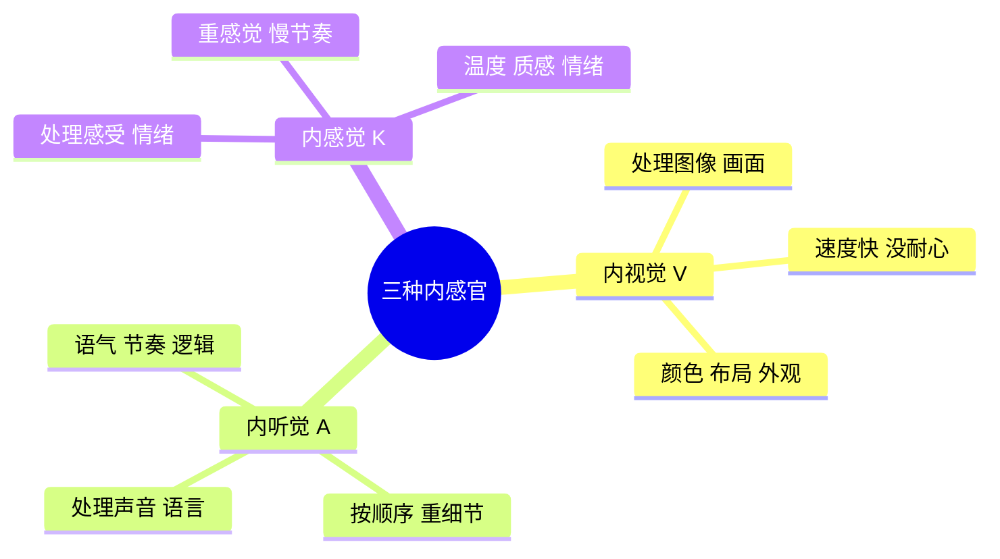
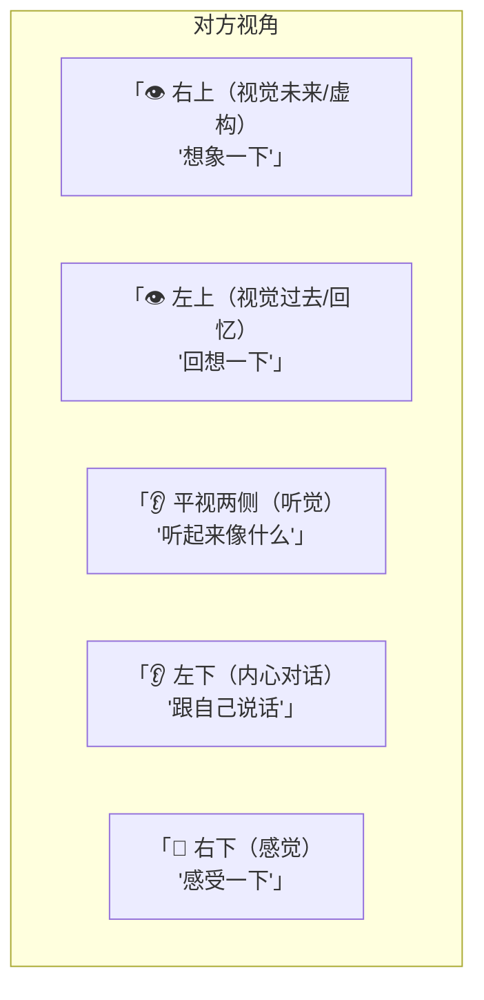

# 三种内感官

NLP对应用心理学最大的贡献之一，就是发现了人脑处理信息的**三种内感官系统**。

> [!NOTE] 核心概念
> 我们用五个外感官（视觉、听觉、触觉、嗅觉、味觉）接收外界信息。这些信息进入大脑后，由**三套内感官神经网络**处理——**内视觉、内听觉、内感觉**。

了解自己的内感官偏好，你就了解了自己如何思考、如何学习、如何记忆。了解别人的内感官偏好，你就知道了如何更有效地沟通。

## 三种内感官

### 内视觉型（V）

| 特征 | 表现 |
|------|------|
| 思维方式 | 图像式，一眼看全局 |
| 说话特点 | 速度快，用"看"字（我看明白了、看起来、展望） |
| 学习方式 | 看书、看图、看演示 |
| 性格特点 | 没耐心，节奏快，能同时做多件事 |
| 衣着打扮 | 注重颜色搭配、整体形象 |
| 眼部线索 | 视线向上或平视前方（好像在"看"画面） |

> **"海边沙滩"**——内视觉型想到的是：蓝天、白云、海浪的**画面**。

### 内听觉型（A）

| 特征 | 表现 |
|------|------|
| 思维方式 | 线性、按顺序、一条一条来 |
| 说话特点 | 节奏适中，用"听"字（听起来、说来听听、和谐） |
| 学习方式 | 听讲、朗读、讨论 |
| 性格特点 | 有条理，注重逻辑和次序 |
| 衣着打扮 | 整洁但不太在意颜色搭配 |
| 眼部线索 | 视线向两侧平视（好像在"听"什么） |

> **"海边沙滩"**——内听觉型想到的是：**海浪声**、风声、人们的笑声。

### 内感觉型（K）

| 特征 | 表现 |
|------|------|
| 思维方式 | 感受式，凭感觉做决定 |
| 说话特点 | 速度慢，用"感"字（我感觉、抓住、舒服） |
| 学习方式 | 动手做、亲身体验 |
| 性格特点 | 重视人际温度，在乎"感觉对不对" |
| 衣着打扮 | 舒适第一，不讲究搭配 |
| 眼部线索 | 视线向下（好像在"感受"什么） |

> **"海边沙滩"**——内感觉型想到的是：**温暖的风**、脚踩沙子的触感、轻松的感觉。

## 如何识别对方的内感官

### 眼部线索（眼睛解读线索）

> [!WARNING] 使用注意事项
> 1. 观察对方眼睛方向**不超过30秒**就判断。人的内感官会不停变化
> 2. 第一次方向和最后一个方向最说明问题——第一个是习惯用的方式，最后一个是信息存储的位置
> 3. **不要用来判断对方是否撒谎**——眼部线索只能告诉你他访问了哪个内感官，不能证明真假
> 4. 用**好奇**的态度而非**审判**的态度

### 语言线索

对方用的**谓词（动词）**会暴露他的主要内感官：

| 内感官 | 常用动词 |
|-------|---------|
| V（视觉） | 看、清楚、展望、模糊、展示、明亮 |
| A（听觉） | 听、说、讨论、和谐、无声、响亮 |
| K（感觉） | 感觉、抓、压、舒服、温暖、踏实 |

## 如何与不同内感官的人沟通

| 对方类型 | 最佳沟通方式 |
|---------|------------|
| V视觉型 | 话快一点，多用手势，给图表/展示，"你看看" |
| A听觉型 | 有条理，一步步讲，"听听看"、"说来听听" |
| K感觉型 | 放慢节奏，给他时间感受，"感觉一下" |

> [!TIP] 三种内感官都重要
> 没有人只用一种内感官。最理想的状态是**三种内感官都能灵活运用**：
> - 用内视觉看大局、做规划
> - 用内听觉理逻辑、做分析
> - 用内感觉做判断、体会人情

## 提升弱项内感官

| 你缺的 | 可练习的方法 |
|-------|------------|
| 内视觉弱 | 刻意观察环境细节；做"未来景象"练习（想象一年后的愿景） |
| 内听觉弱 | 专注听音乐；练习复述别人说的话 |
| 内感觉弱 | 做身体扫描；散步时感受风吹在皮肤上的感觉 |

## 反思与自测

> [!QUESTION] 自我检测
> 1. 你觉得自己最主要的感官是什么？从下面选一个：
>    - 我看一遍就记住了（视觉）
>    - 我听一遍就记住了（听觉）
>    - 我做一遍就记住了（感觉）
> 2. 观察你今天跟人聊天时，你用的最多的谓词是什么类型？（看/听/感？）
> 3. 找一个不同内感官的人（比如你是视觉型，找个感觉型），尝试用他的方式沟通，看效果如何？

> [!TIP] 学习提示
> 上课时，李中莹老师会观察学员的眼球转动来判断他们的学习状态。你也可以在日常生活中练习观察别人——**用好奇的心态，而不是判断的心态。**

## 下一步

进入情绪管理系列：[[0006-qing-xu-yu-ren-sheng|第06课：情绪与人生 →]]
