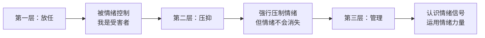

# 情绪与人生

> [!QUOTE] 标题的含义
> 能控制情绪的人，不⼀定能控制人生——因为控制人生还需要其他能力。
> 但能控制人生的人，⼀定能控制情绪——**因为情绪控制是人生掌控的基础能力。**

## NLP的情绪观

NLP对情绪有非常独特的看法，与主流社会观念有很大不同：

| 常见误区 | NLP的观点 |
|---------|----------|
| "负面"情绪是不好的，要消除 | 情绪没有好坏，只有**有没有效果** |
| 情绪是别人引起的 | 情绪是自己**内在**的产物 |
| 情绪来了我控制不了 | 你可以做**情绪的主人** |
| 有情绪就是不成熟 | 有情绪是正常的，关键是如何**运用**情绪 |

## 情绪的本质

> [!NOTE] NLP的核心观点
> 情绪是大脑给你的**信号**——它在告诉你一些重要信息。情绪本身不是问题，问题是**你如何回应**这个信号。

每一种负面情绪背后，都有一个正面的价值和意义：

| 情绪 | 正面意义 |
|------|---------|
| 愤怒 | 给你力量去改变不公 |
| 恐惧 | 提醒你保护自己，准备应对危险 |
| 悲伤 | 让你放下不再重要的东西，完成告别 |
| 焦虑 | 提醒你需要为未来做更多准备 |
| 内疚 | 告诉你偏离了自己的标准，需要修正 |
| 委屈 | 你觉得自己付出了但没得到应有的认可 |
| 失望 | 你对某事的期望没有实现 |

## 做情绪主人的三个层次

### 第一层：被情绪控制
- "我就是控制不住脾气"
- "他让我很生气"
- 把自己看作是情绪的受害者

### 第二层：压抑情绪
- "我要冷静，不能生气"
- "没事，我很好"
- 表面上平静，但情绪积累在身体里，最终爆发或导致身体问题

### 第三层：管理情绪
- "我现在很生气，这告诉我什么？"
- "我需要用这股力量做什么？"
- 认识到情绪是信号，**接受它、理解它、运用它**

## 情绪与压力

李中莹老师从生理学角度解释了压力对学习和工作的影响：

> [!WARNING] 压力状态
> 在压力状态（交感神经兴奋）下，身体产生压力荷尔蒙，关闭了高级思考功能——因为你准备逃命，不需要思考。
>
> 在这种状态下：不能专注、不能学习、不能创新、不能做出好决策。

**改变的关键**：先让身体从"压力状态"转换到"平静状态"，高级功能才能恢复。

## 从情绪管理到人生掌控

> [!TIP] 关键洞见
> 如果你能管理好自己的情绪，你就获得了掌控人生的基础能力：
> - 遇到困难时，情绪不会把你卷走 → 你能理性应对
> - 遇到冲突时，你不被愤怒控制 → 你能有效沟通
> - 遇到挫折时，你不陷入沮丧 → 你能快速恢复

## 反思与自测

> [!QUESTION] 情绪检查
> 1. 今天你有过什么"负面"情绪？它想告诉你什么信息？
> 2. 回想一次你被情绪控制的经历。如果那时你懂得识别情绪信号，结果会有什么不同？
> 3. 你的习惯是放任情绪，还是压抑情绪？这对你造成了什么影响？

练习：情绪信号日志

下次有强烈情绪时，停下来问自己三个问题：
1. 我现在有什么情绪？（命名它）
2. 这个情绪想告诉我什么？（理解它）
3. 我需要做什么来回应这个信号？（运用它）

## 下一步

学习具体技巧：[[0007-zui-kuai-fang-fa-kong-zhi-qing-xu|第07课：最快的方法控制你的情绪 →]]
