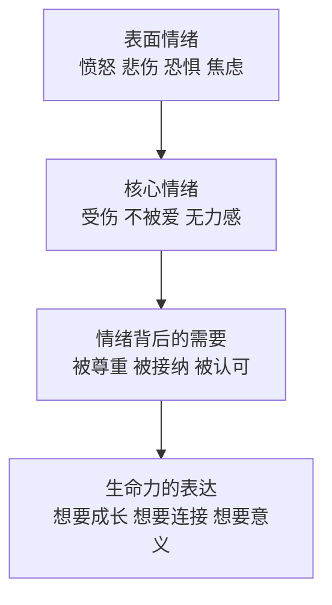

# 更深层次管理你的情绪

> [!QUOTE] 李中莹
> 情绪不是你的敌人，它是你的朋友。只不过这个朋友有时候说话很急，你需要学会听它真正想告诉你什么。

## 情绪的深层理解

### 情绪的四个层次



**表层情绪**：容易识别的情绪（愤怒、恐惧、悲伤）  
**核心情绪**：藏在表面情绪之下的、更脆弱的部分  
**情绪背后的需要**：每个情绪都在表达一个未被满足的需求  
**生命力的表达**：最深层次，情绪本质上是生命力的流动

## 逐步抽离法

这是李中莹老师课程中最核心的情绪处理技巧之一。它能帮你**快速将情绪从自己身上"分离"出来**。

### 原理

当你被情绪困扰时，你等于和情绪"黏在一起"——你就是情绪，情绪就是你。**逐步抽离法**通过创造"距离"来切断这种融合：

```
融合状态 → 你=情绪 → 被淹没
抽离状态 → 你看着情绪 → 可以处理
```

### 步骤

> [!TIP] 做法
> 1. **定位情绪**：闭上眼睛，感受身体里哪个位置有这份情绪（比如胸口堵、胃部紧张）
> 2. **给出形状**：想象这份情绪有颜色、形状、质地、温度（比如一团灰色的雾）
> 3. **放进容器**：想象一个坚固的容器（盒子、罐子），把这份情绪放进去
> 4. **逐步后移**：想象这个容器被放到1米外，然后是2米、5米、10米……越来越远
> 5. **检查感受**：感受身体的变化，看看减轻了多少
> 6. **留下正面**：问自己"这份情绪想告诉我什么？我从中学习到什么？"

### 与认知结合

逐步抽离法不仅仅是"把情绪推开"，更重要的是**理解情绪传递的信息**：

| 步骤 | 做法 | 效果 |
|------|------|------|
| 抽离 | 把情绪放远 | 不再被淹没 |
| 观察 | 看这个情绪是什么 | 理解情绪类型 |
| 解读 | 问它想告诉我什么 | 获取重要信息 |
| 回应 | 决定采取什么行动 | 从情绪中学习成长 |

> [!WARNING] 使用时机
> 逐步抽离法适合处理**已存在的、让你困扰的负面情绪**。
> 如果是紧急情绪爆发，先用第07课的"快速调节"，再在平静时做逐步抽离。

## 个案演示：逐步抽离法

在课堂上，李中莹老师现场给一位学员做了逐步抽离法演示。学员带着一份长期困扰她的情绪（关于人际关系中的无力感）上台。

**过程概要**：
1. 学员描述了情绪：在关系中总觉得自己不好，有深深的无力感
2. 李老师引导她感受这份情绪在身体的哪个位置（胸口）
3. 引导她把这份情绪想象成"一团灰色的东西"
4. 逐步把它放到远处（一步一步远离）
5. 之后学员明显感到轻松，脸上有了光彩
6. 最后她领悟到：这份情绪想告诉她的，是她需要先爱自己

> [!QUOTE] 演示后学员分享
> "我本来以为这个情况没办法改变，我一直活得很辛苦。但现在我感觉不一样了，好像能从旁边看到自己了。"

## 情绪管理的进阶理念

### 情绪不是问题，压抑才是

- 很多人以为"没有情绪"就是成熟
- 实际上，被压抑的情绪不消失，它们会积累在身体里
- 长期情绪压抑会导致：身体疾病、关系问题、生命能量降低

### 情绪为你所用

真正的情绪管理高手能：
- 愤怒时 → 用愤怒的力量推动改变
- 恐惧时 → 用恐惧的提醒做好预防
- 悲伤时 → 用悲伤的深度连接内心
- 焦虑时 → 用焦虑的驱动抓紧准备

## 反思与自测

> [!QUESTION] 深度反思
> 1. 你有过"跟情绪黏在一起出不来"的经历吗？如果学会逐步抽离，会有什么不同？
> 2. 找一件让你不舒服但不那么强烈的事，练习一次完整的逐步抽离法。
> 3. 你有没有长期压抑的情绪？它可能在你的身体哪个位置？

<details>
<summary>练习：逐步抽离法自测</summary>

1. 找一件中度困扰你的事（不要选最强烈的那件）
2. 按步骤做一遍逐步抽离法
3. 做之前给自己的情绪强度打分（0-10）
4. 做之后再次打分（0-10）
5. 记录你观察到的变化
</details>

## 下一步

[[0009-ren-lei-yi-sheng-de-wen-ti|第09课：人类一生都在寻找的问题答案 →]]
