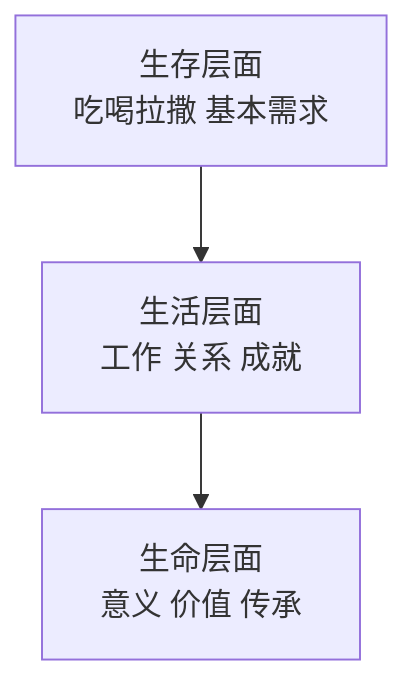
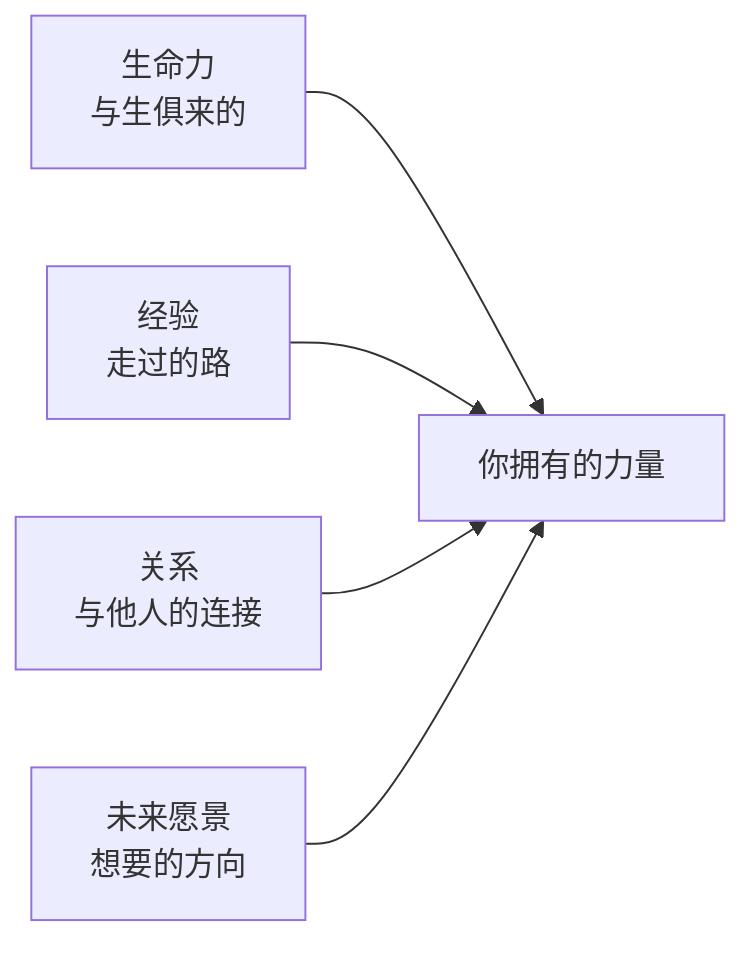
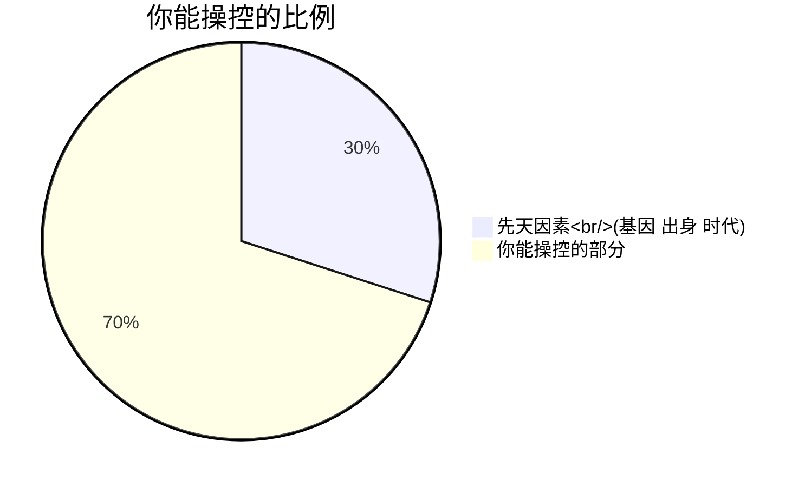

# 人类一生都在寻找的问题答案

> [!QUOTE] 李中莹
> 我们来到这个世界是为了什么？这是人类一生都在问的问题。很多人的困扰都源于对这个问题的模糊或者错误的答案。

## 生命的意义

NLP不谈虚无缥缈的"人生意义"，而是**落地**到很实际的问题上：

> 你每天早晨醒来，有没有一个让你**愿意起床**的理由？

### 人生的三层存在

大多数人的困扰都卡在"生活层面"——工作不顺、关系不和、成就不够。但真正深层的问题，往往在**生命层面**。

## 人生的方向

### "追求快乐" vs "逃避痛苦"

人的所有行为，背后只有两个驱动力：

| 驱动力 | 来源 | 效果 |
|-------|------|------|
| 追求快乐 | 正向目标 | 持续、有创造力 |
| 逃避痛苦 | 压力恐惧 | 短期有效、长期消耗 |

> [!TIP] NLP的建议
> 把主要精力放在"追求快乐"上（你想成为什么样的人、你想创造什么），而不是"逃避痛苦"（不要失败、不要被看不起）。后者会消耗你大量的生命能量。

### 人生中心点

李中莹老师用一个比喻来说明**人生中心点**：

> 你站在一个盘子的中心，这个盘子是你的人生中心。你把中心点让给谁，谁就能影响你的人生。

- 领导说不能来上课 → 你很沮丧 → 你把中心点让给了领导
- 同事说的一句话让你生气三天 → 你把中心点让给了那个同事
- $20的炒饭不好吃，生气一个月 → 你把中心点让给了那$20

> [!WARNING] 你的中心点在哪里？
> 谁/什么事能左右你的情绪，你就是把人生的中心点让给了谁。
> **收回你的中心点。**

## 你绝对有足够的力量过自己梦想的生活（第10课）

> [!QUOTE] 第10课的核心信息
> 你不需要"变成"另一个人才能过好人生。**你本来就拥有足够的力量。**

### 内在资源的四个来源

### 人的"雷达系统"

李中莹老师把人脑比作战舰的**雷达系统**：

- 外在世界通过各种感官（眼睛、耳朵等）输入信息
- 但真正决定你如何回应的，是**内在的雷达系统**
- 这套系统不是"客观反映"世界——它是你过去经验的集合
- 同一个世界，不同的雷达看到完全不同的东西

### 如何升级你的雷达

1. **增加信息输入**——读不同的书、见不同的人、去不同的地方
2. **更新解释框架**——学习新的思维模型（比如12条前提假设就是一种新的框架）
3. **改变回应方式**——从自动化反应转向有意识的选择

> [!TIP] 核心信念
> 你无法改变外在世界，但你可以改变你对世界的**内在认知**。当你改变了内在，你的世界就改变了。

### 你能操控的比例

很多人把力量浪费在那30%的不可控因素上，忽略了70%的可控空间。**把焦点放在你能操控的70%上。**

## 反思与自测

> [!QUESTION] 人生方向反思
> 1. 你每天早晨醒来，什么让你愿意起床？
> 2. 最近有谁/什么事"占据了你的中心点"？你如何收回来？
> 3. 你在"追求快乐"还是"逃避痛苦"上花了更多精力？
> 4. 你有哪些内在资源（经验、关系、能力）还没有被充分利用？

练习：中心点检查

1. 列出最近一周让你情绪波动的3件事
2. 对每件事问：我是否把人生中心点让给了这件事/这个人？
3. 对每件事问：在这件事中，我能操控的70%是什么？
4. 制定一个"收回中心点"的行动计划

## 下一步

[[0011-gai-bian-wei-lai-di-yi-bu|第11课：改变未来的第一步——与父母完成连接 →]]
