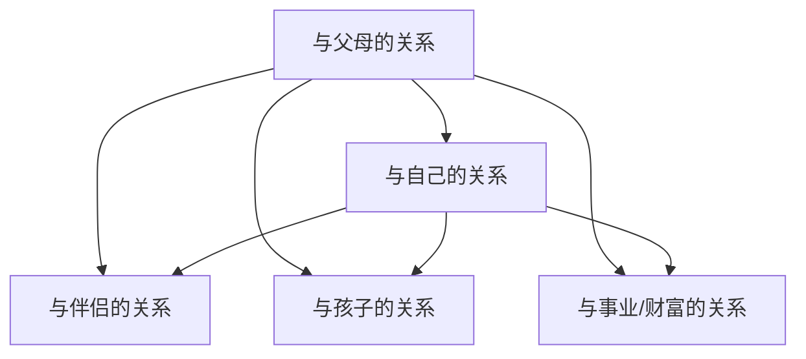

# 改变未来的第一步——与父母完成连接

> [!QUOTE] 李中莹
> 与父母的关系，是你所有关系的**原型**。你与父母的关系没有处理好，你与金钱、与伴侣、与孩子、与事业的关系都会受影响。

## 为什么与父母的关系如此重要

从系统排列和NLP的角度来看，**父母是生命来源的象征**：

- 你与父亲的关系 → 影响你与权威、事业、外在成就的关系
- 你与母亲的关系 → 影响你与情感、滋养、内在安全感的关系
- 你与父母双方的关系 → 影响你与整个世界的关系

### 生命的传承

> 生命是一条线，从祖先一代代传下来。父母不是创造了生命，而是**把生命传给了你**。

| 核心事实 | 含义 |
|---------|------|
| 生命通过父母传给你 | 你不需要做任何事来"赚取"这个资格 |
| 父母能给的已经全部给了 | 没有"给不够"——他们传了生命，已经足够 |
| 你不能改变父母 | 如第二条前提假设所说 |
| 你可以改变与父母的关系 | 改变你内在的父母形象 |

## 常见的"与父母未连接"的表现

| 表现 | 内在状态 |
|------|---------|
| 总想证明给父母看 | 觉得自己不够好 |
| 抗拒父母的某些特质 | 不想成为"像他们那样的人" |
| 对父母有怨恨/委屈 | 觉得父母没给够爱或认可 |
| 过度承担家庭责任 | 想要"拯救"父母 |
| 无法建立稳定的亲密关系 | 与父母的原型连接出了问题 |

## 与父母连接的练习

### 接受父母法

这是一个NLP经典技巧：

1. **闭上眼睛**，想象父母站在你面前
2. **看着他们**，不评判，只是看着
3. **在心里对他们说**：
   - "你们是我唯一的爸爸妈妈"
   - "我通过你们得到了生命"
   - "你们给我的已经全部给了我"
   - "我接受你们给我的生命"
   - "我会好好用这个生命"
4. **鞠躬/低头**（在心里或实际上），表示对生命传承的尊重
5. **转身**，走向你自己的未来

> [!WARNING] 重要
> 这个练习不是让你"原谅"父母——而是让你**接受**生命传承的事实，不再把能量消耗在抗争上。把力量收回来，用在创造自己的未来上。

### 重塑父母形象

- 父母在你心中的形象，不等于**真实的他们**
- 你心中的"好父母"或"坏父母"，都是你主观认知塑造的
- 你不需要改变真实的父母，只需要**调整你内心的父母形象**
- 这让你从"受害"状态中走出来，拿回自己的力量

## 关于"12条"的连接

与父母的关系，可以用12条前提假设来审视：

| 前提假设 | 在亲子关系中的应用 |
|---------|------------------|
| 没有两个人是一样的 | 父母和你是不同的人，他们的选择来自他们的认知 |
| 一个人不能改变另外一个人 | 你不能改变父母，也不需要改变他们 |
| 人生只有三件事 | 父母的人生是他们的事，你的人生是你的事 |
| 每个人都做了当下能做的最好 | 你的父母在当时能做的最好 |
| 动机和情绪不会错 | 父母的行为背后也有正面的动机 |

## 反思与自测

> [!QUESTION] 与父母关系检查
> 1. 你与父亲的关系如何？这在你的事业/权威关系上有影响吗？
> 2. 你与母亲的关系如何？这在你的人际信任上有影响吗？
> 3. 你是否在某些方面"抗拒成为父母那样的人"？这种抗拒消耗了你多少力量？
> 4. 如果你完全接受"父母给了我生命，这已经足够"——你的感觉会有什么不同？

练习：写一封信（不寄出）

给父母写一封信（或者分别给父亲和母亲），写下所有想说的话——感谢的、委屈的、怨恨的、不理解的。写完之后，不要寄出。然后问自己：
- 写完之后，我是否感觉轻松了一点？
- 从"父母的角度"，他们可能会有怎样的解释？
- 现在的成熟的我，可以如何看待这段关系？

## 下一步

[[0013-xin-nian-xi-tong|第13课：信念系统——维持你生存的内在法则 →]]

（第12课"你有多久没听自己说话了"建议参考本课的内省练习，核心是聆听内心的声音，与自己建立深层连接。）
